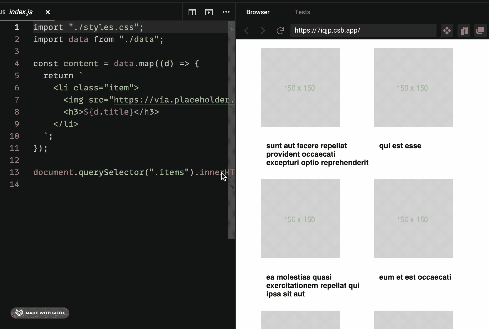

# 你应该知道的 6 个古怪的 JavaScript 和 CSS 技巧

> 原文：<https://javascript.plainenglish.io/6-quirky-javascript-and-css-tricks-you-should-know-a17c59c7ef22?source=collection_archive---------6----------------------->


Photo by [Aziz Acharki](https://unsplash.com/@acharki95?utm_source=medium&utm_medium=referral) on [Unsplash](https://unsplash.com?utm_source=medium&utm_medium=referral)

我最近看到了很多关于 JS 和 CSS 技巧的帖子，今天我整理了一份我自己的列表。我希望你能从这些中学到一些东西。

## **1。可选添加 JS 属性**

通常，我们在本质上是动态的对象中有键，它们是否到达最终对象取决于一个条件。

例如，假设我们有一个跟踪事件函数，其中一个参数是可选的。如果它在那里，我们希望将它包含在跟踪对象中，否则不会只拥有该属性。

```
// title is optional here
function sendTrackingEvent(status, title, pageName) { const obj = {
         status,
         pageName,
     }; if (title) {
          obj["title"] = title;
     }
     trackPageview(obj);
}
```

这是添加检查和添加属性的一种方式，但有一种更好的方式来有条件地添加属性，那就是使用 spread 运算符。下面是同样的例子:

```
function sendTrackingEvent(status, title, pageName){
     const obj = {
         status,
         pageName,
         ...(title && {title: title})
     }
     trackPageview(obj);
}
```

## 2.**带有 css 网格的响应式布局**

我发现 CSS grid 中最有用的一行代码是:

```
grid-template-columns: repeat(auto-fill, minmax(minValue, maxValue));
```

> minmax 的每个参数可以是一个`<length>`、`<percentage>`、`<flex>`值，或者是关键字值`max-content`、`min-content`或`auto`中的一个。

没有任何媒体查询，这将建立一个具有灵活列数的网格容器。这些列会伸展一点，直到有足够的空间容纳另一列，然后添加一个新列，反之亦然。



这里有一个工作沙箱:[https://codesandbox.io/s/quizzical-carson-7iqjp](https://codesandbox.io/s/quizzical-carson-7iqjp)

## 3.**动态属性名称**

您可以在声明对象时分配动态属性。

```
const dynamic = 'color';
var item = {
    brand: 'Ford',
    **[dynamic]**: 'Blue'
}console.log(item); // { brand: "Ford", color: "Blue" }
```

## 4.**截断字符串**

text-overflow 属性指定如何将未显示的溢出内容通知给用户。它可以被剪辑、显示省略号(…)或显示自定义字符串

文本溢出需要以下两个属性:

*   空白:nowrap
*   溢出:隐藏；

这里可以看到工作示例:[https://www.w3schools.com/csSref/css3_pr_text-overflow.asp](https://www.w3schools.com/csSref/tryit.asp?filename=trycss3_text-overflow)

## 5.**读取浏览器网址**

JavaScript 可以部分访问当前 URL。我们可以获得协议、路径名、主机和搜索参数。对于此 URL:

**https://example.com/xyz/index.html?page=1**

*   window . location . protocol = " https:"
*   window . location . host = " example . com "
*   window . location . pathname = "/XYZ/index . html "
*   window.location.search = "？page=1 "

## 6. **CSS 计数器**

要对编号列表中的数字进行样式化，我们需要使用名为 CSS 计数器的属性。CSS 计数器允许您根据内容在文档中的位置来调整内容的外观

要使用 CSS 计数器:

*   计数器的值可以通过计数器增量来增加或减少
*   我们可以在内容属性中使用 counter()或 counters()函数来显示计数器的值