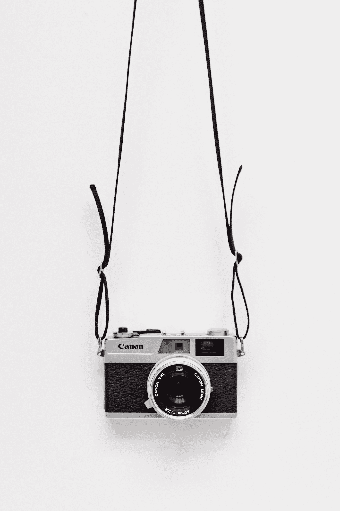

# 在 React Native 中添加相机模块的 6 个步骤

> 原文：<https://javascript.plainenglish.io/6-steps-to-add-camera-module-in-react-native-d0ec9d1eb38b?source=collection_archive---------12----------------------->

如何在 React 本地应用程序中使用相机？



Photo by [Yoann Siloine](https://unsplash.com/@siloine?utm_source=medium&utm_medium=referral) on [Unsplash](https://unsplash.com?utm_source=medium&utm_medium=referral)

## 在后台

故事是这样开始的:我正在为我的一个客户开发一个双赢的竞赛应用程序。核心计划是给用户提供点击图片的功能。当我开始使用 React Native 中的相机模块时。

## 概观

在今天的故事中，我们将使用 React 原生相机库，因为这是 React 原生相机中使用最多、功能最强大的模块。此外，我将指导您完成相机模块的集成过程以及要遵循的架构。

## 入门指南

以下是我们添加摄像头模块的步骤-

*   将 react-native-camera 模块添加为 npm 包
*   在 android 文件夹内的 react-native 的 android 层中添加相机权限
*   为摄像机创建一个单独的屏幕
*   将相机加载到一个单独的模块中，并处理所有权限
*   点击图片，逐个预览。

## 添加摄像头模块

这很简单，但有时添加一个摄像头模块也需要将其与 React Native 链接，这导致了不同设备的许多问题。因此，请确保您仔细遵循每一个步骤。

```
yarn add react-native-camera
```

## 添加摄像机权限

一旦软件包安装完毕，在 android 层添加权限标准。

位置—Android/app/src/main/androidmanifext . XML

```
<uses-permission android:name="android.permission.CAMERA" />
<uses-permission android:name="android.permission.READ_EXTERNAL_STORAGE" />
<uses-permission android:name="android.permission.WRITE_EXTERNAL_STORAGE" />
```

最后一部分是在构建梯度中添加维度策略。在 android/app/build.gradle 中，在版本名称和代码前添加以下行

```
missingDimensionStrategy 'react-native-camera', 'general'
```

## 添加摄像头屏幕

一旦安装了包并添加了权限，我们就可以使用相机模块了。要对其进行全面测试，您可以只为摄像机创建一个全新的屏幕，也可以在组件中添加摄像机组件。

我用来创建 UI 和添加屏幕的库是—

*   React Native Paper —用于设计屏幕样式
*   反应导航—用于添加屏幕

```
yarn add react-native-paper 
// to add paper libraryyarn add @react-navigation/native @react-navigation/stack
// to add navigation library// also for react navigation you will be needing safe area context
yarn add react-native-safe-area-context
```

## 体系结构

我总是关注我们将遵循什么架构来开发任何应用程序。在今天的故事中，我们有一个名为“屏幕”的文件夹，其中包含了我们所有的各种屏幕。例如，相机模块有一个完全独立的屏幕，因此 camera.js 将位于屏幕内的一个文件中。

一旦屏幕添加到根目录的屏幕文件夹中，我们就可以使用导航库在导航栈中注册屏幕。在根目录下的 app.js 中，我们可以添加如下所示的堆栈导航屏幕。

我们已经注册了 2 个屏幕，名称如下主页和相机，就像 2 页关于和登录桌面应用程序。

## 添加摄像头模块

下一步是在相机屏幕上添加一个相机模块。用户界面将看起来像下面这样，我们有一个摄像头模块，占据了几乎 70%的屏幕高度，其余区域将是预览图像的图像区域。

我在相机模块下面添加了预览部分，来帮助你如何处理相机点击的图像。

您可以简单地复制粘贴这段代码，将摄像头模块添加到您的系统中。这是使用相机模块的最基本版本，具有高度的可扩展性和可定制性。

## 处理摄像机权限

请注意，我们需要处理真实世界应用程序的相机权限。大多数情况下，用户确实会忘记启用或允许摄像头访问，在这种情况下，应用程序应该向用户提供适当的指示和反馈。

处理权限也不太难，在相机模块中你得到相机状态作为键，它决定了相机当前的权限状态。它是一个在授权、就绪、未授权之间循环的枚举。

使用相机模块返回的状态参数，我们可以向用户显示对话框或警告框，以提供适当的反馈。

## 使用相机模块点击和存储图像

存储图像也很简单，在相机模块中我添加了一个按钮，点击并收集被点击图像的数据。一旦用户触发了捕捉按钮，单击属性。

一旦图片被点击，我们可以使用美国的 URI 属性存储图像，并在查看预览部分呈现它们。

```
const [ images, setImages ] = useState([]);
const [ loader, setLoader ] = useState(false);async function takePicture(){
 setLoader(true);
 const options = { 
      base64: true, fixOrientation: true, writeExif:  true 
 };
 const data = await ref.current.takePictureAsync(options);
 const newImages = [...images];
 newImages.push({ uri : data.uri } );
 setImages(newImages);
 setLoader(false)
};
```

我们首先单击图像，然后在状态中设置图像，最后我们可以简单地在预览模式中渲染所有图像。

## 最终产品


Final Product Demo

```
Click to read to code - [**Code Repository**](https://github.com/shreyvijayvargiya/iHateReadingLogs/tree/main/TechLogsMobile/ReactNative%20%2B%20Camera)
```

## 结论

今天的相机模块就到这里，我已经介绍了所有需要在移动应用中使用相机模块的情况。这是非常简单和容易理解的，但大多数开发人员发现这很难，因为要么是架构，要么是理解相机模块的概念。

请继续关注，因为在下一篇文章中，我将介绍在 React Native 中添加屏幕和使用导航的部分。直到，下一次，有一个美好的一天，人们。

```
For more such stories visit our website 💻 [**iHateReading**](/www.ihatereading.in)
```

## 更多阅读

[](https://shreyvijayvargiya26.medium.com/getting-started-with-react-native-ui-library-react-native-paper-e6ba75508120) [## React Native UI 库入门，React Native Paper

### 用 React Native Paper 开发 React Native 样板文件

shreyvijayvargiya26.medium.com](https://shreyvijayvargiya26.medium.com/getting-started-with-react-native-ui-library-react-native-paper-e6ba75508120) [](/navigation-in-react-native-4dfdd2c3ff22) [## 如何在 React Native 中实现导航

### 使用 React Navigation，React Native 中唯一完美的导航库。

javascript.plainenglish.io](/navigation-in-react-native-4dfdd2c3ff22) [](https://medium.com/nerd-for-tech/flatlist-is-still-underrated-796130a8b8f2) [## Flatlist 仍然被低估了

### 也许你使用 Flatlist 的方式是错误的，这里有一些提示和技巧

medium.com](https://medium.com/nerd-for-tech/flatlist-is-still-underrated-796130a8b8f2) 

*更多内容看*[***plain English . io***](http://plainenglish.io/)