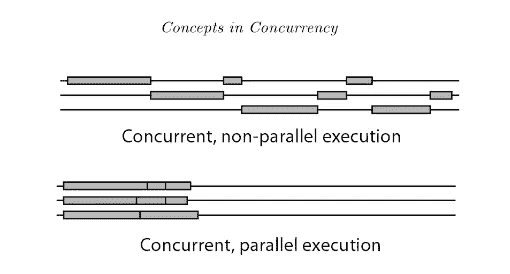
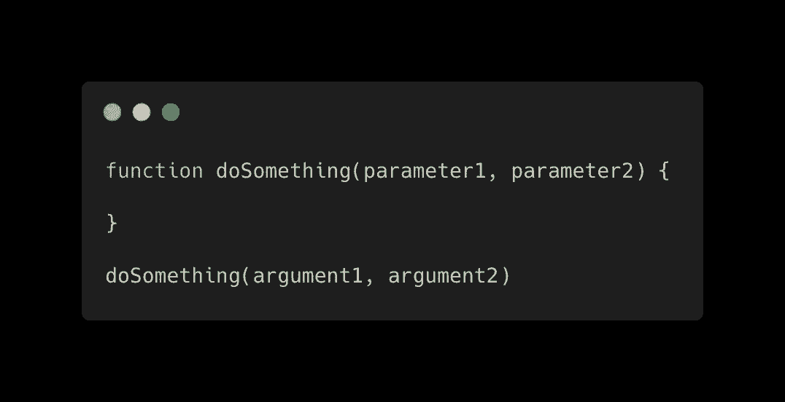

# 编程中的 6 个术语我希望我能早点理解

> 原文：<https://javascript.plainenglish.io/6-terms-in-programming-i-wish-i-understood-earlier-156ad77c998?source=collection_archive---------1----------------------->

## 并发和并行不是一回事

Photo by [Oladimeji Ajegbile](https://www.pexels.com/@diimejii?utm_content=attributionCopyText&utm_medium=referral&utm_source=pexels) from [Pexels](https://www.pexels.com/photo/man-working-using-a-laptop-2696299/?utm_content=attributionCopyText&utm_medium=referral&utm_source=pexels)

# 1.并发

这是计算机科学中最常被误用的概念之一。当考虑并发性时，我们通常认为两件事情同时运行——彼此并行。并发性不一定是这种情况。并行运行被称为并行性，它与并发性并不相同。

罗布·派克引用了一句很好的话来总结这种差异:

> “并发是指同时处理许多事情。并行就是同时做很多事情。”

为了更好地理解并发性，有必要知道即使是单核系统也可以在并发模式下运行。

并发通常感觉像并行，因为两个或更多的任务可以在相同的时间跨度内执行——它们可能在大约相同的时间完成，但并不完全相同。所以计算机在开始任务 b)之前没有完全完成任务 a)。原因是任务可以被分割成更小的部分，理论上，CPU 可以将这些部分混合起来。

有一个很好的图表显示了这种差异:

Source: [Introduction to Concurrency in Programming Languages](https://books.google.ie/books/about/Introduction_to_Concurrency_in_Programmi.html?id=J5-ckoCgc3IC&redir_esc=y)

# 2.单一报告

术语有两种不可理解的方式。首先，你可能不知道这个词是什么意思，也不知道 Monorepo 代表什么。

第二，当你知道它代表什么时，不能保证你理解它:你为什么要使用单一回购协议？

如果是后一种情况的受害者。Monorepo 是一个包含团队或整个公司的所有项目的单一存储库。通常，Monorepo 仅用于单个项目，但其中包含许多微服务和库。TL；DR:mono repo 有更多的独立软件。

但你为什么要做这种事？

Monorepos 是否是一个好主意是一场宗教战争。一些人声称把所有东西都放在一个地方是个好主意；其他人声称这将使一切膨胀起来。由于我不想做这篇关于你是否应该使用 Monorepo 的文章，我们将把它留在这里。让我们来看下一个术语。

# 3.无服务器

这是最令人困惑的术语之一。为什么？对许多人来说，这没有任何意义。我同意这一点。第一次听到的时候，我想到了一个不需要任何服务器的 app。例如，一个静态网页。但这不是无服务器的含义。

开发应用时，后端需要大量的工作(如果有的话)。设置和配置服务器是这项工作的一部分。因此，开发过程也包括服务器。无服务器想要改变这一点。更好的说法是“无服务器开发”。

当然，仍然有一个服务器管理我们的数据库，收集请求等。但是在开发过程中，我们很少关心服务器的设置和配置。无服务器平台为运行我们的后端提供了一个可扩展的、易于管理的、预配置的服务。

无服务器托管的一个很好的例子是 Firebase。该平台提供所谓的云功能。我们只需上传 Node.js 代码，Firebase 会完成剩下的工作。一天十个请求？不需要更多的配置。一天一百万次请求？不过，不需要额外的配置——Firebase 适合我们。

# 4.参数和自变量

这两个术语在代码文档中都很重要。然而，他们经常感到困惑。让我们来分解一下:

*   参数是函数定义的一部分。它们是函数范围内可用的变量。
*   参数是传递给函数调用的值。

如果你像我一样，是一个喜欢视觉的人，这可能会有所帮助:

# 5.指针和引用

指针？参考资料？它们不是一回事吗？没那么容易。

指针指向某物。它是一个保存内存地址的对象。因此，指针引用了内存中的一些东西——在这个地方，可以存储一个变量。通过它的内存地址，变量的值可以被访问，但不仅仅是访问，甚至是操作。

因此，指针是引用的概念——在某些编程语言中，是引用某些东西的唯一可能的方式。在其他编程语言中，它们不是唯一的方式，而是典型的方式。你可能知道 C、C++、Rust 和 Go 等语言的指针。

通常，指针被称为引用事物的最原始的方式。

从按值传递和按引用传递的概念来看，引用本身确实是已知的。引用是现有对象的别名，提供对实际对象的访问。因此，引用变量保存着它被赋给的变量的值。每当*原始*变量改变时，通过引用变量访问的值也会改变——因为最终，两个变量都指向内存中的同一个位置。

理解这一点至关重要，因为引用通常是无意中创建的。不知道你没有创建一个副本，但参考很难适得其反。让我们回到指针上来，让事情变得更加混乱。

## “指针”也经常用在另一个语境中。

除了内存指针，这个词还可以用在程序员喜欢的任何地方。for 循环中的迭代器变量(主要是“I”)有时被称为指针，主要是在迭代数组的上下文中。这就是两点技术得名的原因。小心；双指针方法和双指针是不同的东西。

虽然双指针技术是关于带有指针变量的两个循环，但是双指针技术在 C 语言中是众所周知的——使用内存指针。

# 6.黑客/可黑客

到处乱砍和乱砍是两码事(像我这样不是英语母语的人很难理解)。区别就像编写可破解软件和无意中编写可破解软件的区别一样大。

虽然我们首先将计算机科学与黑客联系在一起，但这个术语的用法经常不同。除了闯入一个系统，合法或非法，黑客和 hackable 有不同的含义。

著名的文本编辑器 Atom 自称是“21 世纪的可黑客攻击的文本编辑器”。有了这样的描述，他们并不意味着 Atom 易受攻击。相反，它们意味着 Atom 是高度可定制的——所以你可以用编辑器修改和构建东西。

所以，黑客和可黑客并不一定是负面的术语。最后还是要看语境。

感谢阅读！

**如果你想加入 Medium 同时支持我:
你可以在这里** ***购买订阅** [**。**](https://louispetrik.medium.com/membership)

**附属链接。如果你使用这些链接购买一些东西，我会赚取佣金，但没有额外的费用给你。非常感谢！*

## [这里是第二部分](/6-more-terms-in-programming-i-wish-i-understood-earlier-443b60bcb8bc)

*更多内容请看*[***plain English . io***](http://plainenglish.io)