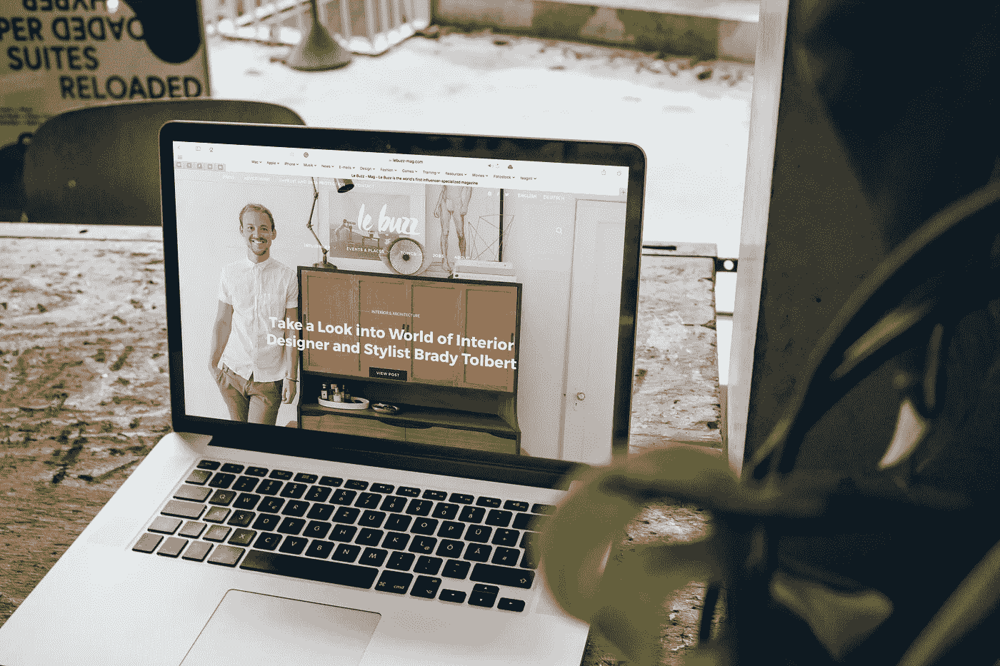

# 2021 年在你的网站上不要做的 6 件事

> 原文：<https://javascript.plainenglish.io/6-things-not-to-do-on-your-website-in-2021-ff171c1ff86b?source=collection_archive---------17----------------------->

Photo by [Le Buzz](https://unsplash.com/@le_buzz?utm_source=unsplash&utm_medium=referral&utm_content=creditCopyText) on [Unsplash](https://unsplash.com/s/photos/website?utm_source=unsplash&utm_medium=referral&utm_content=creditCopyText)

# 第一点:不要跟风

扁平设计现在非常流行。视差效果，很酷但是很慢，太 2013 了。潮流来来去去，但你应该始终专注于让你脱颖而出并与你的目标受众建立联系的东西。重要的是，网站设计是可用的，你的观众可以参与其中。

# 第二点:永远不要使用廉价的设计

你的**网站**是你公司的网络形象。因此，一个好的设计是必不可少的，如果你想被认真对待，并从你的网站创造线索。如果你负担不起一个个性化的网站，你可以利用众多主题中的一个。当然，一个高质量的定制网站在吸引客户方面总是更有效，但是如果你现在买不起，一个模板就足够了。

# 第三点:不要让你的内容混乱

我曾经和一个客户合作过，他有一年多的互联网业务，但是从来没有卖出过任何东西。但是，看了她的网站后，我意识到设计可能会好很多。例如，主页上没有号召行动的按钮，充斥着激励性的短语。这里的要点是，你应该始终清楚你的网站和你对访问者的期望。

# 第四点:不要忽视你的网站加载速度

未经优化的图片是网站运行缓慢的首要原因。第三方脚本，如共享工具或使用低质量的 WordPress 插件，排在第二位。应该不惜一切代价避免这些。通过在我的网站上只使用一些第三方脚本和插件，我能够在加载时间上节省一秒钟。

# 第五点:不要改造你的网站导航

你网站上的导航应该总是易于查找和使用。项目在导航菜单中出现的顺序也很重要。

# 第六点:不要隐藏你的联系方式

如果你的访问者不能轻易地发现你的联系方式，他们可能会变得沮丧。除了联系页面，我强烈建议在网站标题的右上角加上一个电话号码，因为这已经被证明会增加电话呼叫。不要求它是电话号码。它可以是一封电子邮件，也可以是你预订系统的链接。你的地址和联系信息也应该包含在网站页脚，使网站更有用，并有助于本地搜索引擎优化(SEO)。

这是你在完成**网站设计时必须记住的六件事。**你也可以借助专业的**网站开发**机构来拥有一个优秀的网站。

*更多内容请看*[***plain English . io***](http://plainenglish.io/)