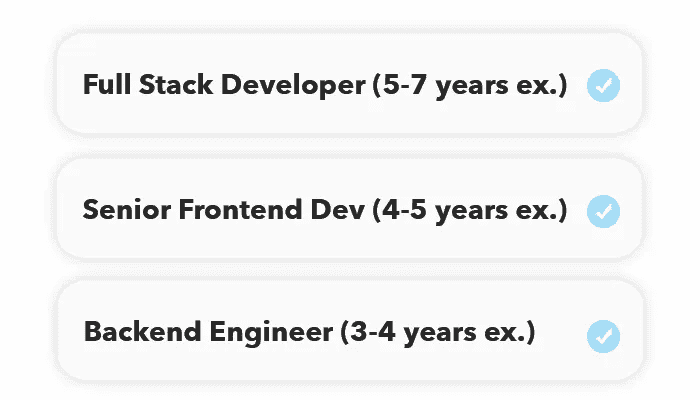
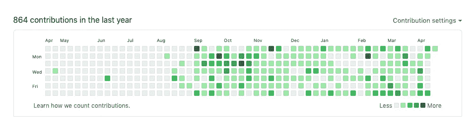

# 给寻找第一份工作的自学者的 6 个建议

> 原文：<https://javascript.plainenglish.io/6-tips-for-self-taught-devs-looking-for-their-first-job-5086a74574b1?source=collection_archive---------10----------------------->

lone self-taught wolves

自学是一把双刃剑。一方面，你可以避免参加新兵训练营和传统的计算机科学(从现在开始我将称之为 CS)学位，从而节省大量的金钱，但另一方面，你可能会经常怀疑自己的决定，并重新规划你的旅程。你会因为缺少一纸资格证书而面临很多拒绝。很糟糕，但事实就是如此。

*幸运的是，*这篇帖子是为了帮助和激励那些正在经历这一可怕旅程的人，希望你能从我的话中找到灵感。所以，事不宜迟，这里有 6 个建议，你可能会发现在这个卑微的旅程中有所帮助。

## **1。缩小搜索范围**

当我刚开始找工作时，我在 LinkedIn 上申请了每一份工作。

你说吧，我申请了。

有些人可能会争辩说，申请工作是一个数字游戏，但我有点不同意。是的，求职是一场数字游戏，但我喜欢称之为正确的数字游戏。

停止申请 50 份工作，当你只得到 2 份回复时感到失望，因为首先你不符合列出的 80%工作的要求。

相反，我建议列出你的 5 大技能(对我来说是反应/前端)，并发送符合你实际要求的高质量申请。

*提示:这是关于高质量的应用。不是数量。*

## **2。关注基础知识**

与刚毕业的计算机科学专业学生相比，你经常被安排与那些在纯计算机科学知识方面更有经验的人竞争，比如排序链表、实现二分搜索法、平衡二叉树(你明白了)。然而，除非你申请的是一家 [*FAANG*](https://www.investopedia.com/terms/f/faang-stocks.asp) 公司，否则大多数公司都不会对你进行这些方面的全面测试。

相反，大多数公司实际上会问大量的概念问题(例如，JavaScript 中的异步函数是什么)，其中一些公司还会给我一些与他们当前提供的产品/服务相关的任务，并使用他们当前的堆栈来构建。

我经常看到许多自学成才的开发人员在 LeetCode 和算法上花了太多精力，而他们应该把更多的精力放在如何实际构建一个工作应用上。有趣的是，在我的一次面试中，我被分配了一个任务，用 React/Django 在两天内创建一个待办事项应用程序，但令人惊讶的是(据面试官所说)，一半的应聘者都无法完成这个任务。

*提示:研究他们的技术组合和面试官对技术的偏好，在此基础上强化自己。*

## **3。态度重于技能**

当一个有经验的面试官在面试你时，他/她很可能通过浏览你的简历、LinkedIn 和 GitHub 个人资料来评估你的能力水平。他们在面试时问你的问题只是为了确认他们对你的了解程度。

然而，如果面试官在看了你的个人资料后已经感兴趣，并且觉得你可能很适合，他们实际上是想看看你是否真的很好，*“很适合”*。这意味着他们想看看你是否能和 DevOps 的 Steve 和 QA 的 Alex 一起工作。此外，在这种情况下，如果你是一个自学成才的开发者，正在寻找第一份工作，他们想看看你是否是*可教的*。

你会听取技术负责人的反馈吗？

你会和/高级开发人员争论 Git 实践吗？

这些事情他们无法从你的网上资料中判断，完全取决于你如何与面试官“一拍即合”。

*提示:完成任何任务后，向面试官寻求反馈。这当然有助于你在未来的面试中提高自己，并向他们表明你想提高自己，愿意接受反馈。*

## **4。作为主要景点的辅助项目**

当一名技术主管想粗略了解你在代码方面的情况时，GitHub 通常是 HR 人员向你要求的第一件事。这背后的原因是因为他们想看看你是否有*副业*。

作为一名自学成才的开发者，兼职项目在求职时至关重要，因为它证明你确实创造了一些东西，而不是在简历上随意吹嘘。

Would this increase the chances of you hiring this guy?

不要担心几个月前你的第一个项目中有垃圾代码。相反，在面试中把它作为一个机会来解释当前的你会如何不同地写它。这显示了学习的进步和成长，但最重要的是，在收到反馈时有一个良好的态度来改进。

## **5。闲聊可以是大事**

这一点是相当普遍的提示，但我决定无论如何包括它，因为我自己也犯了这个错误。不管你的面试官在他们的特定领域有多专业，他/她最终还是人。也就是说，开始像对待一个真正的人一样对待面试官，和他们进行真正的对话。

这意味着一旦对话升温，放松下来，讲一些笑话(YMMV)，更加随意，让对话流畅起来。

面试官可能有一整天要做的事情，所以让他们的时间有价值，进行有意义的谈话，而不是他们问你问题，你回答他们。

即使你能回答他们问的所有 JavaScript 问题的 10/10，但他们并不特别喜欢你，你也很可能无论如何都不会通过面试。

提示:诀窍在于讨人喜欢，如果面试官喜欢你，他们更有可能帮助你。

## **6。拉近与朋友的距离**

作为一个自学的开发人员，你往往是一个孤独的人，独自完成项目。然而，在现实的开发世界中，对于大多数公司来说，协作工作几乎是*事实上的*标准。

这意味着你应该开始建立开发者/招聘者/创业创始人的新朋友网络。结交新朋友会帮你了解当地就业市场的趋势，把你介绍给潜在的雇主，把你和编程会议联系起来，当然，还会从其他开发人员那里得到你技能的反馈。

建立网络需要时间，但随着时间的推移，它也会产生连锁反应。一个朋友把你介绍给一群朋友，这个团体的一个朋友进一步介绍你，这种情况一直持续…

*小贴士:不要等到太晚才开始社交，人们会花时间对陌生人进行热身。* ***现在开始。***

## **最终想法**

自学成为一名开发人员不是为了胆小的人，而是像生活中的许多事情一样，通过持续的努力、奉献和永不放弃的强烈愿望，你最终一定会取得成功。最后但并非最不重要的一点，我留给你们的这段话让我继续前行:

> 每天都变得简单一点
> 
> 但是你必须每天都做，这是最难的部分
> 
> 但这确实变得更容易了。

保重，直到下次，

定时（timing 的缩写）

*多内容于* [***中***](http://plainenglish.io/)