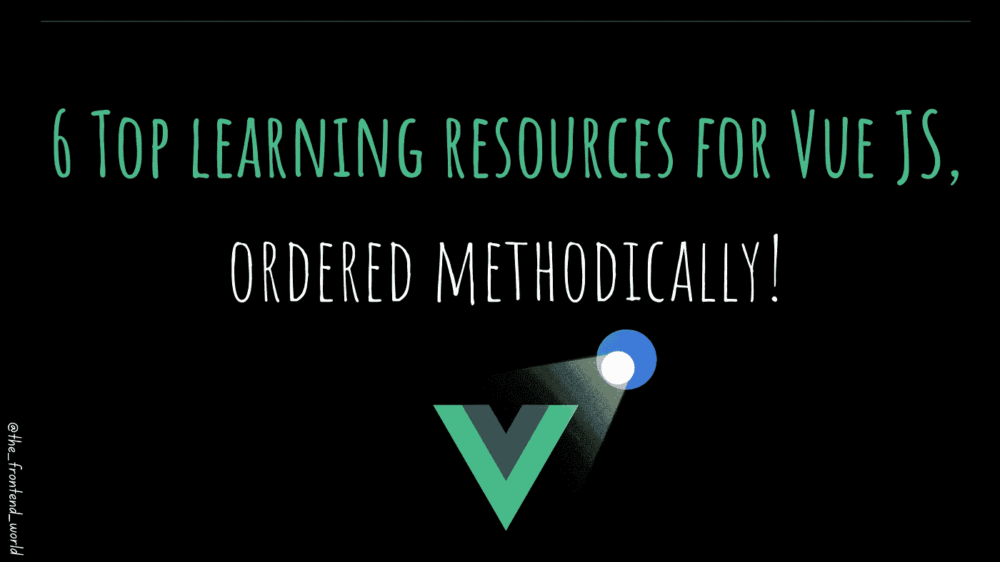
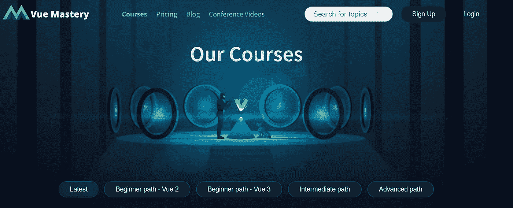

# 学习 Vue.js 的完整路线图

> 原文：<https://javascript.plainenglish.io/6-top-learning-resources-for-vue-js-ordered-methodically-9358b5d4bd79?source=collection_archive---------12----------------------->

## Vue.js 的六大学习资源有序列表

By FAM

因为拥有合适的资源对任何学习都是必不可少的。本文结合了顶级资源，帮助您建立关于 Vue.js 的强大而深入的知识。

您可能已经知道，学习 Vue.js 需要一些关于 HTML、CSS 和 JavaScript 的初步知识。因此，不先学习 web 基础知识就马上学习前端框架是不可取的。

# 1.Vue 文档

> 没人比你自己更了解你，不是吗？

一般来说，框架和技术也是如此。这是领先的 Vue 站点，在这里您可以找到全面的知识和文档，以及食谱、代码示例和参考资料。如果你想对 Vue.js 建立一个深刻的理解，这应该是一个起点。

 [## vue . j

### 已经会 HTML，CSS，JavaScript 了？阅读指南，立即开始制作物品！可增量采用的…

vuejs.org](https://vuejs.org/) 

# 2.Vue 论坛

这也是 Vue.js 的官方资源。他们的官方论坛是一个完美的地方，你可以在那里寻找帮助和答案。你可以筛选，选择一个类别，并提出精确的问题。

有问题吗？查看 Vue.js 论坛！

 [## Vue 论坛

### 讨论一切 Vue.js！

forum.vuejs.org](https://forum.vuejs.org/) 

# 3.Vue CLI

如果您已经熟悉 Angular CLI。这个工具对 Vue 来说也是一样的。这是 Vue.js 开发的标准工具。你可以把它看作是 Vue JS 技术方面的一次温和的入职培训，它提供了一些丰富的功能:

*   图形用户界面
*   丰富的特性(支持 Babel、TypeScript、ESLint、PostCSS、PWA、单元测试和端到端测试等。)
*   满足日常需求的可重复使用解决方案。
*   已经准备好立即使用(CLI 完全可配置，无需注入)
*   还有更多…

 [## Vue CLI

### Vue.js 开发的🛠️标准工具入门→对 Babel、TypeScript、ESLint 的现成支持…

cli.vuejs.org](https://cli.vuejs.org/) 

# 4.Vue 掌握

一旦你在 Vue CLI 的帮助下建立了关于 Vue.js 和实验编码的一般和深入的知识，你就可以跳到更高级的阶段。该资源为您提供每周 Vue.js 教程、课程、现场培训、博客、一些免费课程——许多激动人心的东西将引导您走向精通。

这个资源的缺点是它是一个 ***付费平台*** 。但我相信，当谈到 ROI(投资回报)时，对你的技能和你自己的投资是最值得的。

不过，圣诞节有一个例外，即 12 月 17 日至 20 日的自由周。

 [## Vue 掌握

### 每周 Vue.js 教程，引导您走向精通。我们的道路指引着您的旅程，无论您是…

www.vuemastery.com](https://www.vuemastery.com/) 

它的一个优点是它的教育方法。它带你从一个水平到另一个水平，从初学者到高级。

Vue Mastery

和往常一样，看到漂亮的图形就停不下来。他们的网站太漂亮了😻，让我想起了 CodinGame。

# 5.Vue 学校

也是付费平台。但是这一次，你向核心团队成员和行业专家学习。它的年价格比 Vue Mastery 稍微便宜一点。

 [## 向 Vue 学校的核心团队成员和行业专家学习 Vue.js

### 637 节课* 52 小时* 34 门课程全面学习 Vue.js:为了成为 Vue.js 专业人员，您将了解…

vueschool.io](https://vueschool.io/) 

他们有漂亮的图形。

Vue school

# 6.Vue GitHub

在 Vue GitHub 中找到 Vue.js 代码本身。如果你爱上了它，你甚至可以直接为他们的代码库做贡献。从我的角度来看，这是最先进的一步，因为你不仅仅知道如何使用 Vue.js。你在内心深处了解它是如何工作的，它教会你编写更好的代码。

> 我今天的故事到此结束，我希望你喜欢它，并从中吸取教训，❤

*如果我的作品有* ***感动你*** *如果你* ***喜欢它*** *如果你觉得它* ***值得*** *，请你* [***成为付费会员来支持我，你的一部分费用会寄给我。***](https://famzil.medium.com/membership)

 [## 如果你喜欢看我的文章… ♥️

### 如果你喜欢读我的文章… ♥️，当我的文章发表时，欢迎你第一个得到通知…

famzil.medium.com](https://famzil.medium.com/subscribe) 

亲爱的读者，感谢你在我生命中的存在。让我们联系上*[***中***](https://medium.com/@famzil/)*[***领英***](https://www.linkedin.com/in/fatima-amzil-9031ba95/)*[***脸书***](https://www.facebook.com/The-Front-End-World)***

****参见我的* [*电子书*](http://www.fam-front.com/) *关于网络要领和一般文化。****

***更多内容请看*[*plain English . io*](http://plainenglish.io/)*。在这里报名参加我们的* [*免费周报*](http://newsletter.plainenglish.io/) *。***