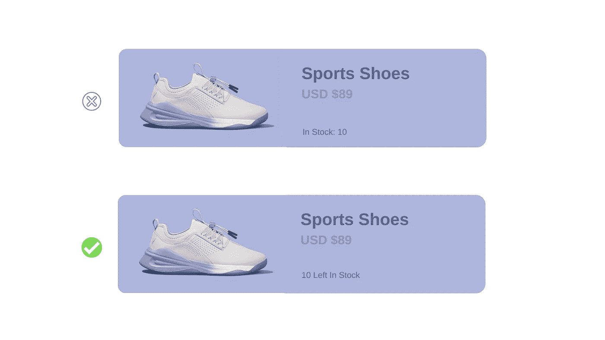

# 让你成为前端忍者的 6 个 UI 概念

> 原文：<https://javascript.plainenglish.io/6-ui-concepts-that-makes-you-a-frontend-ninja-c6c0a29fa954?source=collection_archive---------0----------------------->

## 构建具有出色 UI 的应用程序的基本概念

## 1.等级就是一切

在开发应用程序的前端时，一定要确保你坚持一个层次结构，无论是****字体粗细，字体样式*** 等等。拥有良好的视觉层次会让你的应用程序看起来不那么嘈杂，而不是界面中的所有东西都在争夺最大的注意力，也不清楚什么是最重要的。*

****例如:****

*   *正如您可以在下面给出的*仪表板*页面中观察到的噪音量，所有内容看起来都混合在一个页面中，并且不清楚用户第一次访问时应该关注哪里。*

**

*   *这个问题可以通过使用一组**字体粗细**，颜色层次，并给最优先的元素赋予 ***边框半径*** 来轻松解决。*
*   *此外，当你用第二和第三信息规则构建应用程序时，它会在不改变太多东西的情况下产生更令人满意的结果。*

**

## *2.停止到处使用灰色文本*

*有时候，我们不得不对主*和次*标签使用不同的文本颜色，大多数时候，人们最终会使用常规的 ***灰色文本*** 作为次文本标签。*

*这种方法的问题是，在白色背景下使用灰色很好，我们看到灰色降低了白色的对比度，但其他颜色也应该这样做。*

*为了创建文本中最重要的内容的层次结构，您应该只使用具有相同**色调**的颜色，并调整**饱和度**，直到它符合您的需要。*

**

## *3.使用标签*

*标签在应用程序中几乎无处不在，但是你可能不需要那么多标签。*

*大多数情况下，前端开发人员对所有标签都给予相同的关注，这使得用户更加耗时，因为一条数据被赋予了同等的重要性。*

*不要尝试给你的应用程序的不同部分排序标签。*

****例如:****

*   *在电子商务应用程序中，如果你的商品库存显示为原始数字，你的用户必须花时间计算这些数字实际上是什么。*
*   *不要这样做，如果你简单地告诉你的用户这些数字是什么，他们会更高兴。*

**

***Combined Labels & Values***

## *4.语义是次要的*

*有时候我们在一个页面上有多个动作，在这种情况下，很容易陷入根据语义设计这些动作的陷阱。*

*大多数时候，人们最终会因为语义而忽略他们的层次结构。尤其是在设计 ***按钮*** 时，语义起着至关重要的作用，因为大多数页面只有一个真正的主要动作，次要的次要动作，以及很少的第三动作。*

**

**在设计这些动作按钮时，请确保以下几点。**

*   ***主要动作要明显:**使用纯色和高对比度的背景色。*
*   ***次要动作要清晰:**尽量不要让它们太突出，*轮廓样式*和*低对比度*背景色在这种情况下很好用。*
*   ***三级动作不应该是不显眼的:**将这些动作设计成链接效果最好。*

> ****注意:*** *页面上的设计动作总是要优先考虑层次结构，这样可以减少用户界面的噪音，使交流更加清晰。**

## *5.重叠元素*

*让 web 应用程序对用户来说更流畅的一个很好的技巧是重叠元素，这可以通过在其他元素上显示元素来轻松实现，使它们看起来与附近的元素更紧密地联系在一起。*

****例如:****

*   *你一定在最近的许多应用程序中观察到了这种 UI 趋势，在第一次访问页面时，你会看到元素层层叠加。*

**

## *6.使用空白空间*

**

*在开发应用程序时，有时新添加的特性并没有交付实际的设计&这有多种原因，其中之一是留下了空白。*

*不要忽略你的应用程序中的这些空白区域，因为用户在某个时候会经历这些，他们很可能会感到困惑。*

*试着在那些空白的地方添加一些描述性的图标或图像，让它们看起来和你的应用程序的其他部分更自然。*

* [## 作为前端开发人员，你应该知道的 3 个 CSS 特性

### 了解 CSS 鲜为人知的特性

javascript.plainenglish.io](/3-css-features-you-should-know-as-frontend-developer-f1b5536bf179)  [## 作为前端开发人员，你应该知道的 8 个 UX 原则

### 用这 8 个技巧构建吸引人的前端应用程序

javascript.plainenglish.io](/8-ux-principles-you-should-know-as-a-frontend-developer-9416a24294d2)  [## 作为开发人员，您应该知道的 11 个 VS 代码特性和技巧

### 对 VS 代码更加自信

javascript.plainenglish.io](/11-vs-code-features-tricks-you-should-know-as-a-developer-47e5ec0c362b) 

*更多内容请看*[***plain English . io***](http://plainenglish.io)*