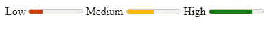

# 你应该知道的 6 个冷门而强大的 HTML 特性

> 原文：<https://javascript.plainenglish.io/6-unpopular-and-powerful-html-features-that-you-should-know-a0c3d62f1294?source=collection_archive---------3----------------------->

## 让你的生活更轻松的 HTML 特性。


Photo by [Lala Azizli](https://unsplash.com/@lazizli?utm_source=medium&utm_medium=referral) on [Unsplash](https://unsplash.com?utm_source=medium&utm_medium=referral)

# 介绍

HTML 是万维网上任何网站的骨架。我无法想象不使用 HTML 的网络。它是一种非常强大的标记语言，有很多我们作为开发者可以从中受益的特性。如今，只需 HTML5，您就可以创建一些非常棒甚至功能强大的 UI，而无需使用 JavaScript 或 CSS。

在这篇文章中，我们将发现一些你可能不知道的惊人而强大的 HTML 特性。让我们开始吧。

# 1.仪表标签

米标签`<meter>`是 HTML 有用且强大的特性之一。它允许您在不使用任何 JavaScript 或 CSS 的情况下创建数量。

看看下面的代码示例:

```
<label for="low">Low</label>
**<meter** id="low" min="0" max="100" low="30" high="75" optimum="80" value="25"**></meter>**<label for="medium">Medium</label>
**<meter** id="medium" min="0" max="100" low="30" high="75" optimum="80" value="50"**></meter>**<label for="high">High</label>
**<meter** id="high" min="0" max="100" low="30" high="75" optimum="80" value="80"**></meter>**
```

*输出:*



The meter tag.

您也可以在下面的代码栏中查看:

The meter tag.

# 2.所需的属性

必需的属性`required`允许您在不使用 JavaScript 的情况下进行表单验证。如果您没有填写必需的输入，它会阻止您提交表单。

下面是一个代码示例:

```
<form>
  <label for="username">Username:</label>
  <input type="text" id="username" name="username" **required**>
  <input type="submit" value="Submit">
</form>
```

您也可以在下面的代码栏中查看:

The attribute required.

# 3.下载属性

HTML 中的属性`download`通常和链接标签一起使用，允许用户从你的网站下载文件到他们的机器上。

这里有一个例子:

```
<div>
<a href="index.html" **download="fileName"**>Download HTML</a>
</div>
```

你只需要在属性`download`中指定文件名，在属性`href`中指定文件路径。

您可以查看下面的 Codepen 示例:

The download attribute.

# 4.HTML 拖放

HTML 的强大功能之一是拖放 API，它允许您拖放网页上的任何元素。

您所需要的只是在一个元素上使用属性`draggable`。然后，您将需要使用一点 JavaScript 来处理拖放事件。

这里有一个例子:

```
<div **draggable="true"** ondragstart="drag(event)"></div><div ondrop="drop(event)" ondragover="allowDrop(event)">
```

你可以看看下面我写的一篇关于这个话题的详细文章。

[](https://js.plainenglish.io/html-drag-and-drop-api-explained-with-examples-35cda91bce56) [## 用例子解释 HTML 拖放 API

### 通过实例学习如何拖放。

js .平原英语. io](https://js.plainenglish.io/html-drag-and-drop-api-explained-with-examples-35cda91bce56) 

# 5.延迟和异步属性

当链接 JavaScript 文件和 HTML 时，属性`defer`被用在脚本标签上。它只适用于外部脚本。

这里有一个例子:

```
<script src="app.js" **defer**></script>
```

它告诉浏览器在呈现 HTML 时不要等待 JavaScript 文件。这将首先呈现 DOM，然后执行脚本。

属性`async`类似于`defer`，唯一的区别是`async`告诉浏览器在加载 UI 时异步运行脚本。

```
<script src="app.js" **async**></script>
```

您不再需要将脚本标签放在 body 标签的底部。

# 6.缩写标签

HTML 中的标签`<abbr>`允许您用鼠标悬停在单词上时显示单词的缩写。

下面是一个例子:

```
<h2>**<abbr** title="JavaScript and XML"**>**JSX**</abbr>** is awesome.</h2>
```

在下面的代码簿中查看:

The abbr tag.

# 结论

正如您所看到的，HTML 是一种非常强大的标记语言。你可以用它创造很多令人惊奇的东西，因为它有很酷的特性，你可以从中受益。

谢谢你阅读这篇文章。

# 更多阅读

*这里还有一篇有用的文章可以查看:*

[](https://js.plainenglish.io/5-useful-javascript-tips-to-speed-up-your-coding-38c54c42e911) [## 加快编码速度的 5 个有用的 JavaScript 技巧

### 5 种在 JavaScript 中更快编码的方法和技巧。

js.plainenglish.io](https://js.plainenglish.io/5-useful-javascript-tips-to-speed-up-your-coding-38c54c42e911) 

*如果你对 JavaScript 和 web 开发相关的更有用的内容感兴趣，你也可以* [*订阅*](https://mehdiouss.ck.page/) *我的时事通讯。*