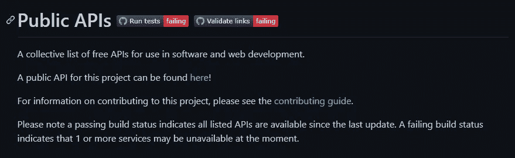
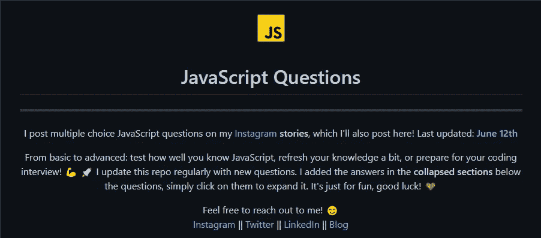
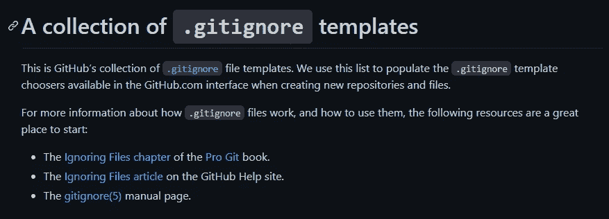
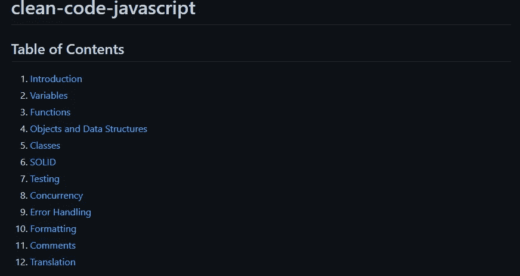

# 6 个对所有 Web 开发者有用的 GitHub 库

> 原文：<https://javascript.plainenglish.io/6-useful-github-repositories-for-all-web-developers-44f26912fd66?source=collection_archive---------2----------------------->

## 每个 web 开发人员都应该知道的令人敬畏的 GitHub 库。

Photo by [ThisIsEngineering](https://www.pexels.com/fr-fr/@thisisengineering?utm_content=attributionCopyText&utm_medium=referral&utm_source=pexels) on [Pexels](https://www.pexels.com/).

GitHub 是一个伟大的平台，允许开发者与世界分享他们的开源项目。有许多存储库可以通过为您提供巨大的价值来帮助您作为开发人员。所以不管你是什么类型的开发者，你都应该一直利用 GitHub 的优势。

在本文中，我决定整理一些有用的 GitHub 库，作为 web 开发人员，您可以从中受益。让我们开始吧。

# 1.开发者路线图

[开发者路线图](https://github.com/kamranahmedse/developer-roadmap)是你应该知道的流行有用的库之一。它有超过 153.000 颗 GitHub 星，这意味着它非常有用。

这个库包含了大量的图表和图片，展示了你可以选择的途径和你需要的技术，这取决于你想成为哪种类型的开发人员(后端、前端等)。所以这是一个网页开发者的路线图，帮助你选择你的道路。

capture from [GitHub](https://github.com/kamranahmedse/developer-roadmap) by author.

# 2.公共 API

[公共 API](https://github.com/public-apis/public-apis)是一个非常有用的资源库，拥有超过 116.000 个 GitHub stars。它收集了一系列不同类型的 API，您可以作为 web 开发人员或一般的软件开发人员使用。您需要的几乎任何类型的 API 都可以在这个库中找到。

API 涵盖了很多主题，比如动漫、商业、电影、动物、加密货币等等。你可以自己去看看。

capture from [GitHub](https://github.com/public-apis/public-apis) by author.

# 3.你还不知道 JS

这个[资源库](https://github.com/getify/You-Dont-Know-JS)是由 *Kyle Simpson* 编写的流行且有用的 JavaScript 系列丛书之一。它拥有超过 136.000 颗 GitHub 星，涵盖了您需要理解的 JavaScript 的重要部分(作用域、闭包、类等)。

如果您想很好地理解重要的 JavaScript 概念，这非常有用。这是完全免费的，你不需要支付任何费用。

capture from [GitHub](https://github.com/getify/You-Dont-Know-JS) by author.

# 4.JavaScript 问题

这个[知识库](https://github.com/lydiahallie/javascript-questions)是由*莉迪亚·哈利*创建的，它在 GitHub 上有超过 30，000 颗星星。它包含许多中级到高级的 JavaScript 问题及其解释。

如果你想测试你的 JavaScript 知识或者准备面试，这是一个非常棒的知识库。该存储库也有许多不同的语言版本。

capture from [GitHub](https://github.com/lydiahallie/javascript-questions) by author.

# 5.gitignore 模板

每当你想为你的项目创建一个 GitHub 存储库，你应该总是有一个`.gitignore`文件来过滤你想要上传的内容。所以这个[库](https://github.com/github/gitignore)给了你一个有用的`.gitignore`文件模板的集合，你可以在你的项目中使用。

这个库有超过 116.000 个 GitHub stars，它还包含几乎所有编程语言的`gitignore`模板。

capture from [GitHub](https://github.com/github/gitignore) by author.

# 6.干净的 JavaScript 代码

Clean-code-javascript 是一个非常棒的资源库，可以帮助你编写干净的 javascript 代码。它采用了 Robert C. Martin 书中的概念，并将其应用于 JavaScript。

这个知识库在 GitHub 上有将近 50，000 颗星星。所以如果你想写干净的 JavaScript 代码，这是非常有用的。

capture from [GitHub](https://github.com/ryanmcdermott/clean-code-javascript) by author.

# 结论

正如你所看到的，所有这些 GitHub 库对你这个 web 开发者来说都非常有用。这是很多免费的有价值的内容，你可以从中受益。所以你只要用 GitHub 就能提高技能。

感谢您阅读这篇文章。希望你觉得有用。

**更多阅读**

 [## 你应该知道的 6 个有用的纯 CSS 技巧

### 你可能不知道的极其有用的 CSS 技巧

javascript.plainenglish.io](/6-useful-pure-css-tips-that-you-should-know-647ccaff201e)