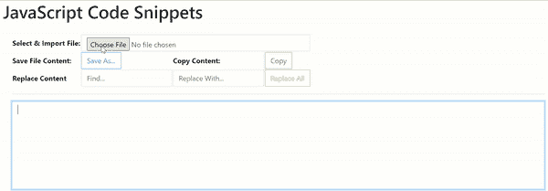
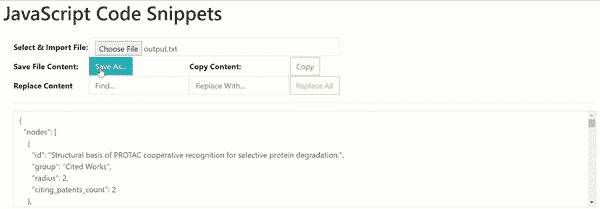
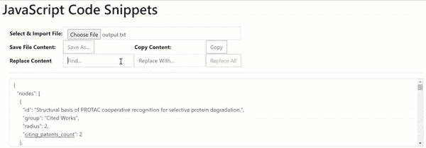
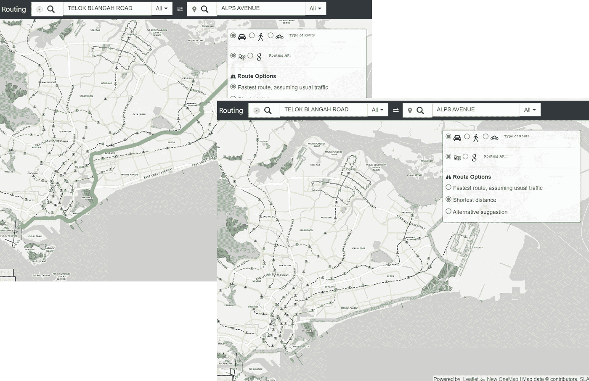
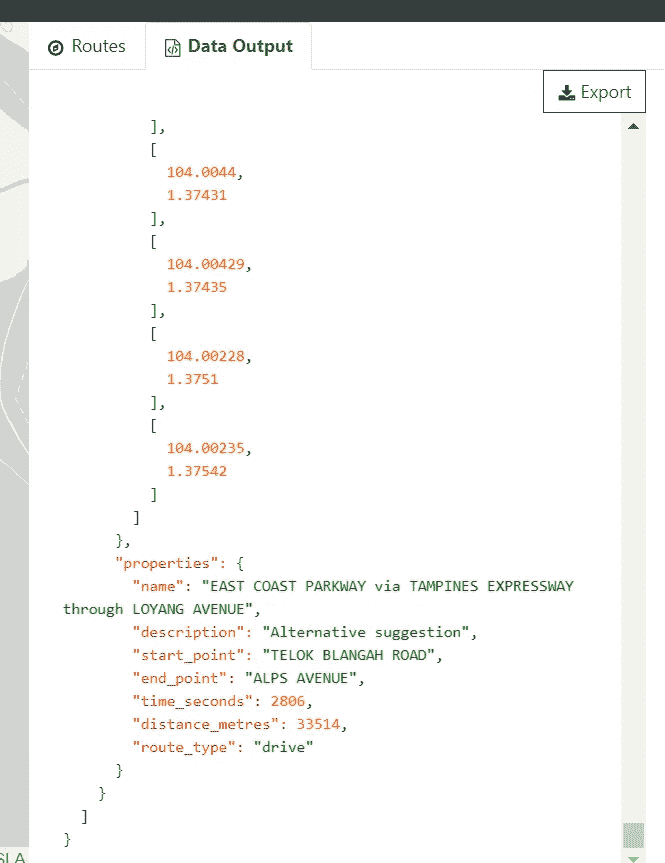

# 6 个有用的 JavaScript 代码片段

> 原文：<https://javascript.plainenglish.io/6-useful-javascript-code-snippets-91424efd1c55?source=collection_archive---------3----------------------->

## 这个列表可能很主观，但我还是分享了我自己的版本。示例和代码。

虽然 Medium 上有其他优秀的作家写过这个主题，但我注意到这个列表的极端主观性，因为每个人心里都有不同的日常用例。类似地，我有我个人的 JavaScript 代码片段列表，对一些读者来说会很方便。

## 1.文件内容上传

```
var selectContent=document.getElementById("selectContent");
var contentForSelection=document.getElementById("contentForSelection");selectContent.onchange=function(e) {
  if (!window.FileReader) {
   alert("Your browser does not support HTML5 'FileReader' function required to open a file.");
  } else {
   let fileis = this.files[0];
   let fileredr = new FileReader();
   fileredr.onload = function (fle) {
    let filecont = fle.target.result;
    contentForSelection.value=filecont;
   };
   //fileredr.readAsArrayBuffer(fileis);
   fileredr.readAsText(fileis);
  }
};
```



Screenshot by Author | Select .txt file to upload into a textarea

在上面的例子中，因为我选择导入的文件是文本格式的，所以使用了方法`**readAsText**`而不是`**readAsArrayBuffer**`。使用`**readAsArrayBuffer**`的例子包括读取图像流或读取 ZIP 存档文件。导入成功后，文件内容被自动渲染到文本区，元素 id 为**“contentForSelection”**。

## 2.保存文件内容

```
var saveBtn=document.getElementById("saveBtn");
var contentForSelection=document.getElementById("contentForSelection");
saveBtn.onclick=function() {
 let txtContent=contentForSelection.value;
 if (!window.Blob) {
  alert("Your browser does not support HTML5 'Blob' function required to save a file.");
 } else {
  let textblob = new Blob([txtContent], {
   type: "text/plain"
  });
  let dwnlnk = document.createElement("a");
  dwnlnk.download = "output.txt";
  dwnlnk.innerHTML = "Download File";
  if (window.webkitURL != null) {
    dwnlnk.href = window.webkitURL.createObjectURL(textblob);
  }
  dwnlnk.click();
  }
};
```



Screenshot by Author | Content present in the textarea is saved by the user via a download link generated by JavaScript

上面的代码片段通常在在线笔记应用程序中实现，以便用户导出他们的输出。或者，在诸如数据/代码格式化程序之类的 web 实用程序中，通常也提供**【Save】**功能，以允许用户将后续格式化的文本内容保存到本地存储文件中。

## 3.复制到剪贴板

复制到剪贴板是基于浏览器设置的另一个经典功能。通常情况下，**如果转换后的输出仅用于一次性任务**，此时没有必要将输出保存到文件中，使用以下 JS 代码片段会更合适:

```
var copyBtn=document.getElementById("copyBtn");
var contentForSelection=document.getElementById("contentForSelection");
copyBtn.onclick=function(evt) {
 copyBtn.nextElementSibling.innerHTML="";
 copyTransformedOutput("contentForSelection");
 let smallEle=evt.currentTarget.nextElementSibling;
 smallEle.innerHTML="<span style='color:green'> Copied to Clipboard!</span>";
};
function copyTransformedOutput(inputEleId) {
 let copyText = document.getElementById(inputEleId);
 copyText.select();
 copyText.setSelectionRange(0, 99999); /* For mobile devices */
 navigator.clipboard.writeText(copyText.value);
}
```

**注意，我选择在代码片段中成功复制后显示消息“复制到剪贴板”。**

因此，转换后的输出可以随后粘贴到其他地方，而不需要存储到本地文件中使用。

## 4.全部查找和替换

虽然在最新的 JavaScript 控制台中，此[功能目前是内置的](https://developer.mozilla.org/en-US/docs/Web/JavaScript/Reference/Global_Objects/String/replaceAll)，但由于其实现的独创性&简单性，了解以下 JavaScript 功能仍然是相关且有用的:

```
function replaceAll(inputStr,toReplace,replaceWith) {
  return inputStr.split(toReplace).join(replaceWith);
}
```

例如，如果我希望在文本区域中用“id”替换“ID ”:



Screenshot by Author | “id” attribute of the JSON object is now replaced with its uppercase counterparts “ID” in the above implementation

代码片段的其余部分如下:

```
var replaceBtn=document.getElementById("replaceBtn");
replaceBtn.onclick=function() {
 let toFind=document.getElementById("ToFind").value;
 let replaceWith=document.getElementById("ReplaceWith").value;
contentForSelection.value=replaceAll(contentForSelection.value,toFind,replaceWith);
};
```

## 5.生成随机十六进制颜色

我发现这种 JavaScript 方法不太受欢迎的一种情况是，当我必须在同一个 web 应用程序上呈现多条驾驶路线时:



Illustration by Author | In this routing application I have created, the fastest route is lightgreen while the shortest distance route is displayed in brown. Depending on no. of routes returned by each map service provider, an infinite no. of colours would be required for each route.

显然，对于任何观看者来说，区分不同颜色的无限数量的重叠驾驶路线更容易比较和对比地图可视化上显示的各种路线。因此，动态生成不同的颜色是必要的，可以通过以下方式实现:

```
function generateRandomHexColor() {
    let colorGenerated="#" + (Math.random() * 0xfffff * 1000000).toString(16).slice(0, 6);
    if(colorGenerated !== "#0000ff" && colorGenerated !== "#ff0000") {
      return colorGenerated;
    }
    colorGenerated="#" + (Math.random() * 0xfffff * 1000000).toString(16).slice(0, 6);
}
```

## 6.突出显示 JSON 语法

对于地图服务提供者返回的每条路线，我都集成了路线的 JSON 数据输出的导出功能。因此，为了区分 JSON 对象中的对象类型，如字符串、浮点、整数、布尔，我选择了如下所示的颜色编码:



上述效果可以通过 CSS 和 JavaScript 来实现。

**JavaScript 代码:**

```
function syntaxHighlight(json) {
    json = json.replace(/&/g, "&amp;").replace(/</g, "&lt;").replace(/>/g, "&gt;");
    return json.replace(/("(\\u[a-zA-Z0-9]{4}|\\[^u]|[^\\"])*"(\s*:)?|\b(true|false|null)\b|-?\d+(?:\.\d*)?(?:[eE][+\-]?\d+)?)/g, function (match) {
        var cls = "number";
        if (/^"/.test(match)) {
            if (/:$/.test(match)) {
                cls = "key";
            } else {
                cls = "string";
            }
        } else if (/true|false/.test(match)) {
            cls = "boolean";
        } else if (/null/.test(match)) {
            cls = "null";
        }
        return "<span class='" + cls + "'>" + match + "</span>";
    });
}
```

**CSS 代码:**

```
.string { 
  color: green; 
}
.number { 
  color: darkorange; 
}
.boolean { 
  color: blue; 
}
.null { 
  color: magenta; 
}
.key { 
  color: red; 
}
```

## 我觉得有用的值得分享的 6 个 JavaScript 代码片段列表到此结束！

**个人评论:**虽然没有绝对的清单列出哪些 JavaScript 函数/代码片段是最有用的，但是当这些建议适用于您的特定用例时，由媒体作者编辑的清单确实证明是非常有价值的。当重新查看我的列表时，我注意到它们大多是在浏览器设置中使用的 I/O 文件实用程序，因为我经常发现自己在数据分析中使用 web 实用程序。

*非常感谢坚持到本文结束！❤希望您发现这适用于您的用例。如需更多数据分析& Web 应用相关内容，请随时关注我的媒体* *。非常感谢*😀

[](https://geek-cc.medium.com/membership) [## 通过我的推荐链接加入灵媒——李思欣·崔

### 获得李思欣·崔和其他作家在媒体上的所有帖子！😃您的会员费直接…

geek-cc.medium.com](https://geek-cc.medium.com/membership) 

你也可以看看下面这篇关于 HTML 标签的文章:

[](https://medium.com/weekly-webtips/6-useful-but-lesser-known-html-tags-attributes-9e9f2c0208c4) [## 6 个有用但鲜为人知的 HTML 标签和属性

### 这些标签的存在是有充分理由的…包括示例+用例。

medium.com](https://medium.com/weekly-webtips/6-useful-but-lesser-known-html-tags-attributes-9e9f2c0208c4) 

*更多内容请看*[***plain English . io***](http://plainenglish.io)