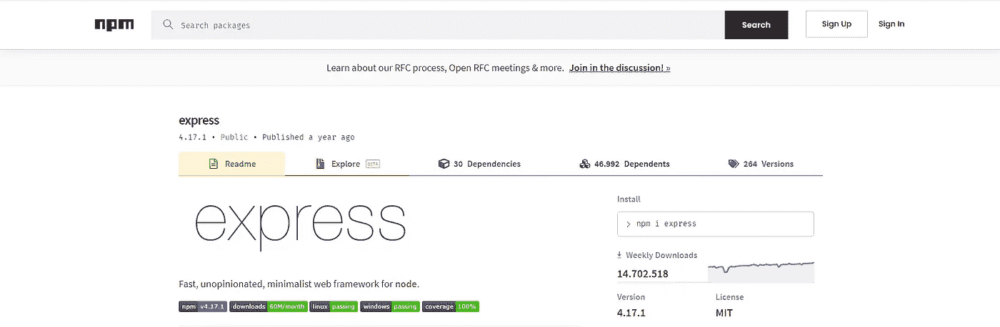
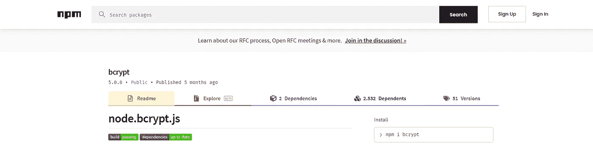
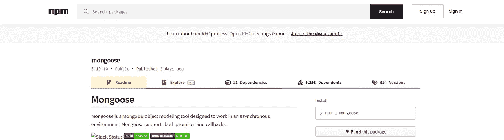
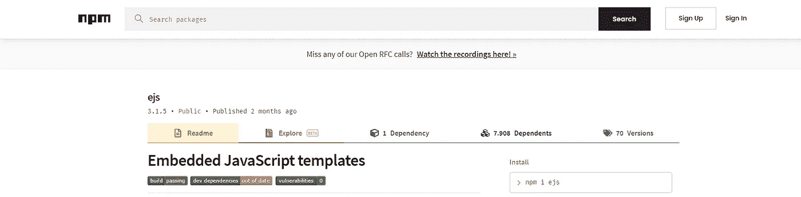
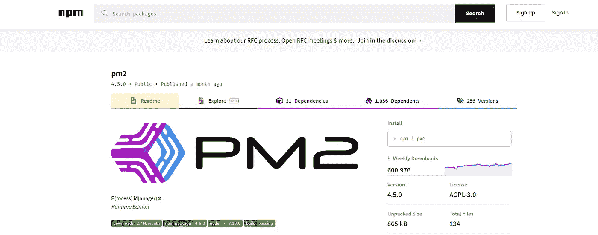
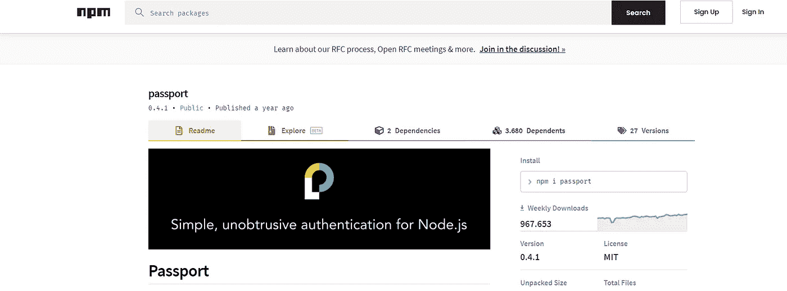

# 2021 年开发人员应该知道的 6 个有用的 Node.js 模块

> 原文：<https://javascript.plainenglish.io/6-useful-node-js-modules-developers-should-know-in-2021-3d043389b74f?source=collection_archive---------8----------------------->

## 使用这些模块将使你的网络应用程序更好！


Photo by [Moritz Kindler](https://unsplash.com/@moritz_photography?utm_source=medium&utm_medium=referral) on [Unsplash](https://unsplash.com?utm_source=medium&utm_medium=referral)

Node.js 是一个开源的多平台 JavaScript 运行时环境，允许 JavaScript 在浏览器之外运行。Node.js 允许开发人员将 JavaScript 用于命令行工具和服务器端脚本。

今天，我们来看看最好的 Node.js 模块，让 Node.js 的使用变得更加容易。所以这里列出了 5 个有用的 Node.js 模块！

# 1.表达

Express 是一个最小且灵活的 Node.js web 应用程序框架，为 web 和移动应用程序提供了一组强大的功能。



Image by Author

## 安装模块

运行以下命令:

```
npm install express --save
```

## 如何使用

要创建一个简单的快速应用程序，请遵循下面的代码:

```
const express **=** require('express')const app **=** express()app.get('/', function (req, res) {res.send('Hello Medium')})app.listen(3000)
```

当您运行此程序时，web 服务器将在端口 3000 上运行，并带有显示消息的默认路由。

# 2.Bcrypt

一个帮助你散列密码的库。



## 安装模块

运行以下命令:

```
npm install bcrypt
```

## 如何使用

要散列密码，请设置以下代码:

```
const bcrypt **=** require('bcrypt');const saltRounds **=** 10;const myPlaintextPassword **=** 'MediumPassword2001';
```

现在加密密码:

```
bcrypt.hash(myPlaintextPassword, saltRounds, function(err, hash) {*// You can use the hashed password over here. (F.E. store it )*});
```

## 比较

Bcrypt 还有一个方便的功能来比较两个密码:

```
bcrypt.compare(myPlaintextPassword, hash, function(err, result) {*// result == true*});
```

# 3.猫鼬

Mongoose 是一个 MongoDB 对象建模工具，设计用于在异步环境中工作。猫鼬支持承诺和回调。



## 安装模块

运行以下命令:

```
npm install mongoose
```

## 如何使用

首先，你需要导入模块:

```
const mongoose **=** require('mongoose');
```

## 连接到 MongoDB

首先，我们需要定义一个连接。

```
await mongoose.connect('mongodb://localhost/database', {
  useNewUrlParser: true,
  useUnifiedTopology: true,
  useFindAndModify: false,
  useCreateIndex: true
});
```

## 定义模型

模型是用猫鼬模式制作的:

```
const Schema = mongoose.Schema;
const ObjectId = Schema.ObjectId;

const Post = new Schema({
  author: ObjectId,
  title: String,
  body: String,
  date: Date
});
```

# 4.EJS(嵌入式 JavaScript 模板)

EJS 简单地代表嵌入式 JavaScript 模板，我们可以在服务器端或客户端使用它。



## 安装模块

运行以下命令:

```
npm install ejs
```

## 如何使用

要使用 EJS，我们可以使用 Express 来简化:

```
const express = require('express');
const app = express();app.set('view engine', 'ejs);app.get('/', (req, res) = > {res.render('index');});
```

这将在名为`‘templates’`的文件夹中呈现`index.ejs`文件。

# 5.PM2

PM2 是 Node.js 应用程序的生产流程管理器，内置负载平衡器。它允许您永远保持应用程序的活力，在不停机的情况下重新加载它们，并简化常见的系统管理任务。



## 安装模块

运行以下命令:

```
npm install pm2 -g
```

## 如何使用

使用 PM2 很容易:

```
pm2 start app.js
```

这将持续运行您的应用程序，直到您取消程序。

## 正在运行的应用程序列表

如果您想要显示正在运行的所有应用程序的列表:

```
pm2 list
```

# 6.护照

Passport 是 Node.js 的 Express 兼容认证中间件。



## 安装模块

运行以下命令:

```
npm install passport
```

## 如何使用

Passport 使用策略的概念来验证请求。策略包括验证用户名和密码凭证、使用 OAuth 进行授权认证。

首先，需要配置应用程序:

```
passport.use(new LocalStrategy(
  function(username, password, done) {
    User.findOne({ username: username }, function (err, user) {
      if (err) { return done(err); }
      if (!user) { return done(null, false); }
      if (!user.verifyPassword(password)) { return done(null, false); }
      return done(null, user);
    });
  }
));
```

要了解更多关于护照的信息，请访问: [NPM —护照](https://www.npmjs.com/package/passport)

# 结论

在本文中，我希望教会您几个新的 Node.js 模块，您可以在未来的项目中使用它们。当然，还有许多更方便的 Node.js 模块可以使用，但我发现这些是目前最好的。所以，享受探索这些 Node.js 模块吧！

*更多内容看*[***plain English . io***](http://plainenglish.io/)