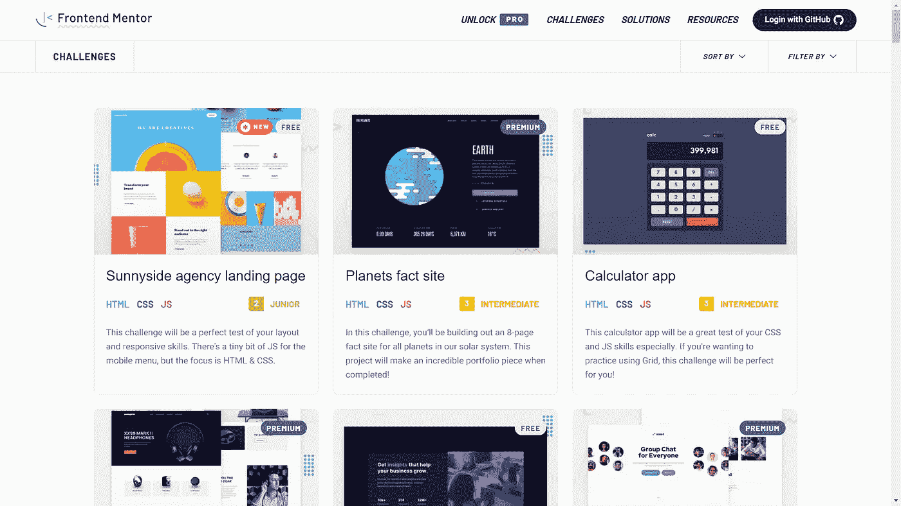
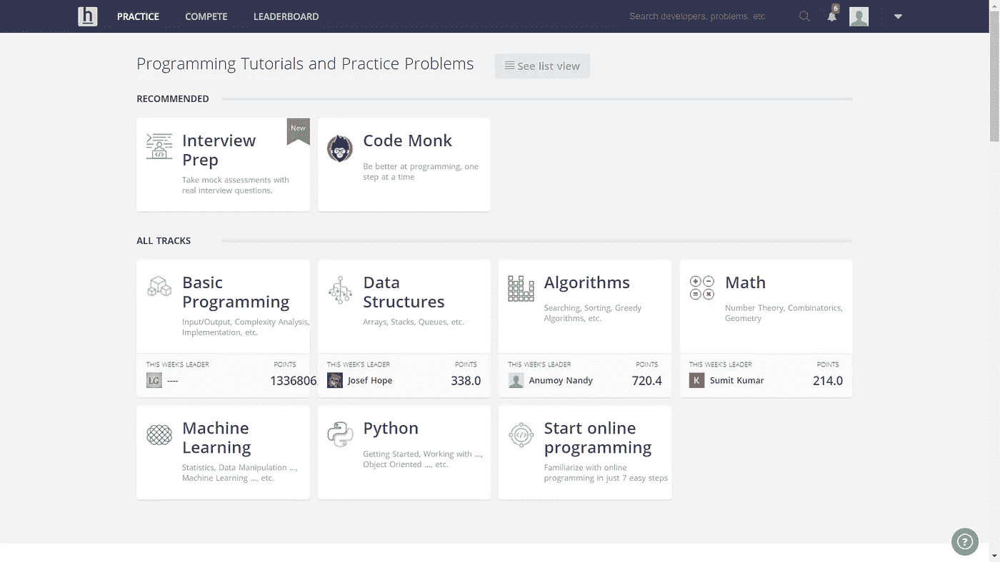
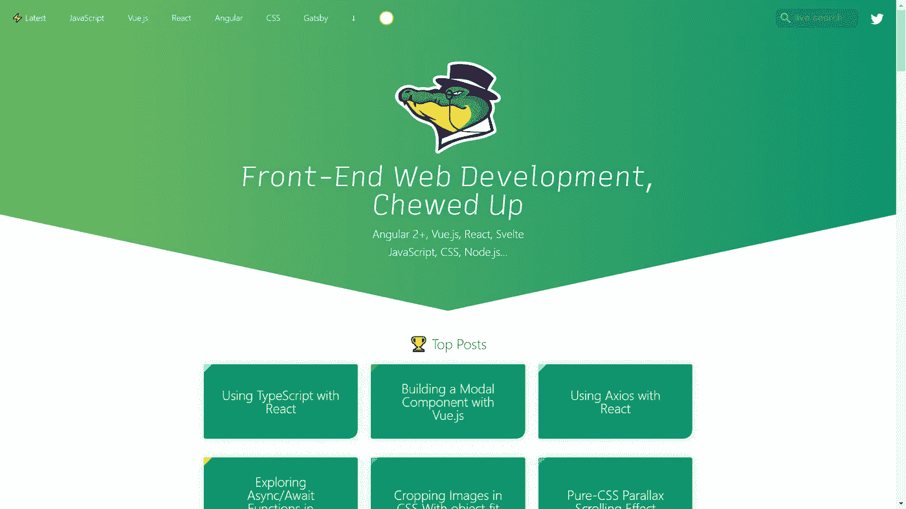
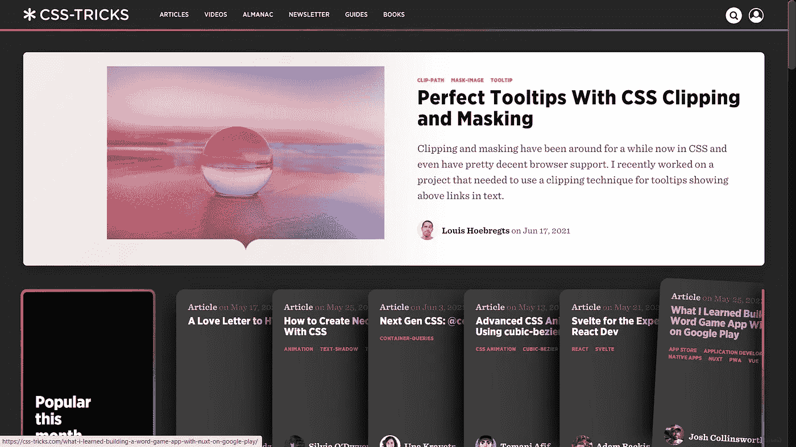
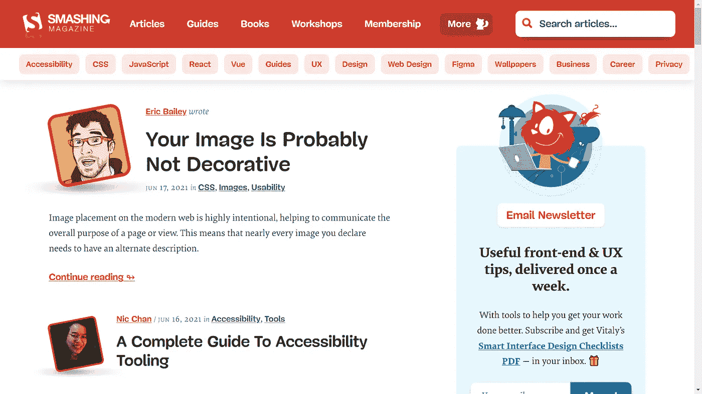
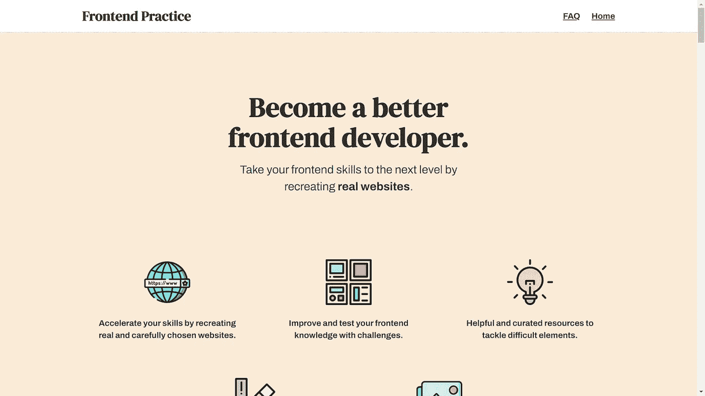

# 提高前端开发人员技能的 6 个有用资源

> 原文：<https://javascript.plainenglish.io/6-useful-resources-to-sharpen-your-skills-as-a-front-end-developer-9ea9836ca86a?source=collection_archive---------10----------------------->

Photo by **@benchaccounting** on: Unsplash.

跟上前端开发的最新趋势并提高我们的技能是我们作为开发人员的责任之一，你这样做不仅仅是为了成为房间里或 Twitter 上的酷开发人员，你这样做通常是为了保持你的工作和你的高经济价值。

公司和初创企业将改变他们的堆栈，如果这将对生产预算、雇佣的工程师数量或产品产生积极影响的话，我们可以以比特币基地为例，看看他们最近如何转向在 React Native 中构建他们的移动应用程序。

作为一名前端开发人员，你正在冒着失去工作的风险，因为你没有提高自己的技能，没有跟上时代的步伐，因为这个领域比其他任何领域都有更多的库、框架和工具，以及每天需要学习的东西。

因此，我列出了一些资源，这些资源是我在过去一年中学习新事物和在前端开发中挑战自己的信息来源。

## 1.前端导师

Photo by the author from Frontend Mentor website.

作为开发人员，我们很难从零开始项目，为什么？你不能建造你能看到或想象的东西。一切都应该从你将要建造的东西的预先计划开始。

到目前为止，Frontend Mentor 是我发现对刚学会网上基本知识的前端开发人员非常有用的网站之一，在 Frontend Mentor 中，你会发现编码设计项目的各种挑战。

Frontend Mentor 的整个过程是这样的:你选择一个网页设计挑战，你编码，然后你提交你的解决方案，你的代码或解决方案将是公开的，所以其他开发者可以给你反馈。

关于前端导师更有趣的是，他们为你提供帮助你解决给定挑战的提示。

## **2。黑客地球**

Screen by the author from Hacker earth website.

HackerEarth 是我早年学习编码时接触过的网站之一，在这个网站上，你可以找到成千上万的挑战来发展你解决问题的技能，那是通过学习更多关于编程、算法、数据结构的基础知识。

你会在 HackerEarth 中发现一件令人惊奇的事情，那就是他们如何组织黑客马拉松和竞赛，在那里你可以测试你的技能并获得奖励。

## 3.鳄鱼. io

Screen by the author from Alligtor.io website.

每当我开始谈论前端开发以及如何在这个领域提高自己时，我都不能不提到 [Alligtor.io.](/Alligtor.io.)

这个网站是我的救星，每次我坚持理解 React 或 CSS 中的新功能时，我都会去鳄鱼网站，那里的作者会解释说你只有五岁。

## 4.CSS-技巧

Screen by the author from CSS-TRICKS website.

如果你熟悉阅读关于前端开发的在线文章，我假设你已经阅读了 CSS-TRICKS 的一些文章，这个网站成立于 2007 年，是一种面向前端开发人员的遗留网站。

每次我为一个项目添加一个特性时，我都会去看 CSS-TRICKS，它包含了数千篇关于如何主要用 CSS 实现技巧和提示的文章，但也有一些关于 HTML 和 JavaScript 的文章

## 5.粉碎杂志

Screen by the author from Smashing Magazine website.

Smashing Magazine 就像 CSS-TRICKS 和 Alligator.io，只不过它的包容性更强，该平台包含了数千篇关于 UI/UX 设计的文章，CSS 和 HTML 中的技巧，以及如何在 React、Vue.js 和其他框架中为项目添加令人惊叹的功能。

此外，你会发现一些有趣的文章，关于如何在科技行业找到工作或如何提升自己作为一名开发人员的建议。

## 6.前端实践

Screen by the author from Frontend Practice website.

前端实践基于与前端导师相同的理念。他们为你提供一个现有的设计，你的工作就是通过编码来实现它..

前端导师包含代码设计的各种挑战，相比之下，前端实践挑战都是关于建立登录页面。

这个网站将为您提供您将在项目中使用的从颜色到 CSS 功能的所有内容，并且很快将包括照片和字体。即使您对使用的 CSS 功能没有任何想法，该网站也会为您提供学习它们的资源。

## 结论

这些是我用来提高我作为前端开发人员的技能的一些资源，我希望它们对你有用。关于 web 开发，你能学什么或者你能在哪里学没有限制，只是不要停止学习。

*更多内容看*[***plain English . io***](http://plainenglish.io)