# 来自访问者的 6 个有用的建议来改进你的作品集🌱🚀

> 原文：<https://javascript.plainenglish.io/6-useful-tips-from-visitors-to-improve-your-portfolio-8b04eb475624?source=collection_archive---------17----------------------->

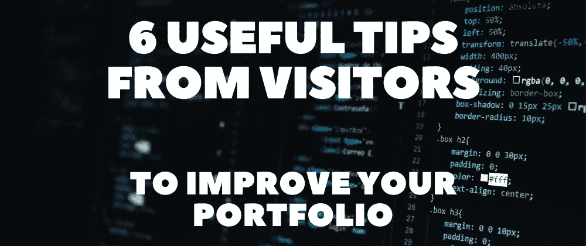

几个月前，我发表了一篇关于我如何建立我的第一个个人 T2 投资组合的文章。反馈非常棒，我得到了一些可以改进的好主意。

感谢用户 [dyllandry](https://dev.to/dyllandry) 、 [cdthomp1](https://dev.to/cdthomp1) 、 [sufyaan323](https://dev.to/sufyaan323) 、 [zzoukk](https://dev.to/zzoukk) 留下反馈并推荐了其中的大部分改动。

最近，我决定在 Git 上创建一个新的分支，并开始研究它们。由于最初的版本仍然被部署，这给了我一个比较两个版本的机会。

希望这些修改前后的图片也能激发你对如何改进你的作品集的一些想法。

## 1.可滚动主提要

## ❌Before

首先，我最初的投资组合有一个完全静态的登录页面。

用户访问内容的唯一方式是点击右上角的导航项目，否则，他们会觉得网站是空的，因为没有滚动。

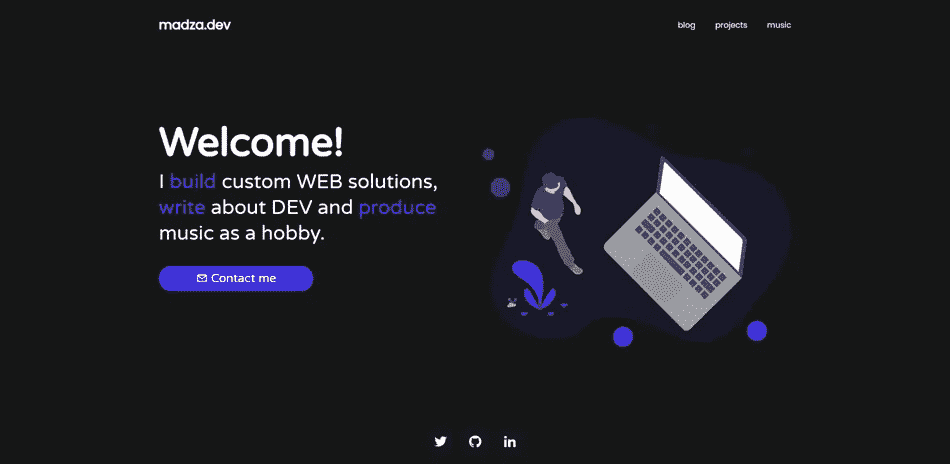

## ✅之后

改版的时候，我把登陆区做成了可滚动的，现在它可以让我突出自己最想呈现的作品。

该组合的主要目的是展示我所做的项目，因此我决定展示 3 个项目的图像和功能。另外还有 6 篇重点文章。

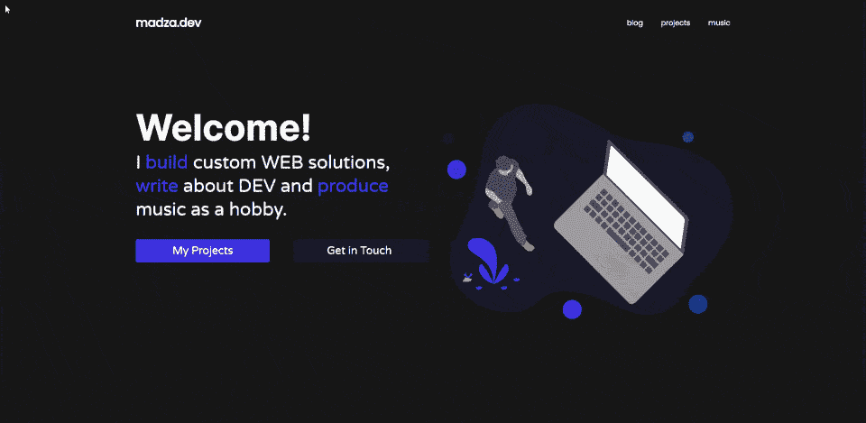

## 🔗[实例](https://www.madza.dev/)

另外，我还配置了我的 CMS (Contentful ),只需勾选一个框，就可以启用或禁用任何项目或文章作为亮点。

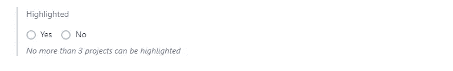

## 2.视觉博客卡

## ❌Before

第一个版本的博客卡只有标题和描述，没有文章的视觉表现。

显然，这无助于娱乐读者和吸引访问者的注意力。参见下面的初始版本:

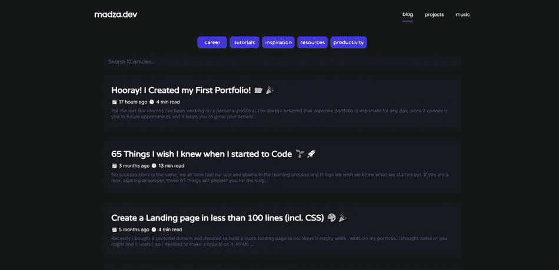

## ✅之后

在改版过程中，我重点关注了图像封面，使其不打破现有的卡片布局，在深色背景下看起来很好，并且对移动设备反应灵敏。

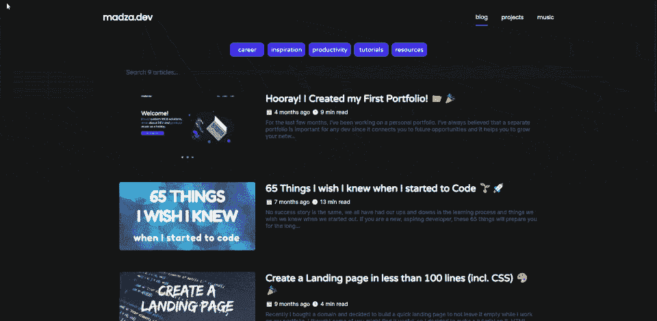

## 🔗[实例](https://www.madza.dev/blog)

## 3.动画项目卡

## ❌Before

类似地，作为博客卡片，项目卡片也不包括任何视觉效果。

这对于项目来说尤其糟糕，因为没有人真的想点击每个项目来看看它是什么样子。

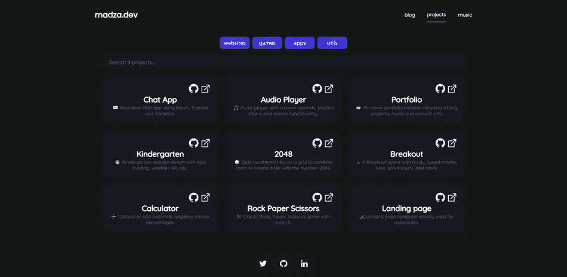

## ✅之后

因此，我决定为每个项目添加一张图片。

我通过创建 GIF 图像进一步扩展了它，这些图像不仅可以描述设计，还可以描述主要功能。

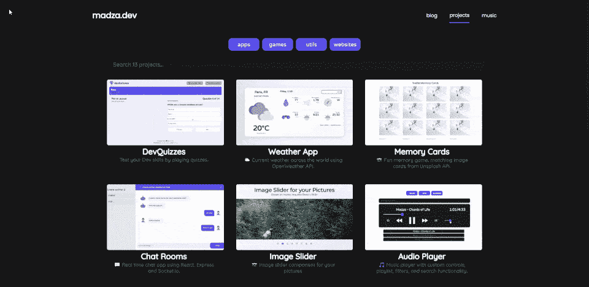

## 🔗[活生生的例子](https://www.madza.dev/code)

## 4.单独联系表单

## ❌Before

最初版本的联系功能取决于用户对系统的设置。我在 href 属性中使用了一个`mailto`,经常会出现这样的弹出窗口，要求配置电子邮件客户端。

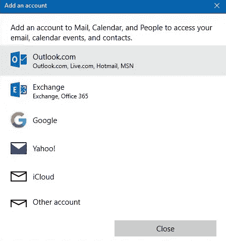

## ✅之后

在修订期间，我为联系人功能创建了一个独立的路由。我用 [react-hook-form](https://react-hook-form.com/) 做表单，用 [Sendgrid](https://sendgrid.com/) 做实际的电子邮件服务。

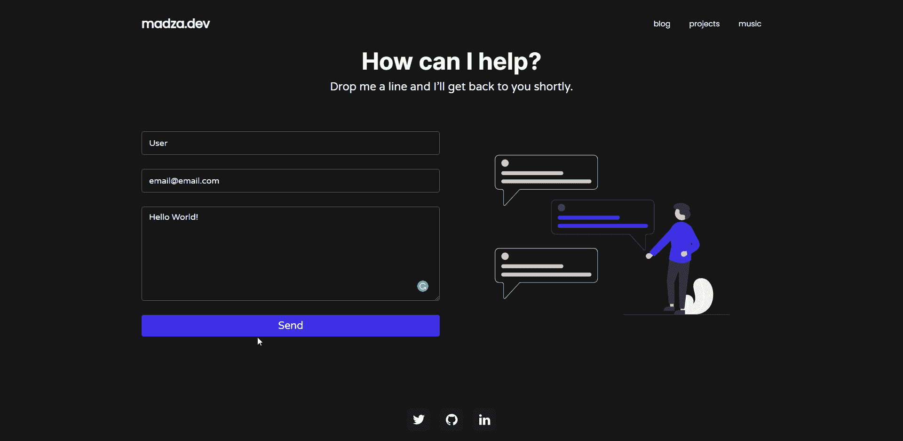

## 🔗[活生生的例子](https://www.madza.dev/contact)

## 5.自定义 404 页面

## ❌Before

我最初的博客用的是股票 NextJS 404 页面。

从技术上来说，用户被告知不存在的路线，尽管它们看起来太基本，与组合的主题不匹配。

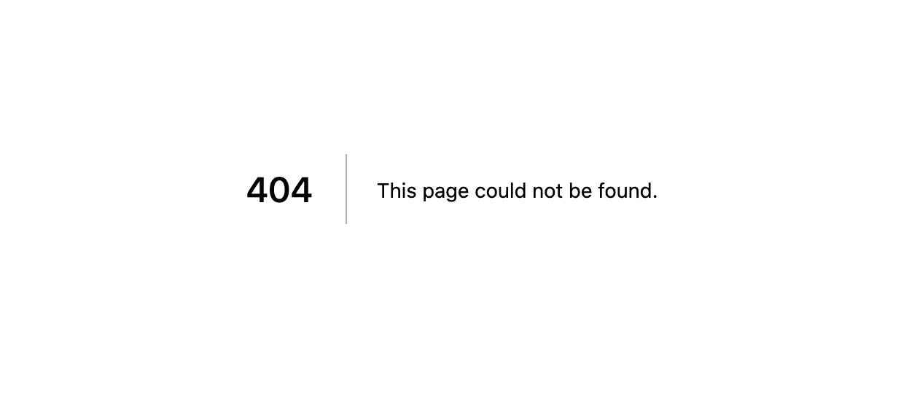

## ✅之后

我从[Undraw.co](https://undraw.co)那里获得了一些不错的 SVG，为页面创建了一个定制的样式，创建了一个定制的警告信息，并添加了一个主页按钮，这样用户就可以被重定向到主页。

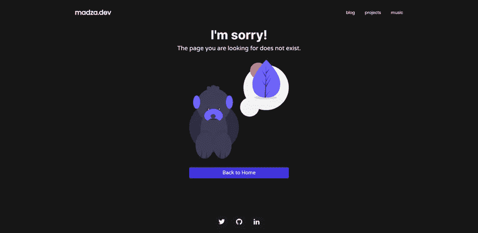

## 🔗[实例](https://www.madza.dev/404)

## 6.其他小改动

在改版期间，我还修改了滚动条样式，调整了代码突出显示，在项目中添加了源代码和 GitHub 的访问按钮，调整了移动设备的响应能力，等等。

我已经将 revision 分支合并到 master 中，并且它已经部署好了，所以你可以在 [madza.dev](https://madza.dev) 查看整个作品集。如果有任何意见或进一步的反馈，我将不胜感激。

我从这篇文章中得到的主要建议是建议使用你收到的所有反馈。我们一起打造更好的产品。我相信我们都通过分享知识来学习。

写作一直是我的激情所在，帮助和激励他人给我带来了快乐。如果您有任何问题，请随时联系我们！

在 [Twitter](https://twitter.com/madzadev) 、 [LinkedIn](https://www.linkedin.com/in/madzadev/) 和 [GitHub](https://github.com/madzadev) 上连接我！

*更多内容尽在* [***说白了***](http://plainenglish.io/)