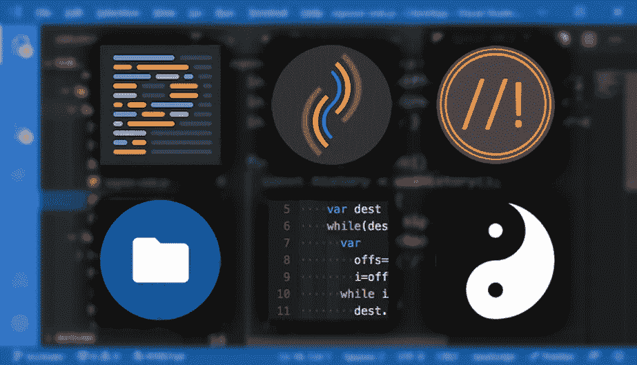
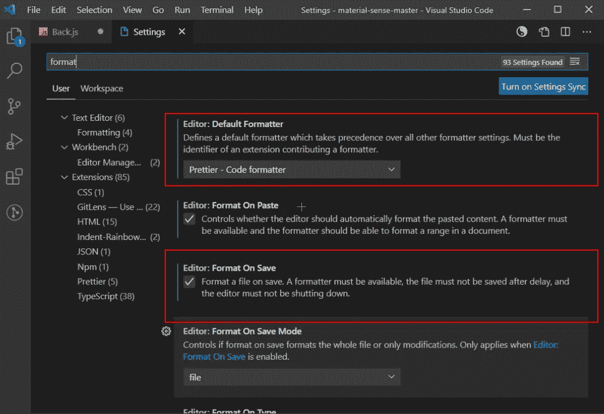
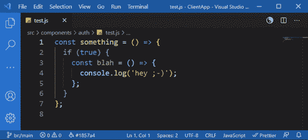
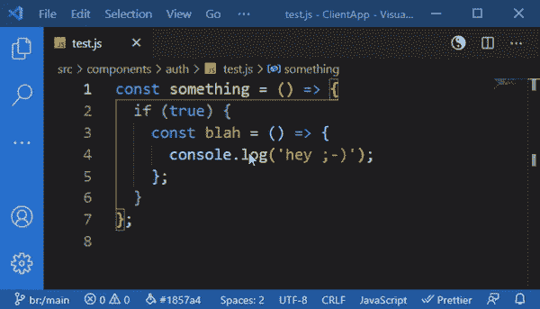
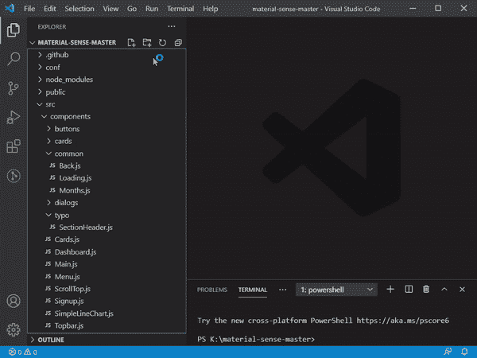
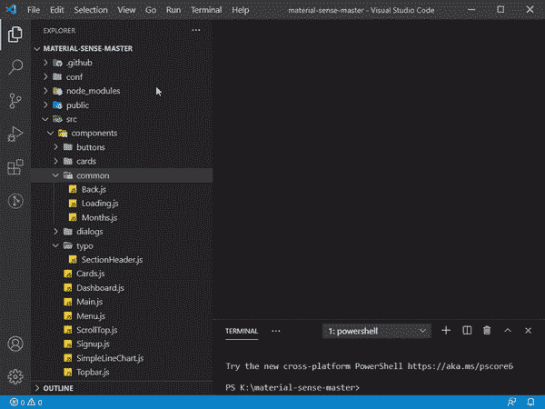
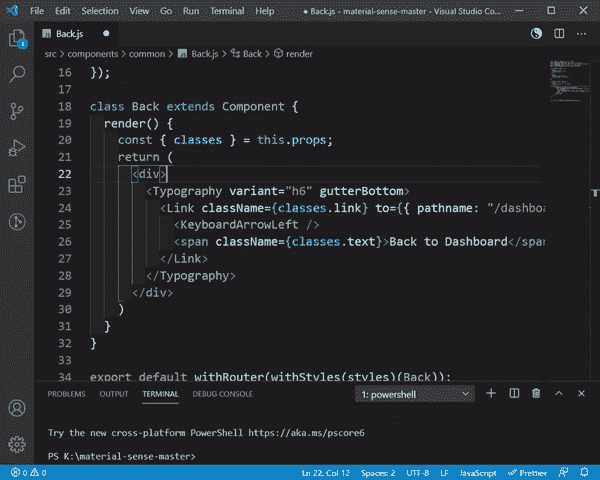
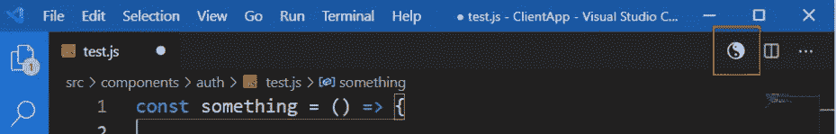
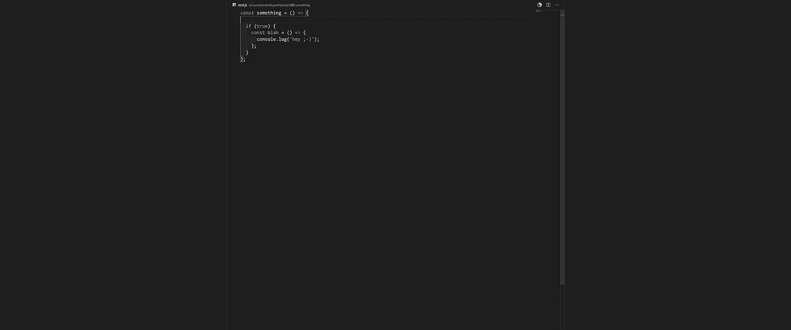

# 我离不开的 6 个 Visual Studio 代码扩展

> 原文：<https://javascript.plainenglish.io/6-visual-studio-code-extensions-i-cannot-live-without-fd00ae70efb6?source=collection_archive---------0----------------------->



VS Code 是一个优秀的编辑器，有一些非常好的扩展。我经常在 VS 代码和 Visual Studio Enterprise 之间切换，我希望 VS 代码中的扩展和响应也能在 Visual Studio Enterprise 中使用。我发现了一些类似的扩展，但不是全部。

## 1 —更漂亮

你要么喜欢它，要么讨厌它。当我第一次安装它的时候，当它重新格式化了我所有精心格式化的代码时，我彻底崩溃了，但是一个星期后，我离不开它了。

当在 Git 或 PlasticSCM 这样的 DVCS 中工作时，在一个以相同方式格式化代码的团队中工作的好处是令人敬畏的。

> 记住，一旦安装完毕，打开漂亮插件作为**默认格式化程序**，否则你将点击保存，什么也看不到。



Prettier VS Code settings required to see it work when you hit save

【https://marketplace.visualstudio.com/items?】VS 代码 : [在此获取 itemName = es benp . prettle-vs code](https://marketplace.visualstudio.com/items?itemName=esbenp.prettier-vscode)

**潜在的 Visual Studio 等价物(未测试):**[https://github.com/warrenseine/prettier-plugin-csharp](https://github.com/warrenseine/prettier-plugin-csharp)

## 2 —括号对着色程序 2

**简单却有用**。这个插件给括号对之间的视觉链接上色。每个新的嵌套对从一个调色板开始循环。您可以配置颜色和其他风格。



Example of bracket highlighting

**拿到这里**:[https://marketplace.visualstudio.com/items?itemName = Coen raads . bracket-pair-colorizer-2](https://marketplace.visualstudio.com/items?itemName=CoenraadS.bracket-pair-colorizer-2)

## 3 —更好的评论

这个小插件帮助你**让评论更友好**。待办事项、提醒、精彩内容等都在视觉上跃然眼前。



Example of some of the comment colours using Better Comments plugin

**拿过来 VS 代码【https://marketplace.visualstudio.com/items?】:[T21itemName = aaron-bond . better-comments](https://marketplace.visualstudio.com/items?itemName=aaron-bond.better-comments)**

**Visual Studio 等同于**:[https://marketplace.visualstudio.com/items?itemName=OmarRwemi。更好的评论](https://marketplace.visualstudio.com/items?itemName=OmarRwemi.BetterComments)

## 4-材料图标主题

安装了这个插件，项目导航就容易多了。我的默认 VS 代码缺少文件夹图标，一旦项目变大，看起来都一样。

这个插件真正酷的是，他们使用文件夹或文件名来设置图标，艰苦的工作已经完成。装上看看区别，你就不回去了。看看下面…

**之前:**



Before the Material Icon Theme is installed

**之后:**



After installing Material Icon Theme

**拿过来**:[https://marketplace.visualstudio.com/items?itemName = pkief . material-icon-theme](https://marketplace.visualstudio.com/items?itemName=PKief.material-icon-theme)

# 5-缩进彩虹

这是一个微妙的插件，在每一级缩进显示不同的颜色。它可以被配置成你喜欢的那样亮，但是我已经把我的彩虹拨回来了。

非常酷的是它突出显示了缩进错误，尽管更漂亮的是在保存时清除这些错误。



我的设置，来自 settings.json

```
"indentRainbow.colors": [
    "rgba(255,255,64,0.04)",
    "rgba(127,255,127,0.04)",
    "rgba(255,127,255,0.04)",
    "rgba(79,236,236,0.04)"
],
```

**获取 VS 代码**:[https://marketplace.visualstudio.com/items?itemName = oder wat . indent-rainbow](https://marketplace.visualstudio.com/items?itemName=oderwat.indent-rainbow)

**Visual Studio 等效软件**:[https://marketplace.visualstudio.com/items?itemName=chingucoding。IndentRainbow](https://marketplace.visualstudio.com/items?itemName=chingucoding.IndentRainbow)

## 6 —切换 Zen 模式

添加一个小 zen 按钮，单击该按钮会使代码编辑器全屏显示。我将我的设置为在中间有一个窄窗口。有利于保持对文件的关注。



Zen mode button

也有一个切换的快捷键(Ctrl+K Z)。确保按下 K 后放开 Ctrl，然后按 z。



In Zen mode

**拿到这里**:[https://marketplace.visualstudio.com/items?itemName = fudd . toggle-Zen-mode](https://marketplace.visualstudio.com/items?itemName=fudd.toggle-zen-mode)

**Visual Studio 等效:内置(Alt+Shift+Enter)**

我确信我已经错过了这个列表中你最喜欢的一些插件。所以请在下面的评论中随意提及它们。