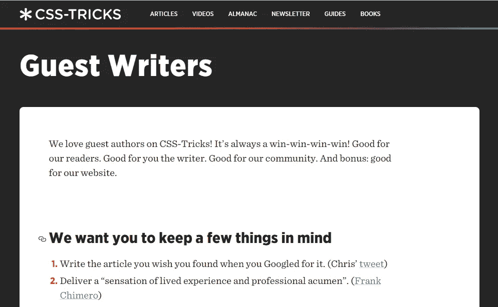
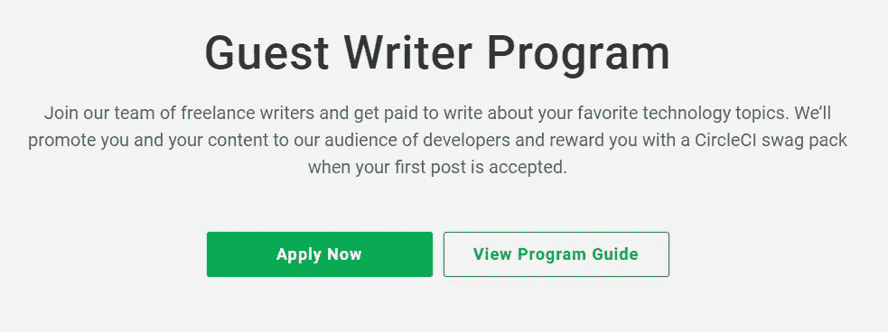
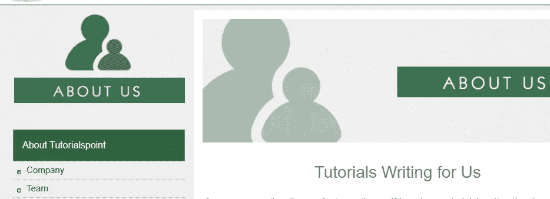

# 6 个付钱给开发者写技术文章的网站

> 原文：<https://javascript.plainenglish.io/6-websites-that-pay-developers-to-write-technical-articles-7f6c691b56b6?source=collection_archive---------5----------------------->

## 一些向你支付技术内容的出版物的列表。

Photo by [ConvertKit](https://unsplash.com/@convertkit?utm_source=medium&utm_medium=referral) on [Unsplash](https://unsplash.com?utm_source=medium&utm_medium=referral)

现在对技术含量的需求很大。许多公司和出版物都在寻找可以在博客中为他们撰写技术内容的作家。这些公司试图发布尽可能多的内容，以增加他们网站的访客，当然也获得一些客户。

作为一名开发人员，你已经掌握了很多技术知识，而且你至少知道一些技术。所以你为这些公司写技术内容会更容易，尤其是如果你已经有了一个博客，可以作为作品集展示给他们看。

写技术文章赚钱是一个额外赚钱的好方法。大多数出版物根据许多因素对每篇文章支付不同的费用。

在这篇文章中，我会给你列出一些付钱让你写技术内容的网站。所以让我们开始吧。

# 1.数字海洋

每篇文章最高支付 300 美元。

Capture by the author from [DigitalOcean](https://www.digitalocean.com/community/pages/write-for-digitalocean).

[数字海洋](https://www.digitalocean.com/community/pages/write-for-digitalocean)让你能够分享你的知识，同时获得报酬，同时支持一个专注于技术的慈善机构。是的，你可以选择一个需要从 DigitalOcean 获得捐赠的专注于技术的慈善机构。

当谈到要写的主题时，他们接受许多关于云托管、OSS、软件开发等主题。

# 2.CSS 技巧

*每篇文章最高支付 250 美元。*

Capture by the author from [CSS Tricks](https://css-tricks.com/guest-posting/).

CSS Tricks 也在寻找可以为他们写文章的客座作家。他们主要发布大量 CSS 内容，但他们有一个你可以写的主题列表。如果他们接受你，你也可以提交一个你想要的主题并写下它。

# 3.Auth0

*每篇文章最高支付 400 美元。*

Capture by the author from [Auth0](https://auth0.com/fr/apollo-program).

[Auth0](https://auth0.com/fr/apollo-program) 有一个程序可以让开发者为 Auth0 读者编写有用的技术内容。例如，你可以写关于框架、编程语言和开发技术的文章。他们也有一个主题列表，你可以从中选择。

# 4.对数火箭

*每篇文章最高支付 350 美元。*

Capture by the author from [LogRocket](https://blog.logrocket.com/become-a-logrocket-guest-author-7d970eb673f9/).

LogRocket 正在寻找充满激情的开发人员和技术作家，他们可以撰写前端开发主题。

他们主要寻找关于 React、JavaScript、Vue、前端性能、UI/UX 等方面的教程。在他们接受你之前，你只需要给他们看你过去写的一系列文章。

# 5.切尔莱西

每篇文章最高支付 300 美元。

Capture by the author from [CircleCI](https://circleci.com/blog/guest-writer-program/).

[CircleCI](https://circleci.com/blog/guest-writer-program/) 有一个作家计划，你可以加入为他们写技术内容。当你被录取的时候，他们会给你一份你可以写的主题清单。你也可以查看他们的博客，看看他们发布的文章类型。

# 6.教程要点

*每篇文章最高支付 500 美元。*

Capture by the author from [Tutorialspoint](https://www.tutorialspoint.com/about/tutorials_writing.htm).

Tutorialspoint 允许你撰写许多技术话题。您也可以从主题列表中选择。

# 结论

如你所见，这些是一些你可以为之写作的出版物，同时你也可以通过写作获得报酬。所以这是一个提高技能和额外赚钱的好方法。

感谢您阅读这篇文章。希望你觉得有用。

**更多阅读**

 [## 10 个令人敬畏的前端开发工具来提高您的生产力

### 你可能需要用到的有用的前端开发工具。

javascript.plainenglish.io](/10-awesome-front-end-development-tools-to-boost-your-productivity-b1d2efc4c4ba)  [## 像专业人士一样创建令人印象深刻的 GitHub 个人资料的 4 个技巧

### 如果你想建立一个令人印象深刻的 GitHub 档案，你需要考虑的事情。

javascript.plainenglish.io](/4-tips-to-create-an-impressive-github-profile-like-a-pro-ea712c976e07)  [## 如何为开发者创造更好的内容

### 开发人员是很难为其创建内容的受众。天生的怀疑论者，开发者倾向于重视真实性…

电路. ooo](https://circuit.ooo/blog/how-to-create-better-content-for-developers)  [## 2023 年内容营销清单|重新定位并重复以取得成功

### 展望新的一年，回顾和更新我们的内容营销策略非常重要，以确保它们…

电路. ooo](https://circuit.ooo/blog/2023-content-marketing-checklist)