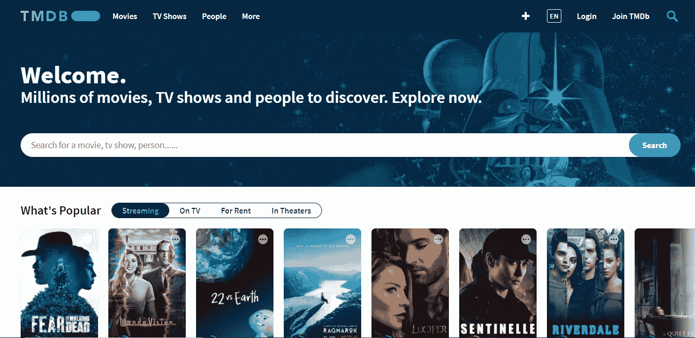
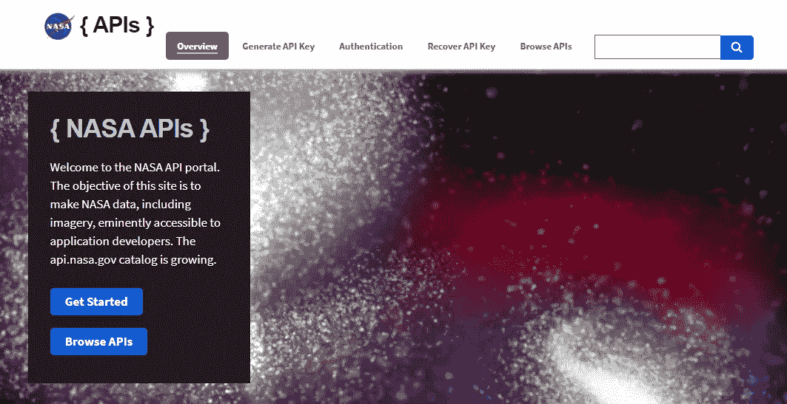
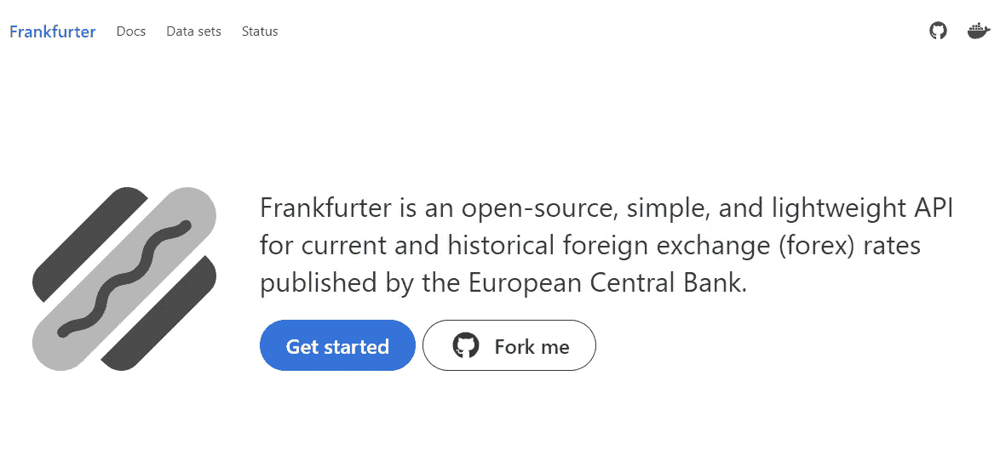
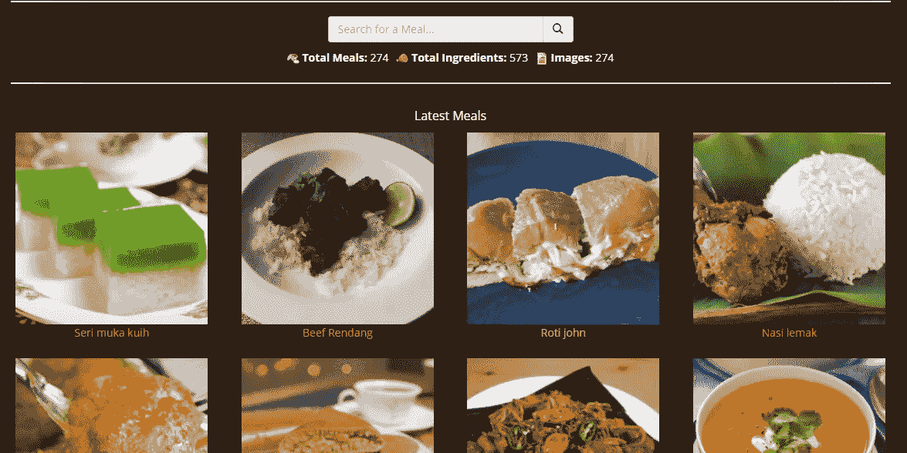
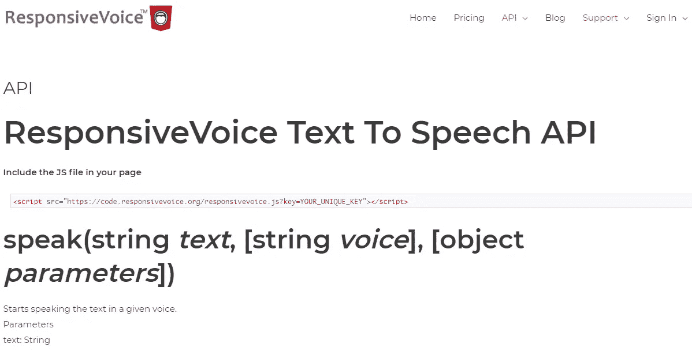
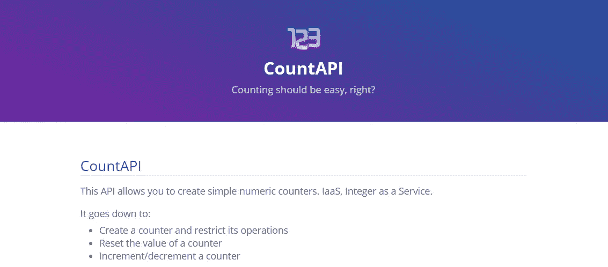
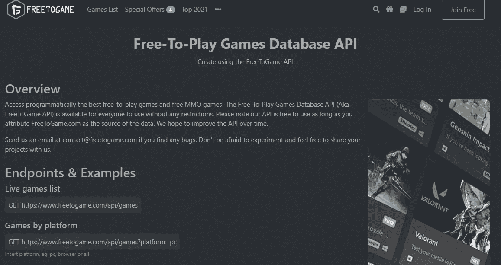

# 面向所有前端开发人员的 7 款出色的 API

> 原文：<https://javascript.plainenglish.io/7-awesome-apis-for-all-frontend-developers-a06c1057661?source=collection_archive---------0----------------------->

## 您的下一个项目可能需要的有用的 API。

Photo by [Ryland Dean](https://unsplash.com/@ryland_dean?utm_source=medium&utm_medium=referral) on [Unsplash](https://unsplash.com?utm_source=medium&utm_medium=referral)

API 现在非常有用。它们允许前端和后端之间的通信。因此，使用 API 功能和数据后，您的网站或应用程序会变得动态。

作为一个前端开发者，API 给了你访问数据和在你的网站或应用上使用数据的优势。除此之外，它们还能让你节省时间，完成有用的任务，而不必写很多代码。

在本文中，我将给出一些非常有用的 API 列表，您可能需要在您的项目中使用它们。所以让我们开始吧。

# 1.MovieDB API

[movie db API](https://www.themoviedb.org/documentation/api)为您提供了创建电影应用程序所需的所有数据。这是一个非常有用的 API，允许你获取关于电影、演员图像、电视节目等等的数据。

Capture by the author from [The MovieDB](https://www.themoviedb.org/).

当涉及到创建电影应用程序时，它是最流行的 API 之一。你可以阅读他们的文档来获得更多关于 API 的信息。

# 2.美国宇航局 API

[NASA](https://api.nasa.gov/) 为应用开发者提供了一堆有用的 API。这些 API 可以让你访问不同类型的数据，包括天文学、空间天气、月球、火星等等。

您也可以阅读他们的文档来获得关于可用 API 的信息。

Capture by the author from [NASA](https://api.nasa.gov/).

# 3.法兰克福香肠

[Frankfurter](https://www.frankfurter.app/) 是一个 API，允许你获取货币数据并跟踪可用的汇率。除此之外，API 是免费的，不需要 API 密钥。

Capture by the author from [Frankfurter](https://www.frankfurter.app/).

# 4.MealDB API

如果您想访问随机的膳食数据和食谱，MealDB API 非常有用。它为你提供了关于食物成分、图片、分类、食物视频等等的数据。

Capture by the author from [TheMealDB](https://www.themealdb.com/).

# 5.响应语音 API

[响应式语音 API](https://responsivevoice.org/api/) 允许你将任何文本转换成语音。这个 API 有很多你可以使用的特性，比如改变说话者的口音、性别、语言和音量。

您可以查看他们的网站，了解关于 API 和如何使用它的更多信息。

Capture by the author from [responsive voice API](https://responsivevoice.org/api/).

下面是一个使用 API 的示例:

A pen by the author from [Codepen](https://codepen.io/).

# 6.计数 API

Count API 让您能够创建数字计数器并跟踪页面被访问的次数。您还可以使用这个 API 来了解用户点击按钮的次数。

你可以用这个 API 跟踪很多东西。它非常有用，文档也很简单。

Capture by the author from [CountAPI](https://countapi.xyz/).

下面是一个使用 CountAPI 的示例:

A pen by the author from [Codepen](https://codepen.io/).

# 7.免费游戏 API

免费游戏 API 完全免费，你可以访问一个数据库 API，它收集了最好的免费游戏。

API 提供了按类别、平台、标签等过滤游戏的能力。你也可以从一个特定的游戏中获得细节。

Capture by the author from [FreeToGame API](https://www.freetogame.com/api-doc).

# 结论

正如您在上面看到的，这些是您可以在项目中使用的一些最好的 API。它们为您提供了作为开发人员可以访问的有价值的数据。我真的建议利用 API，因为它们让生活变得更简单，并节省您的时间。

感谢您阅读这篇文章。希望你觉得有用。

**延伸阅读:**

 [## 只用 HTML 就能做的 4 件了不起的事情

### HTML 比你想象的更有用。在以下情况下不需要 JavaScript。

javascript.plainenglish.io](/4-awesome-things-you-can-do-using-only-html-10ab13a245ef)  [## 学习 React 之前应该了解的 JavaScript 特性

### 在做出反应之前，先学习这些 JavaScript 特性

javascript.plainenglish.io](/8-javascript-features-to-know-before-learning-reactjs-aac8b7748b30)  [## 通过我的推荐链接加入 Medium-Mehdi Aoussiad

### 作为一个媒体会员，你的会员费的一部分会给你阅读的作家，你可以完全接触到每一个故事…

mehdiouss.medium.com](https://mehdiouss.medium.com/membership) 

*更多内容尽在*[***plain English . io***](http://plainenglish.io)