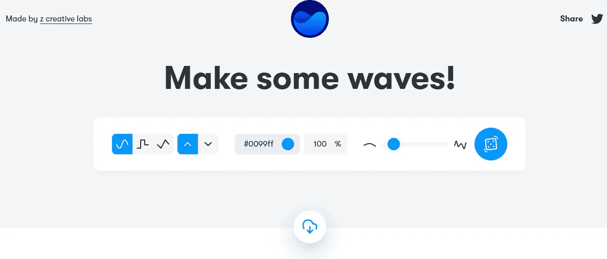
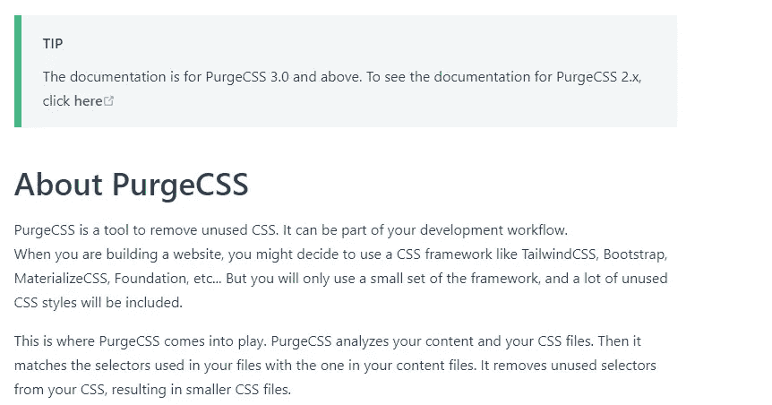
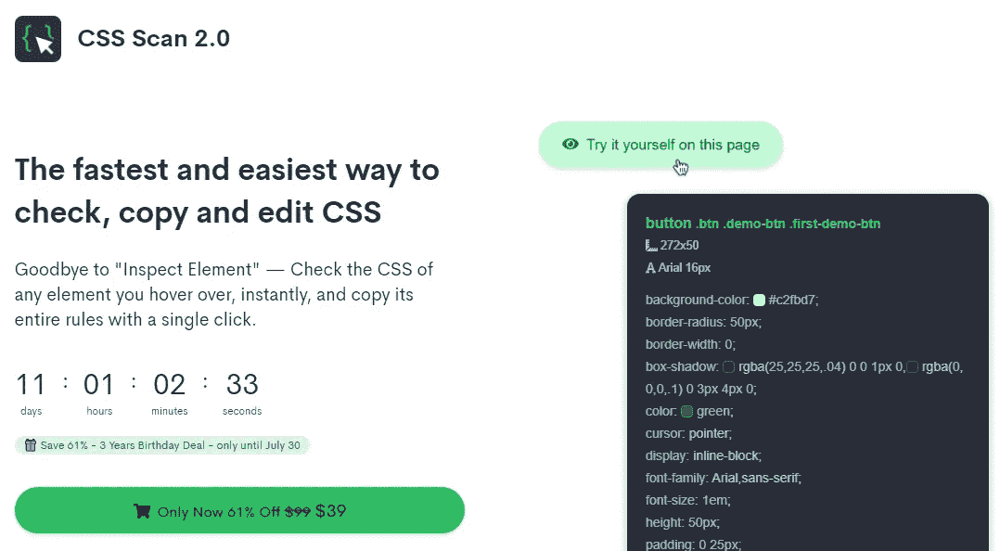
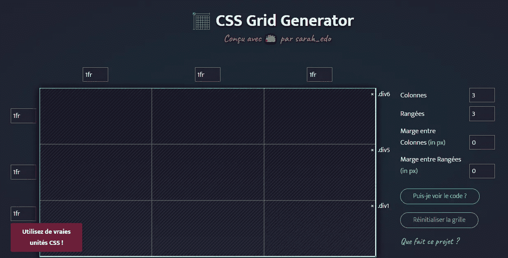
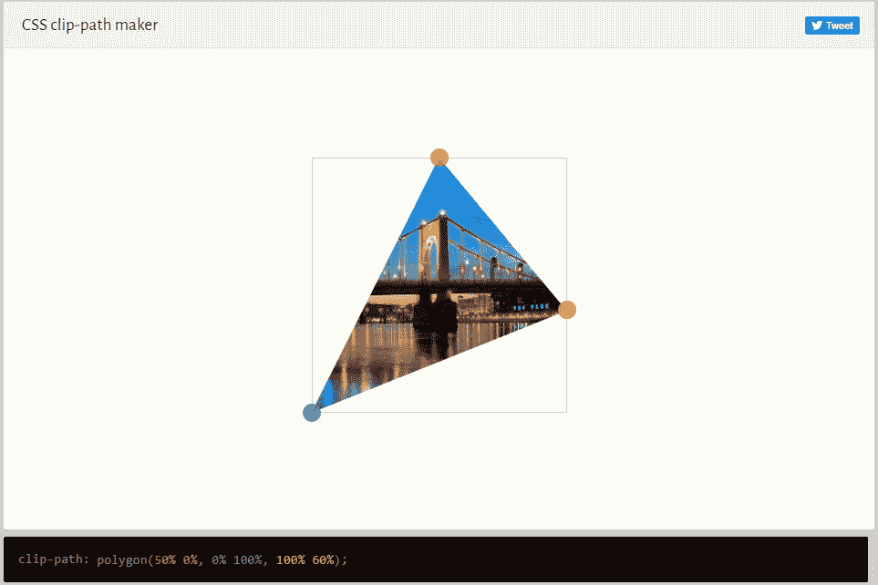
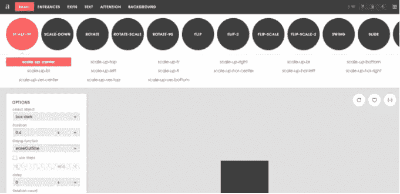
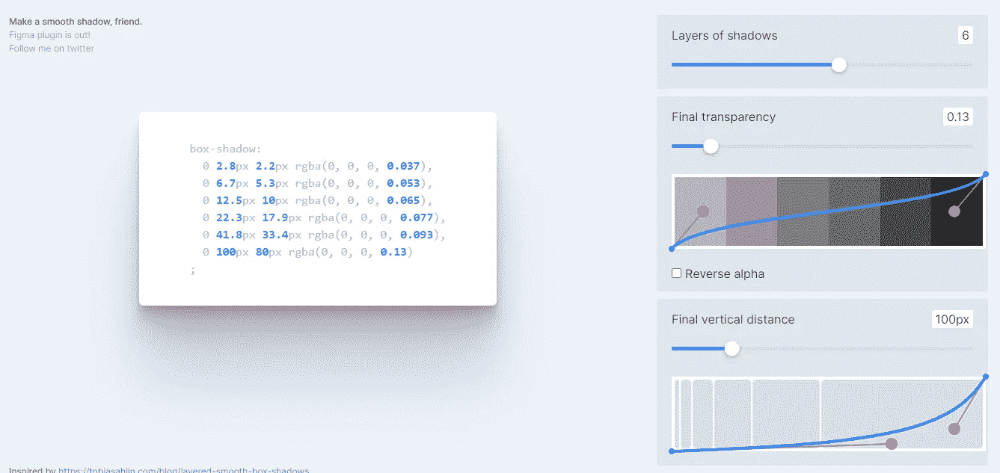

# 面向所有 Web 开发人员的 7 款超棒的 CSS 工具

> 原文：<https://javascript.plainenglish.io/7-awesome-css-tools-for-all-web-developers-390ceced6f83?source=collection_archive---------2----------------------->

## 有用的 CSS 工具，让您的生活更轻松，提高您的生产力。

Photo by [KOBU Agency](https://unsplash.com/@kobuagency?utm_source=medium&utm_medium=referral) on [Unsplash](https://unsplash.com?utm_source=medium&utm_medium=referral)

CSS 是每个 web 开发人员都必须知道的样式表语言。它让我们能够让网页对用户更有吸引力。一个没有 CSS 的网页就像一个没有衣服的人。

CSS 有很多很酷的特性，允许我们在网络上创造惊人的体验。通过使用这种样式表语言，您可以使网页在所有设备上都美观且响应迅速。您还可以利用 flexbox 和 grid 的强大功能创建好看的布局。

CSS 有很多事情要做，它对 web 开发非常有用。然而，编写和管理好的 CSS 代码并不容易。尤其是如果你正在处理大型项目，并且没有使用 CSS 框架。这就是为什么在网上使用一些可用的 CSS 工具会让你的生活变得更容易。

在这篇文章中，我会给你一个很棒的 CSS 工具列表，来提高你的工作效率，让生活变得更简单。所以让我们开始吧。

# 1.获得波浪

[获取波形](https://getwaves.io/)是一个神奇的工具，可以让你轻松地创建 SVG 波形。使用 CSS 创建 waves 并不容易，这就是为什么这个工具非常有用。

您创建 SVG 波并获得它们的代码。如果你愿意，也可以下载 SVG wave。

Capture by the author from [GetWaves](https://getwaves.io/)(external link).

# 2.采购

PurgeCSS 是一个允许你移除 CSS 中未使用代码的工具。这有利于减小 CSS 文件的大小并提高性能。

这个工具非常有用，尤其是当你使用 CSS 框架的时候。因为大多数时候框架会附带很多我们实际上并不使用的代码。

Capture by the author from [PurgeCSS](https://purgecss.com/)(external link).

# 3.CSS 扫描

CSS Scan 是一个高级工具，可以让你获得你在网页上悬停的任何元素的完整 CSS 代码。

Capture by the author from [CSS Scan](https://getcssscan.com/)(external link).

# 4.CSS 网格生成器

这个[工具](https://cssgrid-generator.netlify.app/)能够为你的项目生成 CSS 网格代码。设置列、行和单位，然后就可以得到 CSS 甚至 HTML 代码。

Capture by the author from [CSS Grid Generator](https://cssgrid-generator.netlify.app/)(external link).

# 5.CSS 剪辑路径生成器

CSS 中的属性`clip-path`允许你制作复杂的形状(圆形、椭圆形、多边形和所有其他复杂的形状)。如果你不熟悉这个属性，你可以使用 CSS [clip-path maker](https://bennettfeely.com/clippy/) 工具轻松地创建你想要的形状并获得它的 CSS 代码。

Capture by the author from [bennettfeely](https://bennettfeely.com/clippy/)(external link).

# 6.泛灵论者

Animista 是一个很棒的工具，它给了你一个可以使用的预先制作的 CSS 动画的集合。你可以选择任何类型的动画，并获得它的 CSS 代码。

Capture by the author from [Animista](https://animista.net/)(external link).

# 7.平滑阴影

[平滑阴影](https://shadows.brumm.af/) s 是一个神奇的工具，可以让你轻松创建平滑的 CSS 阴影。这个工具给了你更多的自由，你可以自定义阴影的图层，透明度，垂直距离等等。

一旦你创建了想要的阴影，你可以复制 CSS 代码并在你的项目中使用它。

Capture by the author from [Smooth Shadows](https://shadows.brumm.af/)(external link).

# 结论

正如你在上面的列表中看到的，这些是非常有用的 CSS 工具，可以在你写 CSS 的时候节省你很多时间。它们让你的生活更轻松，并帮助你专注于发展中的其他重要任务。

感谢您阅读这篇文章。希望你觉得有用。

**更多阅读:**

 [## 10 个令人敬畏的前端开发工具来提高您的生产力

### 你可能需要用到的有用的前端开发工具。

javascript.plainenglish.io](/10-awesome-front-end-development-tools-to-boost-your-productivity-b1d2efc4c4ba)  [## 提高网站可访问性的 6 个有用技巧

### 可达性可能比你想象的更重要，尤其是在 2021 年。

javascript.plainenglish.io](/6-useful-tips-to-improve-your-websites-accessibility-d47dd446d82) 

*更多内容请看*[***plain English . io***](http://plainenglish.io)