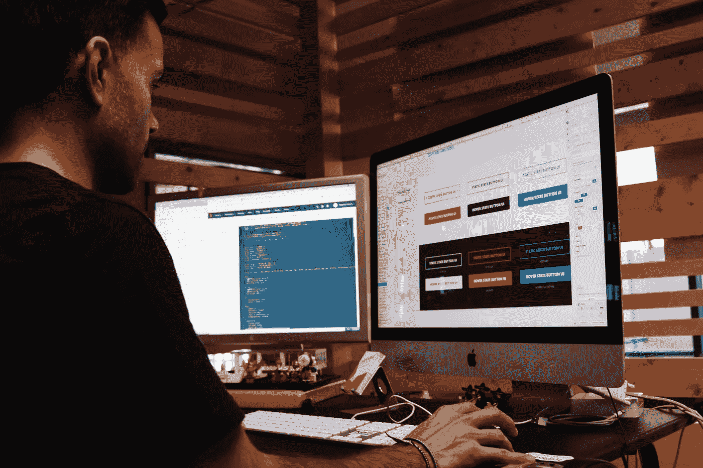
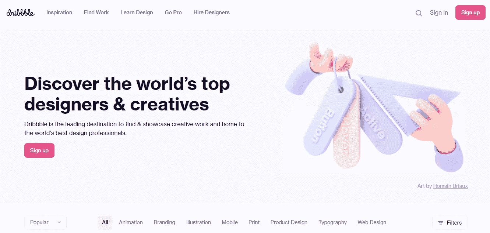
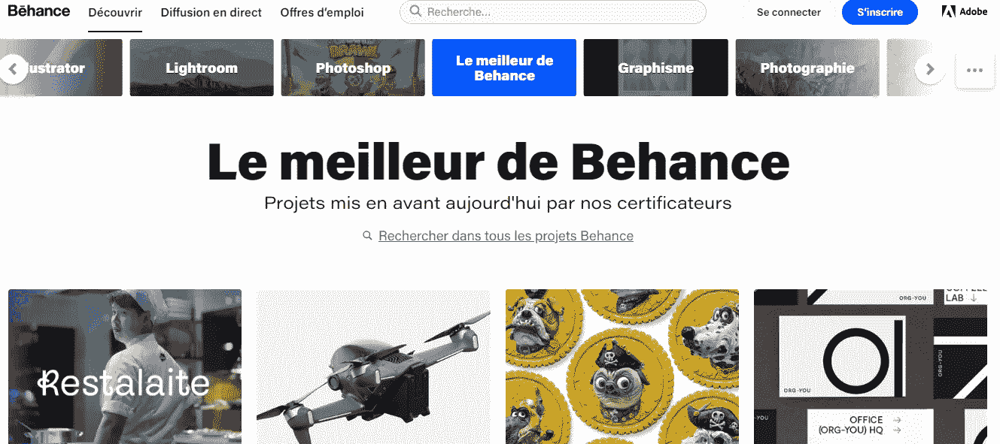
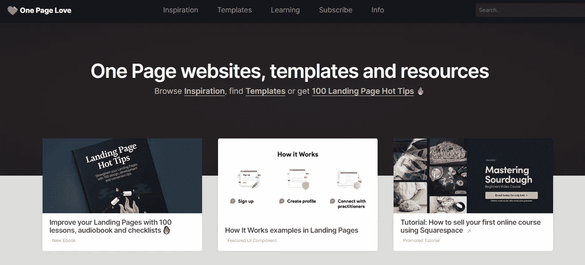
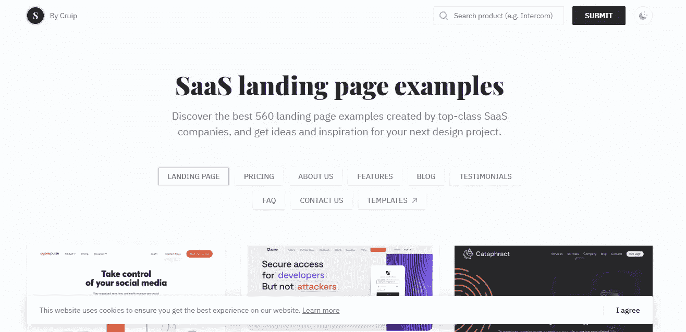
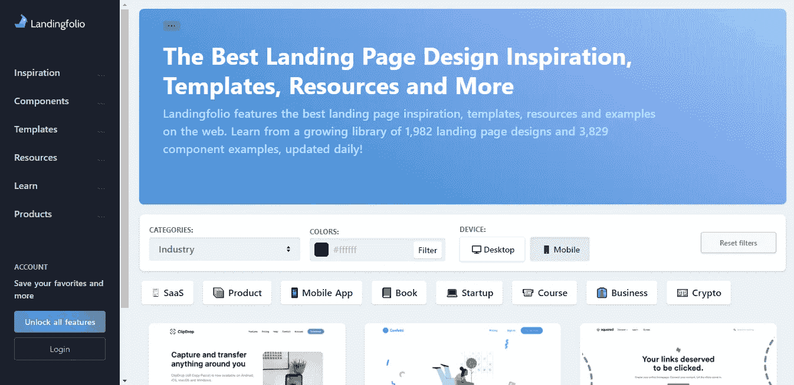
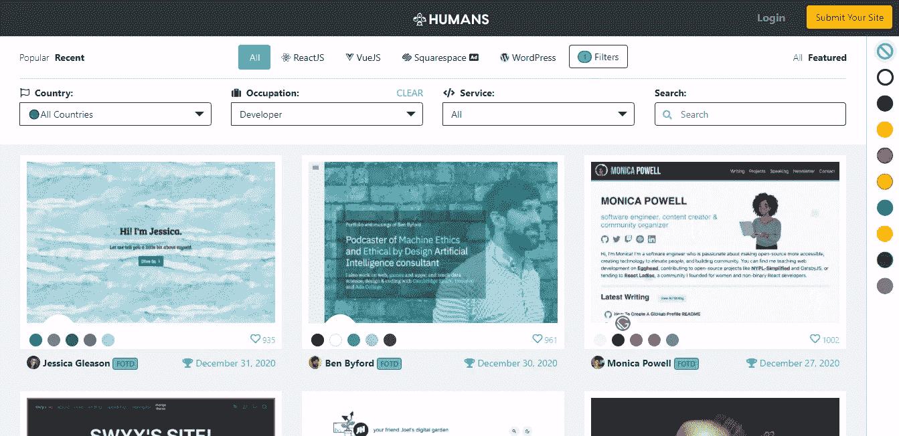
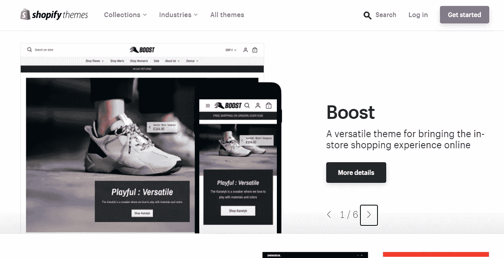

# 面向所有 Web 开发人员的 7 个绝佳设计灵感资源

> 原文：<https://javascript.plainenglish.io/7-awesome-design-inspiration-resources-for-web-developers-9c42c4db7cac?source=collection_archive---------10----------------------->

## 作为一名网页开发者，你可以在这里获得设计灵感。

Photo by [Campaign Creators](https://unsplash.com/@campaign_creators?utm_source=medium&utm_medium=referral) on [Unsplash](https://unsplash.com?utm_source=medium&utm_medium=referral)

设计是任何软件或应用程序非常重要的一部分。这是用户看到的第一样东西，它让用户知道软件的用途。作为一名开发人员，你不必和设计打交道，尤其是如果你和一个设计师团队一起工作的话。

然而，有时你需要自己设计，尤其是如果你是一个独立的开发者。问题是，并不是所有的开发者都擅长设计。这就是为什么如果你想让你的项目对用户更有吸引力，从其他资源获得一些灵感总是有益的。

在本文中，我们将为您提供一些有用的资源，作为开发人员，您可以从中获得一些设计灵感。所以让我们开始吧。

# 1.滴水不漏

[Dribbble](https://dribbble.com/) 是受欢迎的平台之一，在这里你可以获得设计灵感。这是一个设计师发布他们的设计并与世界分享的好地方。任何类型的创意设计都可以在 Dribbble 上找到。

除了灵感，如果你愿意，你还可以学习设计，浏览设计工作，雇佣设计师。

Capture by the author from [Dribbble](https://dribbble.com/).

# 2.行为

T2 也是各类设计师的热门目的地。那里也有很多创造性的工作。作为一名开发者，Behance 允许你搜索任何你想从中获得灵感的设计类型。

Capture by the author from [Behance](https://www.behance.net/).

# 3.一页爱情

[One page love](https://onepagelove.com/) 是一个很棒的网站，在那里你可以找到网页设计、模板和资源。你可以在那里浏览任何你想从中获得灵感的网站设计。

Capture by the author from [One Page Love](https://onepagelove.com/).

# 4.SaaS 登录页面

[SaaS 登陆页面](https://saaslandingpage.com/)是一个流行的网站，策划高质量的 SaaS 网站设计。你可以过滤任何类型的 SaaS 网页设计(登陆页面设计，关于我们的页面设计，博客等)。如果你正在开发 SaaS 产品，这是一个很好的资源。

Capture by the author from [SaaS landing page](https://saaslandingpage.com/).

# 5.兰丁福利奥

[Landingfolio](https://www.landingfolio.com/) 是一个有用的网站，提供登陆页面设计灵感和资源。有很多类型的登陆页面设计，你可以从中筛选，比如登录页面、产品页面、SaaS 页面等等。对于所有的 web 开发者来说，这是一个非常有用的资源。

Capture by the author from [Landingfolio](https://www.landingfolio.com/).

# 6.人类

[如果你正在寻找与设计灵感相关的作品，人类](https://humans.fyi/)是合适的目的地。

人们策划了许多个人投资组合网站，你可以访问并从中获得灵感。你可以搜索任何类型的投资组合(开发者投资组合，设计师，摄影师，等等)。你甚至可以根据技术、颜色和国家来过滤投资组合。

Capture by the author from [Humans](https://humans.fyi/).

# 7.购物主题

如果你想开发一个电子商务网站，Shopify themes 是获得设计灵感的最佳场所。有大量的电子商务模板是由创意设计师创建的。作为一名网站开发人员，你可以探索这些模板设计，并从中获得灵感来建立你的下一个商店。

Capture by the author from [Shopify themes](https://themes.shopify.com/).

# 结论

正如我所说，设计是任何软件的重要组成部分。这就是为什么作为一名 web 开发人员，你应该通过创建出色的用户界面和用户体验来关注你的设计。如果你想拥有一双设计师的眼睛，即使你是一名开发人员，设计灵感也是非常重要的。

感谢您阅读这篇文章。希望你觉得有用。

**延伸阅读**

 [## 构建用户界面时节省时间的 10 个免费工具

### 为你的项目构建用户界面时帮助你的神奇工具。

javascript.plainenglish.io](/10-free-tools-to-save-time-when-building-user-interfaces-e8406c58ba6c) 

*更多内容尽在*[***plain English . io***](https://plainenglish.io/)