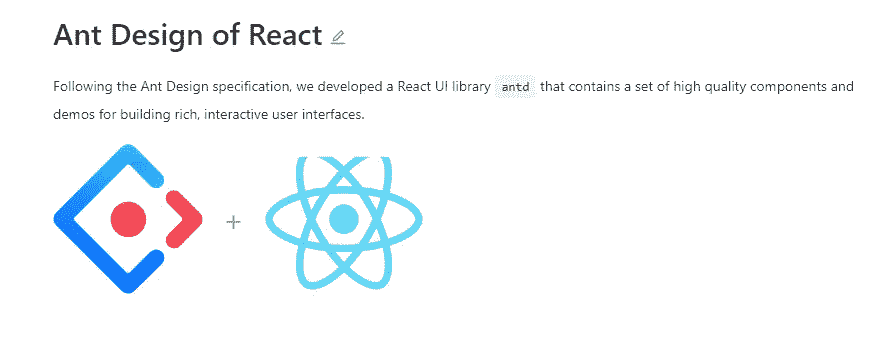
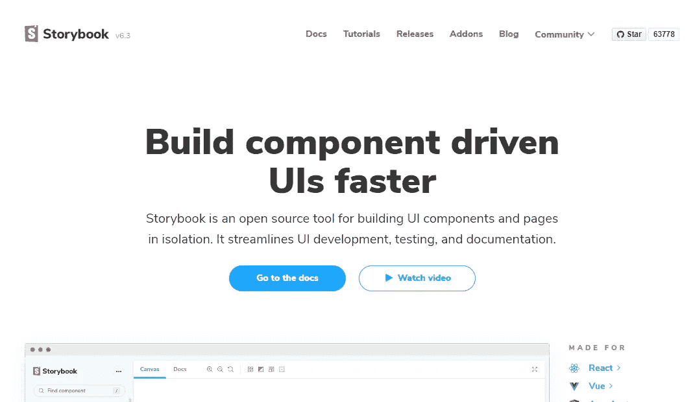
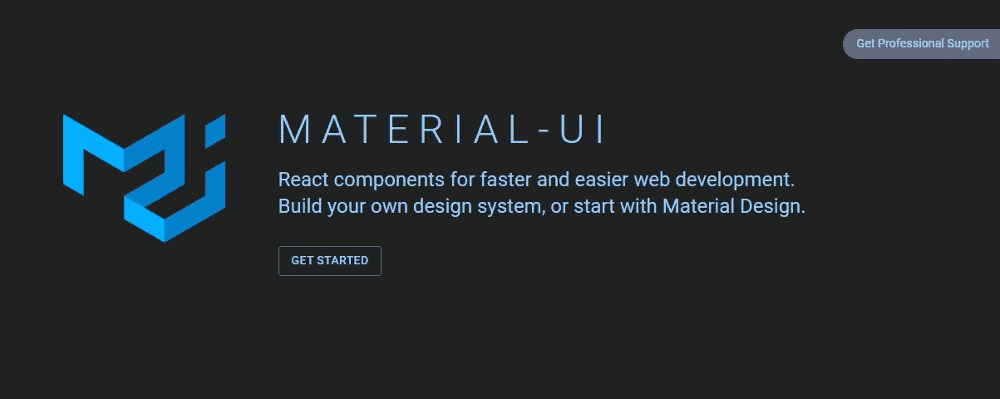
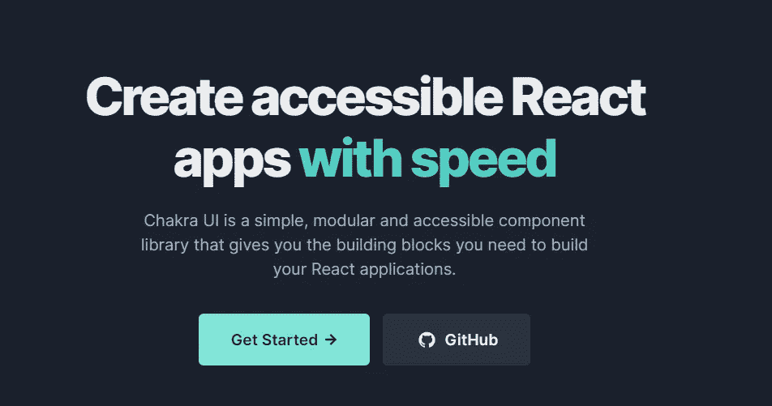
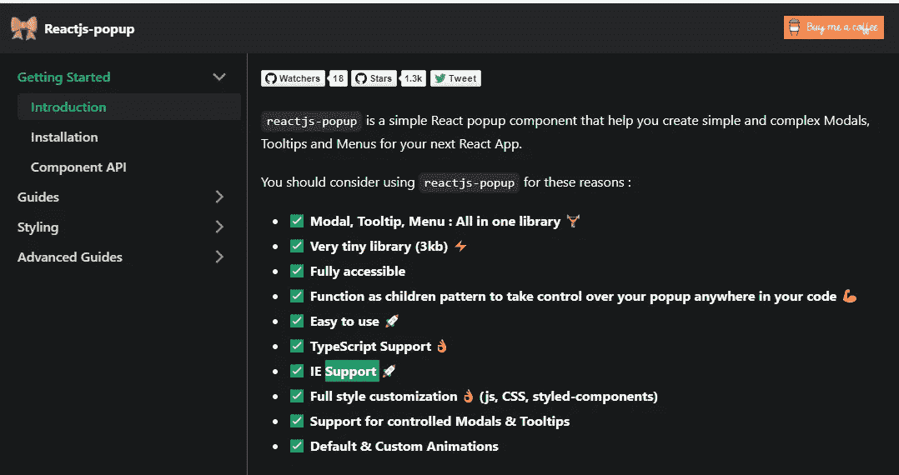
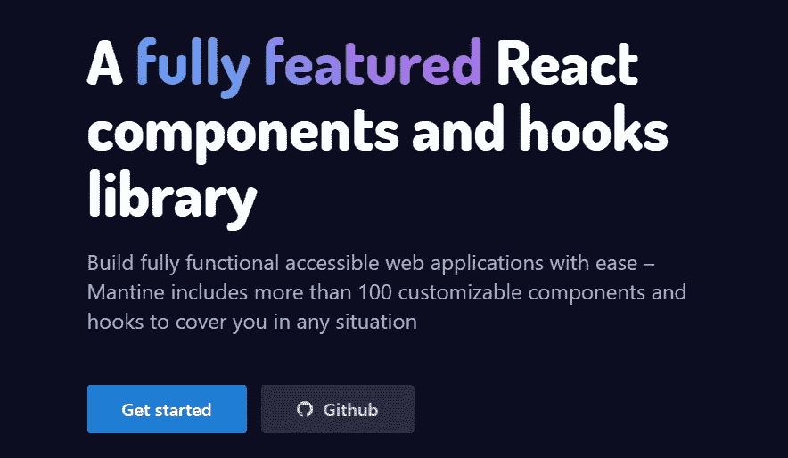
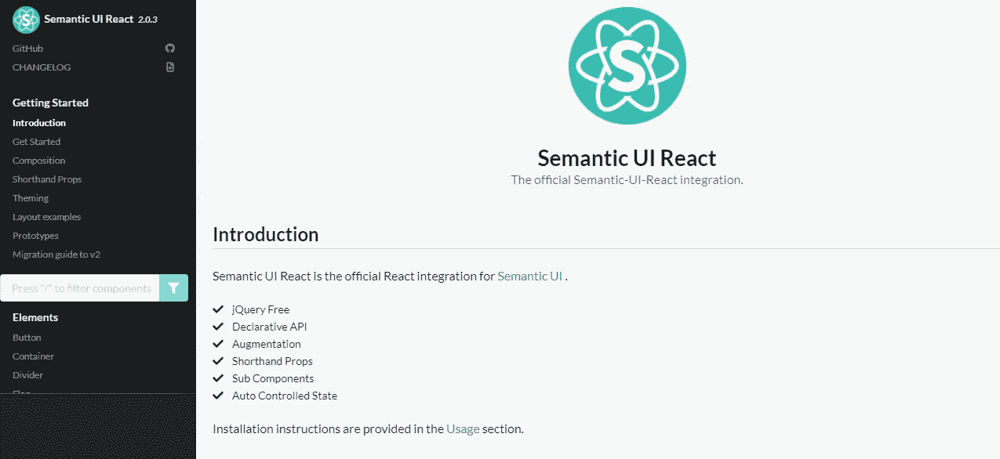

# 面向所有前端开发人员的 7 个非常棒的 React UI 库

> 原文：<https://javascript.plainenglish.io/7-awesome-react-ui-libraries-for-all-frontend-developers-c7d45b7cecad?source=collection_archive---------7----------------------->

## 可以在 React 中使用的有用 UI 组件库的列表。

Photo by [Mohammad Rahmani](https://unsplash.com/@afgprogrammer?utm_source=medium&utm_medium=referral) on [Unsplash](https://unsplash.com?utm_source=medium&utm_medium=referral)

如今，大多数前端开发人员都在使用 React。它是构建出色用户界面的最好和最受欢迎的 JavaScript 库之一。你可以用它实现很多目标。是的，React 只是一个库，但它拥有一个框架的所有功能。

这是因为 React 生态系统有许多包和其他第三方库，您可以在 React 中使用它们来简化开发。最棒的是一切都是开源的。

在本文中，我将向您提供一些您可以使用的非常棒、非常强大的 React UI 库。所以让我们开始吧。

# 1.蚂蚁设计

Ant Design 是你可以在 React 中使用的最好的 UI 库之一。它有很多组件，可以用来在 React 中构建非常棒的用户界面。它也是企业级 web 应用程序的设计系统。

Capture by the author from [Ant Design](https://ant.design/docs/react/introduce)(external link).

# 2.故事书

[如果你想在 React 中轻松构建 UI 组件，Storybook](https://storybook.js.org/) 是一个很棒的开源工具。它还允许您以更快的速度独立开发组件。

Capture by the author from [Storybook](https://storybook.js.org/)(external link).

# 3.材料用户界面

[Material UI](https://material-ui.com/) 是 React 开发者常用的 UI 库之一。它允许您使用一组组件，并为更快的 web 开发构建自己的设计系统。

Capture by the author from [Material UI](https://material-ui.com/)(external link).

因此，Material UI 附带了许多可以使用的组件，比如卡片、按钮、图标、滑块等等。

# 4.Chakra UI

Chakra UI 是 React 中另一个很棒的 UI 库，允许你轻松构建 UI 组件。它还有很多特性，可以让你很容易地设计组件的样式，使它们变得灵活和易访问。

Capture by the author from [Chakra UI](https://chakra-ui.com/)(external link).

# 5.反应弹出窗口

React Popup 是一个简单的组件库，允许你在 React 中轻松创建复杂的模态、菜单和工具提示。它是完全可访问的、可定制的，并且支持 TypeScript。

Capture by the author from [React Popup](https://react-popup.elazizi.com/)(external link).

# 6.曼蒂尼

Mantine 是 React 的一个很棒的组件和钩子库。这个库有很多可用的组件和挂钩来帮助您构建可访问的 web 应用程序。

Capture by the author from [Mantine](https://mantine.dev/)(external link).

# 7.语义 UI 反应

语义 UI 是一个很棒的框架，它允许你轻松地创建好看的、响应性强的布局。

[语义 UI React](https://react.semantic-ui.com/) 是一个允许集成语义 UI 和 React 的库。您可以从他们的文档中了解更多信息。

Capture by the author from [Semantic UI React](https://react.semantic-ui.com/)(external link).

# 结论

正如您在上面的列表中看到的，这些是您可以在下一个 React 项目中使用的一些 UI 库。如果您想加快开发速度并更快地交付 web 应用程序，它们非常有用。

感谢您阅读这篇文章。希望你觉得有用。

**更多阅读:**

 [## 面向所有 Web 开发人员的 7 款超棒的 CSS 工具

### 有用的 CSS 工具，让您的生活更轻松，提高您的生产力。

javascript.plainenglish.io](/7-awesome-css-tools-for-all-web-developers-390ceced6f83) 

*更多内容尽在*[***plain English . io***](http://plainenglish.io/)