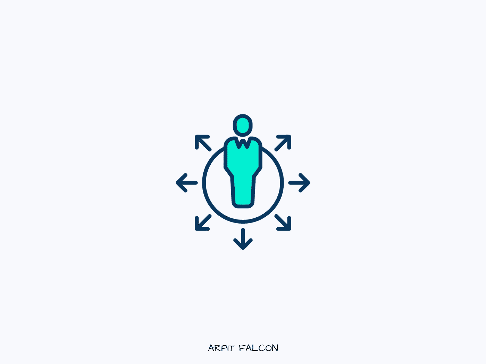

# 开发人员在团队中无与伦比的 7 项基本非技术技能

> 原文：<https://javascript.plainenglish.io/7-basic-non-technical-skills-for-developers-to-be-unparalleled-in-their-team-3f1831b12a5b?source=collection_archive---------9----------------------->

## 无论年龄职位都必须知道的技能。

Photo made by Author

无论你现在职业生涯的哪个阶段，提升自己都没有坏处。想要在行业中真正不可或缺，就要在生活中不断寻求改善。

很多人进入自动驾驶状态，做他们已经做了几年的事情，然后抱怨它。

做最好的自己，只需要很少的努力和知识。我列出了作为一名开发人员你应该知道的 7 个非技术性技能。

# 1.学会如何学习

在过去的 10 年里，科技世界的变化比之前的 50 年还要大。今天相关的技能可能不再有用，甚至两年后就会过时。

有必要创建一个系统来尽快学习新的编程语言、框架和工具。学会如何学习对你来说是绝对必要的。

> “学得越多，赚得越多。”

如果你是一个好奇心强、喜欢学习新东西的人，你正在为自己的未来做准备。但是如果你不喜欢学很多，你可以从这个百万人上的免费课程开始——[学习如何学习](https://www.coursera.org/learn/learning-how-to-learn)。

# 2.做一个好的沟通者

沟通是 21 世纪最需要学习的技能之一。

无论你多么博学和聪明，你都必须有效地交流你的想法、知识和技能，让人们认可你。

你不需要成为一个出色的沟通者，用自己的语言吸引每个人。但是你应该知道把你的想法清晰地表达出来让别人理解的基本知识。

# 3.问好问题

不要成为*站在我旁边*的人或者*人们会评判我*的人。两个都不好。这就是我的意思—

站在我旁边的人是每当他遇到错误时都会问问题的人。他不去谷歌，也不试图自己解决。他联系他的同事和上司，并向他们抛出问题。

不要这样。分析问题，四处搜索，尝试自己解决。如果你仍然停滞不前，然后 ping 你的同伴。

“人们会评判我”的人从来不问任何问题，而是试图自己去做。他日以继夜地独自寻找解决方案。这减慢了你的团队的整个开发过程。

你的同龄人可能以前也面临过类似的问题。当事情似乎不起作用时，不要害怕寻求帮助。

问真实的、适当的问题。

# 4.试着站在别人的角度想想

同理心是工作场所的一项重要技能。每个人都有很多事情和问题同时发生。如果有人表现得粗鲁或生气，不要回应他的行为。想想你最近一次过糟糕的一天，用关心和同情来回应。

当你体谅他人的观点，并以同情做出反应时，你就与他人建立了真正的联系。这将提高你和你的团队的生产力以及工作环境。

带着同情的心态去工作，人们很快就会喜欢上你。在你低潮的时候，他们会以同情回报你。

# 5.了解业务和产品

许多开发人员开始仅仅基于需求来构建产品。你应该总是试图理解你的业务和产品的目标。

知道他们如何与用户联系，用户将如何与之互动，以及你如何让你的用户满意。

开发以用户为中心的产品。

# 6.赶上最后期限

你会惊讶地知道你在琐碎的任务上花了多少时间。几项研究表明，平均每个人花 3 个多小时查看电子邮件。

如果你花时间在人类的[环境转换上，这个增长甚至更多。](https://insights.sei.cmu.edu/blog/addressing-the-detrimental-effects-of-context-switching-with-devops/#:~:text=From%20a%20human%20workforce%20perspective,context%20switching%20between%20multiple%20projects.)

不要等到最后一天才完成任务。在任务中给自己打对勾，每天都取得进步。

当你在截止日期前完成一项既定任务时，你会感觉轻松很多。

# 7.写作

我认为每个人都应该写作。不管是日志、博客还是推特。尽管你头脑中杂乱无章，却有一座知识的金矿。写下来分享一下。

对于开发者来说，写作很重要。他们整天写评论、文档和电子邮件。你应该总是写得清楚扼要，让人觉得你能有效地表达自己的想法。

学会这 7 项非技术性技能，成为你公司里不可或缺的资产，让每个人都喜欢。这个列表并不完整。请随时添加您的观点。

如果你喜欢这篇文章，媒体上还有很多这样的文章。你可以注册阅读它们，每月只需 5 美元。

[**这里是无限制访问媒体上每一个内容的链接。如果您使用此链接注册，我将免费为您赚一小笔钱。**](https://arpitfalcon.medium.com/membership)

*更多内容看*[***plain English . io***](http://plainenglish.io/)