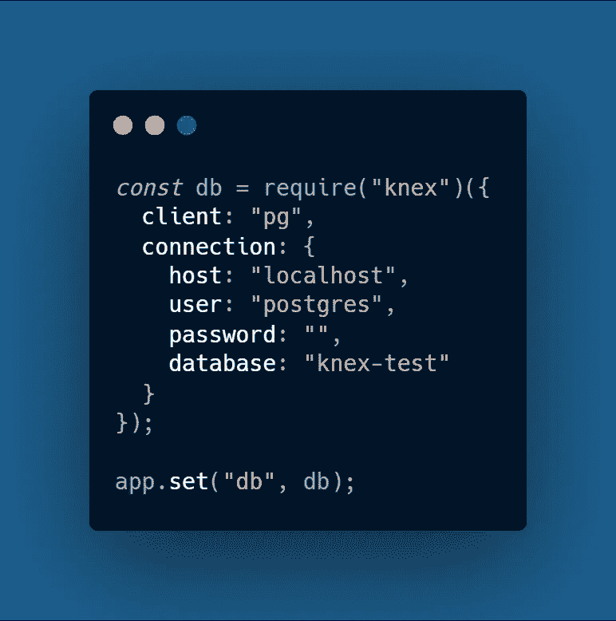

# 2021 年 7 个最佳 JavaScript 和类型脚本格式

> 原文：<https://javascript.plainenglish.io/7-best-javascript-typescript-orms-for-2021-9552d0c7a09f?source=collection_archive---------2----------------------->

## 在下一个 JavaScript 项目中使用 ORM 库

Photo by [Michael Dziedzic](https://unsplash.com/@lazycreekimages?utm_source=medium&utm_medium=referral) on [Unsplash](https://unsplash.com?utm_source=medium&utm_medium=referral)

# 对象关系映射

这个概念对于新开发人员来说似乎很复杂，但是它可以让您作为开发人员的生活更轻松。对象关系映射只是帮助您用自己选择的语言编写查询。在该技术中，数据库查询被转换成实体 ***(实体是包含映射到数据库表的列的属性的对象数据库表)*** 类继承。

在较小的项目中，大多数时候我们不需要 ORM，我们可以使用 SQL 语句来驱动我们的应用程序。但是 ORM 对于从大量数据库表中获取数据的大型项目非常有用。

## [1。Knex.js](https://github.com/knex/knex)

*GitHub Stars: 13.9K*

最稳定的 ***JavaScript*** SQL 构建器之一，可以通过 webpack 在 Node.js 和浏览器中运行。支持 **PostgreSQL、MySQL、SQLite3、Oracle、**等多种数据库驱动的查询构建。您只需要像安装任何其他 npm 模块一样安装 Knex，并为您的数据库安装适当的驱动程序。例如，如果您必须将 Knex 与 Postgres 连接，则使用***NPM install pg Knex-save 在应用程序中安装 pg 驱动程序。***

*   然后，您只需像我们通常在节点应用程序中所做的那样，通过指定连接参数来建立连接。

***例如:***

## [2。顺序化](https://github.com/sequelize/sequelize)

*GitHub Stars: 24K*

一个非常受欢迎的 Node.js ORM 库，它有很好的文档，包含了解释清楚的代码示例。支持 **Postgres、MySQL、MariaDB、SQLite、**和 **SQL Server** 。此外，它有自己的查询构建器，执行起来就像 Knex.js 一样。

*   它还支持原始 SQL 语句，因此开发人员可以灵活地编写复杂的高性能 SQL 语句。
*   唯一的缺点是，随着时间的推移，问题越积越多，没有得到解决，但 Sequelize 的开发者已经宣布，该库将在 2021 年得到应有的关注。

## [3。书架](https://github.com/bookshelf/bookshelf)

*GitHub 星辰:6.1K*

最基本的 ORM JavaScript 库之一，具有所有基本功能。但在幕后，它仍然使用 *Knex.js SQL 查询生成器*。不幸的是，唯一的缺点是没有对验证的支持，但是，您仍然可以使用**检查**来实现验证。此外，文档没有达到要求，所以您必须查找 Knex.js 文档来执行查询和 **CRUD** 事务。

***一些附加特性:***

*   急切和嵌套关系加载
*   多态关联
*   支持一对一、一对多和多对多关系

## [4 .吃水线](https://github.com/balderdashy/waterline)

*GitHub 星:5.3K*

它支持**本地内存，MySQL，MongoDB & Postgres** ，还有 *Waterline* 一直是 Sails.js 使用的默认 ORM。您会发现很难处理复杂的查询，因为文档在某些部分似乎丢失了，如果您正在使用 Sails.js，那么您可以使用 Waterline ORM，如果您将它作为一个独立的产品使用，那么您可能会遇到一些问题，因为**糟糕的文档**和库**没有更新**

## [5。反对. js](https://github.com/Vincit/objection.js/)

*GitHub 星:6K*

一个非常小的 Node.js ORM 库，可以很容易地访问 SQL 数据库&支持 **SQLite3、Postgres、**和 **MySQL** 。有了优秀的文档， *Objection.js* 与其他 ORM 库相比还很年轻，您可以很容易地找到清晰的说明和容易理解的语法。

***附加功能:***

*   官方**打字稿**支持
*   支持生命周期挂钩
*   内置验证支持使用 ***JSON Schema*** 语法

## [6 .猫鼬](https://github.com/Automattic/mongoose)

*GitHub 星星:22.5K*

该库仅支持 **MongoDB** 数据库，并且是 Node.js 生态系统中目前最流行的 ORM 库。但是没有 SQL 选项，因为 MongoDB 是一个 no SQL 数据库，它也不支持事务。猫鼬的主要优势在于它的开发是由**tide elift**平台赞助的，这可以导致早期的补丁修复。此外，TypeScript 也没有官方支持。

**附加功能:T53**

*   内置式铸件
*   确认
*   查询构建
*   通过中间件挂钩

## [7。类型表](https://github.com/typeorm/typeorm)

*GitHub 星辰:23.6K*

目前，为 TypeScript 项目构建的最流行的 ORM 库可以在许多平台上运行，例如

*   *Node.js*
*   *浏览器*
*   *移动设备(* ***Cordova，Ionic，React Native&Native script****)*
*   *电子*

此外，它支持*活动记录*和*数据映射*模式，允许开发人员构建高质量和可伸缩的应用程序。TypeORM 始终支持最新的 JavaScript 特性，并提供额外的特性来帮助开发人员构建使用数据库的高质量应用程序。

 [## 每个软件开发人员都应该知道的 9 条编程原则

### 很好地了解干净代码的编程原则

javascript.plainenglish.io](/9-programming-principles-every-software-developer-should-know-9fffe3c5258)  [## 作为开发人员，你应该知道的 9 种数据结构和算法

### 让你成为更好的开发者的数据结构和算法

javascript.plainenglish.io](/9-data-structures-algorithms-you-should-know-as-a-developer-5e10946c95a0)  [## 2021 年终极网络开发者路线图

### 从基础到部署可伸缩的 Web 应用程序

javascript.plainenglish.io](/ultimate-web-developer-roadmap-for-2021-6758edd0bd3f)  [## Node.js 应用程序的 10 个最佳实践

### 你需要知道的 Node.js 实践

javascript.plainenglish.io](/10-best-practices-for-node-js-applications-2093b3c50799)