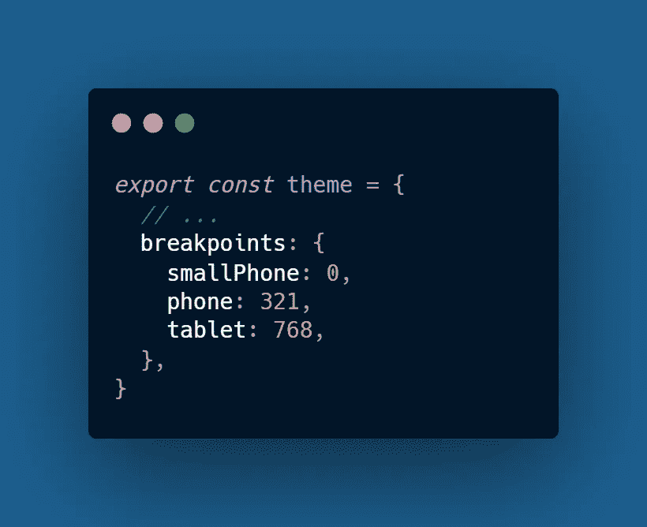
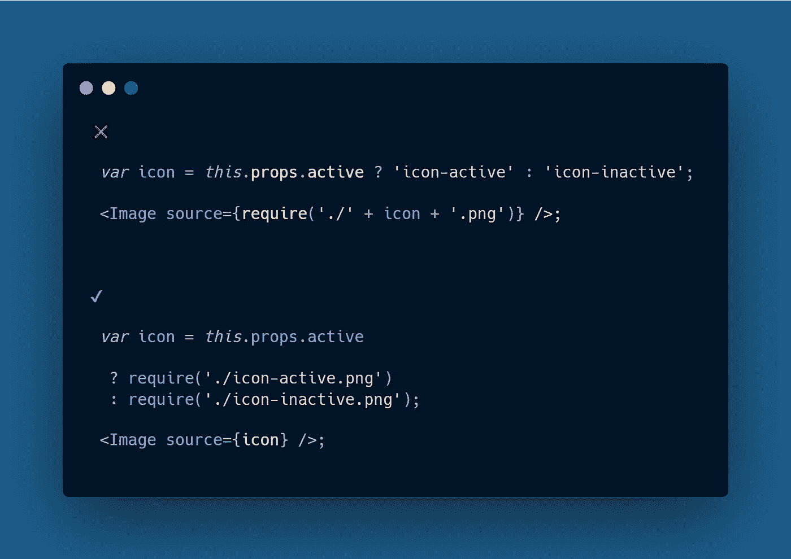
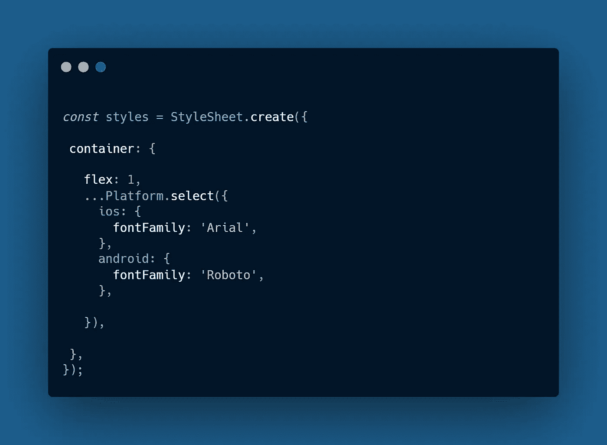
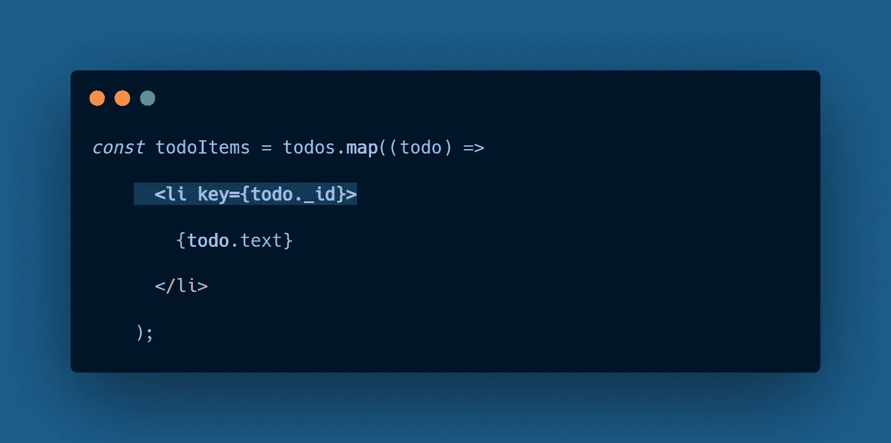

# React 本机应用程序的 7 个最佳实践

> 原文：<https://javascript.plainenglish.io/7-best-practices-for-react-native-applications-be1dd907e657?source=collection_archive---------0----------------------->

## 反应本地最佳实践(第 1 部分)

## 1.使用设计系统

没有一致的风格，很难得到最好的效果。设计系统是一组规则和原则，它们为应用程序的外观和感觉奠定了基础。使用设计系统时，你需要记住 4 件事。

*   **间距:**在使用跨平台应用程序时，屏幕上的不同组件之间的屏幕尺寸可能会有所不同，但要确保它们之间的间距一致，以获得一致的外观。
*   **颜色:**选择正确的颜色不仅是最重要的事情，你如何使用它们也很重要。一个很好的解决方案是使用 ***调色板，*** 你可以根据首选的命名惯例命名你的颜色，这增加了你的整体工作流程。

> *始终以一种你不必考虑它们在你的应用中应该是什么样子的方式来命名你的颜色，以一种更明确的方式来命名你的颜色，以便你能更快地做出决定。*

> ***例如*** *、* ***、【Primary】****作为应用程序中的主要颜色、* ***危险*** *作为将在危险图标中使用的颜色，或者在您强制使用红色的任何地方使用。*

*   字体设计:我们经常忘记字体是如何改变应用程序在结果中的外观的。最好坚持使用有限的一组**字体** **族**、**粗细、**和**尺寸**，以获得令人愉悦的连贯外观。

## 2.响应样式属性

在 Web 应用中，对响应式设计的需求是显而易见的，屏幕尺寸可以从小型移动设备到宽屏桌面设备。但是在 **React Native** 中，目标只是移动设备，它可能无法与相同的设备尺寸一起工作，但是屏幕尺寸的差异已经足够大，这使得很难找到一个适合所有应用程序样式的尺寸。

*   要使用响应式设计，您可以通过对不同的屏幕设备进行分类来定义一些断点。

***例如:***

*   有了这些断点，任何宽度低于 **321** 像素的东西都应该属于较小的移动设备类别，而低于 **768** 的东西就是普通的移动设备&任何比它更宽的东西都是平板电脑。

## 3.使用类型脚本

TypeScript 和 React 是一个完美的组合，尤其是当你使用 Visual Studio 代码时。使用 TypeScript 的好处是，不依赖于 React 的**属性**验证(只有在运行时呈现组件时才会发生)，TypeScript 允许您验证项目中的任何错误。此外，您可以定义属性类型，只接受主题&中可用的值。这样，您的编辑器也会自动为您完成有效值。

## 4.静态图像资源

总是以正确的方式管理你的*静态图像资源*，否则，你的应用程序将会在不需要的时候使用大量的时间来处理静态文件事件。要在应用程序中添加静态图像，您必须以静态定义图像名称 require 的方式来完成。

***例如，***

## 5.使用特定于平台的样式

React Native 提供了一个内置的 API 来编写特定于平台的代码，如果没有平台 API，您最终会有许多不同平台的不同风格***(Android&iOS)***，要组织这些风格，您可以使用样式表的平台模块。可以使用**平台。操作系统**自动检测操作系统，然后应用正确的风格。

***例如，***

## 6.创建别名

创建别名是解决嵌套导入问题的最好方法，例如“**active button from”../../组件/按钮。**你可以使用**巴别插件模块解析器**来创建这样的别名。

## 7.始终为每个元素分配唯一的键

在 React 或 React native 中，分配一个惟一的键可以解决许多问题，这些问题使得处理包含组件的应用程序更加困难，例如**列表。**

***例如，***

 [## 代码文档被破坏了——但是我认为 Swimm 可能已经修复了它

### 传统的文档管理系统让软件开发人员失望了，是时候来点新的了。游泳吗…

javascript.plainenglish.io](/code-documentation-is-broken-but-i-think-swimm-may-have-fixed-it-daaa7547d834)  [## 在 React Native 中使用 FlatList 组件

### 在 React Native 中使用平面列表的最低要求

javascript.plainenglish.io](/working-with-the-flatlist-component-in-react-native-c88fa2d3173c)  [## 8 个开源的 React 本地项目

### CRUD 应用程序、音乐播放器等

javascript.plainenglish.io](/8-open-source-react-native-projects-to-check-out-1940bb4cc466)  [## 在 React Native 中定位和排列视图组件

### 对齐项目并构建出色的视图组件

javascript.plainenglish.io](/view-component-in-react-native-positioning-arranging-feac009b5661)  [## 在 React-Native 中构建更好组件的 4 个技巧

### 在构建 React-Native 组件时，不要浪费时间做重复的事情

javascript.plainenglish.io](/4-tips-for-building-better-components-in-react-native-acb1a000ec23)