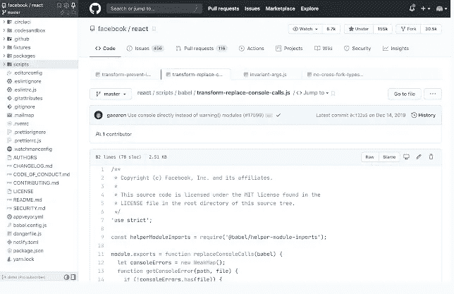
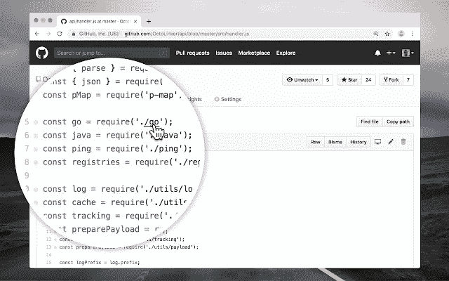
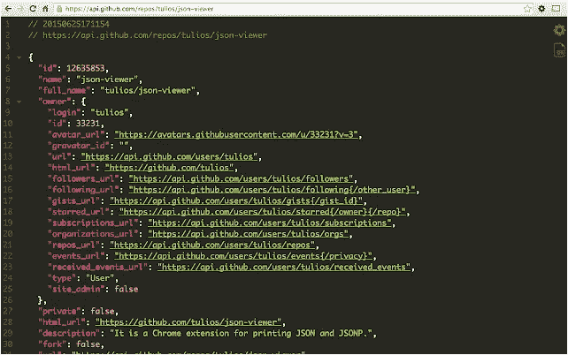
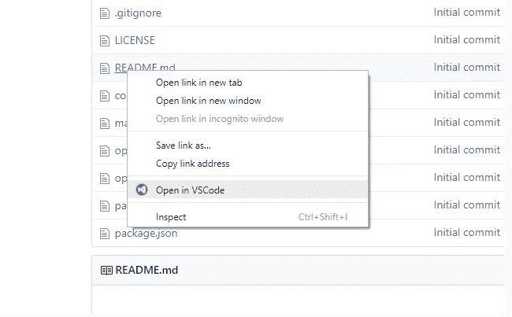
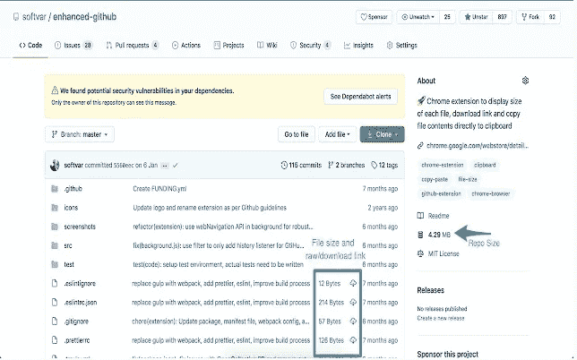

# 我希望我知道的 7 个 Chrome 扩展能够提高我作为开发人员的工作效率

> 原文：<https://javascript.plainenglish.io/7-chrome-extensions-i-wish-id-known-to-improve-my-productivity-as-a-developer-881b5812866c?source=collection_archive---------9----------------------->

## 使用扩展来节省昂贵的开发时间。

Photo by [christian buehner](https://unsplash.com/@christianbuehner?utm_source=medium&utm_medium=referral) on [Unsplash](https://unsplash.com?utm_source=medium&utm_medium=referral)

开发者的主要浏览器是 Chrome。开发人员使用 Chrome 创建 web 应用程序并对其进行调试。开发者更喜欢 Chrome，主要原因是 Chrome 扩展。

Chrome 扩展使开发变得快速、简单和安全。有数以千计的 Chrome 扩展可用。开发人员面临的主要挑战是他们应该选择几千个中的哪一个。

以下是我职业生涯中错过的七个提高开发者生产力的扩展。如果你和我一样感到困惑，请在一千个分机中选择。这七个扩展可以节省你很多时间。

# 1.八叉树— GitHub 代码树

Photo from [Octotree — GitHub code tree](https://chrome.google.com/webstore/detail/octotree-github-code-tree/bkhaagjahfmjljalopjnoealnfndnagc)

[octo tree——GitHub 代码树](https://chrome.google.com/webstore/detail/octotree-github-code-tree/bkhaagjahfmjljalopjnoealnfndnagc)拥有超过 40 万用户。你可以把这个扩展叫做类固醇上的 GitHub。我们这些开发者了解 Github。这是软件开发人员生活中必不可少的一部分。

有时当我们使用 GitHub 时，我们需要点击文件夹来查看相关的子文件夹。我觉得这很烦人，这种手动检查子文件夹的过程很无聊。

这个扩展有助于解决这个问题。它帮助我们探索 Github。这个扩展向您展示了左侧的存储库。这有助于我们更好地理解这个项目。

您会感觉像是在 VSCode 编辑器中查看项目。总之，这个扩展帮助你探索 Github 和代码审查。您可以使用任何规模的存储库。

八叉树不会跟踪你的。此扩展不关心跟踪与您相关的信息。

# 2.八接头

Photo from [OctoLinker](https://chrome.google.com/webstore/detail/octolinker/jlmafbaeoofdegohdhinkhilhclaklkp?hl=en)

[OctoLinker](https://chrome.google.com/webstore/detail/octolinker/jlmafbaeoofdegohdhinkhilhclaklkp?hl=en) 拥有超过 2 万用户。这个扩展也有助于探索 GitHub。如果您正在审查来自 Github 存储库的文件中的代码。在那个文件中，如果你看到一些你不知道的链接。

然后，您可以使用这个扩展。在这个扩展的帮助下，您可以获得链接的详细信息，也可以在其中导航。借助这个例子可以更好地理解这一点。

假设您正在处理一个 react 项目。你会在 multicolor.js 中看到一个导入的 color.css 文件，你对 color.css 文件一无所知。然后，当您单击 color.css 时，您将被重定向到 color.css 文件。

这样，你可以更好地理解一个你不熟悉的 Github 库。即使你是第一次使用 Github 库，你仍然可以使用这个扩展。这次延期将使你的工作更容易。

# 3.JSON 查看器

Photo from [JSON Viewer](https://chrome.google.com/webstore/detail/json-viewer/gbmdgpbipfallnflgajpaliibnhdgobh)

JSON Viewer 拥有超过一百万的用户。根据这个扩展的主页“这是你见过的最漂亮和可定制的 JSON / JSONP 荧光笔。”

这个 Chrome 扩展有助于打印 JSON 和 JSONP。它有 27 个内置主题。它具有语法突出显示的功能。这个扩展还有一个切换按钮来查看原始版本或高亮版本。

它可以处理比数字大的数字。MAX_VALUE。您还可以自定义该扩展中可用的主题。还有一个特性是在 URL 中包含一个带有时间戳的头。

您可以编辑加载的 JSON，并按键对 JSON 进行排序。要使用这个扩展，您必须禁用所有其他 JSON 格式化程序。否则，这个 JSON 查看器可能会开始崩溃。

如果您想突出显示本地文件和匿名选项卡，您需要在您的页面上手动启用此扩展。

# 4.AdGuard 广告拦截器

Photo from [AdGuard AdBlocker](https://chrome.google.com/webstore/detail/adguard-adblocker/bgnkhhnnamicmpeenaelnjfhikgbkllg?hl=en)

[AdGuard 广告拦截器](https://chrome.google.com/webstore/detail/adguard-adblocker/bgnkhhnnamicmpeenaelnjfhikgbkllg?hl=en)拥有超过 1000 万用户。顾名思义，这是一个屏蔽广告的扩展。你可以屏蔽脸书、Youtube 和所有其他类型网站上的广告。

它还可以阻止所有弹出窗口、横幅和文本广告。由于该工具阻止了广告，这导致了网站加载速度的增加。广告拦截也节省了互联网带宽。

这种扩展也有助于通过阻止广告来保护您的隐私。它不允许任何类型的第三方系统跟踪它。它保护您免受任何类型的恶意软件和网络钓鱼。

Adguard 拥有大约 2000k 个有害网站的数据库。所有可能传播恶意软件、特洛伊木马、蠕虫和广告软件的网站都被此扩展阻止。

如果你使用这个广告卫士拦截器，他们不仅会阻止广告，而且不会在页面上留下任何损坏的项目。会让整个网页看起来整洁干净。

# 5.在 VSCode 中打开

Photo from [Open in VSCode](https://chrome.google.com/webstore/detail/open-in-vscode/pfakkjlkpobjeghlgipljkjmbgcanpji?hl=en)

[开放于 VSCode](https://chrome.google.com/webstore/detail/open-in-vscode/pfakkjlkpobjeghlgipljkjmbgcanpji?hl=en) 拥有超过 5k 用户。

当你使用 Github 并试图浏览一个资源库时。作为一名开发者，我们不得不在 Github 上打开一个文件。

甚至在打开一个文件后，有时我们不得不审查代码，并希望对其进行一些更改。如果我们可以在我们最喜欢的 VSCode 代码编辑器中进行这些更改，那就太好了。

这就是 Chrome 扩展的用武之地。首先，您需要安装扩展，然后右键单击 Github 存储库中的任何文件。右键单击后，会出现一个名为“在 VSCode 中打开”的选项。

您可以使用该选项直接从 Github 打开 VSCode 中的代码。Github 和 Gitlab 链接都可以使用这个扩展在 VSCode 中打开。

# 6.Toggl 跟踪:生产率和时间跟踪

Photo from [Toggl Track: Productivity & Time Tracker](https://chrome.google.com/webstore/detail/toggl-track-productivity/oejgccbfbmkkpaidnkphaiaecficdnfn?hl=en)

[Toggl Track:Productivity&Time Tracker](https://chrome.google.com/webstore/detail/toggl-track-productivity/oejgccbfbmkkpaidnkphaiaecficdnfn?hl=en)拥有超过 30 万用户。作为一名开发人员，跟踪你的时间将有助于你提高工作效率。这个扩展帮助你记录你的时间。

如果你作为开发人员使用某种网络工具。然后你可以使用这个扩展来记录你的时间。你所有的时间追踪都储存在你的 Toggl 账户里。

它有像 Slack、Trello、吉拉、Todoist 这样的工具，以及一百多个其他可用的工具。没有必要打开任何新的标签页来记录你的时间。

Toggl 赛道也为你提供了跟随番茄工作法的方法。它会给你自动剩余。一些更先进的功能包括空闲检测，番茄定时器，跟踪剩余。你所有的数据都是实时同步的。

# 7.增强型 GitHub

Photo from [Enhanced GitHub](https://chrome.google.com/webstore/detail/enhanced-github/anlikcnbgdeidpacdbdljnabclhahhmd?hl=en)

[增强型 GitHub](https://chrome.google.com/webstore/detail/enhanced-github/anlikcnbgdeidpacdbdljnabclhahhmd?hl=en) 拥有超过 4 万用户。Github 存储库中的任何文件都不会显示其大小。这个扩展有助于显示存储库的大小。

增强的 Github 显示活动分支中的每个文件大小。它会显示每个文件的下载链接。您可以将文件的全部内容直接复制到剪贴板。

您可以通过这个扩展轻松地使用 Github。此扩展不会收集或共享您的任何数据。

## [加入一个人人社区，享受与科技相关的文章。我们讨论最新的技术和独特的见解。](https://codertoentrepreneurs.substack.com)

*更多内容请看*[***plain English . io***](http://plainenglish.io/)