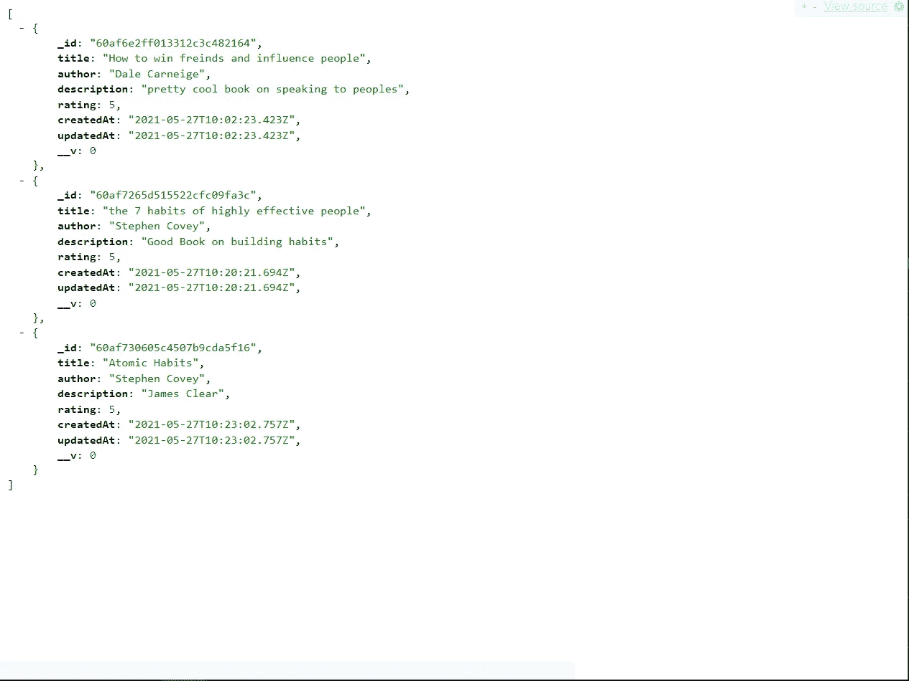

# 作为一名网络开发者，你需要 7 个 Chrome 扩展

> 原文：<https://javascript.plainenglish.io/7-chrome-extensions-you-need-as-a-web-developer-b5521025fb90?source=collection_archive---------13----------------------->

让你的开发者生活更美好的扩展。

Photo by [Christian Wiediger](https://unsplash.com/@christianw?utm_source=medium&utm_medium=referral) on [Unsplash](https://unsplash.com?utm_source=medium&utm_medium=referral)

Chrome 扩展是让你的开发者生活更轻松的关键。在这篇文章中，我将分享 7 个扩展，我觉得它们会给你作为开发人员的生活带来真正的价值。

# 1)字体忍者

如果你喜欢某个网站的字体，但不知道它是什么，那么这第一个 Chrome 扩展是完美的。

这个扩展可以让你看到一个网站上使用的所有字体，并提供一些关于字体粗细和字体风格的有用信息。

还有一个内置的编辑器，允许你用你提供的文本来测试字体。这个编辑器甚至可以让你改变文本的大小和字体的粗细，这对于查看一个特定的字体是否适合你的网站非常有用。

链接:[https://chrome . Google . com/web store/detail/fonts-ninja/eljabgkmlngdpckoiiibecpemleclhh？hl=en-US](https://chrome.google.com/webstore/detail/fonts-ninja/eljapbgkmlngdpckoiiibecpemleclhh?hl=en-US)

# 2)有色人种

有时候，在创建网站时，窃取另一个网站的调色板比创建自己的调色板更容易。这就是扩展 ColorZillia 发挥作用的地方。

ColorZillia 允许你从任何网站窃取颜色。这个过程非常简单，因为它只包括使用滴管和点击你想参考的颜色。十六进制代码然后会自动复制到您的剪贴板。

链接:[https://chrome . Google . com/web store/detail/colorzilla/bhlhnicpbhignbdhedgjhgdocnmhomnp？hl=en](https://chrome.google.com/webstore/detail/colorzilla/bhlhnicpbhignbdhedgjhgdocnmhomnp?hl=en)

# 3) JSON 视图

如果您经常使用 API，那么第三个 chrome 扩展 JSON View 非常有用。这个扩展为 JSON 提供了一些很好的格式，使它比您以前使用的普通 JSON 更好。

Example of JSON View in action

链接:[https://chrome . Google . com/web store/detail/JSON view/chklaanheffbnpoihckbnefhakgolnmc？hl=en](https://chrome.google.com/webstore/detail/jsonview/chklaanhfefbnpoihckbnefhakgolnmc?hl=en)

# 4) React 开发者工具

React 开发人员工具使调试 react 项目变得更加容易。这个扩展为 Chrome DevTools 添加了两个新面板:组件和概要分析器。

“组件”面板允许您按层次顺序查看当前页面上呈现的组件。这使得调试更加容易，因为它允许您看到什么组件嵌套在另一个组件中。

另一方面，profiler 面板允许您记录 react 应用程序的性能信息。

链接:[https://chrome . Google . com/web store/detail/react-developer-tools/fmkadmapgofadoplibjfkapdkoienihi？hl=en](https://chrome.google.com/webstore/detail/react-developer-tools/fmkadmapgofadopljbjfkapdkoienihi?hl=en)

# 5) Redux 开发工具

个人觉得，没有 redux 开发者工具，我是用不了 Redux 的。Redux Developer Tools 使 react 项目中的调试状态变得轻而易举，因为它允许您在组件生命周期的不同时间查看 react 应用程序的状态。

链接:[https://chrome . Google . com/web store/detail/redux-devtools/lmhkpmbekcpmnklioeibfkpmmfibljd](https://chrome.google.com/webstore/detail/redux-devtools/lmhkpmbekcpmknklioeibfkpmmfibljd)

# 6) Wappalyzer

如果你想知道某些网站是如何制作的，那么 Wappalyzer 就是适合你的 Chrome 扩展。Wappalyzer 是一个扩展，可以让你看到一个网站是用什么技术建立的。例如，通过使用 Wappalyzer，我知道 Medium 是使用 Node.js 以 Cloudflare 作为 CDN 创建的。

如果您试图创建一个与现有应用程序相似的 web 应用程序，但不知道从哪里开始，这可能非常有用。

Wappalyzer in Action

# 7) GoFullPage

GoFullPage 是一个相对简单的 Chrome 扩展，因为它唯一的工作就是抓取整页截图。如果你不得不尝试截取整个页面的截图，你就会知道这有多麻烦。有了这个扩展，你再也不用担心了。

# 结论

感谢你阅读完我关于**“作为一名网络开发者你需要的 7 个 Chrome 扩展”的文章。**我希望这些扩展能让你的开发者生活更轻松。祝你有美好的一天！

*更多内容尽在*[*plain English . io*](http://plainenglish.io/)