# 你需要知道的面向对象 JavaScript 的 7 个概念

> 原文：<https://javascript.plainenglish.io/7-concepts-of-object-oriented-javascript-you-need-to-know-5634363f6fdc?source=collection_archive---------3----------------------->

## 像专业人士一样使用 JavaScript

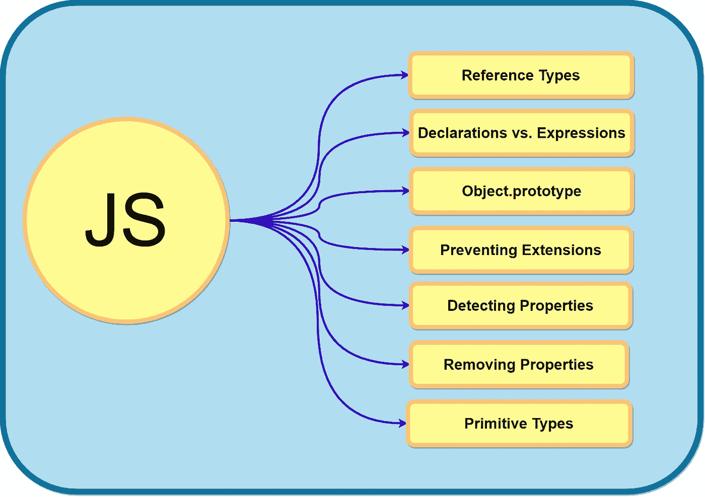

大多数时候，开发人员将面向对象编程与类似于 **C++** 和 **Java** 的语言联系在一起，在这些语言中，你甚至需要为一个简单的命令行程序创建一个类。但是 JavaScript 不使用类，这导致了在实现 OOP 原则时的混乱。在 JavaScript 中使用 OOP 有很多原因，如下所示:

*   **封装:**数据可以按照对该数据进行操作的功能进行分组(*简而言之，我们称之为* ***对象*** *)* 。
*   **聚合:**一个对象可以引用另一个对象。
*   **继承:**当一个新创建的对象与另一个对象具有相同的特征，但没有复制其核心功能。
*   **多态性:**单个接口可以使用多个对象实现。

**JavaScript 中哪些人应该学习 OOP？**

*   熟悉任何种类的 ***OOP*** *编程*概念并希望在 JavaScript 中使用他们技能的热情开发人员。
*   **节点**和 **Web 开发者**试图构建大规模应用。
*   想要获得更深入的语言知识的 JavaScript 开发新手。

# JavaScript 中的两种不同值类型

**原始类型** 存储为简单数据类型，而**引用类型**存储为普通**对象** ( *简单引用内存中的位置*)。最复杂的部分是 JavaScript 允许你像对待*引用类型*一样对待*原始类型*，这样语言对开发者来说更加一致。然而，在其他编程语言中，原语存储在**栈**中，引用存储在**堆**中，尽管在 JavaScript 中它们最初看起来可能是一样的，但是有很多不同之处。

## **原始类型**

它们是简单的数据片段，以这种方式存储**真**或 **30，JavaScript 中有 5 种基本类型，如下所示:**

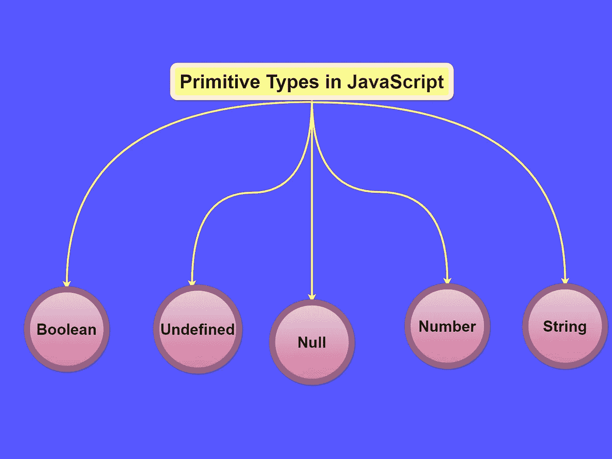

**Primitive Types**

另外，请注意，在 JavaScript 中，保存一个**原语**的变量直接包含一个**原语值**而不是指向该对象的指针，我们可以简单地说，当将一个原语值赋给一个变量时，该值被复制到该变量中。

***例如:***

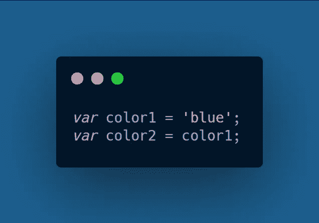

*   当 **color1** 被赋予**‘蓝色’，**的值，然后 color2 被赋予的值 color1 将**‘蓝色’**存储在 **color2 中。**
*   尽管从外表上看它们是一样的，但在引擎盖下，有更多的东西需要了解。
*   有时开发人员会对值是如何存储的感到困惑，这导致他们缺乏对 JavaScript 基础知识的理解，在这个例子中，我们可以在不影响 **color1** 的情况下更改 **color2** 的值，反之亦然。
*   用更简单的话来说，你可以说这两个变量有完全不同的位置&值的变化不会影响其余的相关变量。

> 您将从控制台结果中清楚地了解到:

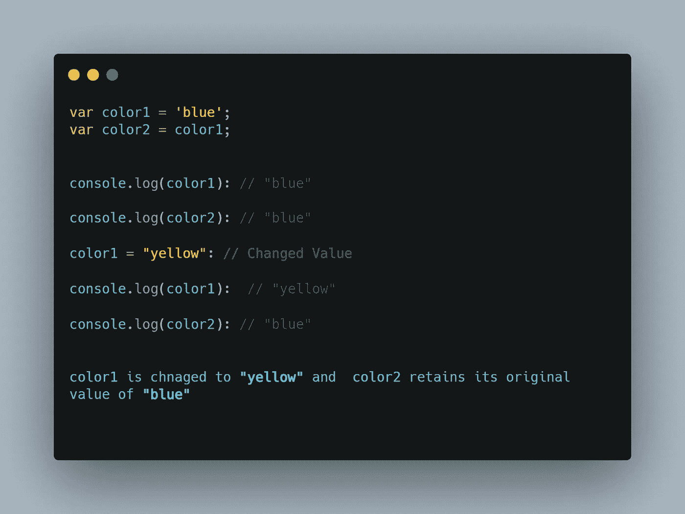

**注意:**原语值本身不是对象，JavaScript 使它们看起来像对象，以提供语言中一致的体验。

## **参考类型**

我们可以调用**类**作为 JavaScript 中最接近表示*引用类型*的东西，其中引用值是引用类型的实例。这些类型并不将对象直接保存在它所赋给的变量中。

***例如:***

*   对象变量实际上并不包含对象实例，相反，它包含一个指向内存中对象所在位置的指针**(或引用)**。

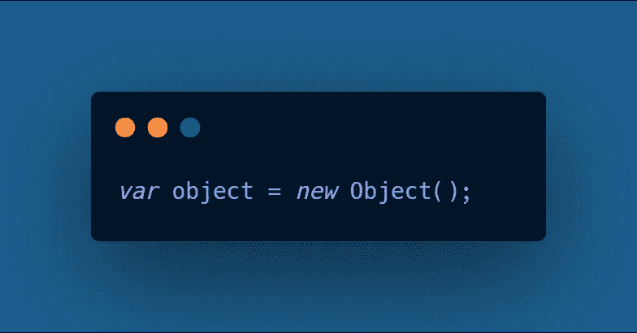

*   当我们把一个对象赋给一个变量时，我们就是在赋指针，这意味着如果我们把一个变量赋给另一个变量，每个变量都会得到一个指针的副本，而两个变量仍然引用内存中的同一个对象。

> *为了清楚地理解，让我们假设我们创建了另一个变量如下:*

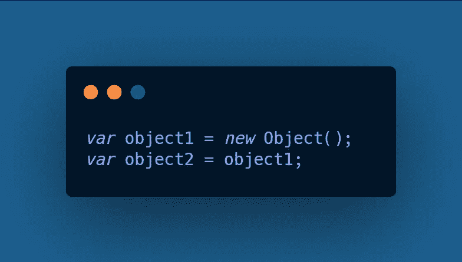

*   在这个例子中， **object1** 存储了一个引用，而 **object2** 保存了 **object1** 的值，但是在第一行中仍然只有一个创建的对象实例，而这两个实例都指向那个对象。

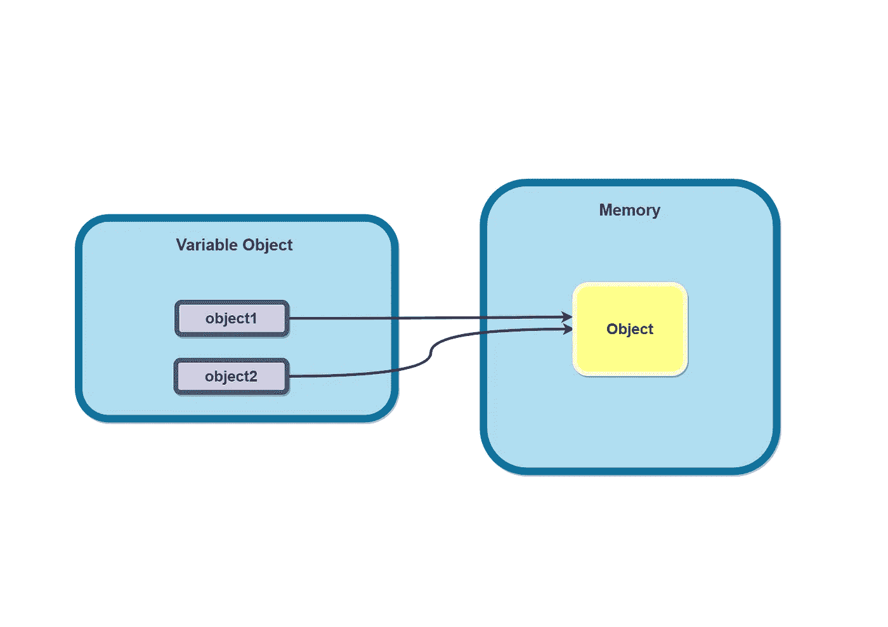

**Two Variables Pointing to One Object**

# 函数是 JavaScript 中的对象

您可能听说过 JavaScript 中的函数是对象，这几乎是真的。但是有一个很少有人知道的概念，在 JavaScript 中，函数与对象的区别在于存在一个内部属性名 **[[Call]]，**这些内部属性不能通过代码访问，但是它们定义了代码的行为。

**[[Call]]** 属性只对函数是唯一的，它表示对象可以被执行。正如我们所知，函数是对象，它们的行为不同于其他语言中的函数，这种行为是成为 JavaScript 专家的关键。

> 在 **JavaScript** 中，我们有很多方法可以定义函数，但我将只讨论最实用的方法。

## 声明与表达式

有两个字面函数，第一个是一个*函数声明*，您可能很熟悉。

它以 function 关键字开始，包括函数的名称，函数的内容用大括号括起来。

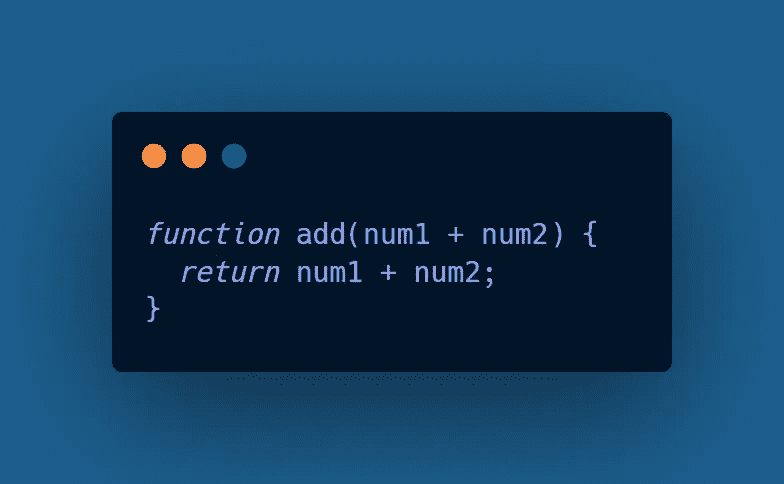

**Function Declaration**

第二个实现是函数表达式，函数后面不需要名字。

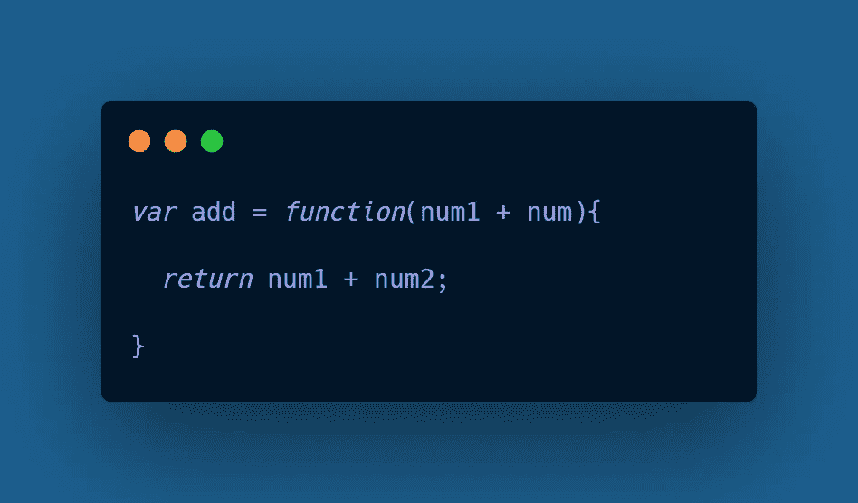

**Function Expression**

在这个阶段，它们看起来非常相似，但是这两个实现在许多方面是不同的。

*   在函数声明的情况下，当代码执行时，它们被提升到上下文的顶部，这仅仅意味着您可以在代码中使用函数后定义它，而不会生成任何错误。

***例如:***

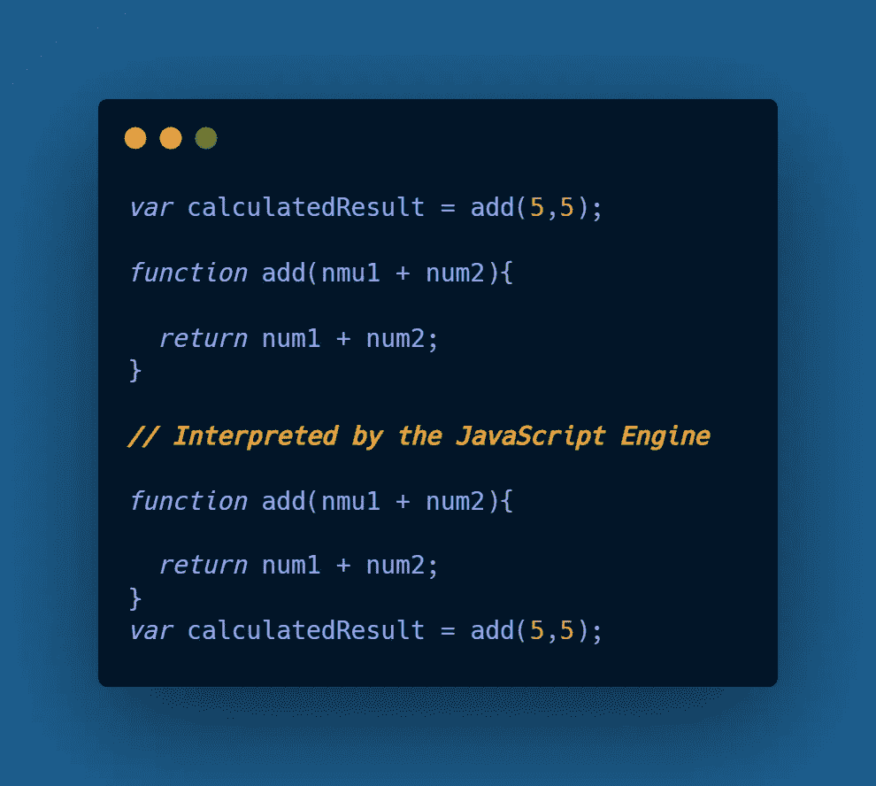

*   函数**提升**只在函数声明时发生，因为函数名是预先知道的。但是，函数表达式不能被提升，因为函数只能通过变量引用，这就是下面定义的函数给出错误的原因。

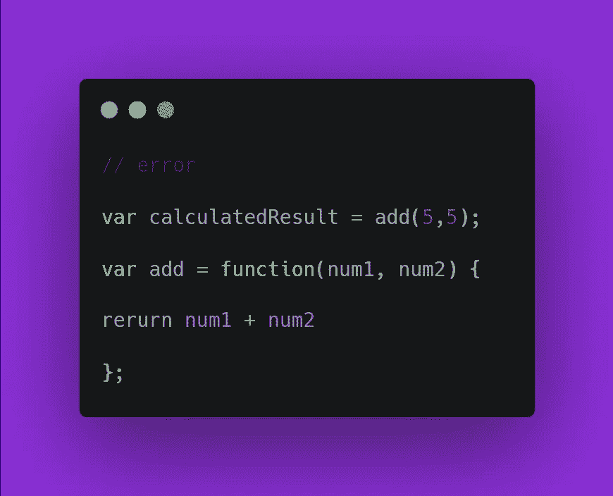

# 使用对象

JavaScript 中的对象不同于其他语言，JavaScript 中的对象是动态的，它们可以在代码执行过程中的任何时候发生变化。而其他基于类的语言基于类定义锁定对象，但我们在 JavaScript 中没有这样的限制。JavaScript 中的 OOP 完全依赖于您对对象的熟悉程度，如果您想提高自己的技能，了解以下概念是很好的。

## 检测属性

大多数时候需要检查对象中是否存在属性，初学者经常使用如下模式。

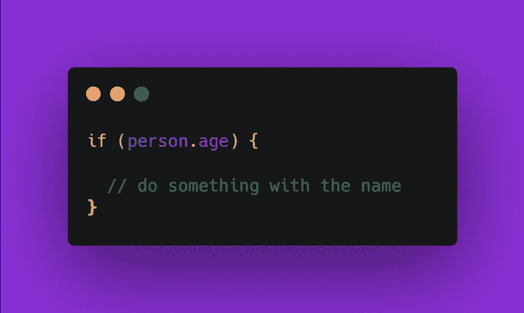

这种方法的问题是 **JavaScript 类型的强制**会影响结果，你会遇到很多错误。

*   如果值为 ***truthy*** ， **if** 条件评估为 true，可以是**对象、非空字符串、非零数字、**或 **true** 本身**。**
*   如果值为 ***falsy*** ，则可以评估为 false，可以是 **null、undefined、0、false、NaN** 或**空字符串。**
*   例如，如果 **person.age** 是 **0** ，那么 if 条件会产生假阴性，即使属性存在，条件也不会满足。

由于这些问题，我们有了一种更可靠的方法来测试对象中属性的存在。使用操作符中的**,你可以在一个特定的对象中寻找一个具有给定名称的属性，如果找到了就返回 **true** 。**

***例如:***

*   操作符中的**检查给定的**键**是否存在于哈希表中，并返回它是否可用。**
*   同样，我们可以使用这个操作符检查对象中的方法，正如我们在下面的例子中可以看到的，我们已经定义了一个方法 **renderName。**

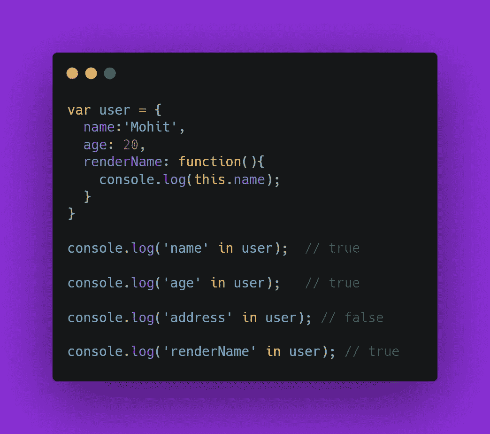

The **in** Operator

## 删除属性

当我开始使用真实世界的 JavaScript 应用程序时，我曾经简单地将属性设置为 **Null，**但是这种方法后来成为应用程序中性能问题的原因**。**

将属性设置为 Null 并不会从对象中完全删除该属性，在这种情况下，会调用值为 **Null 的 **[[Set]]** 操作。**

*   要从对象中完全删除属性，您应该使用 **delete** 操作符，它调用一个名为 **[[Delete]]** *的内部操作(只需从散列表中删除一个* ***键/值*** *对)。*

***例如:***

*   在对象 **person1** 中，当我们使用 **delete** 操作符删除 **name** 属性时，我们可以在控制台结果中观察到 **false** 语句。

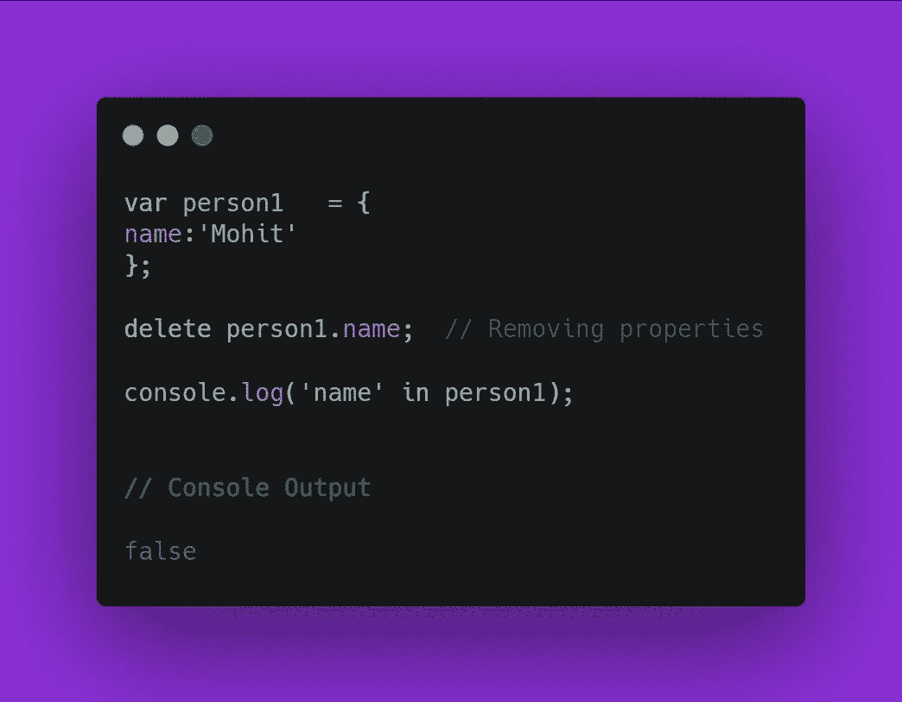

The **delete** Operator

## 防止扩展

有时候我们必须完全保护我们的对象不被进一步扩展。创建不可扩展对象的一个简单方法是使用 **Object.prevent extensions()，**这个方法接受一个参数，这个参数就是我们想要使之不可扩展的对象，仅此而已。

***例如:***

*   当我们试图在对象 **person1** 中添加 **age** 属性时，控制台收到一个错误，因为我们无法再在该对象中添加属性。

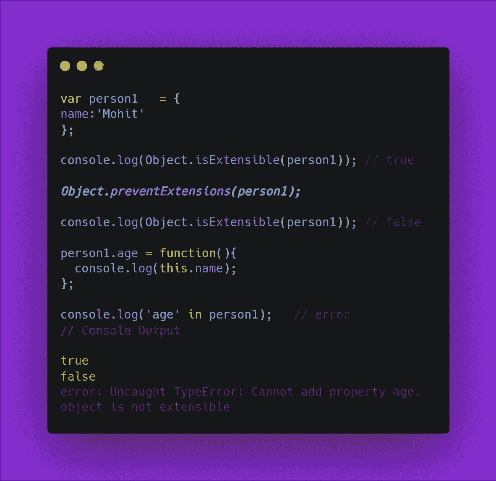

> ***注意:*** *还有两种方法可以创建不可扩展的对象[****object . issealed()****&****object . ISF rozen()****]，这三种方法的工作方式都是一样的。*

# 对象.原型

> 创建对象是 OOP 的第一步，第二步是理解继承。

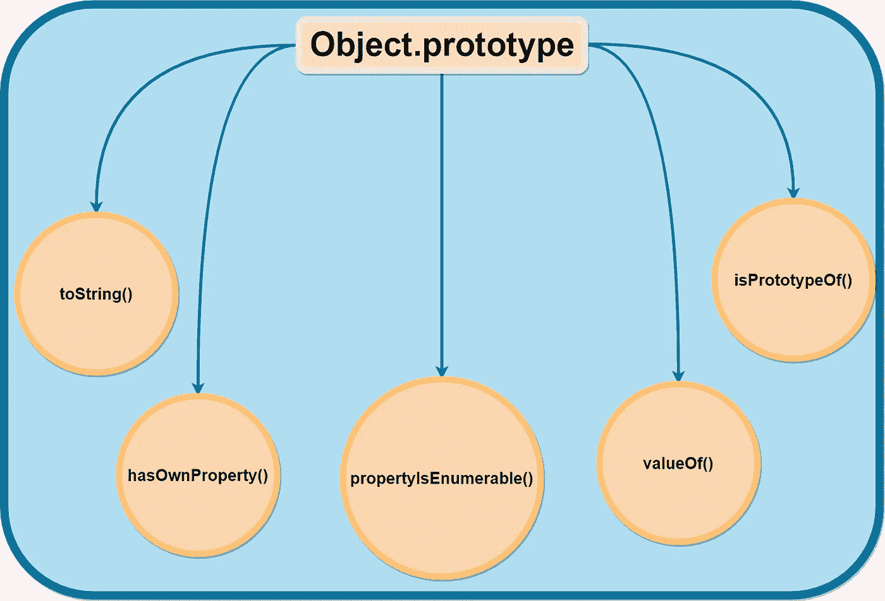

**Methods Inherited From Object.prototype**

所有的对象，也包括那些我们自己定义的对象，都是自动从 Object 继承的，除非特别说明。简单地说，我们可以说所有对象都继承自 **Object.prototype.** 用更专业的术语来说，我们可以说任何通过对象文字定义的对象都将其 **[[Prototype]]** 设置为 **Object.prototype.**

***例如:***

*   如果我们仔细看看变量 ***数据库*** ，它验证了我们关于对象如何被继承的陈述。

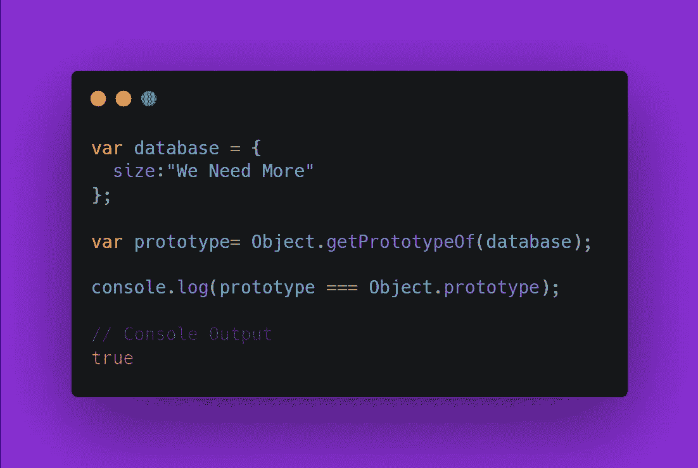

## 结论

感谢您的阅读。我希望你已经发现这是有用的。如果是这样，一定要在评论中让我们知道。

**延伸阅读:**

 [## 2021 年 7 个最佳 JavaScript 和类型脚本格式

### 在下一个 JavaScript 项目中使用 ORM 库

javascript.plainenglish.io](/7-best-javascript-typescript-orms-for-2021-9552d0c7a09f)  [## 每个软件开发人员都应该知道的 9 条编程原则

### 很好地了解干净代码的编程原则

javascript.plainenglish.io](/9-programming-principles-every-software-developer-should-know-9fffe3c5258)  [## React 应用的 6 种优化技术

### 构建快速反应应用程序的有用技术

javascript.plainenglish.io](/6-optimization-techniques-for-react-applications-9585073bc3b7)  [## 作为开发人员，你应该知道的 9 种数据结构和算法

### 让你成为更好的开发者的数据结构和算法

javascript.plainenglish.io](/9-data-structures-algorithms-you-should-know-as-a-developer-5e10946c95a0) 

*更多内容请看*[***plain English . io***](https://plainenglish.io/)