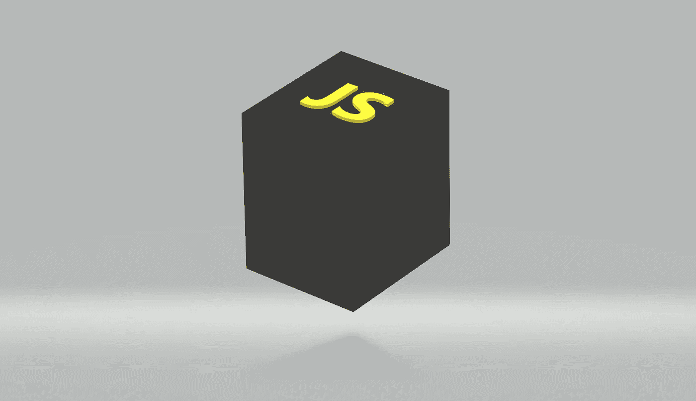
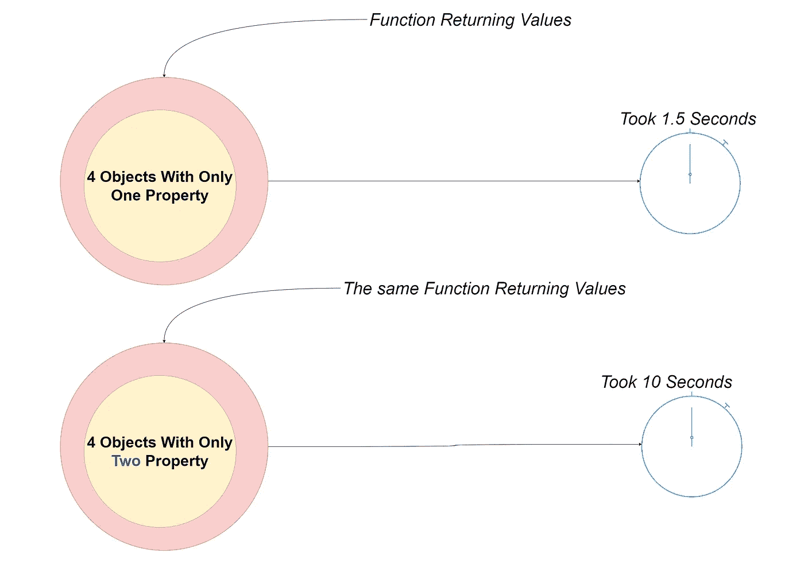
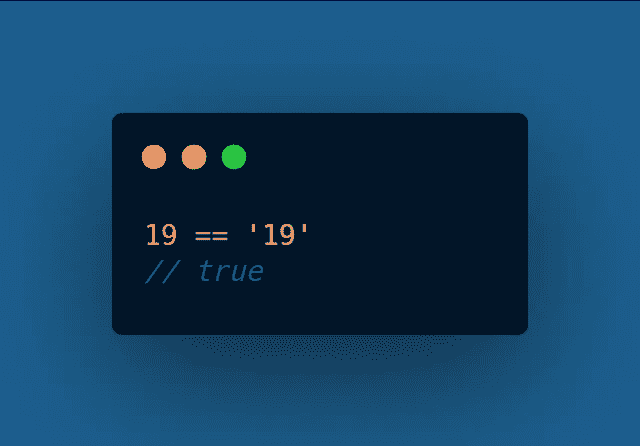
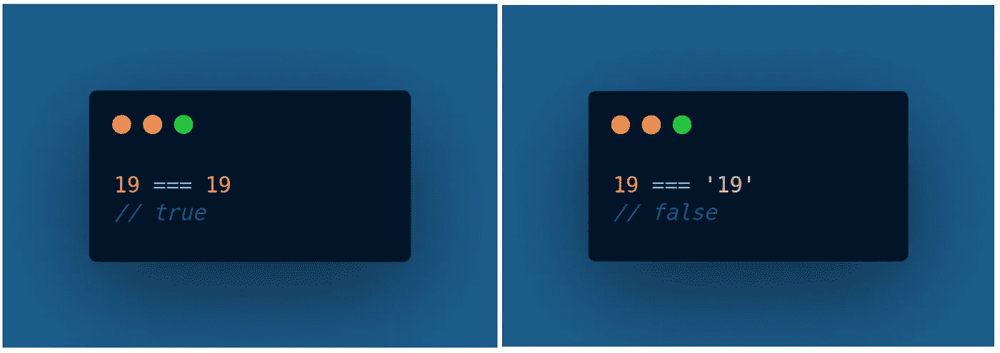
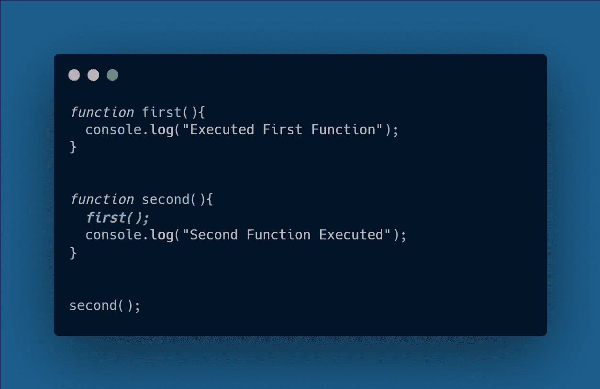
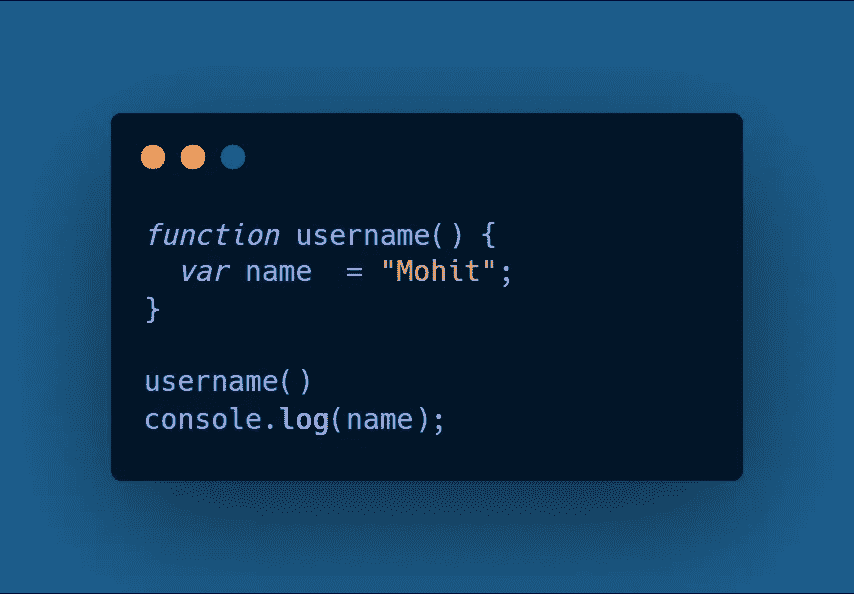
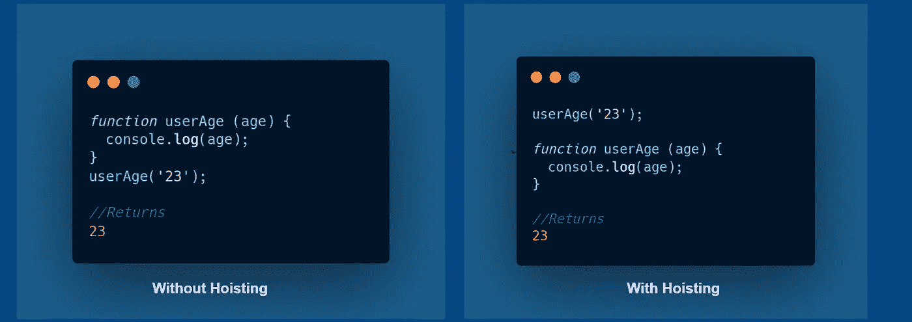

# JavaScript 开发人员应该知道的 7 个概念

> 原文：<https://javascript.plainenglish.io/7-concepts-you-should-know-as-a-javascript-developer-f406597319ab?source=collection_archive---------0----------------------->

## 在下一个 JavaScript 项目中使用的基本概念

## 1.设计模式

> 模式是一种可重用的解决方案，可以应用于软件工程中常见的问题

使用好的设计模式可以防止你的代码库变得异常庞大。尤其是在团队工作的情况下，每个人都必须熟悉一个设计模式，因为它可以在以良好的方式处理项目的同时带来更好的沟通。在 JavaScript 中，有很多设计模式，但是你不需要学习所有的模式就能成为一个精通的人。

***下面是 JavaScript 中一些已知的设计模式***

*   **构造器模式:**在使用*面向对象设计时非常有用的模式* ***，*** 这种设计的一个主要缺点是它不支持继承，因为不同对象之间的属性总是重复的。
*   **原型模式:**由于我们在对象集中有一个属性要在*构造器模式中重新定义，*为了解决这个问题，我们在**原型模式中的原型函数内部创建了一个函数。但是这也有它的缺点，因为你无法控制财产是**私有**还是**公有**。**
*   **模块模式:**对*原型模式*的改进，这里我们可以设置不同类型的修饰符，具有公开重命名功能的灵活性。缺点是您无法从外部环境覆盖创建的函数。
*   单体模式:一种非常实用的设计模式，用于构建可靠的应用程序。*例如，*假设您的应用程序必须建立到数据库的连接，而您不想在已经创建数据库实例的情况下创建它&您只需要在另一个实例关闭或停止正在进行的实例时创建一个新实例。**这种模式确保了实例只被创建一次&，唯一的缺点是难以测试**。

## 2.JavaScript 引擎

作为一名 JavaScript 开发人员，您总是希望从您的代码中获得尽可能好的结果，对 JavaScript 引擎的良好理解将总是导致您更好地决定如何编写代码，而不是进行随机操作。

如果你在想为什么我们需要学习一些在幕后运行良好的东西？

*这里有一个例子*，假设你有几个存储一些值的对象，现在如果我们试图在一个函数中返回这些值大约 10 亿次，在一个高端处理器上，它将花费近 **1.5 秒**的执行时间，但是如果我们只是将存储在我们对象中的属性加倍，那么执行时间将接近 **10 秒**。当您使用真实世界的 JavaScript 应用程序时，这是非常不同的。

## 3.双倍等于和三倍等于

在 JavaScript 中，我们有两种视觉上相似的方法来测试相等性。我们有`==` & `===.`

*   **Double Equals:** 我们正在测试松散的相等性&它还执行 ***类型强制*** ，这意味着只有在尝试将两个值转换为公共类型之后，才会对它们进行比较。

***例如:***

**Double Equals**

> 在这种情况下，JavaScript 将我们的值转换成 like 类型

*   **三重相等:**我们正在测试严格相等，这意味着在比较时，**类型**和**值**必须相同。

***例如:***

**Triple Equals**

## 4.数字正射影像图

DOM 为创建奇妙和创新的应用程序提供了重要的 API，对 DOM 基础知识的良好理解是一些开发人员能够构建令人难以置信的东西的关键因素。DOM ( **文档对象模型)**是一个表示浏览器如何读取 HTML 和 XML 文档的接口&当浏览器读取 HTML 文档时，它会创建一个表示树。

*你能用 DOM 和你的创造力做什么:*

*   **构建可由用户操作定制的应用程序，例如页面布局的改变而无需刷新。**

## 5.调用栈

简而言之，调用堆栈是一种数据结构，它使用**后进先出**原则来临时存储函数调用。

***例如:***

*   当函数 ***second()*** 被执行时，一个空的堆栈框架被创建，它是程序的主入口点。
*   函数 ***second()*** 执行后，调用函数 ***first()*** 推入堆栈，返回并打印**【执行的第一个函数】**到控制台&弹出堆栈。
*   然后执行移动到函数 ***second()*** 返回并打印**‘第二个执行的函数’**到控制台，执行后在清空内存的同时弹出堆栈。

## 6.范围

你可以说作用域是一个盒子，它有自己的变量、函数和对象的边界。默认情况下，你总是在*根*范围内，这里的边界决定了你是否可以访问变量。

*范围可以用两种方式定义:*

*   **局部范围:**边界内一切都是允许的。
*   **全局作用域:**在全局作用域的情况下，你不能访问在**局部作用域**中定义的变量，因为它与外部环境是封闭的，除非你返回它。

***例如:***

*   如果我们尝试运行下面给定的 JavaScript 代码，您将在控制台中得到一个 ***未定义的*** 错误，因为变量名是在函数中定义的，这意味着我们不能在此函数**(局部范围)**之外访问它。

**Local Scope**

## 7.提升

有很多时候很多 ***JavaScript*** 开发者对 ***提升*** 及其工作原理有误解。通过这个概念，你可以处理许多错误&你可以在定义函数之前调用它，以避免类似**‘UncaughtReferenceError’的错误。**在提升中，JavaScript 解释器总是在执行前将变量和函数移动到当前作用域的顶部。

***例如:***

**Hoisting**

 [## 2021 年终极网络开发者路线图

### 从基础到部署可伸缩的 Web 应用程序

javascript.plainenglish.io](/ultimate-web-developer-roadmap-for-2021-6758edd0bd3f)  [## 作为开发人员，你应该知道的 9 种数据结构和算法

### 让你成为更好的开发者的数据结构和算法

javascript.plainenglish.io](/9-data-structures-algorithms-you-should-know-as-a-developer-5e10946c95a0)