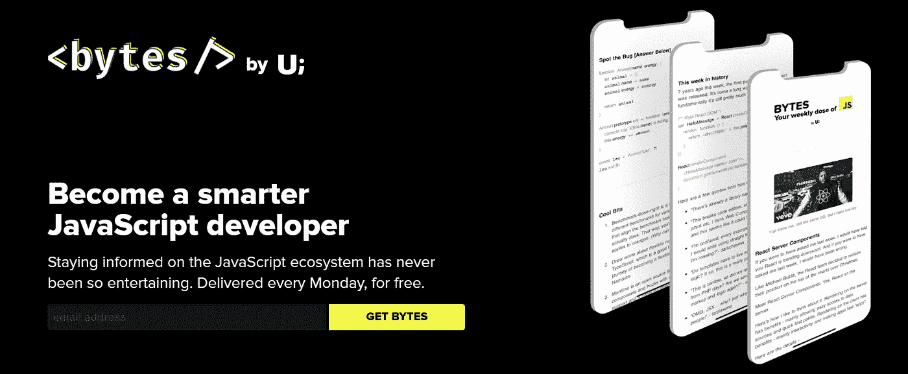

# 您应该订阅的 8 份编程简讯

> 原文：<https://javascript.plainenglish.io/7-developer-blogs-you-need-to-subscribe-as-a-code-newbie-b004ebc6dcf8?source=collection_archive---------12----------------------->

## 作为程序员，你应该看看时事通讯

# 1.肯特·多兹

Kent 是 React 社区中最伟大的开发人员之一，他非常喜欢 React、JavaScript、Node、测试、T2 和巴别塔。作为初学者，他的每周简讯确实帮助了我学习 React。还有，你会了解到所有与 ***JavaScript*** 和 ***React*** 生态系统相关的最新更新。

*   专注于构建高质量软件的内容。
*   来自经验丰富的开发人员的提示和技巧。

# 2.站点点

自从我开始学习 Web 开发以来，Sitepoint 一直是我的最爱之一。大多数时候，你会在 Sitepoint 上获得所有与 web 开发相关的内容，在那里不同的开发者分享他们对主要 web 技术的想法，作为一个初学者，你会发现这些内容非常有趣。此外，如果你想作为一名自由开发者远程工作，那么 Sitepoint 有适合你的东西。

*   web 开发内容的首选。

# 3.新行

如果你想学习构建现实世界的应用程序，Newline 为你提供了多条合适的途径，它们涵盖了很多很好的主题，如 **React、Node.js、TypeScript、GraphQL、JavaScript、CSS & HTML、**等。

如果您对构建现代移动或 web 应用程序感兴趣，我将推荐 Newline 的时事通讯。因为它们涵盖了您可能希望在未来学习的所有最新工具和框架。

*   推荐学习高级**JavaScript**&**Web 开发**概念。

# 4.React 简讯

当谈到在 React 中学习新事物时，这是我最喜欢的一个，React 是由 *UI.dev、*提供的一个很棒的时事通讯，它们涵盖了所有最新的 React 新闻、更新和其他资源。

另外， *UI.dev* 有一个很棒的博客，涵盖了掌握 JavaScript 生态系统所需的所有东西，包括 **TypeScript、React Hooks、Redux、React Router、**等。

*   推荐用其他现代工具学习 **React.js** 。

# 5.网络开发

如果你更关注 Web 开发，Web.dev 在他们的时事通讯中有很棒的内容。这些主题更侧重于构建高性能和快速的 web 应用程序，涵盖了一些基本概念，如使用现代 **CSS、原生加载、Chrome Web 工具、Web Vitals、内容管理系统等。**

*   为网络开发者提供高质量的内容。

# 6.CSS-招数简讯

你一定听说过 CSS-Tricks，这是一个学习 CSS 并深入了解每个概念的好地方。CSS-Tricks 为希望掌握一些重要的 CSS 技能并构建响应迅速的 web 应用程序的新开发人员提供了合适的内容。诸如 **CSS 媒体查询**、即将到来的 **CSS 伪**元素等主题都有深入的解释，你也将了解一些隐藏的特性和技巧，这些是你在大多数教程中不会学到的。

*   推荐用于深入学习 CSS。

# 7.ZTM 时事通讯

ZTM 时事通讯很新，如果你想在你的开发者之旅中建立一个好的载体路径，那么 ZTM 有合适的内容给你。它们涵盖了 JavaScript 和所有其他的 Web 开发概念，ZTM 时事通讯也将帮助那些想找开发工作的开发人员，因为所有的内容都是由一些伟大的行业专家提供的。

*   推荐给正在寻找软件工程师载体路径的初学者。

# 8.字节

这是我遇到的最好的 JavaScript 时事通讯之一，作为一名前端开发人员，你可以阅读这篇时事通讯来提高你的 JavaScript 技能。正如你必须意识到的，并不是所有的时事通讯都是有用的，可以提供好的东西，但是这一个实际上很突出，因为你将会得到很多关于 **JavaScript** 和前端开发的有见地的新闻。

*   推荐给初学者和专业的 *JavaScript* 开发者。

**延伸阅读**

 [## 高简讯打开率背后的关键因素

### 在这篇文章中，我们将讨论我们 9 个月前的时事通讯《简明英语上周》是如何一直…

电路. ooo](https://circuit.ooo/blog/the-key-ingredient-behind-high-newsletter-open-rates)  [## 如何在 CSS 中创建阴影

### 为您的应用程序构建出色的视觉效果

javascript.plainenglish.io](/working-with-shadows-in-css-15ff0717cf71)  [## 作为软件开发人员，你正在犯的 5 个 UI 错误

### 开发人员在前端应用程序中经常犯的 UI 错误

javascript.plainenglish.io](/5-ui-mistakes-you-are-making-as-a-software-developer-6e311d769a77)  [## 在 4 分钟内解释 4 个关键 CSS 属性

### 基本 CSS 入门

javascript.plainenglish.io](/4-key-css-properties-explained-in-4-minutes-9567d1b5af86) 

*更多内容看* [*说白了。报名参加我们的*](https://plainenglish.io/) [*免费每周简讯*](http://newsletter.plainenglish.io/) *。关注我们* [*推特*](https://twitter.com/inPlainEngHQ) ，[*LinkedIn*](https://www.linkedin.com/company/inplainenglish/)*，*[*YouTube*](https://www.youtube.com/channel/UCtipWUghju290NWcn8jhyAw)*，以及* [*不和谐*](https://discord.gg/GtDtUAvyhW) *。对增长黑客感兴趣？检查* [*电路*](https://circuit.ooo/) *。*