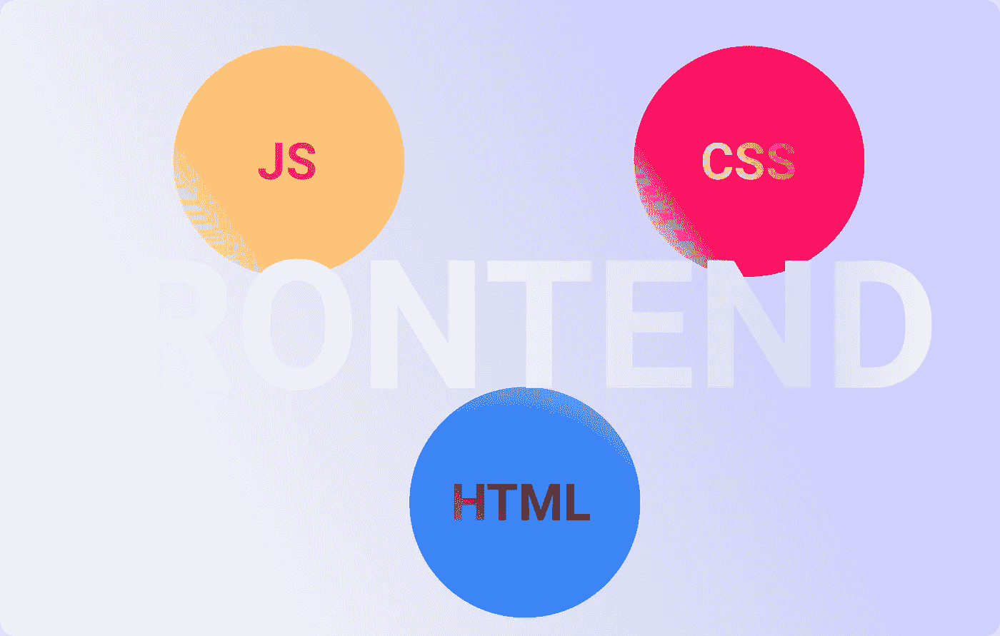
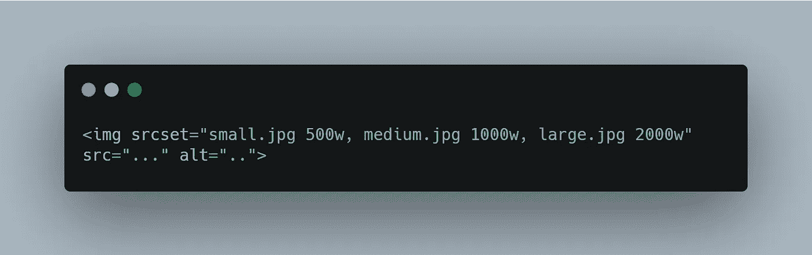

# Web 开发人员的 7 个前端面试问题

> 原文：<https://javascript.plainenglish.io/7-front-end-interview-questions-for-web-developers-794509cd8415?source=collection_archive---------11----------------------->

为你的下一次前端面试提供坚实的概念

## 1.什么是渐进式渲染？

渐进式渲染是指用于提高网页性能的技术，例如尽可能快地显示内容。Web 开发人员应该经常学习这样的方法来构建更加用户友好的网页，并与慢速互联网连接兼容。

***例如:***

*   使用 ***JavaScript*** 的图像延迟加载可以用来在用户向下滚动到页面时加载图像。
*   只使用最少的 **CSS 脚本**来尽可能快地呈现给用户的浏览器。

## 2.解释图像标签中的 srcset 属性

当您希望根据用户设备显示的**宽度**向用户提供不同的图像时，会使用 ***srcset*** 标签。为具有高分辨率的设备提供更高质量的图像，反之亦然*提高了性能并避免了数据浪费。*

****例如:****

*   *假设您正在使用一个具有多个分辨率的图像，使用 **srcset** 标签，您可以告诉浏览器根据客户端的分辨率显示**小、中、大**图像。另外，注意当使用 ***srcset*** 标签时，你必须定义相关的**宽度**以完成工作。*

**

***Using the srcset attribute***

## *3.描述*

*   *在 ***<脚本异步>，*** 的情况下，脚本被并行提取到 **HTML** 解析中，并在可用时立即执行。*
*   *但是在 ***<脚本延迟>，*** 的情况下，脚本也是与 **HTML** 解析并行获取的，但是执行是在页面已经完成解析时完成的。*
*   *另请注意，如果有多个脚本，每个脚本将按照它们在文档中出现的顺序执行。*

> ***注意:对于没有 **src** 属性的脚本，async** 和 **defer** 属性会被忽略。*

## *4.列举一些设计多语言网站的最佳实践*

*   ***lang 属性:**在你的 HTML 中始终使用 ***lang*** 属性。*
*   ***语言阅读方向:**注意你正在使用的语言方向，如在 ***英语*** 中我们从**左**到**右 *&* 顶部**到**底部**阅读。但在传统的 ***日语*** 中，文字是**向上**到**向下&向右**到**向左**。*
*   ***格式化日期&货币:**在开发多语言网站时，必须确保根据地区使用正确的*日期*和*货币*格式。*例如*，日期在*中表示为**【2001 年 4 月 4 日】**但是在 ***欧洲*** 中，它将类似于**【2001 年 4 月 4 日】**。**
*   ****句子长度:**你可能犯的最大错误之一就是当一个句子被翻译成不同的语言时，你的网站会出现*溢出*的问题。为了避免这个问题，你应该总是使用较短的句子。**

## **5.CSS 选择器特异性是如何工作的？**

**使用四个逗号分隔值 **a、b、c、d** 的特异性根据以下公式计算:**

*   ****a** 是使用内联样式的地方&如果属性声明是元素 a 上的内联样式，则为 1，否则为 0。**
*   ****b** 是 ***ID 选择器*** 的编号。**
*   ****c** 是数量 ***伪类，属性&类。*****
*   ****d** 是标签和**的数量 *pesudo-element* 和**选择器。**

**CSS 中的特异性是在矩阵值的基础上工作的，这些矩阵值随后被逐列比较。为了寻找最高的特异性，从**左**到**右**观察并比较每列中的最高值。**

> *****注意:*******b****列中的值将覆盖* ***c*** *和* ***d、*** *列中的值，不管我们有什么值。* **比如******0，1，0，0*** *的具体值会大于* ***0，0，10，10*** *。*****

## ***6.什么是 CSS 精灵？&如何在网页上使用它们？***

***CSS 精灵用于将多个图像合并成一个更大的图像，通常用于网页上的图标。***

*   ***为了使用它们，我们必须使用一个 sprite 生成器，将多个图像打包成一个图像，并生成适当的 CSS。***
*   ***由于每个图像都有一个相应的 CSS 类，并定义了 ***背景-图像、背景-位置**&****背景-大小*** 属性，我们只需将相应的类添加到您的元素中即可使用该图像。*****

*** [## OAuth 在 4 分钟内解释

### 使用 OAuth 进行快速简单的授权

javascript.plainenglish.io](/oauth-explained-in-4-minutes-84081720a4f7)  [## 4 分钟解释大 O 符号

### 用更好的代码构建可伸缩的应用程序

javascript.plainenglish.io](/big-o-notation-explained-in-8-minutes-ded09f8f0f0a)  [## 你不知道 CSS 能做的 4 件事

### 鲜为人知的 CSS 特性及示例

javascript.plainenglish.io](/4-things-you-didnt-know-css-can-do-13b364296570) 

*更多内容请看*[***plain English . io***](http://plainenglish.io/)***