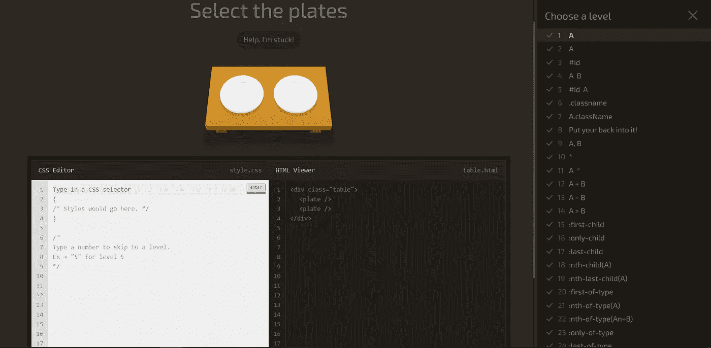
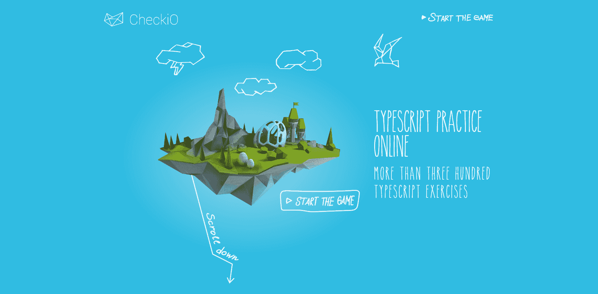
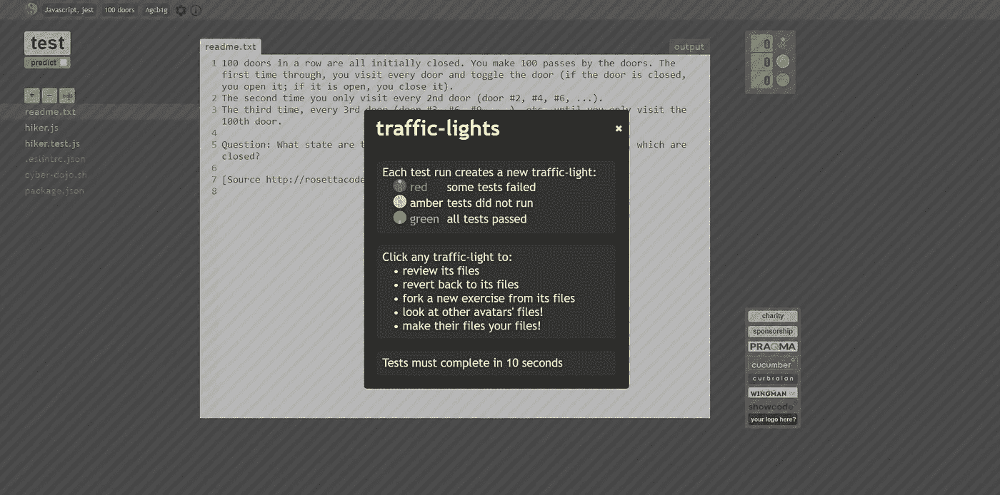
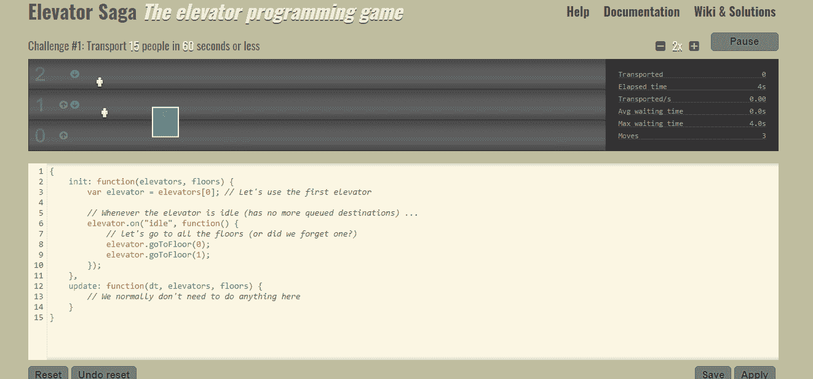
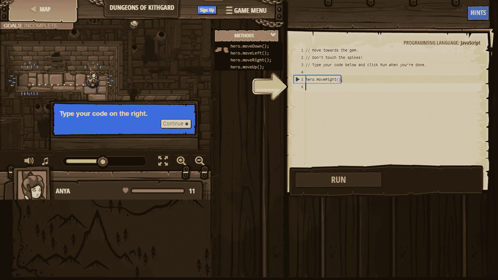
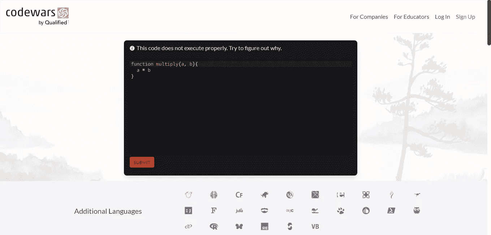
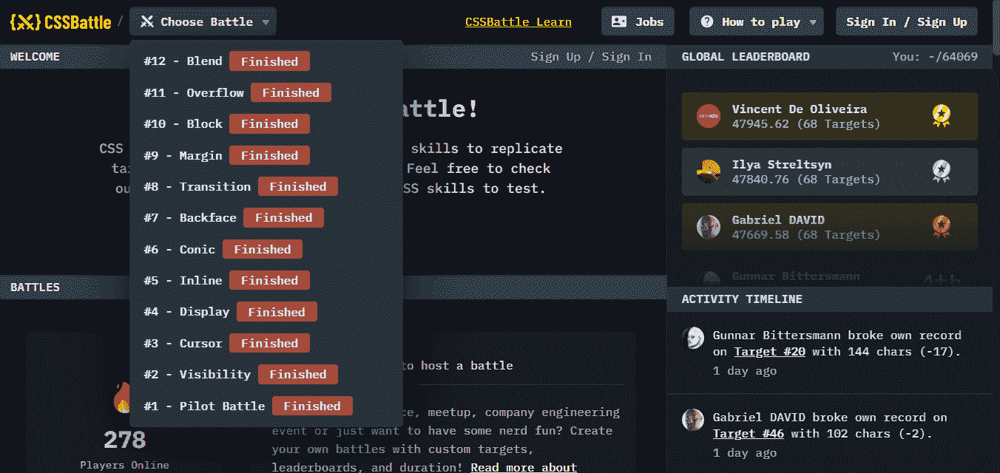

# 你应该玩的 7 个有趣的游戏来提高你的编码技能

> 原文：<https://javascript.plainenglish.io/7-fun-games-you-should-play-to-up-your-coding-skills-ec051a55faaa?source=collection_archive---------4----------------------->

## 掌握各种网络技术的非典型方法。

Photo by [Nicolas Gras](https://unsplash.com/@armgd?utm_source=medium&utm_medium=referral) on [Unsplash](https://unsplash.com?utm_source=medium&utm_medium=referral)

无论是获得专业知识还是学习一门全新的语言，开发人员都需要跟上潮流，提升他们现有的技能。

不管你对编码有多热情，持续的学习可能会令人厌倦，甚至可能会产生反效果，比如“教程地狱”。

幸运的是，有很多真正的方法可以提升你的编码技能，而不需要花费数小时阅读书籍或观看教程。

玩编码游戏是一种令人兴奋的消磨时间的方式，同时还能解决问题和学习新事物。

下面是你应该玩的 7 个游戏，来提升你的网络开发技能:

## 1. [CSS 食客](https://flukeout.github.io/)

Game to learn CSS. [Source](https://flukeout.github.io/).

[CSS Diner](https://flukeout.github.io/) ，由 [Luke Pacholski 制作，](https://twitter.com/flukeout)是一个有趣的&直观的掌握 CSS 选择器的方法。

为您提供了一个 CSS 编辑器，您可以在其中键入 CSS 代码，还提供了一个 HTML 查看器，它可以呈现像盘子这样的项目。

有多达 32 个级别，每个级别的唯一挑战是弄清楚如何使用 CSS 选择器选择特定的项目。随着每一关的通过，游戏的复杂性也在增加。

此外，如果您对解决方案不确定，每个级别都有示例来帮助您。

## 2. [CheckiO](https://checkio.org/)

CheckiO’s TypeScript challenges. Source: GIF by Author of the [site](https://checkio.org/).

如果你想学习 TypeScript(或 Python)， [CheckiO](https://checkio.org/) 对你来说是一个令人难以置信的网站，绝对值得一试。

此外，还有一个 Chrome 扩展[可用，它允许你使用本地桌面 IDE，而不是基于 web 的开发环境。](https://chrome.google.com/webstore/detail/checkio/mlglngjgefkbflbmelghfeijmojocnbi?hl=en)

你会遇到一些挑战，比如从给定的列表中删除不唯一的元素，并且有超过 300 个练习可用。

为了构建最有趣的编码游戏，CheckiO 提供了一些不同种类的编码游戏。有一个代码帝国，它将战术、战略和代码结合到一个游戏中。

他们的博客页面上也有关于编程的挑战和有用的文章。

有趣的是，[网站帮助老师们](https://checkio.org/teachers/)使用这些代码谜题和游戏来补充他们的教学。

教师可以监控课堂进度以及查看学生提交的解决方案。

## 3.[赛博道场](https://www.cyber-dojo.org/creator/home)

One of the Cyber-Dojo challenges. [Source](https://www.cyber-dojo.org/creator/home).

如果你是测试驱动开发(TDD)的粉丝，Cyber-dojo 是一个必去的网站。

如果你不知道 TDD，它是我们看待软件开发的一种方法。在 TDD 中，测试是在实际的软件开发代码之前编写的。

首先，请访问[网站](https://www.cyber-dojo.org/creator/home)创建一个新的练习环节，选择您想要解决的问题，然后选择您选择的语言。

Cyber-dojo 支持几乎所有著名的编程语言，如 JavaScript、C、Java、Python 等等。

## 4.[电梯传奇](https://play.elevatorsaga.com/)

Source: GIF by Author of [Elevator Saga](https://play.elevatorsaga.com/) page.

另一个你可以尝试的有趣游戏是[电梯传奇](https://play.elevatorsaga.com/)游戏。

你必须用 JavaScript 编写电梯运动的程序，目的是以高效的方式将人们从一层楼运送到另一层楼。

有时间限制，你可以尽可能多次重写代码，尽量减少运送人员的时间。

随着你的进步，这真的变得很有挑战性，正如官方文档所说的那样:“只有最好的程序才能完成所有的挑战”。

如果需要，您甚至可以使用浏览器的开发工具来调试代码，除此之外，代码也存储在本地存储中，因此您不必担心意外关闭浏览器。

## 5.[代码战斗](https://codecombat.com/play)

Code Combat Game. Source: Screenshot by Author of the [official](https://codecombat.com/play) site.

代码战斗一直是我最喜欢的编码游戏之一，有时我仍然喜欢玩它。

这个网站提供了一系列的游戏，一些基于地牢风格的导航，而另一些基于游戏开发，在游戏开发中你有责任建立关卡。

当你完成每一个游戏，下一个就会解锁。

在第一个游戏[厨房地牢](https://codecombat.com/play/level/dungeons-of-kithgard?)中，你必须引导你的英雄穿过走廊，不要碰到墙上的钉子之类的障碍物。

支持 JavaScript 和 Python，而对 CoffeeScript 和 C++的支持还在实验阶段。

## 6.[代码大战](https://www.codewars.com/?language=javascript)

Codewars’s JavaScript challenge. [Source](https://www.codewars.com/?language=javascript).

顾名思义， [Codewars](https://codecombat.com/play) 实际上是关于真正的代码“战争”，即修复和比较代码。

如果你想以一种有趣的方式掌握一门语言，这个游戏真的很棒。

当您完成挑战时，您将获得显示您专业水平的等级。而且，这些排名是用来给你匹配真正会挑战你的问题的。

您还可以将您的代码与其他用户进行比较，并创建您自己的挑战，供其他用户尝试。

此外，您不仅可以获得对少数几种知名语言的支持，还可以获得对大量语言的支持。

这款游戏还推广并使用了试驾开发(TDD)的方式。

## 7. [CSS 之战](https://cssbattle.dev/)

CSS Battle landing page. Source: GIF by Author of the [site](https://cssbattle.dev/).

[CSS 之战](https://cssbattle.dev/)如果你想掌握 CSS，是一款优秀的游戏。与 CSS Diner 游戏不同，这个游戏不仅仅是使用选择器。

你得到了一个图像，你必须尽最大努力只用 CSS 复制这个图像，甚至不用 JavaScript 或者像图片这样的外部资源。

从对齐到大小到颜色的一切都必须与提供的图像匹配，以获得 100%的成功结果。

你可以选择你想要的确切的挑战，每个挑战集中在特定的 CSS 特性上，比如过渡、溢出、块等的使用。

你还会看到一个排行榜，有趣的是，还有一个就业排行榜。

更有趣的是，你可以用自定义的目标和排行榜来创建自定义的战斗，还可以和你的朋友一起玩。

## 最后的想法

开发人员必须不断学习新的语言，或者花时间掌握他们当前选择的语言。

虽然开始时令人兴奋，但这种不断学习的过程可能会变得乏味，为了让您的编程之旅焕发活力，您可以尝试上面提到的游戏。

虽然单独来说，这些游戏不能保证教会你所有你需要知道的语言知识，但是它们仍然提供了价值，并且可以提高你的技术技能。

然而，仅仅提高你现有的技能是不够的，当你从头开始构建新项目时，你必须学习新的方法和实践。

 [## 作为开发人员成长的 5 种方式

### 明确的方法来提高你的游戏和推进你的职业生涯

js .平原英语. io](https://js.plainenglish.io/5-ways-to-grow-as-a-developer-b147336debb6) 

我真的希望你喜欢阅读这篇文章，并享受玩这些游戏的乐趣。