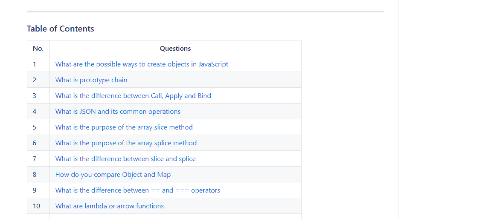

# 7 个 Github Repos 将帮助你赢得下一次编码面试

> 原文：<https://javascript.plainenglish.io/7-github-repos-that-will-help-you-ace-your-next-coding-interview-306ddf297743?source=collection_archive---------13----------------------->

## 准备好通过任何公司的面试，获得你梦想中的工作

Photo by [Icons8 Team](https://unsplash.com/@icons8?utm_source=medium&utm_medium=referral) on [Unsplash](https://unsplash.com?utm_source=medium&utm_medium=referral)

求职面试可能会让人不知所措，尤其是如果这是你的第一次求职面试。每次面试，你都要推销自己，推销自己的能力。

此外，面试中问的许多概念和问题并不完全是你最终将在工作中使用的，尤其是如果你是一名前端开发人员。

尽管如此，了解这些算法和数据结构在破解求职面试中发挥着关键作用。

学习和掌握这些概念的最好方法是使用你可以支配的合适的资源。

下面是你在下一次编码面试中需要的 7 个资源:

## 1.[编码面试大学](https://github.com/jwasham/coding-interview-university)

Table of Contents. Source: Author

这是一个优秀的 [Github 库](https://github.com/jwasham/coding-interview-university)，对于新的软件工程师或者那些从 web 开发转向软件工程的人来说。

这个知识库的创建者完成了概述的学习计划，并在亚马逊找到了一份软件工程师的工作。

软件工程和 web 开发是不同的领域，因为软件工程要求你具备计算机科学知识。

话虽这么说，但值得注意的是，很多前端开发人员角色面试也要求算法和测试你的计算机科学知识。

即使您是一名希望更新知识的软件工程师，这个存储库也是一个理想的起点。

使用这个存储库的最好方法是克隆这个存储库，然后在你完成这个主题后用 X 标记所有的框。这里给出了做这件事的具体步骤[。](https://github.com/jwasham/coding-interview-university#how-to-use-it)

你还可以找到一些最著名的在线面试准备内容的链接。

## 2.[牛逼的面试问题](https://github.com/MaximAbramchuck/awesome-interview-questions)

顾名思义，这是一个由各种编码面试问题组成的精选列表，用于测试您的知识。

这个[库](https://github.com/MaximAbramchuck/awesome-interview-questions)不仅适用于 web 开发角色，也适用于几乎所有与软件工程和开发领域相关的角色。

您可以找到大量与数据库、缓存、不同编程语言、Linux、设计模式、数据结构、算法等相关的问题和备忘单。

数据科学调查问卷也可以在这里找到。

这个知识库是一个问题的一站式商店，特别是对 web 开发人员来说，因为你可以在几乎所有著名的框架上找到一堆问题，比如 NodeJS、React，甚至 WordPress。

此外，还涵盖了应用程序开发问题。

## 3.[系统设计入门](https://github.com/donnemartin/system-design-primer)

Source: [System Design Primer Repo](https://github.com/donnemartin/system-design-primer)

这个[库](https://github.com/donnemartin/system-design-primer)为各种系统设计主题提供了极好的参考。

即使您是系统设计新手，该资源也涵盖了您需要从头开始了解的每个原则和主题。

关于如何设计大规模系统的主题，牢记相关的权衡，如性能与可伸缩性。

cdn 和负载平衡器等特定主题也将全面涵盖。

该存储库仍在开发中，预计将会加载新内容。在撰写本文时，面向对象的设计面试问题正在开发中。

## 4.[采访手册](https://github.com/yangshun/tech-interview-handbook)

*Credits:* [*Illustration*](https://dribbble.com/shots/3831443-Tech-Interview-Handbook) *by* [*@leftaligned*](https://dribbble.com/leftaligned)

如果你想得到一份工作，但你对整个过程完全陌生，这个[库](https://github.com/yangshun/tech-interview-handbook)是一个寻找实用内容的完美地方，涵盖了与技术面试相关的一切。

这个 r [epository](https://github.com/yangshun/tech-interview-handbook) 更适合算法问题。

*目前，该存储库尚未涵盖系统设计问题，因此，如果您专门寻找系统设计问题，可以跳过这一步。*

练习 LeetCode 可能需要很多时间，这就是为什么这个知识库包含了最好的练习问题，从而节省了你为其他重要事情做准备的时间。

除此之外，您还会发现行为问题和面试备忘单，它们肯定会在编码面试的非技术方面帮助您。

还可以找一个 [Docusaurus 网站](https://yangshun.github.io/tech-interview-handbook/)提供更好的阅读体验。

## 5.[面试](https://github.com/Olshansk/interview)

这个[库](https://github.com/Olshansk/interview)和之前讨论的[牛逼面试问题库](https://github.com/MaximAbramchuck/awesome-interview-questions)非常相似。

它本质上是一个各种讲座、资源、书籍和其他此类材料的精选列表，可以帮助您在编码面试中胜出。

你还可以找到模拟面试，以及成功破解谷歌和脸书等大公司面试的人的博客链接。

虽然这对于 web 开发人员和这个领域的新手来说是一个很好的回购，但这个回购不像我们在这个博客中讨论的其他回购那样彻底。

然而，这并不意味着这不是一个好的资源。对于不希望被涵盖每个主题的长篇报告淹没的绝对初学者来说，这是理想的选择。

## 6. [JavaScript 算法](https://github.com/trekhleb/javascript-algorithms)

顾名思义，这个[库](https://github.com/trekhleb/javascript-algorithms)的唯一目的是为需要 JavaScript 的编码面试做准备。

在这个库中可以找到用 JavaScript 实现的许多流行算法和数据结构的例子。

每种数据结构都有正确而深入的解释，每种算法和数据结构都有自己独立的自述文件。

关于这个库最好的部分是主题被分为高级和初级两类。

`B`标签给初学者类别，而`A`给高级类别。

从该资源运行代码时，建议使用林挺工具来增强可读性并检查代码质量。

就我个人而言，我已经多次使用这个回购，因为它提供了有用的信息和大 O 符号表及其性能比较。

## 7. [JavaScript 面试问题&答案](https://github.com/sudheerj/javascript-interview-questions)

这个 [Github 知识库](https://github.com/sudheerj/javascript-interview-questions)旨在提供最常见和最常问问题的摘要。

Table of contents. [Source](https://github.com/sudheerj/javascript-interview-questions).

如你所见，有超过 400 个问题，全部基于 JavaScript。

这个报告还包含编码练习以及一个 PDF 版本。

虽然你不需要知道所有这些问题，而且公司也不会问这里所有的问题，但是这些问题可以让你对技术面试中的问题有一个很好的了解。

如果您是一名 JavaScript 开发人员，即使您没有准备技术面试，也绝对有必要通过这份问卷来测试您的知识。

## 最后的想法

去参加工作面试时感到不知所措是正常的，不管准备的程度如何。

得到你梦想的工作和梦寐以求的角色的唯一方法就是比其他候选人准备得更充分。这也包括面试的非技术性方面。

> 预测未来的最好方法是创造未来。

这些知识库肯定会增加你在下一次工作面试中胜出的机会，因为它们涵盖了技术和非技术方面。

此外，你还可以在这些知识库中找到其他相关和重要的讲座和书籍的链接。

希望这些资源能帮助你成功应对下一次求职面试。

感谢阅读！