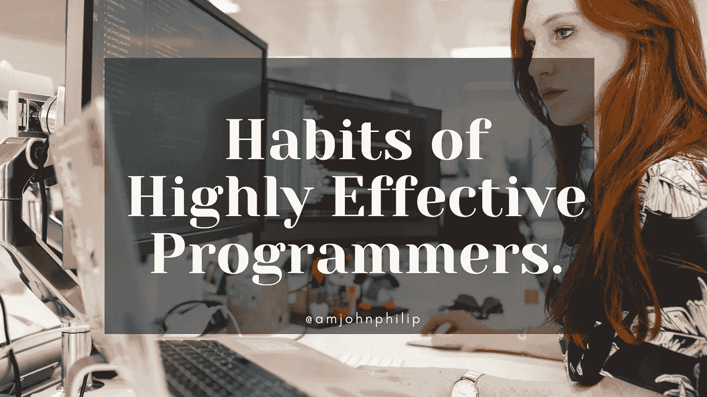

# 高效程序员的 7 个习惯。

> 原文：<https://javascript.plainenglish.io/7-habits-of-highly-effective-programmers-81e2e57417ff?source=collection_archive---------12----------------------->

## 长期的习惯将在多年的编程中为你提供动力。

Photo by [John Philip](https://medium.com/u/c2cdb19c0977?source=post_page-----81e2e57417ff--------------------------------).

编程总是伴随着不健康的习惯，这些习惯会破坏你的工作效率，改变你的关注点、目标和职业生涯的最初轨迹。

尤其是当你很少考虑遏制同样的不健康习惯时。

在这篇文章中，我们将学习一些习惯，当这些习惯完全实现时，将会提高你的生产力，完成更多的工作。

这些习惯也将帮助你成长为一名更好的程序员。

## **1。“搞定”的态度。**

拥有“完成它”的态度是确保你做你打算做的事情并且不会偏离你的目标的一步。

有以结果为导向的目标(你能提供的产品)。

有了这个习惯，会帮助你成长，让你一路上知道很多东西。

顺带一提，做吧，因为这是你应该做的。避免懒惰的习惯，用自己的方式把事情做好。

灌输一种“完成它”的态度和心态将确保你得到你想要做的，也帮助你更好地利用你的技能。

把你的眼睛放在目标上，专注于最终目标，而不是制定短小的计划来完成这个目标。

## **2。保持简单。**

编写有适当文档记录且易于阅读的代码和程序是一个需要养成和磨练的好习惯。

不要让其他人的生活变得过于复杂，他们不久前会阅读你的代码，并发现它不可维护。

在适当的地方适当地记录你的代码，并编写易读的代码。

根据您的编程语言，有许多编程和干净的代码原则，您可以轻松地合作编写易于阅读的代码。

根据 KISS(保持简单，笨蛋)的说法，如果保持简单而不是复杂，大多数系统工作得最好；因此，简单应该是设计的关键目标，并避免不必要的复杂性。

编写易于阅读和调试的简单代码，这有助于更快地交付产品。

总而言之，保持简单易懂，不要过度设计。

## **3。进入“区域”状态。**

拥有你自己的时间，尽量让你的工作时间最大化。像任何其他职业一样，编程总是伴随着许多不健康的习惯，从拖延到精疲力竭。

尤其是当你在家(远程)工作的时候，知道如何设置你和朋友、家人在一起的时间。

让他们知道你在工作，不要试图打断你的工作。

设定界限，这将有助于你管理你的工作时间，并把工作做好。

不要因为对我们周围的人设定期望而在你一天中注意力最集中的时候受到干扰。

## **4。永远学习。**

在这方面，技术领域每天都在随着新的和复杂的技术不断变化。

这些技术提供了新的机会和新的方法来做一些事情。

关于这一点，让自己不断学习新的东西会让你永远走在别人的前列，并帮助你在前进的道路上获得其他机会。

如果你不愿意在这个过程中学习新的东西，你将会坚持旧的不流行的做事方式，这可能会让你失去工作机会。

综上所述，永远不要停止学习新的技术和突破。

## **5。协作。**

编程，在这方面，你的编程之旅不会总是一个人做所有的事情。

一路上，你总会有同事和其他人向你看齐，甚至和你一起工作。

学会与其他人和队友合作是一个很好的习惯。知道何时以及如何提问也是一项需要掌握和磨练的技能。

遇到困难时，不要害怕向别人求助，不管是队友还是同事。

问问题，越多越好。

## **6。运动，良好的睡眠，健康的心理健康。**

尽管我们所做的一切，也就是编写和发布好的和高质量的代码，但如果没有健康的身体和精神，这一切都无法完成。

记住，你的思想和身体是你孤独的圣殿，对你如何控制自己非常有效。对他们好，他们会对你好，对它不好，它也会对你不好。

检查你的健康和精神肌肉，喝大量的液体，在非生产时间晒晒太阳，坐在椅子上保持背部挺直。

身体和心灵是你花园的象征；当你正确喂养它，并确保它得到照顾，它会给你带来许多好处和丰富。

无论你做什么，都要经常检查你的身体和头脑。

## **7。习惯孤独。**

编程有时会让你感到孤独，而且大多数时候，你会独自一人在没有别人帮助的情况下思考问题。

你可以充分利用这个机会，习惯这种情况。大多数时候，你会独自面对你的键盘和屏幕，不习惯这些对大多数人来说是一项艰巨的任务。

作为一项孤独和单独的活动，习惯于花大量时间专注于工作和发展你的职业生涯，这对你和整个世界都有帮助。

## **最终想法。**

这些习惯，当完全实现的时候，将帮助你提高你的生产力和提升你的编程生涯。

感谢您花时间通读这篇文章。

如果你觉得其他人可能会从这篇文章中受益，请不要犹豫，分享出来。

*更多内容请看*[***plain English . io***](http://plainenglish.io/)