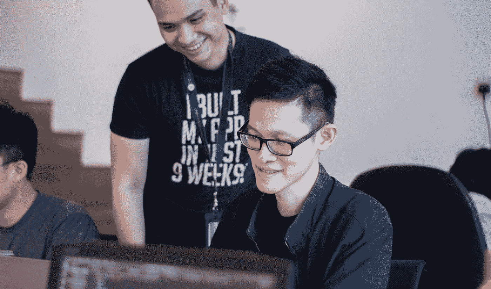

# 成为优秀程序员需要掌握的 7 个习惯

> 原文：<https://javascript.plainenglish.io/7-habits-you-can-master-to-become-a-good-programmer-8c328c005345?source=collection_archive---------12----------------------->

## 显示良好效果的习惯。

Photo by [NEXT Academy](https://unsplash.com/@next_academy?utm_source=medium&utm_medium=referral) on [Unsplash](https://unsplash.com?utm_source=medium&utm_medium=referral)

好奇心、精神挑战、雄心，最后，平均收入意味着在 IT 行业工作会吸引新的人。年龄在这里并不重要——无论是毕业后的年轻人，还是那些已经开始职业生涯的人，但正在寻找新的机会和新的挑战，学习编程。

当你在寻找“如何成为一名程序员”这个问题的答案时，很可能会找到几十个教程或课程来指导你度过学习的初始阶段。

当你开始自学时，获得更高级的技能对你来说是自然而然的事。另一方面，几乎没有人注意在编程职业中做什么来保持良好的健康和创造力。

在自学中，很难高估好习惯的价值——它是你未来可以做的更好的投资之一。好的实践和习惯会让你学会编程，让你更长久地成为一名优秀的程序员。字面上。

# 1.总是接受或大或小的项目

当你刚开始学习工作坊时，开始一个大的、雄心勃勃的项目有什么错？首先，在缺乏足够高的技术技能的情况下，你很可能很难完成它。

你需要做很多事情来保持你的应用程序稳定，如果你缺乏编写干净代码、测试和可伸缩架构的经验，你的工作可能会永远结束。

你知道的越多，你就越能看到这个伟大工程中需要重写的许多部分。你将更容易找到中级开发人员级别的工作，但你的投资组合仍然没有看起来像它应该的那样好，因为伟大的项目还没有准备好。与此同时，你的同事比你做得更好，尽管他们没有什么大的设计，只有几个小的，但工作正常，写得很好。

不要把你所有的精力都花在一个可能远大于你现有技能的大项目上，而是专注于几个较小的项目。小项目应该展示你实际知道的东西，并在你的作品集里炫耀。尽快添加它们——你不知道什么时候投资组合的机会将是至关重要的。

# 2.总是在学习算法和结构。

什么时候开始学习算法和数据结构最好？当你想获得第一份工作时，这种技能可能不是最重要的，但它在你职业生涯的后期证明是有用的。

它只是让你更好地理解计算机程序和数据处理背后的机制。算法是其中的一部分:可以说每个程序都是一系列与数据结构相联系的算法。没有这些知识你也可以生活，但是有了这些知识你会更舒服。

# 3.总是练习干净的代码。

如果你想成为一名专业的开发人员，你需要学习编写干净代码的规则。你越早开始用这种方式编写程序或应用程序。越好——根除旧习惯比从头开始培养新习惯更难。

这个原则可能比编写代码和学习编程工具更晚得到回报，但当你在项目中挣扎着处理前任留下的代码混乱时，它迟早会回到你身边。

# 4.总是写测试

是的，测试是很乐意离开的东西——因为如果一个网站或应用程序工作正常，那么一切都很好，直到你得到一个错误，将你的工作“摊在肩膀上”当你学习时，这样的失败没有任何后果(除了证明需要测试之外)。在商业项目中，这是浪费时间和金钱。

如果代码编译完美，应用程序运行时没有任何控制台内的警告，这并不一定意味着整个系统都可以共享和使用。在小型应用程序或网站中，缺少测试可以通过而不会产生任何后果。设计越大、越复杂，就越有可能集成到现有代码中，从而破坏设计的另一部分。

这听起来很矛盾，但却是真的:如果你想节省时间，就开始测试吧。

# 5.总是学习语言和工具。

框架是流行的工具，尤其是对于使用 JavaScript 的程序员来说。您可能会遇到这样的观点，即最好先学习一门语言，然后学习流行的工具、框架、库和集成环境。

事实上，当你开始浏览工作机会和远程工作任务时，你会很快发现，对于你的客户来说，工具和框架的知识与了解语言本身一样重要。

# 6.总是和其他人交往。

是的，社会关系影响生活质量和健康——当社会关系薄弱或缺失时，抑郁和焦虑、睡眠障碍和失去动力的风险就会增加。照顾他们是值得的:你所爱的人和家人是支持你的天然来源。

# 7.始终保持身体健康。

当你 20 岁的时候，这样的建议可能会让你觉得很可笑——你很健康，年轻，完全健康。请记住，程序员的工作主要是久坐不动的工作，有时与时间压力和紧张的工作有关。

远程工作时，进行体育活动来抵消坐在办公桌后对肌肉和脊椎的负面影响是有好处的。训练你喜欢的运动也是一个很好的精神跳板和放松的方式。当你在项目中必须解决第一个主要技术问题时，你会意识到它们的重要性。

当你想成为一名程序员时，也要注意你自己建立的习惯。这包括在学习和生活以及所学知识之间保持健康的平衡。顺序很重要，良好的实践会让你在很长一段时间内成为一名程序员。

*更多内容看*[***plain English . io***](https://plainenglish.io/)