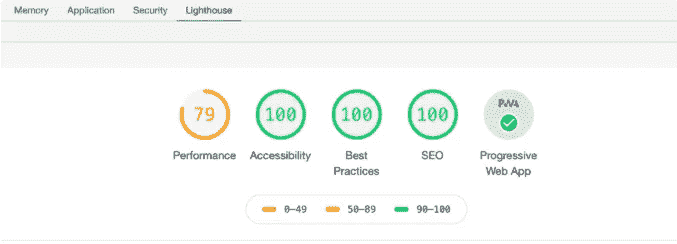

# 更好的开发者组合的 7 个重要提示

> 原文：<https://javascript.plainenglish.io/7-important-tips-for-a-better-developer-portfolio-964589aa4aa5?source=collection_archive---------12----------------------->

## 构建开发人员组合时需要考虑的事情。

Photo by [Olia Danilevich](https://www.pexels.com/fr-fr/@olia-danilevich) on [Pexels](https://www.pexels.com/).

许多开发人员创建他们自己的组合网站，作为展示他们的技能、他们参与的项目和他们的经验的一种方式。这是向客户和招聘人员证明你作为开发人员的能力的好方法。

虽然，在我看来，建立一个令人印象深刻的投资组合并不容易。有很多事情你需要考虑，以使一个坚实的投资组合看起来专业，转换，给你机会。

在这篇文章中，我们会给你一些重要的提示，你需要遵循这些提示来制作一个更好的开发者作品集。所以让我们开始吧。

# 1.遵循用户界面和 UX 规则

作为一名 web 开发人员或软件开发人员，你必须至少了解一点 UI 和 UX 的基础知识。当你想建立自己的作品集网站时，你必须创建一个简单好看的用户界面，并提供良好的用户体验。

我建议在编码之前，在 Figma 或 Adobe XD 等设计工具上设计作品集。此外，如果你不擅长设计，可以从 Behance 和 Dribble 等设计平台获得灵感。这很有用，因为当你编码的时候，你会对投资组合的结构有一个概念。

除此之外，投资组合需要是像样的，因为它是招聘人员/客户对你的服务感兴趣时的第一个项目。因此，如果你想做一个好的像样的投资组合，遵循用户界面和 UX 的基本原则是非常重要的。

# 2.让它简单和最小化

少即是多。你不需要做一个有很多创意的复杂投资组合。你只需要一个简单的外观和功能的网站，展示你作为一个开发者的激情和能力。所以总是建议尽可能简单，尤其是如果你是初学者。

尽量少用，最多用三种颜色和两种字体。你不需要疯狂的动画，因为这只是另一种方式来减缓你的网站。当人们访问你的投资组合时，他们的主要目的是更多地了解你、你的技能和你的项目。就是这样。

# 3.性能和可访问性

在构建任何类型的网站时，性能和可访问性是你必须始终考虑的两个重要因素。用户不会等待超过 3 秒来加载你的网站，这是一个糟糕的用户体验。因此，总是减少图片的大小和延迟加载它们，使用网络捆绑器来缩小你的文件，并做任何其他可以提高你的投资组合的表现的步骤。

除此之外，您的作品集需要对所有用户都是可访问的，这样即使是残疾人也可以使用它。如果对你来说是新的，我鼓励你学习更多关于网页可访问性的知识。

顺便说一句，你可以使用一个名为 Lighthouse 的谷歌 Chrome 工具，你可以在开发工具上找到它。它允许你测试你的网站的性能，可访问性，搜索引擎优化，等等。

Capture by author.

# 4.为项目部分执行此操作

当谈到项目部分时，我建议把它放在主页部分之后，这样人们可以很容易地看到你的项目。拥有自己构建的*独特的*项目也很重要，所以不要从教程和课程中复制项目，除非你愿意定制并使它们独特。

另一件重要的事情是谈论项目(添加描述)并添加每个项目使用的技术。这有助于让你的客户和招聘人员了解你参与过的项目。

除此之外，如果可能的话，你还需要让用户能够看到你的项目以及代码的现场演示。

# 5.避免带百分比的技能栏

我看到很多开发人员在他们的作品集的技能部分增加了技能栏。比如他们做一个 JavaScript 技能栏，说自己懂 90%的 JavaScript。我不知道他们这么说是什么意思，但这不重要。

人们会注意到，通过检查你的项目，你真的了解一门语言或一项技术，而不是通过看到一个 90%的技能栏。所以我会建议避免那些带百分比的进度技能条。

# 6.容易接触

另一个重要的建议是让客户和招聘人员更容易联系到你。制作一个简单的联系表格，并在页眉和页脚添加社交链接。

所以只要让别人更容易联系到你就行了。这才是重要的。

# 7.获取自定义域名

如果你想向你的客户和招聘人员展示你的专业性，为你的作品集获得一个自定义域名总是很重要的。有了域名，人们会知道你是认真和专业的。

对于其他项目，我觉得没必要每个项目都弄个域名。因此，如果您为您的投资组合获得一个自定义域名，这就足够了。

# 结论

正如你所看到的，如果你想有一个更好的投资组合，增加你被录用为开发人员的机会，这些技巧是非常重要的。

感谢您阅读这篇文章。希望你觉得有用。

**延伸阅读**

 [## 您可以将 5 个 JavaScript 项目添加到您的投资组合中

### 您可以使用 JavaScript 构建出色的项目。

javascript.plainenglish.io](/5-javascript-projects-you-can-add-to-your-portfolio-e07f0d668d25) 

*更多内容尽在*[***plain English . io***](https://plainenglish.io/)