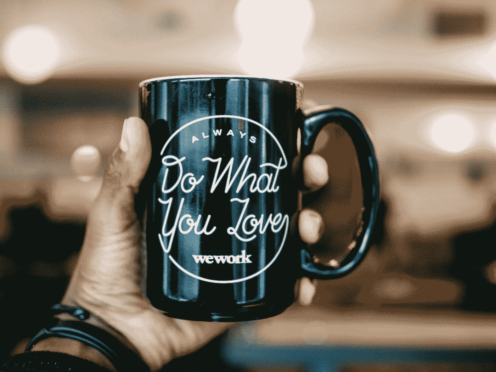
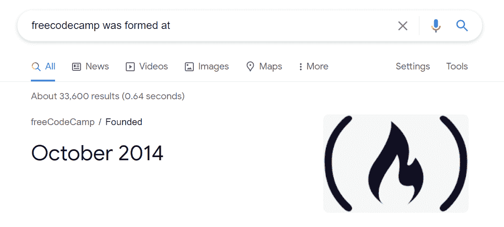

# 7 个教训大多数开发人员都经历了惨痛的教训

> 原文：<https://javascript.plainenglish.io/7-lessons-most-developers-learn-the-hard-way-be9d53b5686c?source=collection_archive---------17----------------------->

## 激励有助于提高工作效率，带来更好的结果。

Photo by [Patrick Malleret](https://unsplash.com/@pmalleret?utm_source=medium&utm_medium=referral) on [Unsplash](https://unsplash.com?utm_source=medium&utm_medium=referral)

我们都知道 Covid，因为它影响了我们所有人的生活。这还不是结束，我们还可能在未来面临许多更糟的情况。与此相反，我们都希望[赚钱](/5-ways-to-earn-money-as-a-developer-1e42e694a078)谋生，或者[想创业](https://medium.com/code-blog/how-to-start-your-business-today-and-earn-b52bd1d94ceb)。

根据[统计](https://www.statista.com/statistics/235494/new-entrepreneurial-businesses-in-the-us/)，2020 年 3 月，仅在美国就有 804398 家企业成立不到一年。

另一项调查显示，大多数企业在一年内倒闭，员工失业，诸如此类。

而我们呢，我们学一门技能，比如 [Web 开发](https://medium.com/code-blog/getting-started-and-earning-105-813-yr-as-a-web-developer-for-beginners-19b2cd26fcc2)。在 Upwork 上创建个人资料，申请工作，启动我们的数字代理，以及其他大量的事情。

结果是什么，我们连谋生的钱都赚不到。

然后我们转向学习不同的技能，如 [React Native App 开发](/getting-started-with-react-native-for-beginners-958d39fee16a)，数据科学家[，人工智能](https://medium.com/dev-genius/introduction-to-artificial-intelligence-the-future-5ed6f26d0578)等。

我们参加 Udemy、Coursera 的课程，或者参加免费课程。并开始学习新技术。

Source: Giphy

我们花了几个星期，之后，我们感到沮丧。购买其他课程或离开编码，等等。

现在，结果是什么？完全没有。

那么尼廷我们要做的是。

我的朋友们，你们缺乏关键的策略，在这里我将帮助你们。

# 1.做你喜欢的事

Photo by [Charles Etoroma](https://unsplash.com/@charlesetoroma?utm_source=medium&utm_medium=referral) on [Unsplash](https://unsplash.com?utm_source=medium&utm_medium=referral)

企业失败的一个主要原因是我们专注于自己不喜欢的各种技能。我们不能一辈子都掌握这种技能。

因此，我们根据这种技能学习了许多课程，并在一段时间后离开。

千万别这么做。

想想你爱的是什么？花几天时间考虑一下。是的，这需要时间，但这是你的未来，所以花点时间在这上面。

# 2.从一个目标开始

Photo by [Markus Winkler](https://unsplash.com/@markuswinkler?utm_source=medium&utm_medium=referral) on [Unsplash](https://unsplash.com?utm_source=medium&utm_medium=referral)

> 你的目标应该是非常大的，你必须做任何事情来实现它。

在我们的地球上，每个人都想挣钱。也许是为了自己，为了家人，或者某个特定的事业。

你呢？为什么要挣钱？

想想吧。

就问问自己？

你的目标应该是非常大的，你必须做任何事情来实现它。

# 3.明智地选择

Source: Pexels

我将用一个例子来解释它。

假设你想成为一名开发者。你会遇到各种各样的技能，比如 Web 开发、应用程序开发、软件开发、程序员、机器学习、人工智能、数据科学、网络安全等等。

相信我，开发人员很难选择一项特定的技能。

而其他人最初选择随机技能。如果他们得不到任何结果，他们就离开。并转移到其他方面。

尼廷，我们如何选择我们的技能？再读一遍第一点和第二点，即做你喜欢的事情，从一个目标开始。

# 4.保持一致

Photo by [Icons8 team](https://unsplash.com/@icons8?utm_source=medium&utm_medium=referral) on [Unsplash](https://unsplash.com?utm_source=medium&utm_medium=referral)

我是一个 MERN 栈网站开发人员，我学习它有 2 年了。是的，当我天真的时候，我转移到不同的技能——基于糟糕的结果。

但是我知道这需要时间。

所以不要试图一次学习多种技能。始终保持一致。

这会浪费你的时间，你也无法掌握任何技能。

# 5.享受你的成功

Photo by [Mitchell Orr](https://unsplash.com/@mitchorr?utm_source=medium&utm_medium=referral) on [Unsplash](https://unsplash.com?utm_source=medium&utm_medium=referral)

很多时候我们感到心灰意冷，想翘课或者想马上挣钱。

而这时候我们一直忽略我们小小的成功。

当我刚接触 Web 开发时，我一直拿自己和昆西·拉森比较。

但是当我研究他的时候，我知道这是我最大的错误。

谷歌称，freeCodeCamp 成立于 2014 年 10 月。他花了很长时间才成功，而且他的想法很棒。

Source: Google

所以这背后最主要的动机就是不要拿自己和别人比。开始享受你小小的成功，这会帮助你激励自己。

我在 Medium 上写了 6 个月，但我并不喜欢它。我得到了 150 多个追随者，但我也失去了动力。

freeCodeCamp 接受我成为作家，这是一个不可思议的时刻，但我从未享受过。

所以我缺少一些东西，我从一本书上学会了享受你的小成功。

从那时起，我享受每一天。

当我在 freeCodeCamp 上写了第一篇文章，编辑团队接受了我。我去了附近的一家酒店庆祝成功。

# 6.激励自己

Photo by [Priscilla Du Preez](https://unsplash.com/@priscilladupreez?utm_source=medium&utm_medium=referral) on [Unsplash](https://unsplash.com?utm_source=medium&utm_medium=referral)

当我学习 Web 开发时，有一段时间我没有动力。学习 HTML、CSS、JavaScript、Bootstrap、jQuery、React.js、Node.js、Express、MongoDB、Mongoose、EJS、Heroku、Git、GitHub 等等。

有趣的是，今天我知道了上面提到的每一个概念。

这是因为当技术威胁到我的时候，我会花一些时间和家人在一起。

同样的道理也适用于你的生活。

当你被工作压得喘不过气时。花些时间和你的家人、朋友在一起。出去旅游，吃自己喜欢的东西，看书等等。

它真的能让你放松，让你变得坚强。

# 7.学会实施

Photo by [sean Kong](https://unsplash.com/@seankkkkkkkkkkkkkk?utm_source=medium&utm_medium=referral) on [Unsplash](https://unsplash.com?utm_source=medium&utm_medium=referral)

我写过一篇关于[如何完整消化一本书，增加你的智力](https://medium.com/illumination/how-to-digest-books-completely-and-increase-your-intelligence-ddecc60091cf)的帖子。在这里我解释了如何在你的生活中通过读书来实现它。

同样的概念也适用于此。当你学到一些东西时，它可能是任何东西，你必须实现它。

> 学会应用，学会实施，学会解决问题，学会应用。

总是渴望了解更多新技术。但是在一个特定的领域工作，掌握它，执行它，然后如果还有时间，挖掘另一个领域。

# 结论

给自己一个鼓励，你已经学会了各种可能会浪费你时间的策略。

学习和实施真的很难，但你已经从中学到了一些东西。

恭喜你。

我希望这些想法对你有用。

谢了。

*更多内容看*[***plain English . io***](https://plainenglish.io/)