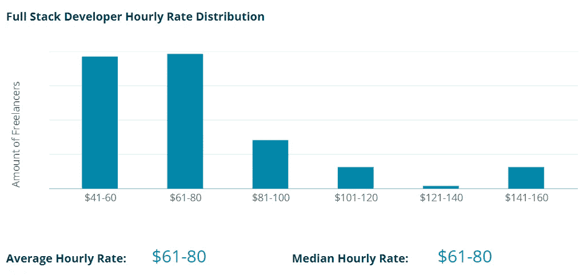
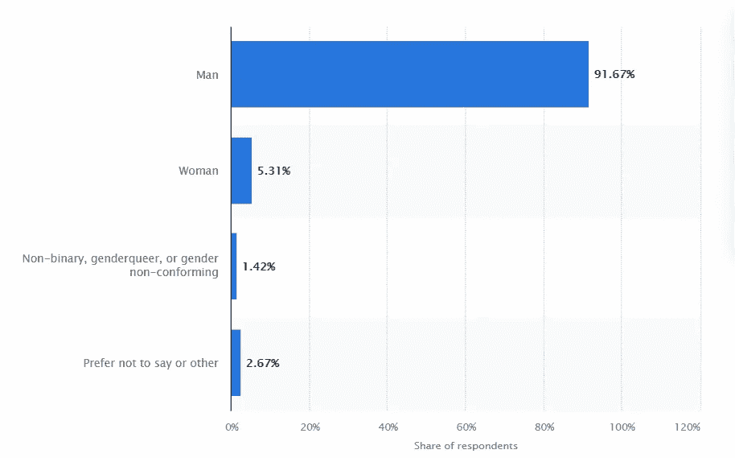

# 大多数人对程序员的 7 个误解

> 原文：<https://javascript.plainenglish.io/7-misconceptions-most-people-have-about-programmers-d6bddf7214b6?source=collection_archive---------10----------------------->

## 2.我们不免费工作。

Photo by [Jonas Leupe](https://unsplash.com/@jonasleupe?utm_source=unsplash&utm_medium=referral&utm_content=creditCopyText) on [Unsplash](https://unsplash.com/s/photos/big-desk?utm_source=unsplash&utm_medium=referral&utm_content=creditCopyText)

我不知道你怎么想，但是我已经厌倦了人们让我解决他们的互联网或打印机问题。

我发现，当我和别人谈论我的工作时，他们要么从未听说过，要么就自动认为我是来解决他们的电脑问题的。

当我开始成为一名程序员时，我不知道有多少人对这个职业一无所知。各行各业都有很多误解，在这个领域呆得够久了，我想是时候让人们知道真相了。

在这篇文章中，我将分享大多数人对程序员的 7 个误解。

我们开始吧！

# 1.软件！=硬件

如果每次我被要求帮助我的一个同事或朋友解决他们的计算机问题时，我都有一枚镍币，那么，你明白了。

这可能是对程序员最大的误解之一，让我简直要疯了。当然，我比一般人更了解电脑，但是如果有人经历了黑屏，需要快速诊断，他们可能最好谷歌一下。

很多人倾向于将软件开发人员和技术支持混淆，但是他们是两种完全不同的工作。软件开发人员构建*软件应用*就像你正在阅读这篇文章的那个。技术支持专业人员倾向于处理与计算机网络和/或计算机硬件问题直接相关的问题。

虽然它们都在“IT”的保护伞下，但它们不是一回事，而且不是我们所有人都像**那样熟悉电脑硬件。这就是专业人士的工作。**

# *2.我们不免费工作*

*关于程序员的另一个巨大的误解是，我们免费工作，或者接受报酬过低。如果我们不能为我们的客户提供免费的应用程序，那么成为一名程序员还有什么意义呢，对吗？*

*看，我们中的许多人可能已经花了很多钱去学校获得学位，或者购买在线课程。我知道有些人可能会说，承担学生贷款的负担是我们的决定，他们没有错。问题是，大多数公司都需要某种程度的学位才有资格被录用。*

*这项调查显示，在 2020 年，大约 75%的程序员至少获得了相当于学士学位或更高的学位。这意味着我们许多开发人员都有某种债务，并希望从我们的工作中获得报酬。*

*这里只是快速浏览一下人们对典型编程速率的预期。*

**

*codementor.io Full Stack Developer Hourly Rate Distribution*

*最终，程序员应该被看作是对你企业的一种投资，而不是一种快速的施舍。*

# *3.我们不是什么都知道*

*相信我，如果我有一本关于成为终极程序员的黄金剧本，我早就写好了。我们都会从中受益。*

*满足你所有的商业愿望是不可能的，除非你的团队全部由谷歌开发人员组成(对 FAANG devs 的误解)。*

*软件一直在发展。概念和方法在不断变化。这意味着，作为程序员，我们总是试图跟上时代，这样我们才不会变得陈旧过时。因此，我们不会总是知道所有该知道的事情。*

*虽然你可以要求我们想出下一个最好的人工智能程序，但要知道这不太可能发生，除非我们已经在那个领域有专长。*

# *4.不是所有人都是伟大的程序员*

*在你打倒我之前，先听我说几句。*

*我认为有一种误解，认为所有的程序员都被看作是这群人中的精英，但我确信我们都认识一两个程序员，这让我们开始怀疑他们是如何做到这一点的。*

*我们都是从程序员新手开始的，我们都在生活中的某个时刻与编码作斗争。这并不意味着我们不能在未来有充足的时间和经验的情况下最终成为伟大的程序员。*

*我绝不是例外。见鬼，我和一群其他程序员一起毕业，他们可以围着我转，但是我的朋友和我的工作场所对我有误解。在你妄下结论之前，让我先证明我的价值。*

# *5.应用程序不是一天建成的*

*很多时候，我被问及某个项目需要多长时间，大多数情况下，我得到的回答是，“那么最多一周？”。*

*有些人有这样的误解，他们要求开发的网站或应用程序会比实际花费更少的时间。一些公司也面临这样的问题。*

*如果你是一个自由开发者，甚至是一个全栈开发者，你可能非常了解这种感觉。问题是，我们在一个给定的时间里只能做这么多。根据项目的复杂程度，它可能比我们的客户想要的时间要长。*

*这不是因为我们试图榨干我们客户的钱包，而是因为我们关心我们的工艺，希望它尽善尽美，问题最少。所以耐心点，你不会后悔的。*

# *6.我们不常出去*

*我的意思是，当然，我是一个相当内向的人，有时我只是喜欢呆在家里，但这并不意味着我不喜欢偶尔冒险。如果这不是真的，生活会怎样？*

*关于程序员的另一个误解是，我们整天呆在家里盯着屏幕，但是相信我，这与事实相差甚远。我的大多数编程朋友都在不断发布他们最近出国旅行的图片，或者是城市中下一个值得参观的最佳酿酒厂的图片。*

*老实说，整天呆在电脑前让我筋疲力尽，我喜欢下班后出去放松一下。另外，呼吸新鲜空气真的有助于清醒头脑，非常提神。*

*所以，是的，我们知道天空中那个亮橙色的东西是什么，不，我们不是现代的吸血鬼。*

# *7.编程是男人的事*

*几年前我上大学的时候，我班上大约 98%的学生都是男生。偶尔会有一些女学生，但除此之外，都是男性占主导地位。*

*这些年来，通过团体项目，我认识了几个女同学，让我告诉你，她们不是好惹的。这些女士们知道她们的东西。*

*来自 Statista 的统计数据显示，2021 年，全球 5.3%的软件开发人员是女性，比几年前增加了几个百分点。*

**

*Statista Software developer gender distribution worldwide as of 2021*

*这意味着每年都有越来越多的女性成为程序员，我欣然接受！*

*女性在软件行业越来越受关注，人们需要知道编程不仅仅是男人的事。偶尔在这里得到不仅仅是男人的观点是有好处的。*

# *结论*

*这就是了。我已经和你分享了 7 个我认为大多数人对程序员最大的误解。*

*是的，我们很多人确实生活在屏幕之外，我们不会给任何想要的人免费的施舍。并不是所有人都擅长编程，但这并不是说我们不能做到。*

*如果你给我们时间，我们将确保你的网站/应用程序是你所要求的一切，但知道可能有一些功能，我们只是不能简单地实施。*

*最后，如果你的电脑有问题，一定要记得咨询当地的技术支持专家。*

*感谢您的阅读。*

**更多内容尽在*[***plain English . io***](http://plainenglish.io)*