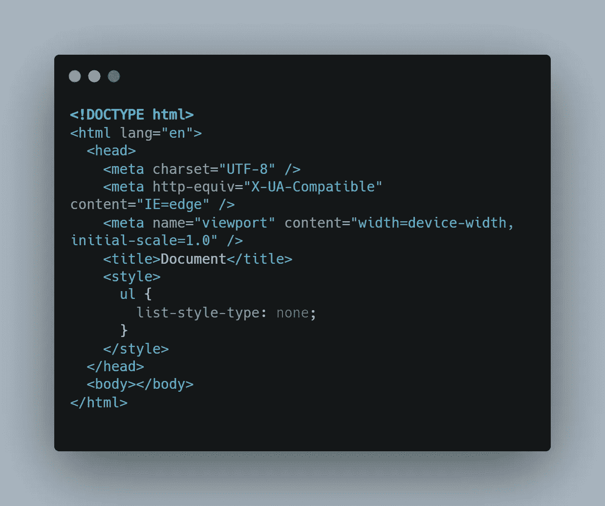
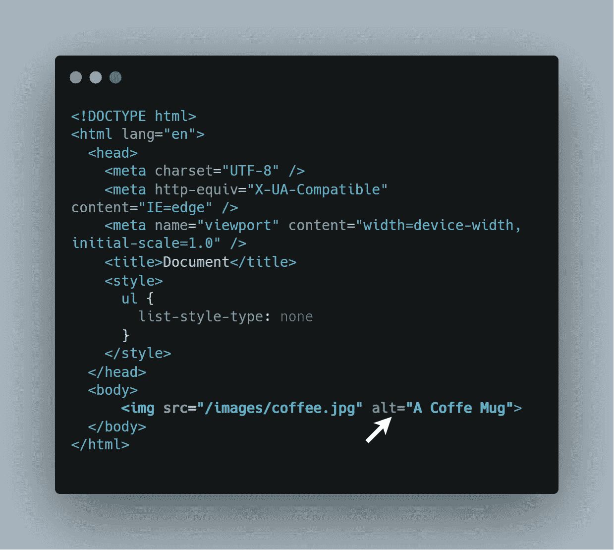
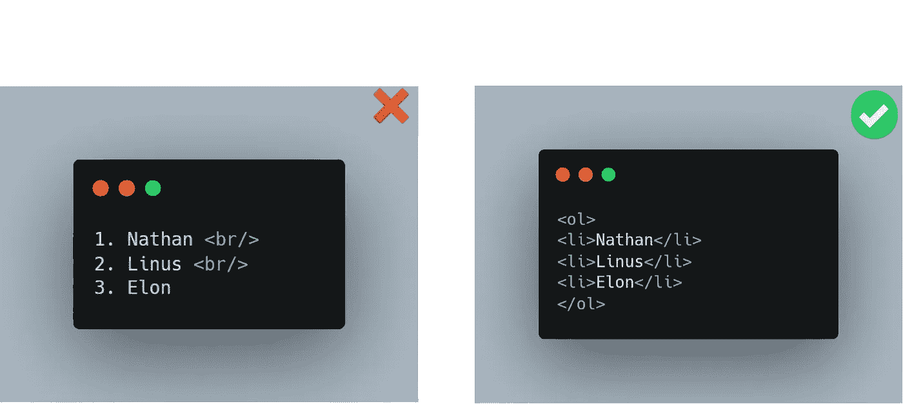
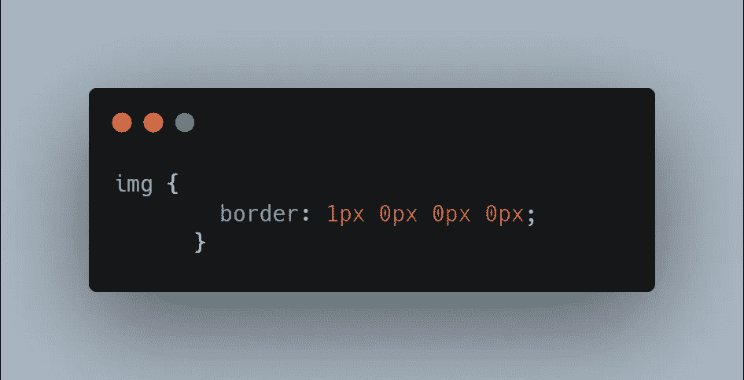
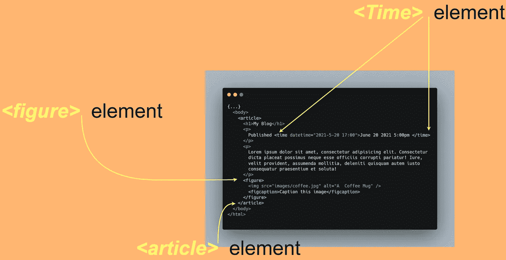

# 初学 HTML 时你会犯的 7 个错误

> 原文：<https://javascript.plainenglish.io/7-mistakes-you-are-making-as-a-beginner-in-html-e65ca41ad598?source=collection_archive---------11----------------------->

你应该知道的 HTML 错误

## 1.根据标题的大小使用标题

你一定很熟悉 HTML 中的标题，我们有 ***H1、H2、H3 等*** ，但是很多时候人们是根据大小来使用标题的。这导致了你的网站中最重要的东西的糟糕的层次结构。**例如**，当搜索引擎查找标题时，他们会查找 H1、H2、H3 等元素的层级，如果你在网站的副标题中使用 H3 元素，会导致糟糕的搜索结果。

*   简而言之，如果你想让你的网站出现在搜索引擎的顶部结果中，根据大小使用标题是你应该避免的。

## 2.不正确的文档类型

它告诉 Web 浏览器你在你的网页上使用的是什么版本的 HTML，所以一定要确保 DOCTYPE 总是在你的 HTML 代码的第一行。

## 3.使用不支持的标签或属性

开发人员有时会使用 HTML 标准不支持的标签，如果您没有检查 HTML 代码中不支持的标签和属性，那么您只是增加了网站崩溃的几率。

*   为了确保你的 HTML 代码中所有的标签和属性都是好的，你可以使用 W3C 的 HTML 验证器**上传你的源代码并检查错误和其他开发者经常犯的错误。**

## 4.不使用替代文本

假设你有一个用 HTML 构建的漂亮网站，但是你忘记了 ALT 文本，你的网站看起来被压扁了，如果客户端的网络不好，会给用户带来不好的体验。

*   此外，视障用户会多次使用文本到语音转换功能，如果您没有在图像中提供替代文本，他们将很难知道哪里出了问题。

## 5.使用换行符显示列表

不要在你的网站中使用换行符来显示项目列表或蚂蚁数据，因为你的 HTML 代码需要处理更多的元素，这会降低网站的速度。你应该使用一个**无序列表** *<李>* 或者**有序列表***< ol >标签来代替。*

## 6.使用 0px 而不是 0

在设计 HTML 元素的样式时，人们有时会使用 **0px** 值，这是完全不必要的，因为你会毫无理由地增加文件的大小。

**Dont Use 0px**

## 7.到处使用 div 和 spans

在 HTML 5 中，我们介绍了语义元素，它们可以在搜索结果中轻松提升你的网站。开发者仍然没有使用 **<文章><图><标记><时间>** 等语义元素来编写可维护性更强、可读性更高的 HTML。

*   请注意，使用 **div** 和 spans 没有任何关系，因为它们工作得非常好。但是，比如说，在一篇博客文章中，我们必须定义**图像、** **日期、**和其他主要内容，在 divs 和 span 中写所有这些内容很容易在将来使你困惑。

但是有了语义元素，你就有了一种更清晰的方式来编写 HTML。

 [## 你需要知道的 Git 的 5 个未知特性

### 你绝不能错过的 Git 特性

javascript.plainenglish.io](/5-unkown-features-of-git-you-need-to-know-99a40bb3622d)  [## 提高 CSS 性能的 5 种优化技术

### 构建突出的前端应用程序

javascript.plainenglish.io](/5-optimization-techniques-that-will-boost-your-css-performance-c16ad808d32e)  [## 3 个隐藏的 CSS 功能

### 对前端开发者有用的 CSS 特性

javascript.plainenglish.io](/3-hidden-features-of-css-566e8c27597f) 

*更多内容请看*[*plain English . io*](http://plainenglish.io/)