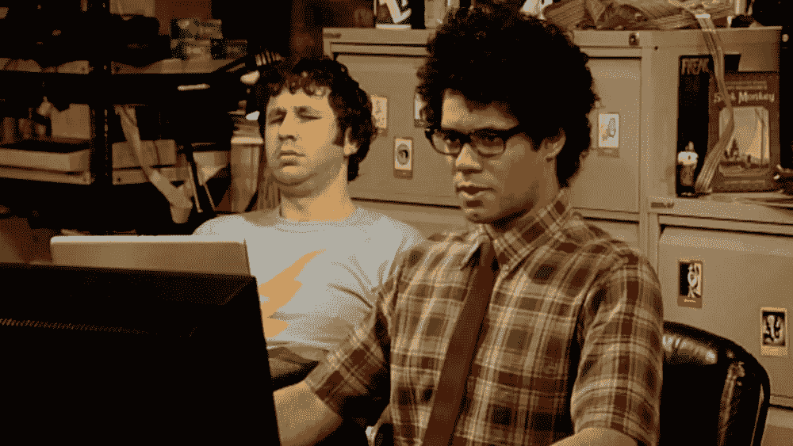

# 每个程序员必看的 7 部电视节目

> 原文：<https://javascript.plainenglish.io/7-must-watch-tv-shows-for-every-programmer-fcda8491f036?source=collection_archive---------5----------------------->

## 我会推荐每个程序员观看的电视节目。

Photo by [Tech Daily](https://unsplash.com/@techdailyca?utm_source=medium&utm_medium=referral) on [Unsplash](https://unsplash.com?utm_source=medium&utm_medium=referral)

编程有时会让人不知所措，有时会出故障，有时会到处修补。也许这对你来说是一个警钟，让你休息一会儿，通过一些节目电影来给你的大脑注入活力。

这些电影清晰而真实地描述了作为一名程序员和解决问题需要做些什么。他们中的一些人虽然没有多少虚构，但往往掩盖了拥有程序员标签的障碍的本质。

这些电影中的大多数都很好地描述了称自己为程序员需要什么。

在这篇文章中，我们将会看到一些最好的电影和电视节目，作为一个程序员，你需要去看看。

## 1.机器人先生

Image from [CNN](https://www.google.com/url?sa=i&url=https%3A%2F%2Fwww.cnn.com%2F2019%2F12%2F22%2Fentertainment%2Fmr-robot-finale%2Findex.html&psig=AOvVaw0yB7qZd4N4F_PbHPBiVkR8&ust=1628251939845000&source=images&cd=vfe&ved=0CAwQjhxqFwoTCJC29K_tmfICFQAAAAAdAAAAABAE)

《机器人先生》是一部有趣的电影，有很多关于大多数程序员生活的美丽场景。这部电影讲述了一个白天做安全工程师，晚上做著名黑客的人的生活。

他被社会的不良面所淹没，并通过侵入一切他能侵入的东西来寻找杠杆。凭借娴熟的黑客技术，他可以隐藏自己的行踪而不被发现。

在他父亲工作的公司工作，结果导致了悲惨的死亡，为了他的父亲，他注定要摧毁同一个组织“邪恶集团”，并将公司绳之以法。

埃利奥特患有严重的毒瘾，并尽一切努力向任何人隐瞒这一点，包括侵入医疗保健系统以改变信息，并总是同情那些不认真对待自己工作的安全专家，以确保像他这样的人不会渗透到系统中。

他的社交生活也很忙碌，似乎过着内向的生活。

机器人先生是任何程序员的必看节目。

## **2。启动**

Image from [TV time](https://www.google.com/url?sa=i&url=https%3A%2F%2Fwww.tvtime.com%2Fen%2Fshow%2F310614%2Frecommendations&psig=AOvVaw1f_RT6TlXaiP5MYs8F9cNh&ust=1628252080123000&source=images&cd=vfe&ved=0CAwQjhxqFwoTCMDg6PLtmfICFQAAAAAdAAAAABAO)

顾名思义，它包含了创建一家科技初创公司“Gen Coin”所需要的所有奋斗、快乐和压力。

《创业》描述了一位女士的生活，她痴迷于拥有一种不受任何政府和个人控制的分散货币。

她的激情在许多方面引导着她，她被从他男朋友的房子里踢了出来，搬回她父母那里，他在车库里安顿下来。

后来，一位投资者向他提供了一笔好交易，这位投资者肯定想把他踢出创业公司，自己经营整个创业公司。

简而言之，创业通常伴随着建立和发展创业所需的奋斗和障碍。最肯定是必看的。

## **3。硅谷**

Image from [Vulture](https://www.google.com/url?sa=i&url=https%3A%2F%2Fwww.vulture.com%2F2019%2F12%2Fsilicon-valley-recap-season-6-episode-6-russfest.html&psig=AOvVaw3PHFF4Dlv4WOdQKJ9lJI5O&ust=1628252306792000&source=images&cd=vfe&ved=0CAwQjhxqFwoTCICm9tzumfICFQAAAAAdAAAAABAh)

硅谷电视连续剧与《创业》非常相似，只是它包含了即将到来的年轻程序员所经历的事情。

从做他们的项目，被踢出合作，经营他们的副业和为黑客马拉松做贡献。这一切都在硅谷。

电视剧中也涵盖了许多关于程序员的旅程。还有，沿着电影的思路，你会注意到程序员是如何被各种公司拒绝的，他们是如何处理的等等。

一部精彩的电视连续剧。

## **4。IT 人群**

Image from [Variety](https://www.google.com/url?sa=i&url=https%3A%2F%2Fvariety.com%2F2017%2Ftv%2Fnews%2Fit-crowd-remake-nbc-graham-linehan-1202641831%2F&psig=AOvVaw0Zo5UpgoFzLN-Fq_EUOoC2&ust=1628252422132000&source=images&cd=vfe&ved=0CAwQjhxqFwoTCKiImZTvmfICFQAAAAAdAAAAABAD)

IT 人群也是我的科技喜剧系列。这部电影涵盖了与技术一起工作的各种元素和不幸，比如“它在我的电脑上工作——只是开玩笑——但它需要与技术互动和工作的喜剧部分。

无论你是设计师还是开发人员，我打赌你会看完这本书，然后笑得前仰后合。

## **5。黑镜**

Image from [TV Insider](https://www.google.com/url?sa=i&url=https%3A%2F%2Fwww.tvinsider.com%2F933674%2Fblack-mirror-season-6-delayed-charlie-brooker-netflix%2F&psig=AOvVaw3QoXmDrgY-gvuhscqonaHJ&ust=1628250302261000&source=images&cd=vfe&ved=0CAwQjhxqFwoTCKClzaHnmfICFQAAAAAdAAAAABAD)

《黑镜》是恐怖与科技的结合，它的科技元素让人看了非常愉快。

另一方面，它通常与当技术失去对我们双手的控制并开始控制我们时发生的事情有关。

它还包括像杀手机器人和增强现实这样的事情，当它变得比真实更真实时。

这部电影也促使我们相信未来会是什么样子，那时会有什么可能。

## **6。社交网络**

Image from [Wired](https://www.google.com/url?sa=i&url=https%3A%2F%2Fwww.wired.com%2Fstory%2Fsocial-network-right-all-along%2F&psig=AOvVaw2DGXNBf4UJtSyEOj2YI_sq&ust=1628251007082000&source=images&cd=vfe&ved=0CAwQjhxqFwoTCODFxuLvmfICFQAAAAAdAAAAABAD)

社交网络开始并调整他们的故事，类似于马克·扎克伯格所做的以及他如何建立社交网络巨头脸书。它也开始讲述如何从大学开始创业和产生想法等等。

> 脸书电视剧《社交网络》(The Social Network)上映仅 10 年多，但它仍然和以往一样有意义，因为我们确实处于互联网时代，社交媒体和科技巨头拥有巨大的市场影响力。安德鲁·伯格梅斯特的评论

## **7。社会困境**

Image from [The News Minute](https://www.google.com/url?sa=i&url=https%3A%2F%2Fwww.thenewsminute.com%2Farticle%2Fsocial-dilemma-revealing-documentary-social-media-trap-133209&psig=AOvVaw2cEGN0PmHkvcyd7ZGtX-zj&ust=1628252716472000&source=images&cd=vfe&ved=0CAwQjhxqFwoTCNj2xZ7wmfICFQAAAAAdAAAAABAD)

尽管这部电影还是在 2020 年上映的。它通常包含和谈论社交媒体对我们的影响。

它还揭示了这种社交网络对我们日常生活和幸福的潜在影响。

社交网络有让我们长时间呆在上面的趋势，因此会让我们无法专注于生活中意义重大的其他事情。

更像是他们以某种方式控制了我们。这通常会影响我们的日常生活。

如果你对此感兴趣，它值得你花时间。

## **结论**

感谢您抽出时间来观看这些精彩的电影。我希望你会像我一样对它们感兴趣。

如果你认为其他人可能会从这篇文章中受益，如果你分享出来，对我来说意义重大。

## **延伸阅读:**

 [## 如何提高你的学习和逃脱教程地狱

### 在学习的同时保持你的生产力。

javascript.plainenglish.io](/how-to-improve-your-learning-and-escape-tutorial-hell-8084b90158e2)  [## 获得第一份工作的 5 个关键前端开发技能

### 作为前端开发者脱颖而出。

javascript.plainenglish.io](/5-key-front-end-development-skills-to-land-your-first-job-74d18a22b4ef) 

*更多内容看*[***plain English . io***](http://plainenglish.io/)