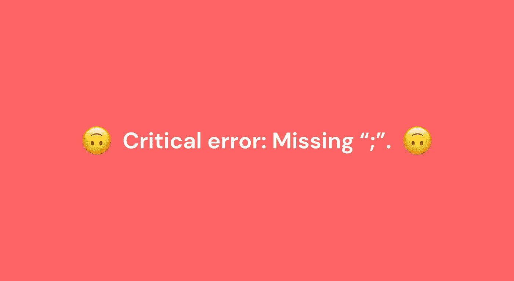
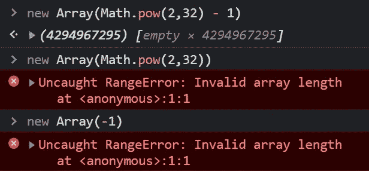
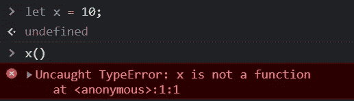

# JavaScript 中的 7 个原生错误

> 原文：<https://javascript.plainenglish.io/7-native-errors-in-javascript-39c0474ad1f2?source=collection_archive---------10----------------------->



一次又一次，你坐在 StackOverflow 前面，试图找出你的代码中到底发生了什么，为什么它不工作。这很令人沮丧，因为大多数时候，报告的问题并不总是立即清晰。这篇博文将帮助你下次使用 JavaScript 时更好地解决问题。我将介绍一些常见的 JavaScript 错误类型和它们的来源，我希望它能在将来帮助你更有效地调试代码。

> 我也有这篇文章的 youtube 版本，你可以在这里观看。

## **JS 中最常见的错误类型**

1.  评估错误
2.  范围误差
3.  参考错误
4.  语法错误
5.  类型错误
6.  URIError
7.  聚合错误

这些错误类型是浏览器返回的**对象**。因此，任何时候你得到一个属于这种类型的错误，你都可以使用这个错误对象的所有属性。由于这些错误继承了主**错误**对象的属性，您可能会看到它们之间的相似之处。Error 对象具有下列属性，您可以在应用程序中利用这些属性

*   消息—出现此错误时显示的消息。
*   名称—错误的名称/类型
*   您还会看到一些额外的属性，基于错误的类型，也基于您正在使用的浏览器。

## 1.评估错误

JavaScript 有这个全局 **eval()** 函数，它最初用于计算字符串形式的 JavaScript 语句/表达式。比如说，

```
eval('2 + 2') //  Output: 4
```

当你运行这个函数的时候，每当你得到一个错误，它会给你一个 **EvalError** 。现在，如果你有一些安全方面的经验，你会立即在这里看到一个**危险信号**。如果有人将恶意代码作为字符串传递到这个函数中，该怎么办？正如所料，它将由浏览器执行。因为 JavaScript 支持现成的字符串表达式求值，所以最好不要在任何项目中使用 eval 函数。

*在当前的 ECMAScript 规范中没有使用 EvalError，所以在大多数情况下，您不会遇到这个错误。但是为了向后兼容，仍然存在****eval error****对象。* [*MDN 字面意思告诉你不要用这个*](https://developer.mozilla.org/en-US/docs/Web/JavaScript/Reference/Global_Objects/eval#never_use_eval!) *。*

## 范围误差

每当您试图传入不在有效范围内的变量或参数时，都会得到一个 RangeError。JavaScript 对其所有数据成员都有限制。例如，假设您正在创建一个具有特定长度的数组。您可以为数组设置的最大元素数是 2 -1。但是在那之后，它超出了范围，你会得到一个 RangeError。如果你试图传入一个负值，它会给你同样的结果。



RangeError for Arrays

其他一些常见的 RangeError 实例可能是，

*   尝试获取浮点数中小数点后的 101 位(或更多)数字。

```
1.2345.toFixed(2)   //1.23
1.2345.toFixed(101) //RangeError
1.2345.toFixed(-1)  //RangeError
```

*   使用 **repeat()** 重复字符串超过特定范围

```
"abc".repeat(5)      //abcabcabcabcabc
"abc".repeat(2**28)  //RangeError
"abc".repeat(-1)     //RangeError
```

> 在 Chrome 中，如果你在一个无限循环中递归地运行一些东西，超出了调用栈的限制，你也会得到一个 RangeError。在 Firefox 或 Edge 的情况下，对于同一问题，您可能会得到不同的错误。

## **参考错误**

当你试图访问一个尚未声明的变量时，你会得到一个 ReferenceError。对于这种类型的错误，现在有一些注意事项，让我们简单地看一下。

```
function getName(){
   console.log("My name is " + name)  // "My name is undefined."
}getName();
var name = "Jack";
```

现在，如果你按照 ReferenceError 的定义，我们应该在这里得到一个错误，因为变量在声明之前被访问**。但是我们得到了想要的字符串，但是用“ **undefined** ”代替了名称变量。这是因为**吊装**造成的。[我已经在一个单独的视频中详细介绍了吊装，所以你可以查看一下](https://youtu.be/nnCykighqxI)。
但是基本上发生的是，整个文件首先经过一个**创建阶段**，其中所有的变量和函数都被 JS 引擎分配了一些内存。获取内存时的变量也被**赋予占位符值“未定义”**。所以在文件的实际执行过程中，它会有一个未定义的值，因此它不会抛出错误。**

现在，如果我对文件做一点小小的改动，

```
function getName(){
   console.log("My name is " + name)  // "My name is undefined."
}getName();
let name = "Jack";  //Changed the declaration from var to let
```

变量声明已从 **var 更改为 let。**现在如果我运行这个，我会得到一个变量名的引用错误。这会让你认为使用“ **let** 声明的变量没有被提升。但事实并非如此。它们也会被提升，但是它们的处理比 var 声明更严格。只有当一个“let 声明”被**完全初始化**时，你才能访问它们。所以，任何在 let name =" Jack "之前的代码都不能访问 name 变量。" **const** "声明也类似地工作。

这种错误的一些其他常见情况是，

*   未定义的变量
*   无效范围

```
const sayHello = () => {
   let name = "John";
   console.log("Hello " + name);
}
sayHello();
console.log(name);  //Reference error since name is inside a                                                    function scope
```

## 类型错误

每当变量/参数不是有效(预期的)类型时，JS 引擎都会抛出 TypeError。例如，尝试定义一个值为 10 的变量 x。如果你像调用函数一样调用它，你会得到一个类型错误。



这种情况，加上语法错误，是很常见的。如果您创建的函数的名称已经用于文件中的变量或对象，您也会得到这个错误。其他一些常见的例子有

*   尝试迭代不可迭代的元素(如变量)

```
let x = 10;
x.map(val => return true)  //Error: map() is only for iterables
```

*   尝试编辑只读属性
*   尝试在非字符串元素上调用类似 toUpperCase/toLowerCase 的字符串方法。
*   试图重新分配常量声明。

## URIError

当某个全局 URI 处理函数(decode URI、endcodeURI、encodeURIComponent、decodeURIComponent)使用不当时，会出现此错误。

encodeURI 用一个、两个、三个或四个表示字符的 UTF-8 编码的转义序列替换某些字符的每个实例。所以如果你试图编码一个无效的序列，你会得到这个错误。在解码 URI 的例子中，如果你传入一个畸形的 URI，它会给你这个错误。

我个人从未遇到过与 URI 相关的错误。所以我假设大多数开发人员都是这种情况，但是如果您正在开发特定的 URI 编码/解码相关的应用程序，您可能希望深入了解它们。

## 语法错误

当您编写语法不正确的代码时，就会触发这种类型的错误。无论何时运行一段代码，JavaScript 引擎都必须将这段代码转换成机器可以理解的格式。

*   它将首先分解您的代码，并从中创建单独的令牌。例如“让 x = 10”将被标记化为"**让"**，" **x"** ，" **="** ，" **10"** ，"**"**。
*   之后，它会将这些标记解析成一个树状结构，称为抽象语法树，这是一个更规范的代码表示。有一个在线工具，叫做 [AST Explorer](https://astexplorer.net/) ，可以让你查看代码的 AST 版本。

在解析阶段，如果 JS 引擎发现任何不符合其语法的标记，它将抛出一个 SyntaxError。这种错误的例子不胜枚举，但是我们将会看到一些常见的错误

*   尝试使用保留的关键字作为标识符

```
let var = 10; // Error; var is reserved for variable declarations
```

*   将无效字符串解析为 JSON。

```
JSON.parse('{foo: 1}'); //Invalid string -> JSON
JSON.parse('{"foo": 1}'); // Valid
```

*   缺少或尾随逗号、括号、圆括号
*   不被立即调用的无名函数

```
function () { return 'Hello world';} //invalid
(function () {})(); //valid
```

*   未初始化的常量声明

```
const VALUE; //Error
```

*   将测试相等性的“==”与用于赋值的“=”互换

很明显，有很多方法可以犯语法错误。这些错误对象提供的大多数消息都非常简单明了，因此解决它们不是问题。

## 聚合错误

AggregateError 基本上是包装在单个错误中的一堆错误。因此，每当一个操作报告多个错误时，就会返回这个错误。最好的例子就是当你在一个“Promise.any()”中传递多个承诺时，所有这些承诺都被拒绝。您将获得一个 AggregateError，其中实际上是通过数组传递的错误。

```
Promise.any([
  Promise.reject(new Error("Error 1")),
  Promise.reject(new Error("Error 2")),
  Promise.reject(new Error("Error 3"))
]).catch(e => {
  console.log(e.name);        //"AggregateError"
  console.log(e.errors);      //[ Error: "Error 1", Error: "Error 2", Error : "Error 3"]
});
```

## 结论

这些是一些最常见的本机错误，您可能会经常看到。我希望这有助于您未来的调试工作。如果你认为我可能遗漏了什么，请随意添加到这个列表中。

如果你对这篇文章或其他任何东西有任何问题，你可以把它放在评论中，或者你可以在下面提到的我的社交网站上给我发一个 DM。干杯！

[LinkedIn](https://www.linkedin.com/in/akilesh-rao-610357137/)
TwitterT5[Github](https://github.com/AkileshRao)

*更多内容请看*[***plain English . io***](http://plainenglish.io/)