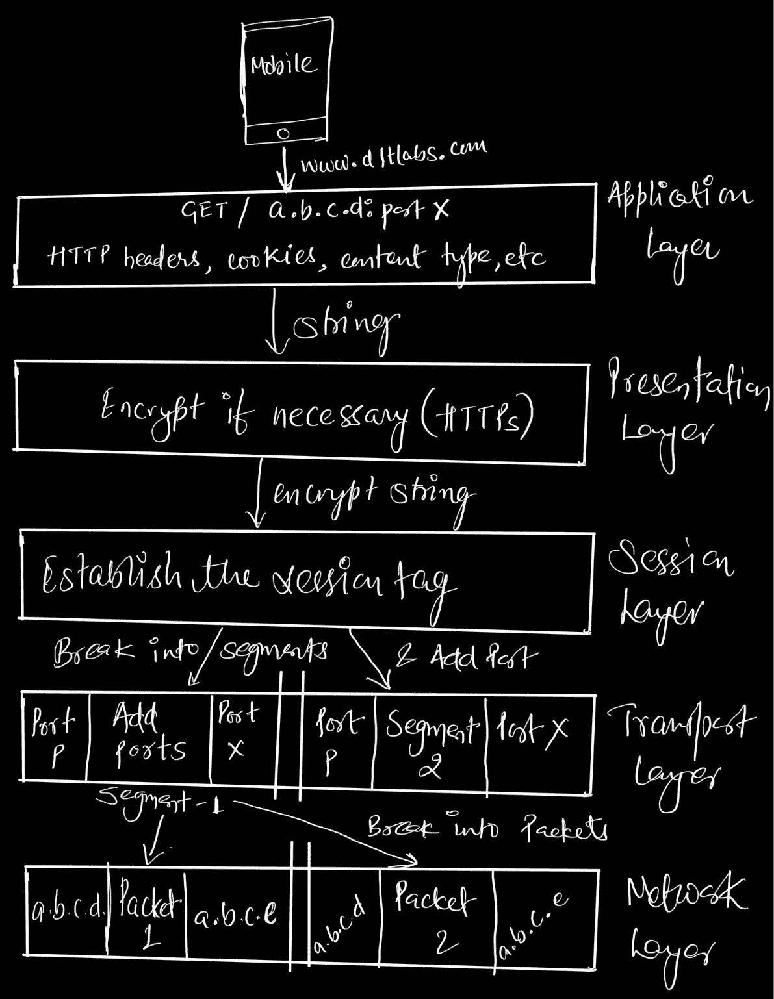

# 每个开发人员都应该知道的 7 个 OSI 层

> 原文：<https://javascript.plainenglish.io/7-osi-layers-that-every-developer-should-know-about-9c45a890efd0?source=collection_archive---------10----------------------->

Photo by [Nubelson Fernandes](https://unsplash.com/@nublson?utm_source=medium&utm_medium=referral) on [Unsplash](https://unsplash.com?utm_source=medium&utm_medium=referral)

## 什么是 OSI 模型？

OSI 代表开放系统互连，它是一种告诉我们应用程序如何通过网络进行通信的模型。

好吧，这是我们在工程课上读到的书生气定义(相当无聊，是的，同样的感觉)。那跟开发者有什么关系，为什么大家都要知道？

让我们以你为例，用你的手机在网上搜索任何东西。那么首先会发生什么？您的搜索页面将会打开。绝对的，是的，但是中间发生了很多你不知道的事情。作为一个普通用户，你不需要知道但是从一个开发者的角度来看，你应该知道这个机制。猜猜中间发生了什么？没什么特别的，但这 7 个 OSI 层表演他们的魔术，我们将看到它是如何发生的。

假设你在手机 M1 到服务器 C1 上搜索 https://www.linkedin.com/in/arshad404/。让我们一步一步地看看每一层的作用和工作原理。

## **应用层**

当您搜索任何内容时，首先进入画面的是应用层，它保存的是您的请求、请求类型、IP 地址、端口、HTTP 头、cookies 等。所有内容都存储为一个简单的字符串。

## **表示层**

这是可选的，也就是说如果需要加密来自应用层的字符串，我们就加密。如果连接是 HTTPS，那么就不需要这个表示层。

## **会话层**

然后，加密的字符串进入会话层，在会话层中，它将会话标记附加到您的数据上。因为对于给定的 web 服务器，最多可以有 7 个 TCP 连接，并且所有连接中的所有内容都是相同的，但是有不同的会话 id 来区分每个请求。

## **传输层**

在这一层中，您的数据被分成数据段，目的端口和源端口被添加到每个数据段中。因此服务器(发送请求的服务器)很容易识别该请求。

## **网络层**

当数据段到达传输层时，传输层会将每个数据段分成数据包，并将目的 IP 和源 IP 附加到每个数据包上，这是为什么呢？因为与服务器识别/丢弃数据包的原因相同。

## **数据链路层**

现在数据包将到达数据链路层，但仍然有一些东西丢失了，你们能识别出来吗？是的，你是对的。我们的数据包中缺少 MAC 地址。因此，当数据包到达数据链路层时，它会进一步分成帧，并将目的地和源的 MAC 地址附加到每个帧上。在 ARP(地址解析协议)的帮助下，它将 IP 地址转换为 MAC 地址。

## **物理层**

这是 OSI 模型的第一层或最后一层；在这里，你的数据包被转换成二进制的 0 和 1，然后发送到服务器。所有服务器都接收这些数据包，但只有与

*   mac 地址
*   国际电脑互联网地址
*   通道数
*   会话 Id

接收此数据包，所有其他数据包丢弃此请求，并以反向方式向用户发送数据，就像我们上面所做的反向工程一样。

别忘了鼓掌。；)

我很乐意和你们联系，在这里和我联系—

推特:【https://twitter.com/xByZero 

领英:【https://www.linkedin.com/in/arshad404/ 

来源:

1.  [https://en.wikipedia.org/wiki/OSI_model](https://en.wikipedia.org/wiki/OSI_model)
2.  [https://www.youtube.com/channel/UC_ML5xP23TOWKUcc-oAE_Eg](https://www.youtube.com/channel/UC_ML5xP23TOWKUcc-oAE_Eg)