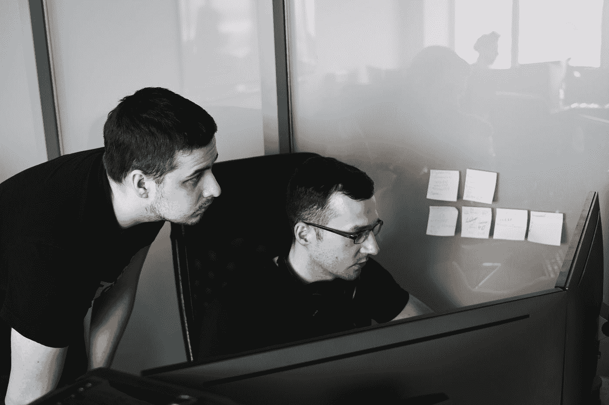

# 7 个短语高级程序员羞于告诉他们的下级

> 原文：<https://javascript.plainenglish.io/7-phrases-senior-programmers-shy-away-from-telling-their-juniors-33eee682feee?source=collection_archive---------6----------------------->

## 尤其是对于出色完成的工作。

Photo by [Maxim Tolchinskiy](https://unsplash.com/@shaikhulud?utm_source=medium&utm_medium=referral) on [Unsplash](https://unsplash.com?utm_source=medium&utm_medium=referral)

作为一名程序员，我在工作中并不总是表扬初级程序员。如果我的团队中有人比我优秀，我不会感到骄傲。这是一个人可能有的最糟糕的行为。

但是除了他们的高级程序员之外，他们也应该得到赞扬、认可和承认。所以，如果我不羞于表扬我的队友的出色表现，我会说下面的短语和理由，为什么说出来没有什么不好意思的。

# 1.“那是我的错。”

在团队面前承认错误，对很多资深程序员来说还是很难的。他们担心公开坦白会损害他们的权威。然而，公开、积极地处理错误对公司的发展至关重要——毕竟，它提供了一个弥补自己弱点的机会。“那是我的错误”这句话是走向积极的错误文化的第一步。

除此之外:试图掩盖错误或者甚至将责任推给员工的做法经常会出错——然后老板的权威变得更加不稳固。

# 2."我想听听你对此的看法。"

简单地接收和执行命令——这与当今许多程序员的自我形象相冲突。相反，他们希望自己的专业知识和观点能得到重视。因此，“我想听听你对此的看法”考虑了这一要求。

让员工参与设定公司未来发展方向的老板不仅能获得员工的支持。在许多情况下，他们会做出更好的决策，因为员工作为各自领域的专家，对问题有不同的看法。

# 3.“我很高兴你在我的团队里。”

对于许多程序员来说，与情况相关的表扬是理所当然的:当程序员解决了一个让大客户恼火的重大问题时，他会自然而然地说“干得好”。

“很高兴你在我的团队”这句话更有效。因为这种表达没有特定的原因，他们感到“被看见”——不仅因为他的表现，而且因为他作为一个人的整体而受到重视。

# **4。“我不知道。”**

没有人什么都知道。如果你是一个高级程序员，你可能知道也可能不知道关于新框架的一切。如果你称赞一个比你懂更多东西的程序员同事，你的名声或职业生涯不会有风险。

如果你有说服力地说，你的队友会更有动力或被鼓励在工作中做得更多。

# **5。“你可以比我做得更好。”**

“你能做得比我好”这句话和“我不知道”关系密切，但它更有力量。首先，因为它传达了三个信息:

*   第一，“我不完美，我也不羞于承认这一点。”
*   第二，“我看到你，我知道你的优点。”
*   第三，“我相信你的专业能力。”

另外:程序员可能已经知道他能比他的领导做得更好。

# **6。“我们明天继续吧。”**

如果你对某件事充满热情，你会忘记时间。但是除了工作，还有其他重要的事情。例如，“我们明天继续吧”这句话对员工来说是一个重要的信号:“我不期望 24 小时都有空，我尊重你的下班时间。”

这创造了一个让你的员工感到舒适的工作氛围。不仅如此:你保持健康和高效。另一方面，过度工作的员工表现较差，可能会缺勤。而且说实话:很多任务可以等到第二天。

# **7。“别担心，这种事谁都可能发生。”**

一个程序员告诉高级程序员有什么地方出错了:程序员错过了一个次要的客户端指令或者原型的一个小问题。烦人，但没什么大不了的。“别担心，这可能发生在任何人身上，”是这种情况下的最佳回应。

因为这个答案不仅公平(毕竟每个人都可能发生小错误)，而且有远见:它消除了员工的恐惧，为公开交流错误原因扫清了道路。无论如何，指责和指控不再能挽回这场灾难。

-

初级程序员晚上工作。他们在节假日、生日以及生活中的其他特殊场合工作。所以我认为他们应该听到这些神奇的话，这些话会让他们脸上露出笑容，鼓励他们更加努力地工作，即使是从他们的学长那里。

*更多内容尽在*[***plain English . io***](http://plainenglish.io/)