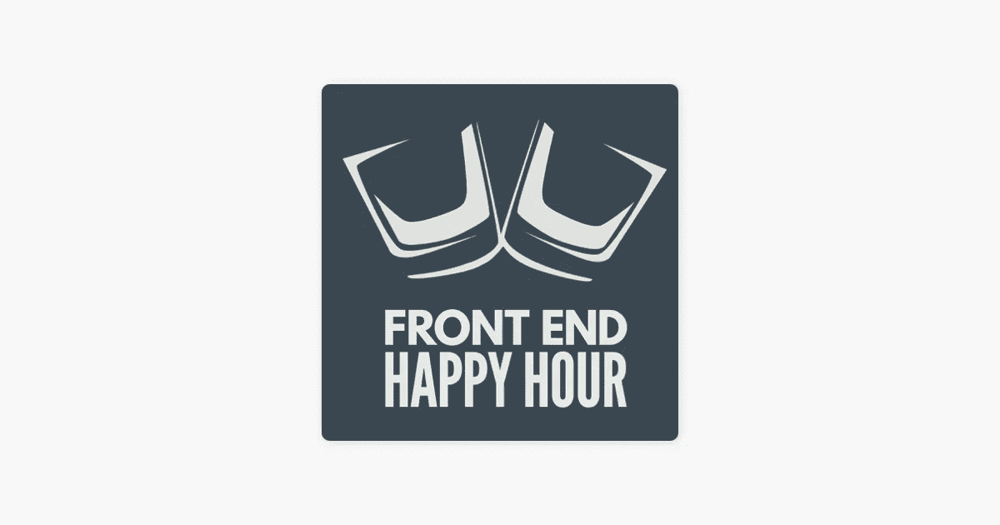
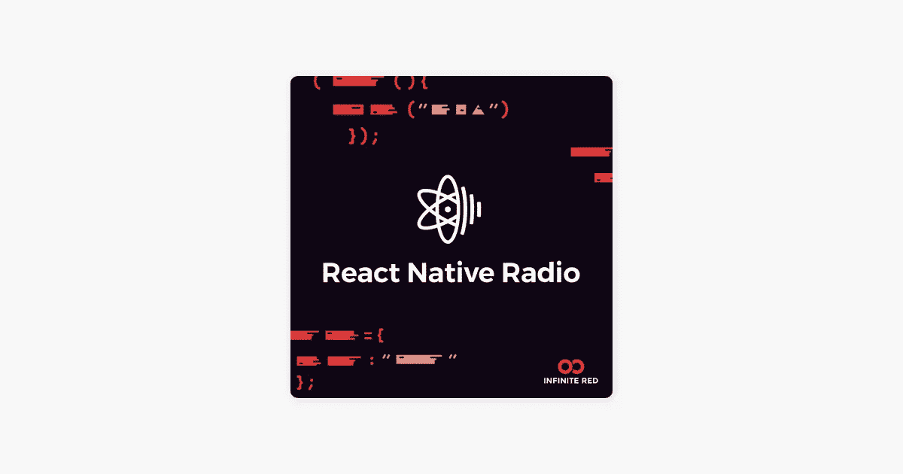

# 作为软件开发人员，你会喜欢听的 7 个播客

> 原文：<https://javascript.plainenglish.io/7-podcast-youll-enjoy-listening-as-a-software-developer-be242fdf085c?source=collection_archive---------20----------------------->

适合各种类型开发者的播客。

## 1.全栈无线电

这是热情的软件开发人员的一次真正的盛会，由亚当·瓦森主持，他也是非常著名的**顺风 CSS** 库的创建者。剧集通常专注于某个特定的嘉宾和他们热衷的事情，如果你作为开发者对构建企业级产品感兴趣，那么这个播客是最值得推荐的。

## 2.前端欢乐时光

这次有点不同，因为他们有来自大型科技公司的工程师，如**网飞，Twitch** 等。来自这些大型科技公司的开发人员根据他们自己在大型科技公司工作的经验，谈论他们对前端开发的最佳方法的想法。

## 3.反应本地无线电

作为一名移动应用程序开发人员，React Native Radio 是我个人的最爱，他们讲述了与 React Native 和移动应用程序开发相关的精彩内容。您还将获得 React Native 的所有最新更新，这将有助于您更好地使用 React Native。

## 4.吊舱火箭

由来自 LogRocket 的三人组主持，这个节目每周采访编程领域的大技术人员，他们问的问题都是经过精心准备的，如果你最近正在学习 web 开发，我会推荐这个节目。

## 5.JavaScript Jabber

正如你从名字中所料，这个节目是专门为 JavaScript 开发者准备的，这个节目涵盖了 JavaScript 开发者的一切。无论你是后端还是前端开发人员，你都将了解到令人敬畏的工具、最佳实践、测试、部署等。

## 6.entre 程序员

强烈推荐有兴趣为世界构建真实世界产品的开发者来听听这个。一个由 4 名开发人员组成的小组讲述了他们在创业过程中的经历，并学到了一些重要的经验。

## 7.循环

一个很棒的关于开发和设计的播客，他们谈论 JavaScript，React，React Native 居多。有兴趣让他们以前的技能更有效的开发人员会发现这个节目对他们来说很棒，因为他们谈论的每个话题都与有经验的开发人员有关。

 [## 网站开发人员避免常见错误的 5 个便捷的网站设计技巧

### 网页设计中要避免的常见错误

javascript.plainenglish.io](/5-handy-web-desing-tips-for-web-developers-f36bcb3fdaf4)  [## 2021 年你需要知道的 25 个 CSS 最佳实践

### 编写更好 CSS 的最佳实践

javascript.plainenglish.io](/25-css-best-practices-you-need-to-know-69f9192babdd)  [## 初学 HTML 时你会犯的 7 个错误

### 你应该知道的 HTML 错误

javascript.plainenglish.io](/7-mistakes-you-are-making-as-a-beginner-in-html-e65ca41ad598) 

*更多内容请看*[***plain English . io***](http://plainenglish.io/)