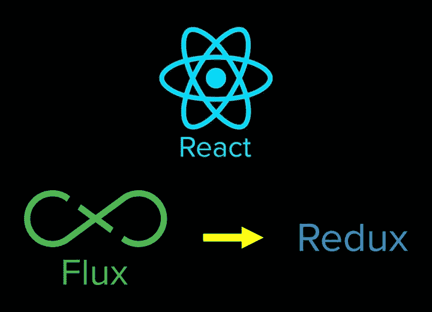

# 你应该使用 React 的 7 个理由

> 原文：<https://javascript.plainenglish.io/7-reasons-why-you-should-use-react-8ef3f95bcf1f?source=collection_archive---------13----------------------->

Photo by [Filiberto Santillán](https://unsplash.com/@filisantillan?utm_source=medium&utm_medium=referral) on [Unsplash](https://unsplash.com?utm_source=medium&utm_medium=referral)

React 由脸书开发，是一个 JavaScript 库，它允许您通过将 UI 拆分成可组合的组件来为单页应用程序创建用户界面。React 只需要很少的 HTML 和 JavaScript 知识，已经成为越来越流行的 web 开发工具。

在开发我们产品的新版本 JotForm 4.0 之前，我们决定了所有的前端框架。在经历了一系列掌握现代前端 web 库的黑客周之后，我们得出结论，React 是满足我们需求的最佳选择。以下是我们决定推进 React 的 7 个原因:

# 1|快速学习曲线

React 是一个基本的轻量级库，只处理视图层。不是像 Ember 或者 Angular 之类的其他 MV*框架那样的猛兽。然而，任何 JavaScript 开发人员都可以在阅读教程几天后学习基础知识并开始开发优秀的 web 应用程序。

正如 React 指南中所说，“用 React 思考”可能与你习惯的略有不同，因为它带来了一种新的方法，但随着你对它的进一步了解，它会变得更加容易和自然。

# 2|可重复使用的组件

React 提供了一个基于组件的结构。组件就是你的乐高积木。你从按钮、复选框、下拉菜单等小组件开始。，然后创建由这些较小组件组成的包装组件。然后，编写更高级别的包装组件。如此继续下去，直到你有一个单一的根组件，这个组件就是你的应用程序。

每个组件决定如何渲染。每个成员都有其内在逻辑。这种方法产生了令人印象深刻的结果。您可以在任何需要的地方重用组件。该产品是:

1.  您的需求具有一致的外观和感觉
2.  代码重用使得维护和扩展代码库变得更加容易
3.  您的应用程序更容易开发

这种基于组件的结构在我们构建广泛的 web 应用程序时帮了我们很大的忙，这是一个基于 JotForm 4.0 的全新表单生成器。

举一个特别的例子，所有的表单域都作为组件在表单编辑器(构建表单的地方)和结构本身(因为我们使用服务器端 Javascript 呈现 HTML)中重用。

# 3|使用虚拟 DOM 快速渲染

假设您打算开发一个包含许多用户交互和视图更新的 web 应用程序，比如 JotForm 4.0 的新表单呈现器。在这种情况下，您需要意识到潜在的性能问题。虽然当前的 javascript 引擎已经足够快来处理如此复杂的应用程序，但是操作 DOM 仍然不够快。因此，更新 DOM 通常是 web 性能的瓶颈。React 试图通过使用虚拟 DOM(存储在内存中的 DOM)来解决这个问题。对视图的任何更改都会首先反映在虚拟 DOM 中。然后，一个有效的 diff 算法比较虚拟 DOM 的先前和当前状态，并计算应用这些更改的最佳方式(最小更新)。最后，这些更新被应用到 DOM，以确保最小的读写时间。这是 React 高性能的主要原因。

# 4|纯抽象

React 的强大之处之一是它提供了良好的抽象，这意味着它不会向用户公开复杂的内部元素。

相比之下，Angular:为什么你需要学习像消化周期这样的内部过程？最好将这些细节留在内部，以确保清晰的抽象。要掌握 React，您需要理解组件生命周期、状态和道具。React 不像 MVC/MVVM 那样规定模式或架构；毕竟，这只是一个视图，您可以随意设置您的应用程序架构。

然而，有一个很好的架构可以很好地与 React 一起工作，它叫做 flux。

# 5|通量和 Redux

Flux 架构已经被脸书采用和维护，并用于他们的 web 应用程序中。它用单向数据流补充 React 组件。大致结构如下。

基本思想是创建由中央调度程序编排的动作来更新商店。然后，视图会根据这些存储库中的变化进行更新。组件显示的所有数据都存储在存储中，不会作为 MVC 结构中的模型复制，因此您不必在整个应用程序中保持模型数据同步。

不幸的是，没有现成的 flux 库，但这样的实现确实存在。其中最流行的是 Redux，它是 flux 架构的一种重新实现。它提供了一个统一的存储库，不会发生变化。在我看来，这是一个非同寻常的决定，所以你有一个真理的来源。只有一个存储所有应用程序数据的对象。这使得跟踪和操作变得更加容易。存储(信息)的任何变化都会触发相关组件的呈现，并且视图与数据保持同步。

Redux 的另一个很好的特性是，您可以定义一个中间件来停止被分派的动作。它通常用于日志记录、异常处理和异步 API 调用，但是您也可以快速编写中间件来解决各种其他问题。

如果你决定使用 redux，它附带了一个很棒的开发工具。

# 6|优秀的开发工具

选择开发平台时，开发工具是另一个重要因素。您应该注意两个很棒的工具:React 开发人员工具和 Redux 开发人员工具。两者都可以作为 Chrome 的扩展安装。

React 开发人员工具非常适合管理 React 组件的层次结构，并跟踪它们当前的属性和状态。下面你可以看到一个快照。在这里，我们正在检查 JotForm 4.0 组件。选中的部分突出了左边及其在层次中的位置，在右边面板中很好的显示。

用于开发 JotForm 4.0 的 React 开发工具的屏幕截图。

如果你使用 Redux 库，你应该看看 Chrome 的 Redux 开发者工具。您可以跟踪发布的操作、当前商店状态并查看商店中的更改。您还可以提交活动或编辑商店，并立即查看视图中反映的变化。由于所有更新都保存在扩展中，你甚至可以穿越时间。您可以保存并返回到应用程序中的任何状态以进行故障排除。

JotForm 4.0 开发中的 Redux 开发者工具截图

# 7|反应自然

当你学会反应时，你会得到一个奖励:原生反应。React 并不像创建者所说的那样是一个“写一次就到处跑”的库，而是一个“学一次就到处写”的库。是的，你可以用 React Native 为 Android 和 iOS 编写原生应用。虽然你不能使用你注册的相同代码，但是你可以使用相同的方法和架构。

到目前为止，Beta 测试人员对它非常热情，所以我们对这个版本非常兴奋。如果你正在寻找 react developer，印度有许多 react 开发公司可以帮助你将想法变成现实。

*更多内容尽在*[plain English . io](http://plainenglish.io/)