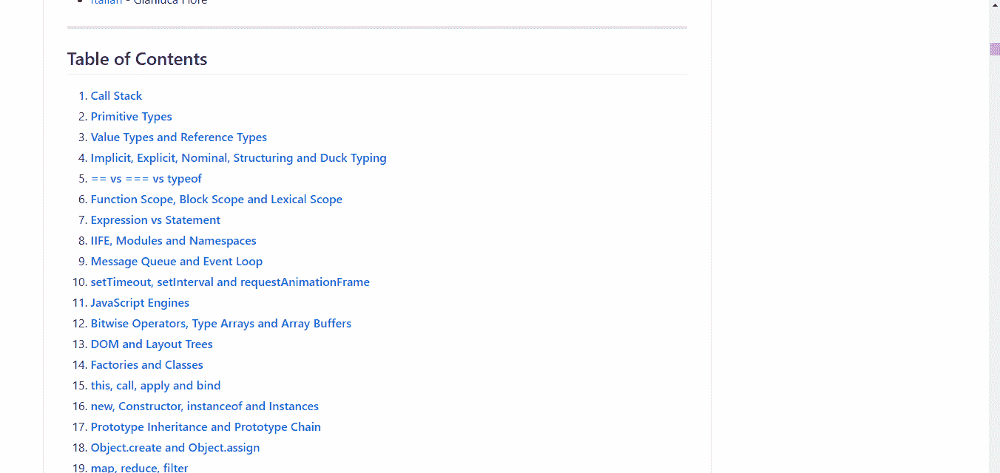
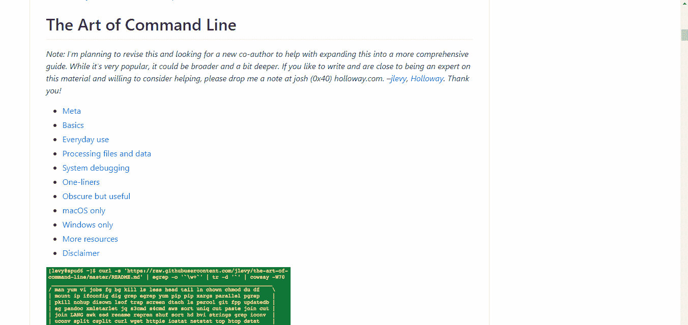
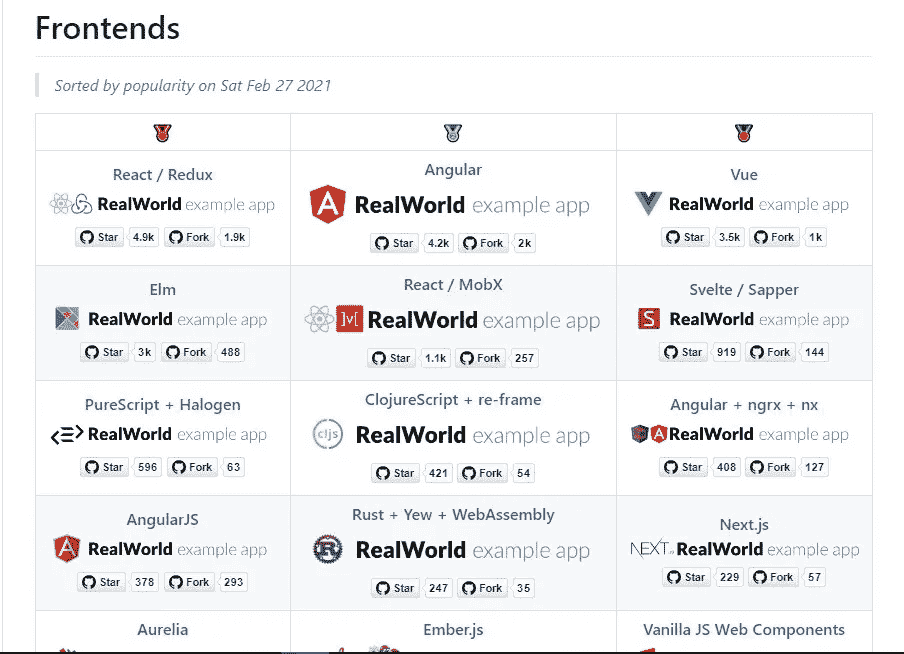
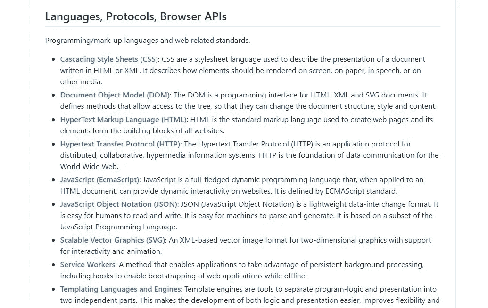
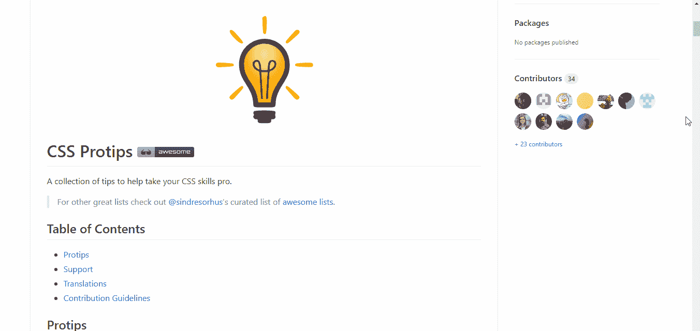
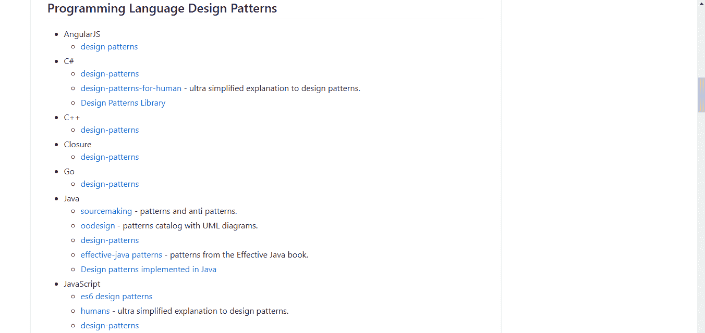
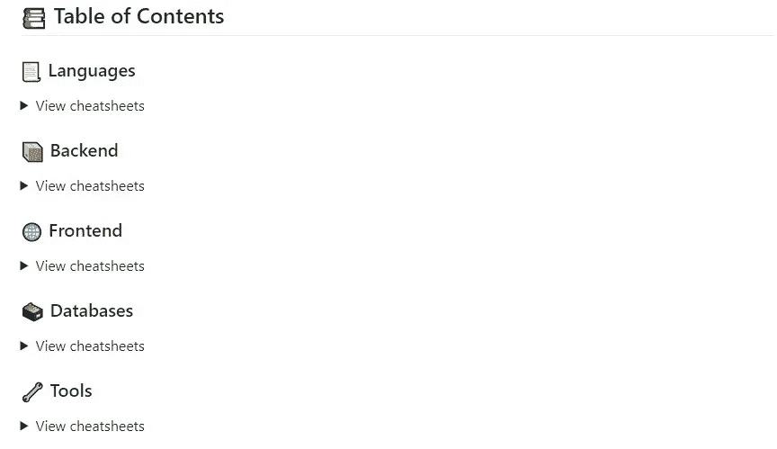

# 我不知道前端需要 7 个回购

> 原文：<https://javascript.plainenglish.io/7-repos-i-didnt-know-i-needed-for-front-end-389bf498afaa?source=collection_archive---------0----------------------->

## 很少有人谈论将帮助您更快地构建更好的东西的存储库。

Photo by [Juan Rumimpunu](https://unsplash.com/@earbiscuits?utm_source=medium&utm_medium=referral) on [Unsplash](https://unsplash.com?utm_source=medium&utm_medium=referral)

我们生活在一个全面的工具和资源唾手可得的时代，幸运的是，大多数工具和资源都是免费的。

发现新的工具和更简单的方法来执行繁琐或复杂的任务让每个人都很高兴，尤其是开发人员。

然而，有时我们不知道更好更聪明的方法存在，我们可以用意想不到的方式节省时间。

在两年的时间里，我在 GitHub 上发现了一些令人愉快的资源，它们给了我很大的帮助，我甚至不知道我需要其中的一些库。

因此，我整理了一份您可能需要的 GitHub 库列表。

## #1. [33 个 JS 概念](https://github.com/leonardomso/33-js-concepts)

[Source](https://github.com/leonardomso/33-js-concepts).

我用 Java 开始了我的编程之旅，然后转到 Dart。

当我切换到 JavaScript 时，尽管有或多或少相同的编程概念，但感觉像是一种全新的语言。

[33 JS Concepts](https://github.com/leonardomso/33-js-concepts) 是新的 JavaScript 开发人员或那些希望更新技能和发现新事物的人的一站式目的地。

顾名思义，这是您应该知道的 33 个基本 JavaScript 概念和基础的列表。

您可以找到关于干净代码、部分应用程序、数组方法、数据结构、承诺等主题的完整文章和资源。

即使你是一个完全的初学者，这个库也是学习 JavaScript 的好方法。

内容以初学者友好的方式安排，首先讨论关键和最基本的主题，如变量和语法，然后介绍慢慢高级的主题。

## #2.[命令行艺术](https://github.com/jlevy/the-art-of-command-line)

[Source](https://github.com/jlevy/the-art-of-command-line).

这个库专门用于掌握 Linux 上的命令行。

熟悉命令行通常是一项被忽视的技能，但是只有真正的开发人员才理解熟练使用命令行的真正需要。

你在这个库中找到的许多作品最初都出现在 Quora 上，但是已经被转移到这里，并且对它们做了一些改进。

这个库面向初学者和有经验的用户，虽然它是为 Linux 编写的，但是这里只提供 MacOS 和 Windows 部分。

即使您没有使用 Linux，我也强烈建议您浏览这个库。

## #3.[现实世界](https://github.com/gothinkster/realworld)

[Source](https://github.com/gothinkster/realworld).

如果你已经在 web 开发领域工作了几个月，你一定已经注意到新的框架时不时地出现，它们提供了更快或更简单的构建方式。

这听起来很棒，但是当你继续你的 web 开发时，在某个时候你会意识到新框架出现的速度是疯狂的，并且几乎不可能跟上它们。

此外，学习一个新的框架有其独特的挑战，因为大多数教程会教你如何构建一个基本的 todo 应用程序，而不是像[脸书](http://facebook.com)或[媒体](http://medium.com)这样的现实世界的应用程序。

这就是[现实世界](https://github.com/gothinkster/realworld)的用武之地。

这个库让你可以选择任何列出的后端和任何前端框架来创建一个名为 [Conduit](https://demo.realworld.io/) 的应用，它本质上是 Medium 的克隆。

后端和前端通过 API 连接，每个框架(后端和前端)都是用相同的 API 规范设计的，因此使用哪种组合并不重要。

我们的目标是为您提供一个您喜欢的技术堆栈中的媒体的真实世界克隆。

## #4.[前端开发者书签](https://github.com/dypsilon/frontend-dev-bookmarks)

[Source](https://github.com/dypsilon/frontend-dev-bookmarks).

这个存储库是我很长一段时间以来的首选。

它是每个开发人员不时需要的重要资源的精选集合。

然而，这个列表严格针对前端开发人员，尽管即使你是后端开发人员也值得一查。

你可以在外观、工作流程、架构、新闻、生态系统等主题上寻找资源。

这个库最有趣的部分之一是[兼容性部分](https://github.com/dypsilon/frontend-dev-bookmarks#compatibility)，它强调使用各种输入和输出设备。

你可以在一个巨大的文件[中找到这个库所提供的所有信息。](https://github.com/dypsilon/frontend-dev-bookmarks/blob/master/TOTALLY-GIGANTIC-FILE.md)

## #5. [CSS Pro 提示](https://github.com/AllThingsSmitty/css-protips)

[Source](https://github.com/AllThingsSmitty/css-protips).

CSS Pro Tip 是一个帮助我提高 CSS 技能的知识库。

它向你介绍了一些最简单却最有效的技巧和指南。

您可以找到一些基本信息，比如使用 SVG 和 CSS 重置的优点。

这个资源库教会了我一些巧妙的技巧和窍门，比如如何隐藏未静音的自动播放视频等等。

本指南面向任何使用 CSS 的人——无论是初学者还是有经验的用户，我强烈建议你去看看。

我已经介绍了一些有趣的 CSS 属性，它们在我之前的博客中很少被提及，你应该去看看。

 [## 6 没有人谈论的 CSS 属性

### 许多人从未听说过的有趣特性。

javascript.plainenglish.io](/6-css-properties-nobody-is-talking-about-e6cab5138d02) 

## #6.[令人敬畏的设计模式](https://github.com/DovAmir/awesome-design-patterns)

[Source](https://github.com/DovAmir/awesome-design-patterns).

如果您计划构建大型应用程序，这个存储库是非常好的。

不要把这个知识库和一些前端设计模式混淆。这完全是面向工作流和架构的。

架构基本上是指如何组织你的文件，以及你的代码如何与其他代码文件通信。

例如，MVC 架构将应用程序分成三个主要的逻辑组件:模型、视图和控制器。

大型应用程序和小型应用程序之间的区别不仅仅在于编码文件的数量，还在于架构，架构在应用程序的可伸缩性中扮演着至关重要的角色。

您可以找到大多数著名语言的模式，如 Go、C#、JavaScript 等等。

该存储库中还提供了云、无服务器和微服务架构。

## #7.[超赞的小抄](https://github.com/LeCoupa/awesome-cheatsheets)

[Source](https://github.com/LeCoupa/awesome-cheatsheets).

顾名思义，这个库有大量关于数据库、前端、后端等的备忘单。

备忘单可以成为一个有效且方便的工具，尤其是当你在框架和语言之间周旋的时候。

如果你在几个月后重新学习一门语言，备忘单也很有用，因为通常备忘单会覆盖所有的核心概念。

例如，[这个库中的 Java cheatsheet](https://github.com/LeCoupa/awesome-cheatsheets/blob/master/languages/java.md) 涵盖了所有的核心方法和概念，比如比较运算符和数学库，以及一般的语法和规则。

如果需要的话，你可以叉这个图书馆，并继续重新访问，因为它肯定会帮助你不浪费无数时间重新学习你已经知道的东西。

## 最后的想法

偶然发现我从未想过我需要的工具和资源总是令人兴奋的。

很多时候，我们只是接受事物的本来面目，而不是寻找更好的替代方法，或者寻找是否有人找到了更简单的方法。

虽然列表中的一些项目是策划内容，但其他项目是像 RealWorld 这样的独特存储库。

如果你喜欢读这篇文章，一定要看看我写的关于可以用来掌握编程技能的有趣游戏的文章。

 [## 你应该玩的 7 个有趣的游戏来提高你的编码技能

### 掌握各种网络技术的非典型方法。

javascript.plainenglish.io](/7-fun-games-you-should-play-to-up-your-coding-skills-ec051a55faaa) 

希望你喜欢这篇文章！