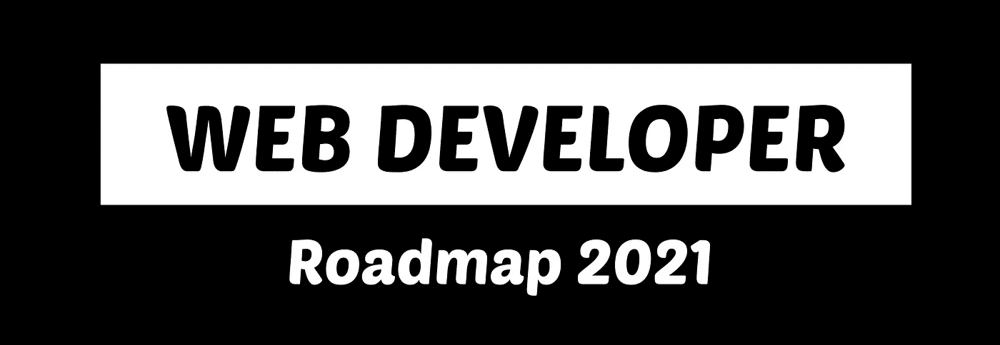

# 7 个回购帮助你掌握前端开发

> 原文：<https://javascript.plainenglish.io/7-repos-to-help-you-master-front-end-development-9b1b9cd065e3?source=collection_archive---------15----------------------->

帮助您踏上 web 开发之旅的资源列表。

Photo by [Thought Catalog](https://unsplash.com/@thoughtcatalog?utm_source=medium&utm_medium=referral) on [Unsplash](https://unsplash.com?utm_source=medium&utm_medium=referral)

我已经踏上了我的 web 开发之旅一年多了。作为一名软件工程专业的学生，我非常幸运地出生在一个可以获得无限量资源、视频、文章和教程的时代。最棒的是，这一切都是免费的。

下面我列出了 7 个在我的旅程中帮助过我的 GitHub 库。我希望他们也能帮助你。

希望你发现这些和我一样有用，祝你在 web 开发之旅中好运。

# 1.开发者路线图

developer-roadmap via GitHub

这不仅仅是为前端开发者准备的，而是为所有人准备的。他们制作了一些惊人的图表来展示成为开发人员的途径。图表深入而清晰，尤其适合新手。

**星星:167k**

来源——【https://github.com/kamranahmedse/developer-roadmap 

网站—【https://roadmap.sh/ 

# 2.超棒的 JavaScript

Awesome JavaScript Readme

如果你从事前端开发，你很可能会使用 JavaScript 编程语言。

这个库包括一组资源，可以帮助你更好地理解这门语言。

一些资源包括:

*   MVC 框架和库
*   模板引擎
*   数据结构
*   用户界面
*   ES6
*   播客、博客和文章
*   类型检查器
*   结构

**星星:25k**

来源—[https://github.com/sorrycc/awesome-javascript](https://github.com/sorrycc/awesome-javascript)

# 3.前端开发书签

Frontend Development Bookmark Readme

这是一个万能的回购，他们已经成功地管理了前端开发的许多不同类别的资源列表。

一些资源包括:

*   设计
*   体系结构
*   兼容性
*   生态系统
*   语言、协议、浏览器和 API
*   用户界面
*   工作流程

**星星:31.6k**

来源—[https://github.com/dypsilon/frontend-dev-bookmarks](https://github.com/dypsilon/frontend-dev-bookmarks)

# 4.30 秒的代码

30 seconds of code via GitHub

这个 repo 包含简短的 JavaScript 代码片段，如 utils 或与时间相关的函数。您可以只声明您可能需要的两三个函数，而不是引入整个依赖/包来处理与时间相关的数据。

他们甚至有一个网站，你可以搜索和预览片段，他们甚至让你复制片段到你的剪贴板。

**星星:81.5k**

来源—[https://github.com/30-seconds/30-seconds-of-code](https://github.com/30-seconds/30-seconds-of-code)

网站—[https://www.30secondsofcode.org/js/p/1](https://www.30secondsofcode.org/js/p/1)

# 5.33-js-概念

33-js-concepts via GitHub

顾名思义，这是每个 JavaScript 开发人员都应该知道的 33 个概念。repo 几乎涵盖了构建 JavaScript 坚实基础所需的一切。

他们甚至为不讲英语的人提供了翻译版本。

我发现自己不时会回到这个回购，它真的包含了很多很棒的资源(视频、文章、教程……)。

一些概念包括:

*   原始类型
*   表达式 vs 语句
*   DOM 和布局树
*   映射、减少、过滤
*   高阶函数
*   递归
*   承诺
*   异步/等待
*   数据结构
*   算法
*   设计模式
*   干净的代码

**星星:42.1k**

来源—【https://github.com/leonardomso/33-js-concepts 

# 6.故事书

Storybook via Github

Storybook 是构建 UI 组件时的开发环境。它使您能够在库视图中查看所有组件。然后，您可以在不同的状态下交互和测试您的组件。

它们支持大多数流行的框架，如 React、Angular & Vue。故事书甚至有一个很棒的社区，所以如果你遇到任何问题，你也可以在他们的 discord 组里问。

来源—[https://github.com/storybookjs/storybook](https://github.com/storybookjs/storybook)

网站—[https://storybook.js.org/](https://storybook.js.org/)

**星星:63.7k**

# 7.面向开发者的设计资源

[https://github.com/bradtraversy/design-resources-for-developers/blob/master/headerimage.png](https://github.com/bradtraversy/design-resources-for-developers/blob/master/headerimage.png)

这个知识库是由大家最喜欢的网络开发英雄 Brad Traversy 创建的。

顾名思义，它包含了非常广泛的开发者资源列表。

一些东西包括:

*   用户界面图形
*   字体
*   不同前端框架的 UI 库
*   JavaScript 动画
*   设计工具
*   CSS 框架
*   …..更多的

在 HTML 和 CSS 的美好时代，这对我绝对有帮助。

**星星:31.3k**

来源—[https://github . com/bradtraversy/design-resources-for-developers](https://github.com/bradtraversy/design-resources-for-developers)

 [## 什么才算是干净的代码

### 让开发人员定义干净的代码，他们都会告诉你一些不同的东西。

javascript.plainenglish.io](/what-actually-counts-as-clean-code-cc5db5f74301)  [## 反应仍然是王道

### React 会长久保持王者地位吗？

javascript.plainenglish.io](/react-is-still-the-king-7e70f9db8288)  [## Axios 与 Fetch:哪个更好？

### 探索 Axios 和 Fetch 之间的差异，并最终找出哪个更好。

javascript.plainenglish.io](/axios-vs-fetch-aeaec89023b3) 

*更多内容看*[***plain English . io***](http://plainenglish.io/)