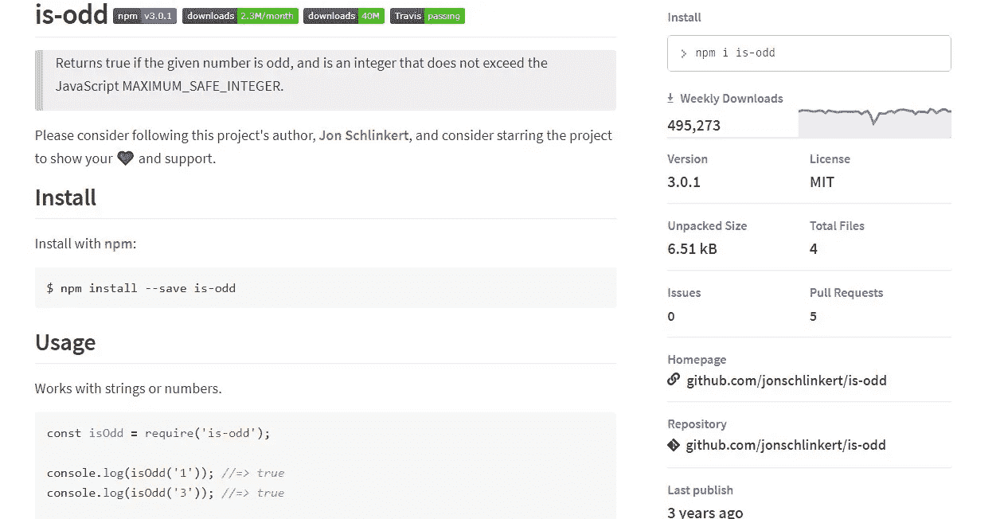
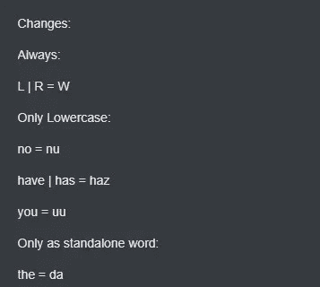
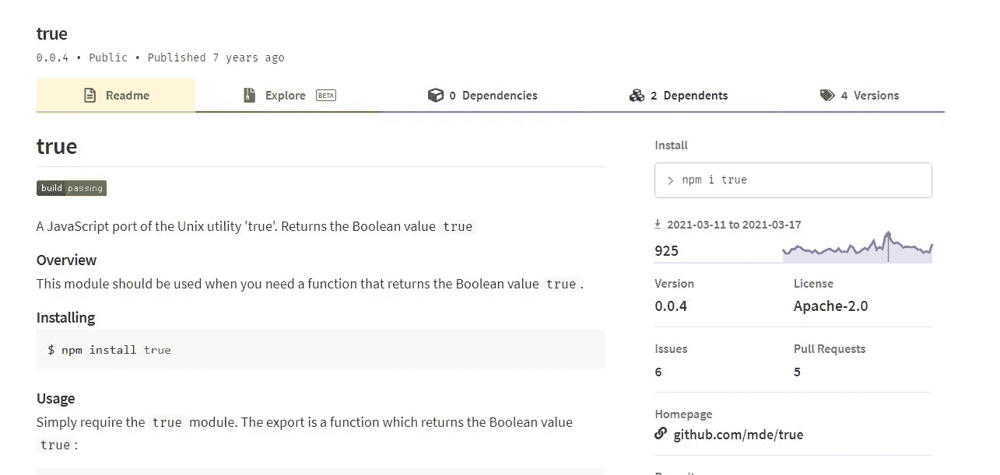
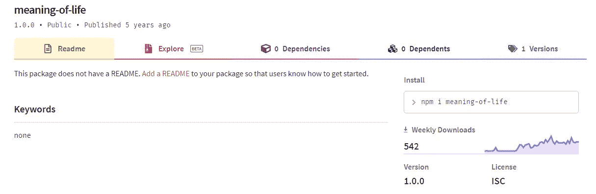
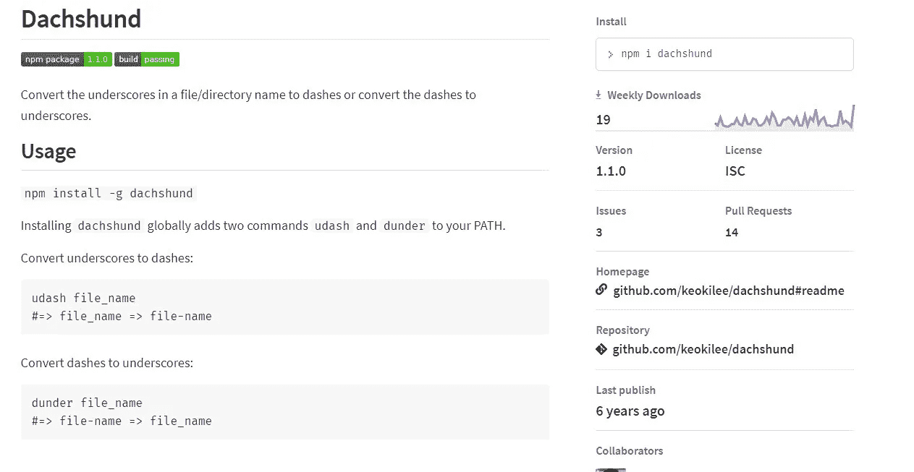
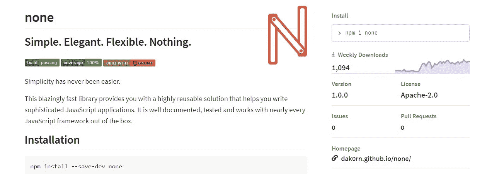
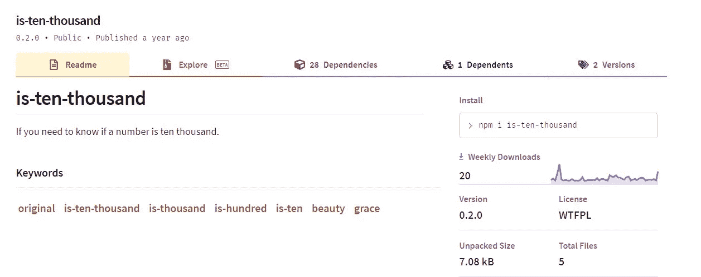

# 你不会相信存在的 7 个荒谬的 NPM 包裹

> 原文：<https://javascript.plainenglish.io/7-ridiculous-npm-packages-you-wont-believe-exist-4bf1ac8c884d?source=collection_archive---------1----------------------->

## 我甚至不知道有无意义的包裹存在。


Photo by [Jalal Kelink](https://unsplash.com/@jalalkelink?utm_source=medium&utm_medium=referral) on [Unsplash](https://unsplash.com?utm_source=medium&utm_medium=referral)

所有开发人员都熟悉 npm，毕竟它是世界上最大的软件目录。

向 npm 发布您自己的包没有任何障碍。任何拥有 npm 用户帐户的人都可以上传并发布用户范围的 npm 包。

它有超过一百万个包，同时也提供其他工具和服务。

这也打开了人们推送无用和无目的代码的可能性，但你会认为其他开发者不会下载这样的包，但对于我下面列出的一些奇怪和无意义的包来说，这不是真的。

下面是 7 个简直可笑的 npm 包:

## #1.[是奇数&是奇数](https://www.npmjs.com/package/is-odd)



Source: [npm](https://www.npmjs.com/package/is-odd)

如果给定的数字是奇数，并且是不超过 JavaScript MAXIMUM_SAFE_INTEGER 的整数，则 is-odd 包返回 true。

你不仅可以通过不导入这个包并简单地将给定的数字除以 2 来检查来达到同样的效果，而且事实上它几乎触及了 500k 的周下载量(在撰写本文时)。

事实上，在 2021 年 5 月，它甚至超过了 500k 大关，并在 [GitHub](https://github.com/i-voted-for-trump/is-odd) 上拥有超过 160 颗星星。

这个包在其他类似的包中作为依赖项使用，比如 [is-even](https://www.npmjs.com/package/is-even) ，顾名思义，它返回与 is-odd 的返回值相反的值。

类似地，您可以找到其他类似 is-is-odd 的包，它只在传递的函数是 is-odd 时才返回 true。

```
const isOdd **=** require('is-odd');const isIsOdd **=** require('is-is-odd');console.log(isIsOdd(isOdd)); *//=> true*console.log(isIsOdd(function() {}));
```

像 is-is-is-odd 这样的包也是存在的，我希望您现在能理解这种模式。

## #2. [owoifyx](https://www.npmjs.com/package/owoifyx)

这个包“过滤”了你的信息。这仅仅意味着它取代了某些字母和单词。你可以在下面的图片中找到变化:



[Source](https://owobot.fandom.com/wiki/Owoify)

您可以使用简单的正则表达式和字符串操作实现同样的效果，但是很明显，在 2021 年 6 月，有 147 名开发人员需要它。

这个包甚至有 4 个依赖项。

## [#3。真](https://www.npmjs.com/package/true)



Source: [npm](https://www.npmjs.com/package/true)

这个包在 7 年前发布，显然经受住了时间的考验，因为在 2021 年 3 月几乎有 1000 名开发者需要这个包。

当您需要一个返回布尔值`true`的函数时，可以使用这个包。听起来很蠢，对吧？

如果你想知道，这是这个包的 index.js 代码。

```
module.exports = function aJavaScriptPortOfTheUnixUtilityTrueReturnsTheBooleanValueTrue () 
{  
      return true;
};
```

JavaScript 已经有内置的布尔值`true` & `false`，但是它花了 30 多次提交才使这个包成为今天的样子。

## #4.[生命的意义](https://www.npmjs.com/package/meaning-of-life)



Source: [npm](https://www.npmjs.com/package/meaning-of-life)

这个包旨在回答最抢手的问题:*人生的真谛是什么？*

本周，542 名开发者寻求答案。

原来意思是一个数字，是 42。

这很可能是对道格拉斯·亚当斯的《银河系漫游指南》的引用，但你可能永远不会知道。

此包的 index.js 代码:

```
module*.*exports = 42
```

## #5.[腊肠犬](https://www.npmjs.com/package/dachshund)

腊肠犬和生命意义包是同一个人创造的。

与其他包不同，这个包确实提供了某种程度的实用性。



Source:[npm](https://www.npmjs.com/package/dachshund)

它为您提供了两个函数来用破折号替换下划线，反之亦然。

但是，只需几行代码就可以实现。你所要做的就是[用你想要的名字创建一个新文件，并把我们的旧文件作为第一个参数传入。](https://pqina.nl/blog/rename-a-file-with-javascript/)

## #6.[无](https://www.npmjs.com/package/none)



Source: [npm](https://www.npmjs.com/package/none)

这个包的名字准确地描述了这个包的内容。

它简单、优雅、灵活，什么也不做。

拥有超过 3 个依赖项和超过 1，000 次每周下载，该软件包为您提供了以下功能:

```
var none = function() {};
```

它甚至有整整一页的[文档](http://dak0rn.github.io/none/#why)，关于它如何跨许多框架工作，并且不需要配置。

## #7.[是-万](https://www.npmjs.com/package/is-ten-thousand)



Source: [npm](https://www.npmjs.com/package/is-ten-thousand)

这个包检查一个数字是否是 10，000，你可以用一个简单的单行语句`number===10000`来完成。

这个包不仅下载了 20 次，而且有超过 28 个依赖项，这使得它的文件大小增加到 7kB。

这个包需要哪 28 个依赖项？你可以自己查看这个 [index.js](https://github.com/james-work-account/is-ten-thousand/blob/main/index.js) 文件。

可以找到类似 is-ten 和 is-100 这样的包。所以下次你需要检查一个数字是 10，100，还是 1000，你知道该安装哪个包。

## 最后的想法

npm 是世界上最大的软件目录，也是 JavaScript 框架和应用程序的重要组成部分。

拥有超过 100 万个软件包，并且发布自己的软件包没有很高的门槛，你一定会发现一些弊大于利、毫无用处的愚蠢的软件包。

然而，如果你被困在网上搜索解决方案，而不是安装可靠的、经过测试的软件包，你应该试着用几行代码就能完成。

查看我最近的博客，讨论如何使用谷歌搜索引擎找到编程错误和逻辑的解决方案。

[](/5-google-search-techniques-to-quickly-find-solutions-answers-532974c2a196) [## 快速找到解决方案和答案的 5 个谷歌搜索技巧

### 专业开发人员使用的技巧和诀窍是在几分钟内找到答案，而不是没完没了地浏览几个小时。

javascript.plainenglish.io](/5-google-search-techniques-to-quickly-find-solutions-answers-532974c2a196) 

我希望你喜欢这篇阅读文章。

*更多内容看*[***plain English . io***](http://plainenglish.io/)