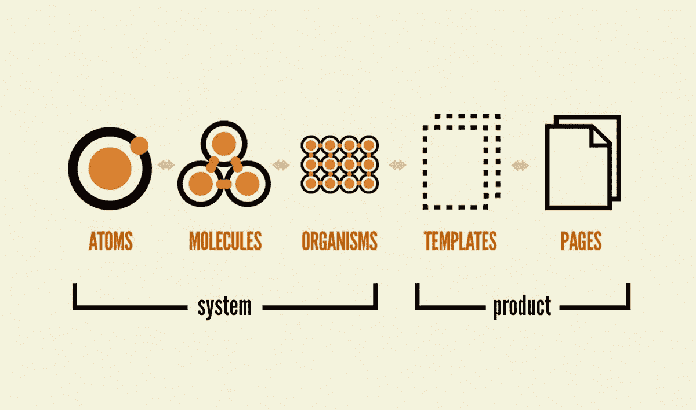
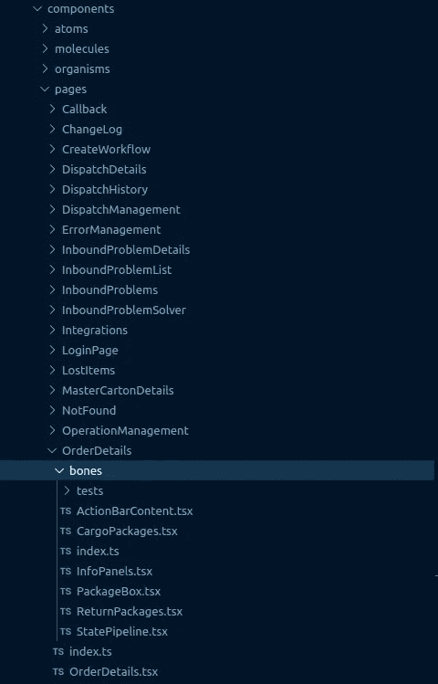
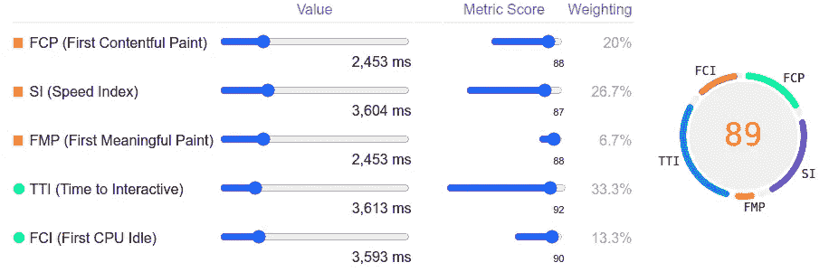
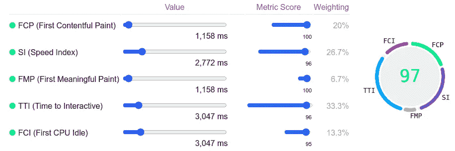
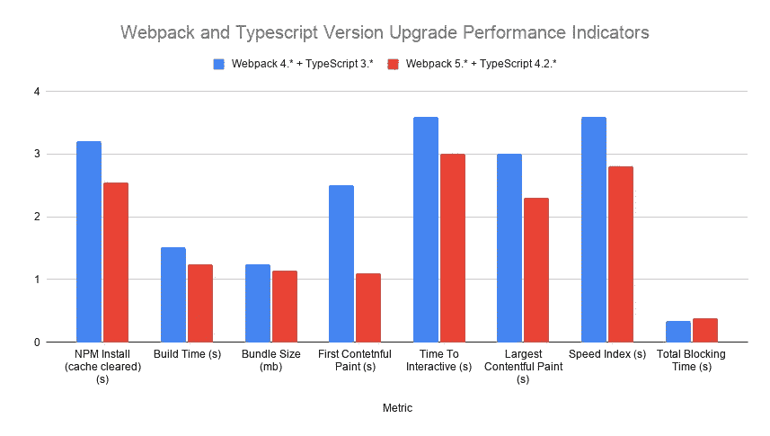
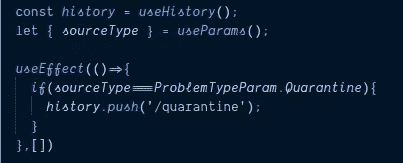
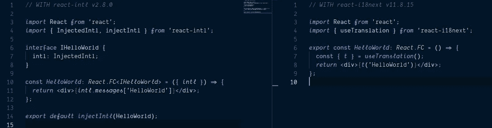
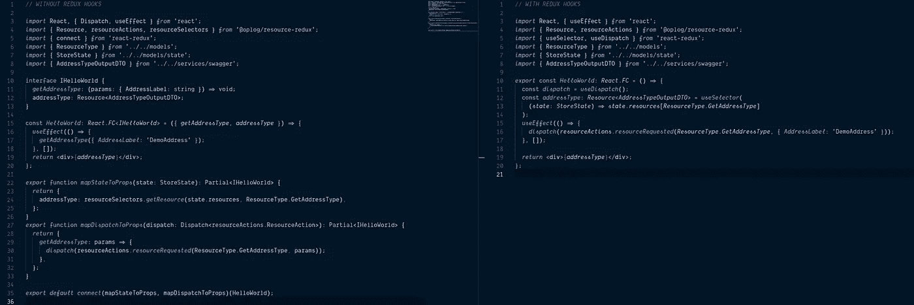

# 实现 React 应用现代化和优化的 7 个步骤

> 原文：<https://javascript.plainenglish.io/7-steps-to-modernize-and-optimize-your-react-app-466cbea51b8f?source=collection_archive---------1----------------------->

Photo by [Ferenc Almasi](https://unsplash.com/@flowforfrank?utm_source=medium&utm_medium=referral) on [Unsplash](https://unsplash.com?utm_source=medium&utm_medium=referral)

> 由于前端环境和社区的性质，工具和技术堆栈正在快速转变。这些转变旨在为开发者和最终用户提供更好的体验。由于开发人员每天面临的挑战，心态得到了改善。这些经验带来了高度参与的社区方法的进步，产生了在可伸缩性、性能和适应性方面更好的应用。

在这种变化速度下，并不是每个应用都能成功保持其流通性。即使这是你的应用程序或你刚开始工作的公司的应用程序，你也需要重构应用程序，以拥有更现代的方法和策略。

我和我在[***OPLOG***](https://oplog.com.tr/)*的团队现在就在这个现代化的进程中。该应用程序的代码库建立于 2018 年，出于某种原因，主要结构自那以来一直没有改变。我们的目标是使我们的应用适应前端世界的最新发展，并增加开发者和最终用户的体验。对于相关人员，我们的技术堆栈是 [TypeScript](https://www.typescriptlang.org/) 、 [ReactJS](https://reactjs.org/) 、 [Redux](https://redux.js.org/) 、 [Jest](https://jestjs.io/) - [酵素](https://enzymejs.github.io/enzyme/)、[风格化系统(CSS-in-Props)](https://styled-system.com/) 、[原子设计](https://bradfrost.com/blog/post/atomic-web-design/)。*

*下面，我将分享我们遵循的步骤，以及我们经历的原因和不可理解的影响。*

## *1)将有类组件转换为功能组件*

> *作为 React 16.8 我们遇到了 React 钩子。在此之前，为了使用生命周期方法，我们使用有类组件。在钩子的帮助下，我们可以拥有类组件对于功能组件的所有能力。*

**

*Photo by [Ferenc Almasi](https://unsplash.com/@flowforfrank?utm_source=medium&utm_medium=referral) on [Unsplash](https://unsplash.com?utm_source=medium&utm_medium=referral)*

*由于基本输入输出机制的性质和钩子的力量，react 社区建议在每个秤应用中使用功能组件。此外，大多数流行的库都建立了定制的钩子，以避免在 HOC 中注入道具。*

*借助将有类组件转换为功能组件的简易性，我们已经在很短的时间内转换了应用程序中的所有组件。通过这样做，我们为应用程序现代化的下一步奠定了基础。*

## *2)重新设计文件结构，将组件分解成更小的部分*

> *当我们谈到可伸缩性和可维护性时，文件结构是最关键的一点。*

*我们使用 Brad Frost 的原子设计方法来设计我们的组件结构。我们有原子、分子、有机体、页面和模板。你可以阅读 Brad Frost 的博客页面，了解更多关于原子设计方法论的想法。*

**

*Atomic Design Methodology by [Brad Frost](https://bradfrost.com/blog/post/extending-atomic-design/)*

*作为一个团队，我们非常喜欢这种方法。感觉很有条理，很容易确定哪些组件放在哪里。在 WMS(仓库管理系统)领域编码近两年后，它也证明了自己的可伸缩性。找到你正在寻找的代码块并操作它是非常舒适的。*

**

*Atomic Design Methodology with Bones*

*尽管有这些积极的观点，但组件的大小还是有问题。与业务逻辑或设计需求相关，组件代码的行数可能会增加 1000 多行。*

*为了解决这个问题，我们在系统中添加了另一个文件夹，我们称之为**“骨头”**。我们用 300 行代码限制了组件的长度。如果组件需要 300 行以上的代码，我们会把它们分成骨骼，这些骨骼是主要组件的较小块，它们有自己的逻辑。这些组件具体属于被划分为骨骼的主要组件。它们不应用于任何其他组件。*

*你可以看到上面的图片，看看我们是如何将 *OrderDetails* 组件分割成骨骼的。我们还将包含规范文件的“tests”文件夹放在组件的并行文件中。*

*我们意识到 300 是一个很好的心理极限，可以拥有更干净易读的原子组件。*

## *3)使用 Webpack 5*

> *有了 Webpack 5，我们在 Webpack 和 webpack-dev-server 上得到了许多新奇而显著的改进。我们还向微前端基础设施迈进了一步(参见[带 Webpack 模块联盟的微前端](https://engineering.telia.no/blog/micro-frontends-with-webpack-module-federation))。*

*将详细的 webpack 4 配置转换到 webpack 5 是一项颇具挑战性的任务。有许多突破性的变化。幸运的是，webpack 团队分享了一份[迁移指南](https://webpack.js.org/migrate/5/)以供遵循。经过细致的工作，我们将我们的 webpack 版本升级到了 5，将 webpack-dev-server 升级到了 4。*

*我在另一篇[博客文章](https://mucahitgurbuz.medium.com/webpack-4den-5-e-ge%C3%A7i%C5%9F-e89236086ab1)中详细分享了我将 webpack 升级到 v5 的经历。这个博客是土耳其语的，所以土耳其人可以阅读并应用到他们的项目中。对于其他人，您可以查看以下链接，以便更好地了解 webpack 5 及其迁移:*

*【https://webpack.js.org/blog/2020-10-10-webpack-5-release/
https://webpack.js.org/migrate/5/
[https://frontend-digest . com/whats-new-in-web pack-5-ef 619 bb 74 FAE](https://frontend-digest.com/whats-new-in-webpack-5-ef619bb74fae)*

*我将分享我们应用程序的一些结果，包括关键绩效指标的变化。除了指标之外，最终用户和开发人员的体验也有显著改善。*

**

*Webpack 4.* Lighthouse Values*

*您可以在图表中看到几乎 100%的改进。此外，webpack 5 为更大的改进奠定了基础。*

**

*Webpack 5.* Lighthouse Values*

*这次版本升级可能没有那么困难，甚至这可能是将所有库升级到最新版本的好机会。*

**

*The change in the performance indicators between webpack v4 and v5*

## *4)将 React 和 TypeScript 升级到最新版本*

> *拥有主要库的最新主要版本总是好的。尽管 React 17 和 TypeScript 4 没有突破性的变化，但它们提供了一些不错的特性，并与其他最近升级的库具有对等依赖兼容性。*

*在这个现代化过程中，我们已经升级了 React(到 v17)和 TypeScript(到 v4)库。*

*升级 TypeScript 版本是一项简单的任务。代码库中没有冲突或中断。然而，在 React 的升级过程中，一些版本过时的库出现了一些对等依赖冲突。*

*为了解决这些冲突，必须对这些库进行一些主要的版本升级，这导致了代码库的一些重大变化。正如我前面提到的，这是将您的依赖项升级到最新版本的好机会。*

*由于这不在本文的讨论范围内，您可以在下面的博客文章中找到这些升级后所获得的变化:*

*react 17:[https://better programming . pub/whats-new-in-react-v17-68b7e 15576 e 1](https://betterprogramming.pub/whats-new-in-react-v17-68b7e15576e1)
TypeScript 4:[https://JavaScript . plain English . io/features-and-breaking-changes-in-TypeScript-4-111 e 6551 CD 7](/features-and-breaking-changes-in-typescript-4-111e6551cd7)*

*特别是，即时热重新加载功能和不再需要在组件中导入 react 库是 React 17 中我们喜欢的两个主要改进。*

## *5)升级 react-router 并使用其新的基于钩子的函数来导航*

*我们使用`withRouter` HOC 将路由器属性注入到组件中，并从组件的属性中读取路由器状态。作为 v5.1，我们现在可以使用钩子来访问组件内部的路由器状态和导航器功能。*

> *这有助于我们摆脱注入的道具和需要包装组件的特设函数的不必要的复杂性。*

*`useHistory`、`useLocation`、`useParams`是最受欢迎的挂钩。*

**

*Example usage of the react-router hooks*

*`useHistory`钩子让您可以访问`[history](https://reactrouter.com/web/api/history)`实例，您可以用它来导航。`useLocation`钩子返回代表当前 URL 的`[location](https://reactrouter.com/web/api/location)`对象。`useParams`返回 URL 参数的键/值对的对象。*

## *6)替换或升级您的 i18n 库，以使用基于钩子的翻译功能*

*我们使用的 i18n 库是`[react-intl](https://formatjs.io/docs/react-intl/)`。我们需要升级它的两个主要版本，以拥有一个定制的钩子特性来达到组件内部的`intl`状态。有太多的突破性变化需要配置。因此，尽管它有足够的能力，但是考虑到易用性和社区支持，我们决定将我们的 i18n 库迁移到`[**i18next**](https://www.i18next.com/)`和`[**react-i18next**](https://react.i18next.com/)`。*

*迁移过程非常顺利。我们在`i18next`中使用了完全相同的翻译文件，并根据我们的需求进行了配置。*

*为了从`injectIntl` HOC 中解放出来，去修改 app 中的每一个组件。我们已经移除了`injectIntl` HOCs，并使用`useTranslation()` hook 来实现翻译功能。*

**

*Before (left) and after (right) of usage of the i18n libraries to translation*

*我们也修改了我们的单元测试，因为有突破性的变化。然而，为用钩子而不是 HOC 来包装组件的组件编写单元测试要容易得多。*

## *7)对 Redux 调度程序和选择器使用钩子*

> *我总是倾向于忘记`mapStateToProps`、`mapDispatchToProps`和`connect`的结构来包装组件。如果您正在使用 TypeScript，那么您总是需要从其他组件中进行复制，这可能会更加混乱。此外，当我们看我们想要的东西时，显然有一种多余的复杂性。*

*随着`[react-redux](https://react-redux.js.org/)` v7.1.0、`useSelector`和`useDispatch`挂钩加入了我们的生活。在这些的帮助下，我们不再需要编写两个独立的函数( *mapStateToProps* 和*mapdispatctoprops*)和一个包装器 HOC 来为组件注入 redux props。这些钩子足以订阅 Redux 存储和调度操作。*

*正如 react-redux 医生所说；*

> *“我们**建议**使用 React-Redux hooks API 作为 React 组件中的默认方法。*
> 
> *现有的`connect` API 仍然工作，并将继续得到支持，但是 hooks API 更简单，并且与 TypeScript 一起工作得更好。"*

*你可以在[文档](https://react-redux.js.org/api/hooks)中找到更多关于在 React Redux 应用中使用钩子的信息。*

*这一变化对开发人员的体验产生了积极的影响。我们已经删除了所有容器组件，这些组件仅用于 redux、translation 和 router 包装器。现在，处理 TypeScript 并达到组件内部所需的状态变得更加简单。*

**

*Before (left) and after (right) of usage of the redux hooks to subscribe to the Redux store and dispatch actions*

*从上面你可以清楚地看到这一变化的影响。*

*即使对现有的 React 应用程序进行优化和现代化还有更多工作要做，这也是一个非常好的开始。作为一个团队，我们在开发人员和最终用户体验方面经历了巨大的差异。编写一个组件要容易得多，也快得多，而且花在代码库上的时间也更少。*

*下面两个 gists 具有相同的输出。你可以看到组件缩短了多少。*

*我们在可持续性和可扩展性问题上积累了多年的经验后，提出了这些步骤。正在开发的 React 应用程序应该始终与最近的开发保持同步。*

> *保持持续发展的心态是非常重要的，尤其是对于前端世界。*

*我要感谢我的队友埃姆雷·克斯金和 T2·乌尔坎·达夫兰，他们的高水平视野和经验激励了我们。*

*保持联系！*

**更多内容尽在*[*plain English . io*](http://plainenglish.io/)*