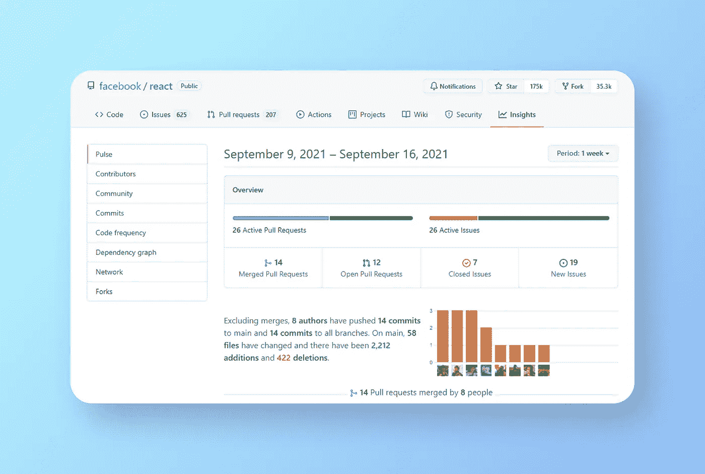
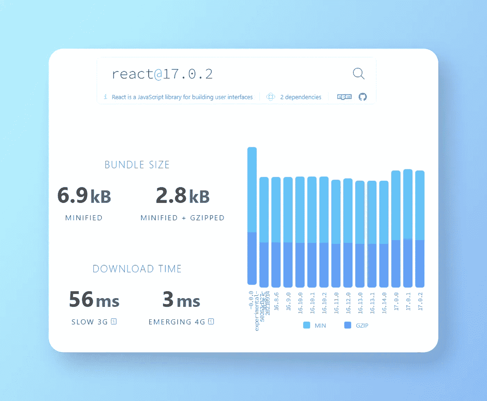
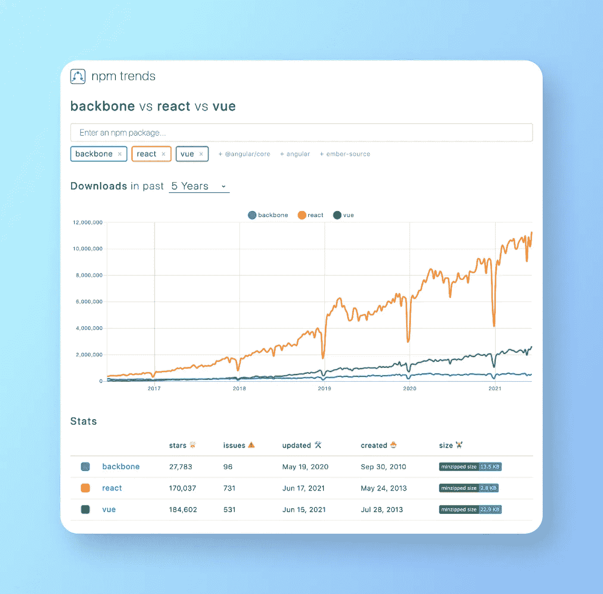
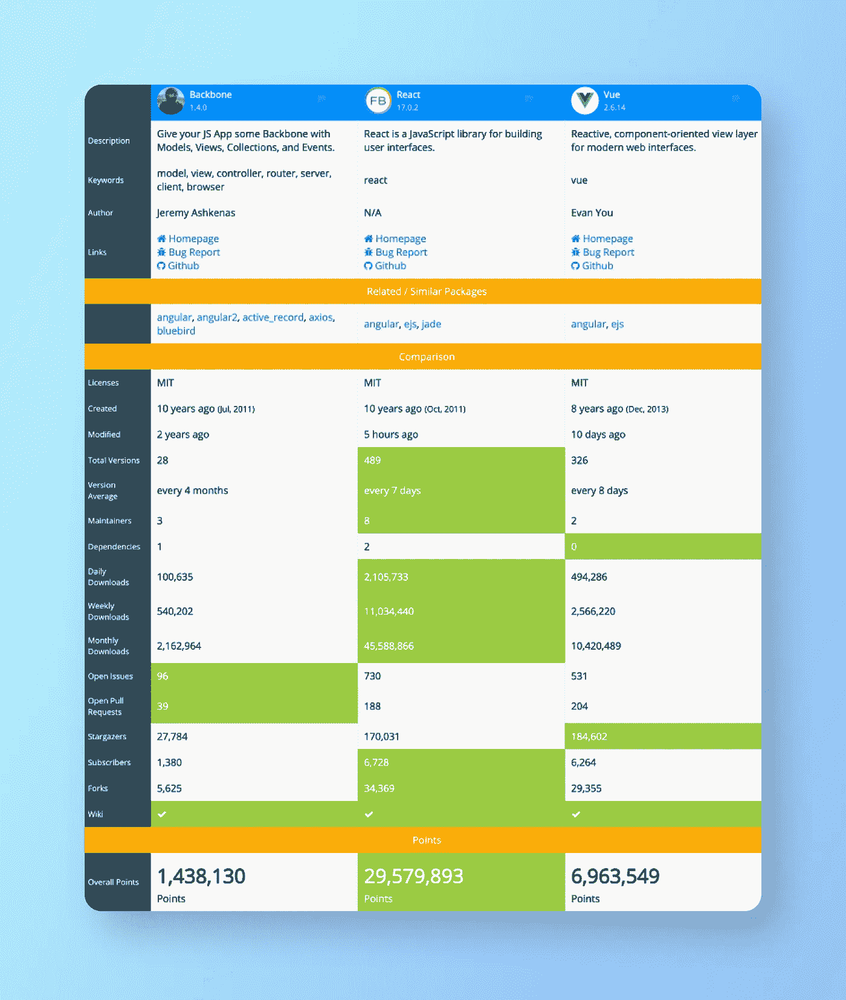
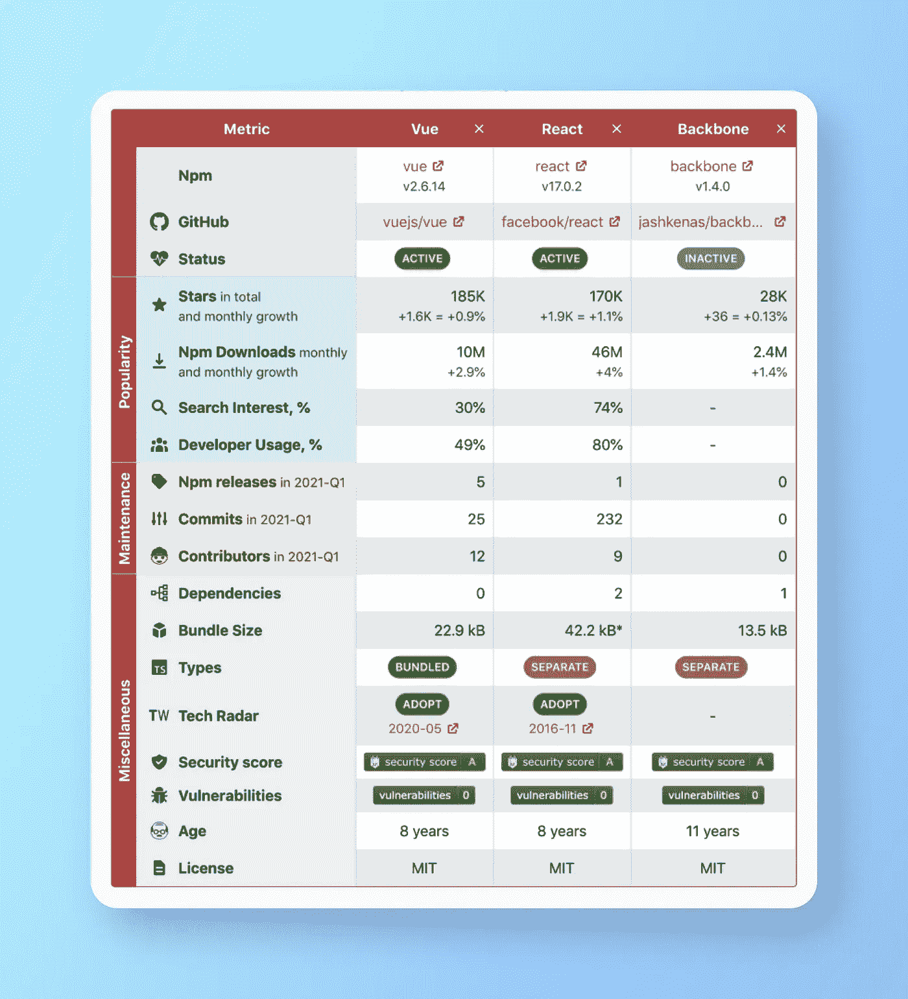
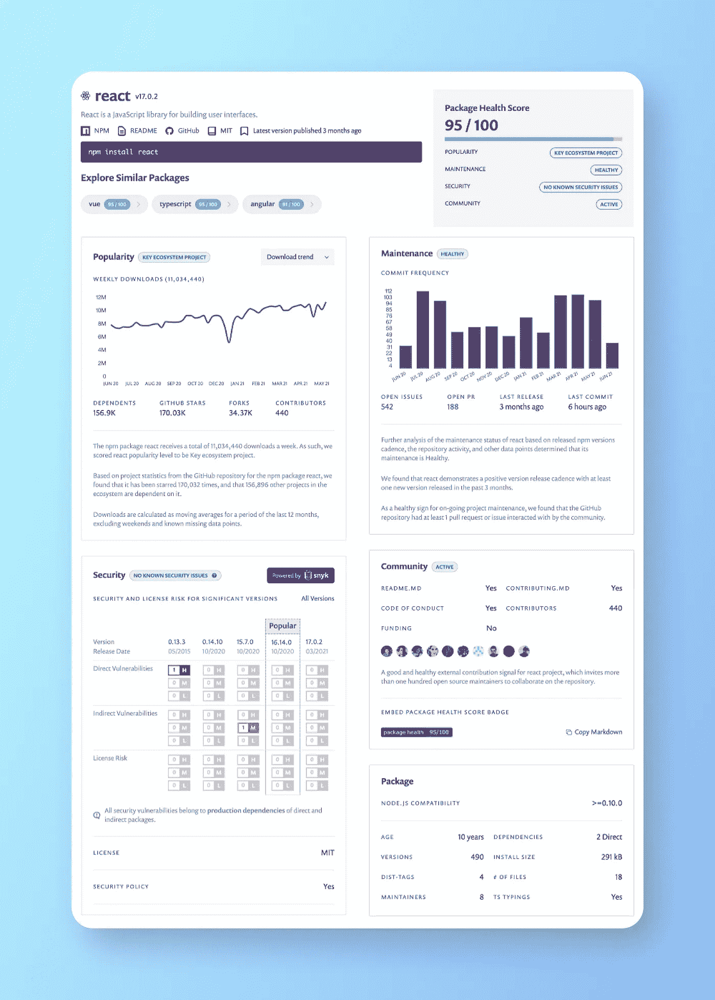
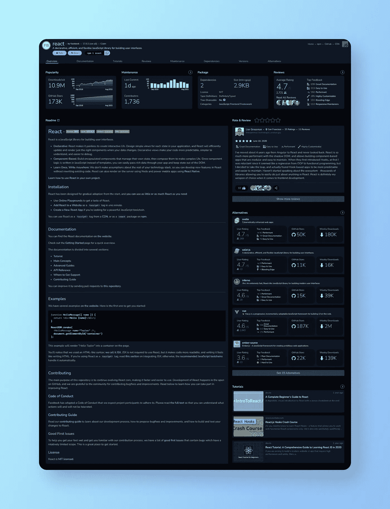

# 选择正确的 NPM 包装的 7 个工具

> 原文：<https://javascript.plainenglish.io/7-tools-to-choose-the-right-npm-package-7baf47259ae0?source=collection_archive---------7----------------------->

*7 种免费工具将帮助您比较和选择最适合您项目的 NPM 软件包。*

**什么是 NPM？**

NPM(节点包管理器)是 Node.js 包的包管理器。它由两个主要部分组成:用于发布和下载包的 CLI(命令行界面)工具，以及托管这些包的在线存储库。有超过 130 万个可用的包，JavaScript 开发者可以使用 NPM 将其他人的代码安装到他们的项目中。

NPM 网站很棒。您可以在所有公共包中进行搜索，并获得各种信息，如文档、GitHub 链接和一般数据(版本、发行次数、最后出版日期)。

然而，这可能还不足以选择适合您项目的正确包。你需要一个更完整的概述来更有效地做出选择。例如，您想知道一个包是否足够受欢迎、维护良好、受社区支持，以及是否完全安全。

这篇文章将通过 7 个伟大的工具，给出了很多关于 NPM 包的额外指标。

**1。** [**Github / Github 洞见**](https://github.com/facebook/react/pulse/monthly)

尽管 Github 因其基于云的 Git 存储库托管服务而闻名，但它也提供了一些有用的附加信息。

`Stars`和`Watch`都很好地表明了这个包的受欢迎程度。`Open issues`和`Open pull requests`可用于评估包装是否维护良好。

此外，“Insights”选项卡包含一些高级指标，如`Code frequency`和`Project contributors`。

React — Github

**2。** [**恐布症**](https://bundlephobia.com/package/react@17.0.2)

*BundlePhobia* 通过查找任何 javascript 包的大小及其对前端包的影响，帮助评估 npm 包的性能影响。它提供了一些有趣的指标，比如`Bundle size`(缩小和缩小+ Gzipped)和`Download time` (3G 和 4G)。

React — BundlePhobia

**3。** [**NPM 趋势**](https://www.npmtrends.com/backbone-vs-react-vs-vue)

*NPM 趋势*是由[约翰·波特](https://medium.com/u/eae470f4d6b1?source=post_page-----7baf47259ae0--------------------------------)创造的一个好看的工具，它可以让你并排研究和比较许多 NPM 包。它显示了一个测量时间线上`Downloads`数量的图表。另外，一个表格引用了一些 GitHub 的统计数据(`Stars`、`Issues`、`last update`、`creation date`、`size`)。

Backbone vs React vs Vue — NPM trends

**4。** [**NPM 比较**](https://npmcompare.com/compare/backbone,react,vue)

*NPM 比较*显示了非常详细的并排比较，并突出显示了每个指标的最佳方案。它提供了许多有趣的数据，如`Version Average`、`Maintainers`的数量、`Open issues`的数量和`Monthly Downloads`的数量。最后，它按包给出一个`Overall point`。

Backbone vs React vs Vue — NPM compare

**5。** [**莫瓦**](https://moiva.io/?npm=backbone+react+vue)

Moiva 是另一个并列比较工具，它结合了来自几个来源(NPM、Github、Snyk、BundlePhobia)的数据。它将它们分为 3 类:流行、维护和杂项。

**人气**显示基本指标，如`Github starts`和`Npm Downloads/month`。以及更高级的像`Search interest %`和`Developer usage %`。

**维护**提供了一个最近包活动良好的指示器。您将找到`Npm releases`、`Commits`和`Contributors`的编号，它们都是上个季度的编号。

**杂项**包含附加信息，如`Dependencies`、`Bundle size`和`Security score`的编号。

Vue vs React vs Backbone — Moiva

**6。** [**Snyk 顾问**](https://snyk.io/advisor/npm-package/react)

*Snyk advisor* 是一款免费工具，可以用来测量软件包的健康状况。你会发现四类:人气，维护，安全，社区。

**流行度**使用`Downloads`和`Repository stars`等指标帮助理解软件包的流行程度。

**维护**提供关于依赖健康的见解，并评估项目的可持续性。你会发现像`Commit frequency`、`Open issues`的号码、最后一次`Released Pull request`的日期等信息。

**安全**允许快速评估包及其过去版本的安全状态。

**社区**衡量其他开发者参与支持这个包的程度。您会发现一些信息，如贡献者的数量以及该套餐是否为`founding`，这意味着有来自公司或社区的财务贡献。

最后，Snyk advisor 属性了一个`Package Health Score`，这样就可以很容易地将它们相互比较。

React -Snyk advisor

**7。**[**open base**](https://openbase.com/js/react)

将自己描述为开源包和库的 Yelp *Openbase* 是一个完整的工具，可以帮助查找和比较数百万个包。它提供了关于流行度、维护、质量、开发者评论等十几个指标的强大洞察力。

它包含通用 Github 指标，如`Github stars`、`Download/week`、`Contributors`、`Issues`号和`Pull requests`号。还包括封装信息，如`License`的类型、`Dependencies`的数量和`Bundle size`的数量。

**Review** 是一个社区部分，开发者可以在这里分享他们的软件包经验。可以添加一个描述和几个标签来给出更精确的描述(例如，如果这个包有很好的文档记录、易于使用、高效、缓慢、有错误或被放弃)。

此外，Openbase 还提供了备选建议包和相关的教程视频。

React — Openbase

## **结论**

我们已经看到第 7 篇文章中的工具提供了许多关于 NPM 包的有用指标。由于它们的互补性，您可以将它们的数据结合起来，为您的每个软件包定义一个良好的健康状况。

除此之外，还必须考虑其他几个因素，比如文档的质量、所提供特性的相关性，甚至是代码的质量。

我希望你发现这篇文章是有用的，现在更有信心为你的项目选择正确的 NPM 软件包。

感谢您的阅读。

*更多内容看*[***plain English . io***](http://plainenglish.io/)