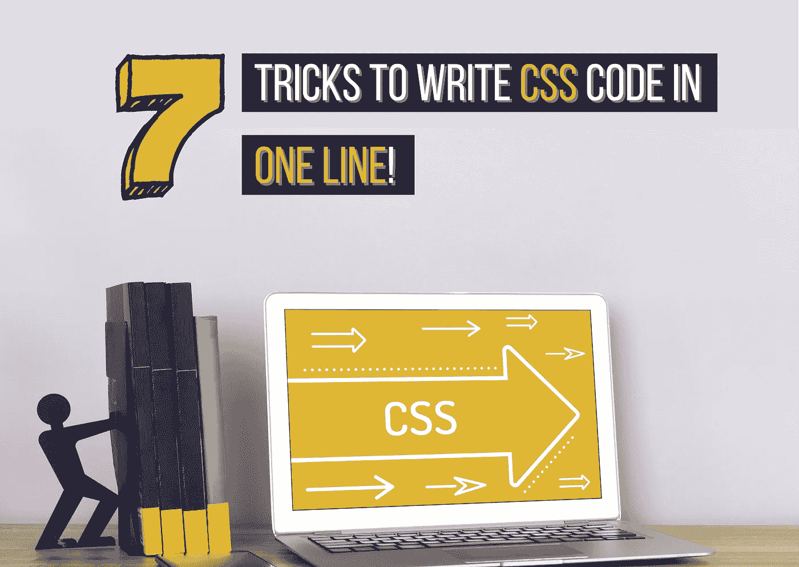
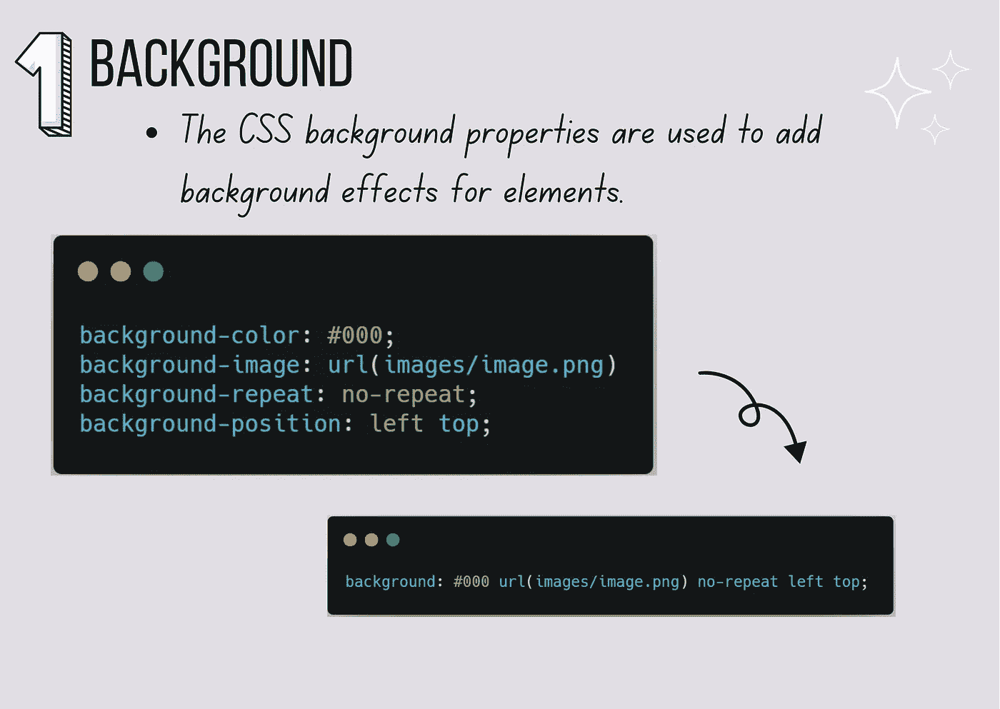
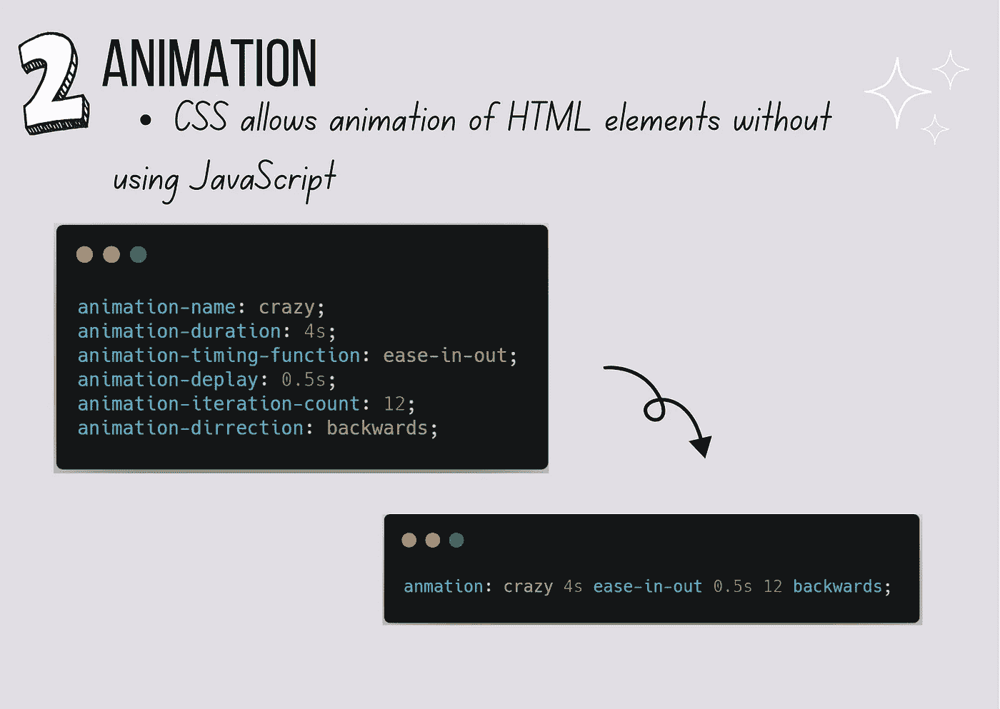
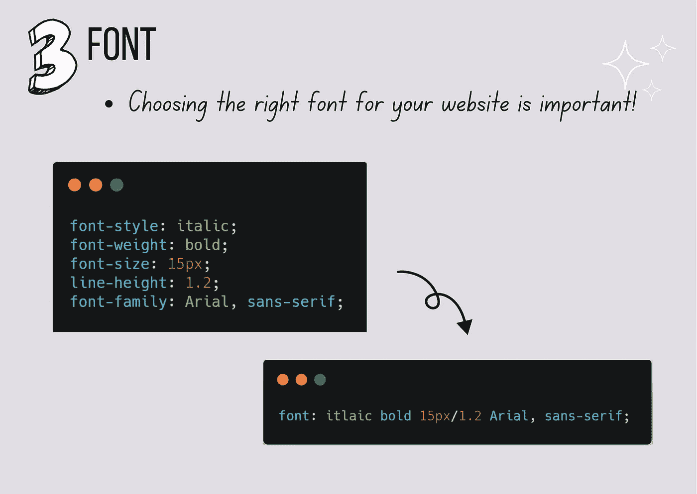
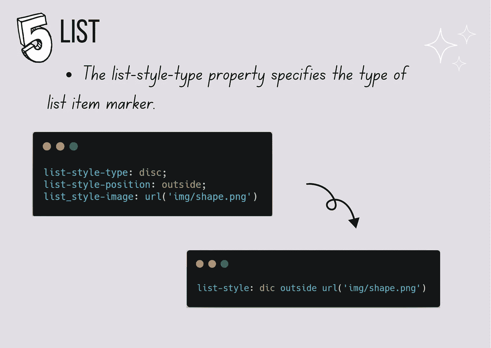
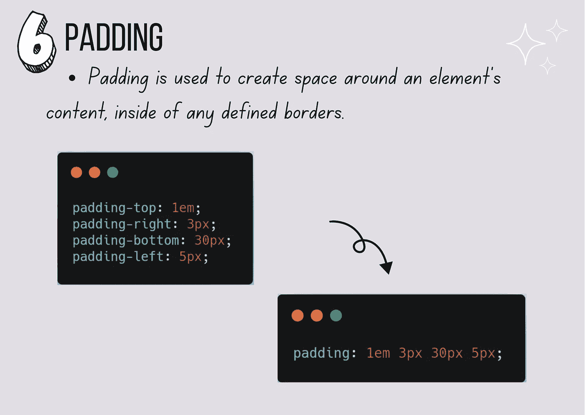
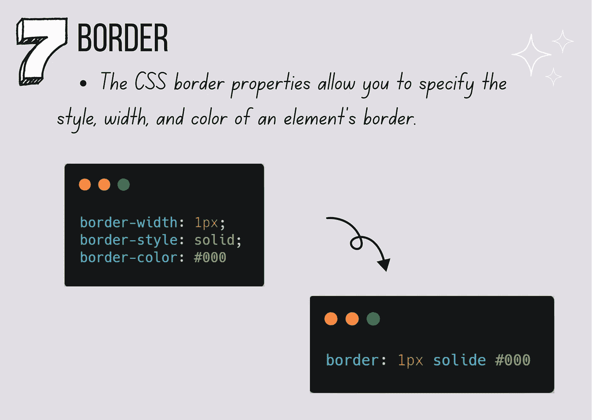
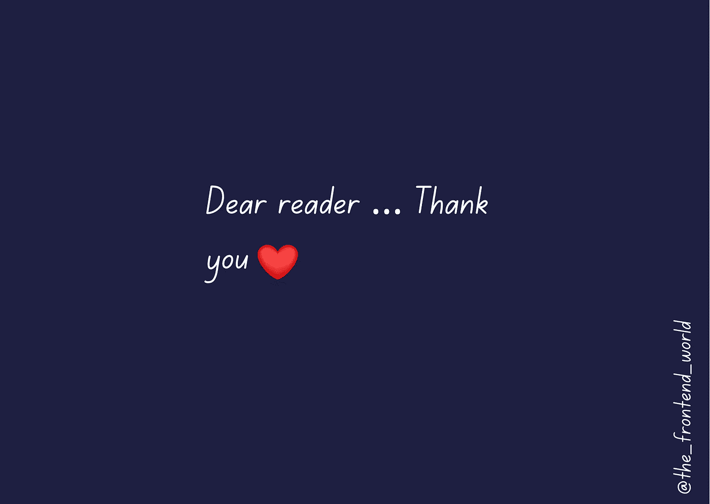

# 一行写 CSS 代码的 7 招！

> 原文：<https://javascript.plainenglish.io/7-tricks-to-write-css-code-in-one-line-64a4c9ffe57d?source=collection_archive---------11----------------------->

## 如何少写 CSS 代码，提升生产力！



By FAM

学习如何用更少的代码行编写 CSS 将有助于您在网页上加载更少的代码行，从而加快页面加载。

最后结果都一样，为什么不写成一行呢。有人可能会说用一行文字写出来是不可读和不可见的，但是想想吧！如果你不得不把所有的东西都写在多行中，那会使 CSS 文件太长，更难阅读，不是吗？

准备好了，我们开始吧！

以下是在多个网页中最常用的 CSS 代码，它们可以快速缩减为一行:

# #1-背景

```
background: #000 url(images/image.png) no-repeat left top;//vsbackground-color: #000;
background-image: url(images/image.png)
background-repeat: no-repeat;
background-position: left top;
```



CSS Background

# #2-动画

```
anmation: crazy 4s ease-in-out 0.5s 12 backwards;
//vs
animation-name: crazy;
animation-duration: 4s;
animation-timing-function: ease-in-out;
animation-deplay: 0.5s;
animation-iteration-count: 12;
animation-dirrection: backwards;
```



CSS Animation

# #3-字体

```
font: itlaic bold 15px/1.2 Arial, sans-serif;//vsfont-style: italic;
font-weight: bold;
font-size: 15px;
line-height: 1.2;
font-family: Arial, sans-serif;
```



CSS Font

# #4-利润

```
margin: 10px 5px 10px 5px;//vsmargin-top:10px;
mrgin-right: 5px;
margin-bottom: 10px;
margin-left: 5px;
```


CSS Margin

# #5-列表

```
list-style: dic outside url('img/shape.png')// vs
list-style-type: disc;
list-style-position: outside;
list_style-image: url('img/shape.png')
```



Styling HTML Lists

# #6-填充

```
padding: 1em 3px 30px 5px;//Vs
padding-top: 1em;
padding-right: 3px;
padding-bottom: 30px;
padding-left: 5px;
```



CSS Padding

# #7-边框

```
border: 1px solide #000//vsborder-width: 1px;
border-style: solid;
border-color: #000
```



CSS Border

你觉得这些人手不足的人怎么样？你知道其他的人手不足的人吗？请与我们分享！

保存文章以备将来使用😉



亲爱的读者，我希望这是明确和有用的。我希望你无论在哪里都是安全的，你的家人也是！坚持住。明天会更好！

**让我们联系一下**[**LinkedIn**](https://www.linkedin.com/in/fatima-amzil-9031ba95/)**[**脸书**](https://www.facebook.com/The-Front-End-World)**[**insta gram**](https://www.instagram.com/the_frontend_world/)**[**Youtube**](https://www.youtube.com/channel/UCaxr-f9r6P1u7Y7SKFHi12g)**或**[**Twitter**](https://twitter.com/FatimaAMZIL9)**。********

****[www.fam-front.com](http://www.fam-front.com/)****

*****更多内容请看*[***plain English . io***](http://plainenglish.io/)****