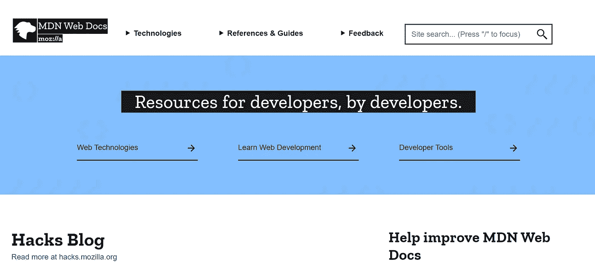
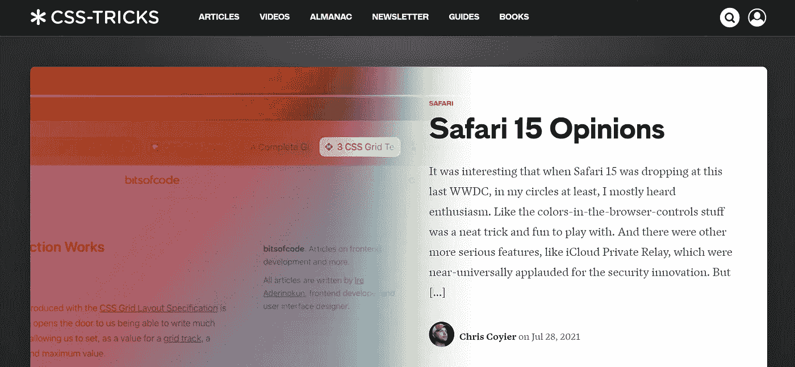
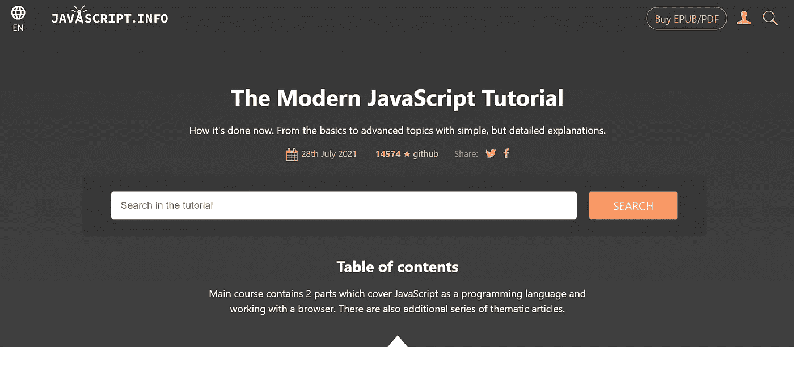
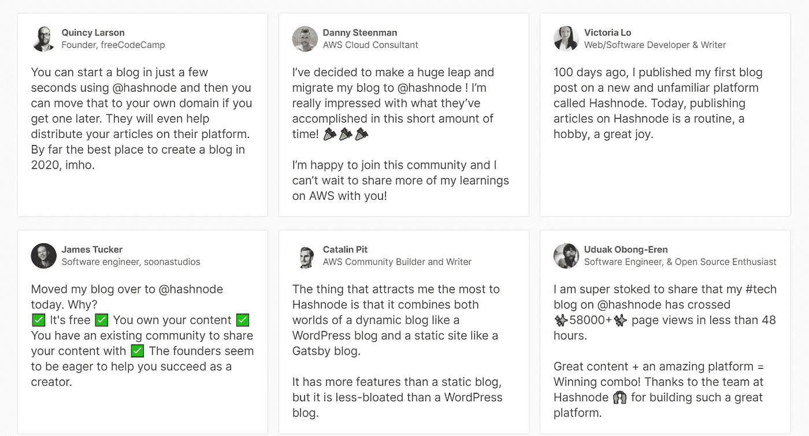

# 你应该关注的 7 个独特的网络开发博客

> 原文：<https://javascript.plainenglish.io/7-unique-web-development-blogs-you-should-follow-that-no-one-is-talking-about-9717cfe80abd?source=collection_archive---------7----------------------->

## 不，我不会谈论自由代码营，W3School，Dev

Photo by [Thought Catalog](https://unsplash.com/@thoughtcatalog?utm_source=medium&utm_medium=referral) on [Unsplash](https://unsplash.com?utm_source=medium&utm_medium=referral)

你可以使用大量免费的网络开发资源。

比如你可能知道 W3School、YouTube、Medium 和 freeCodeCamp，甚至跟随他们学习 Web 开发

但是今天我要谈谈我在网络开发过程中使用过的一些博客，这些博客没有人谈论过。我非常喜欢它们，所以我想和大家分享。

> **注意:**我不属于这些网站中的任何一个，所以我没有从他们那里赚一美元。

不浪费你的关键时间，我们开始吧。

# a)粉碎杂志

Src: Official Website

对网络开发者有益的博客网站之一。当我在谷歌搜索一个概念时，我找到了[这个网站](https://www.smashingmagazine.com/)。

在这里你可以学习 CSS，JavaScript，React，Vue，甚至网页设计，Figma，UX 等。

我知道 CSS、JavaScript、React 和 Figma。但是我想更深入地挖掘网站的性能和可访问性，Smashingmagazine 帮助了我。

如果您正在创建一个网站，性能和可访问性是帮助您的网站快速加载并轻松访问网络世界的关键概念。

还有一些其他的概念，你可以学习有关商业，搜索引擎优化，合同，吸引客户，以及更多的将有助于你的网站开发之旅。

所以试着访问网站，学习网络开发的概念。

# b) MDN

Src: Official Website

[学习一系列 Web 开发主题的最佳指南之一](https://developer.mozilla.org/)，如 HTML、CSS、JavaScript 和 API。

还有，你可以学习图形，浏览器扩展，我最爱的是游戏开发。

我们在生活中都玩过游戏，但是你知道吗，你可以从 MDN 学习制作游戏。

当我第一次学习网页开发的时候，我已经使用了 MDN 但是我不知道我可以学习游戏开发。

# CSS-技巧

Src: Official Website

Web 开发在当今世界很容易学习，但是你必须不断学习新的概念才能成功。

CSS-Tricks 是一个熟悉新概念的好网站。

由于 CSS-Tricks 的帮助，我不知道 Svelte，Redis 和 Rust。

我还从 CSS-Tricks 中学到了其他一些很酷的概念。

# d) JavaScript.info

Src: Official Website

我在 Udemy 的课程上学过 Web 开发，但对 JavaScript 还没有深入的理解。

由于课程没有教会我们所有的东西，我不得不更深入地钻研 JavaScript 概念。

为此，我使用了 [JavaScript.info](https://javascript.info/) 。在这里我学到了与 JavaScript 相关的一切。

有些概念有点复杂，比如承诺、异步/等待等，你可以通过这个网站轻松学会。

# e)哈希节点

有一次昆西·拉森[写了一篇关于 Hashnode 的文章](https://www.freecodecamp.org/news/devblog-launch-your-developer-blog-own-domain/)，我很喜欢。文章免费教你如何用 Hashnode 建立自己的博客。

实际上，Hashnode 是一个很棒的网站，开发者可以免费设置博客。实际上，作为一名网络开发人员，我学会了用 MERN、盖茨比和 WordPress 创建博客。

但是[用 Hashnode](https://hashnode.com/) 创建一个博客非常简单，他们已经为开发人员设计了这个工具。

Src: Official Website

一些人也将他们的博客迁移到了 Hashnode。

# f)中等

Medium 是每个人都应该关注的重要网站之一。我还想鼓励大家关注这个网站。

在这里你可以学到一切，是的，我是说一切。我已经使用它两年多了，我学到了很多关于商业、生活、创业、网络开发和加密货币的知识。

在 Medium 上，有几个杰出的作家精通他们的领域，他们在这里写作来教导我们。

对于开发人员来说，有一些类似于 [Better Programming](https://betterprogramming.pub/) 、[JavaScript in Plain English](https://javascript.plainenglish.io/)、 [Level Up Coding](https://levelup.gitconnected.com/) 的媒体出版物，你可以跟随学习技术。

# g)网络开发

6 个月前，我听说过 PWA，就像 [Twitter Lite PWA 显著提高了参与度，减少了数据使用量](https://developers.google.com/web/showcase/2017/twitter)。

Twitter 开发 Twitter Lite 是为了提供更强大的体验，其明确的目标是即时加载、用户参与和降低数据消耗。

*   每次会话页面增加 65%
*   发送的推文增加了 75%
*   跳出率下降 20%

在那之后，我想了解它，Web 帮助了我。

您还可以学习其他概念，如网络活力、指标、快速加载时间、网络可靠性、性能审计、PWA 审计等。

# 让我们结束吧

当我学习网络开发的时候，我对这些都不了解。

经过工作和实践，我找到了这些有用的资源。我认为你们大多数人会发现它很有用。

如果你喜欢这个帖子，你可以[关注我](https://nitinfab.medium.com/)阅读这样令人惊叹的文章。

下面是一些你可以阅读的其他文章，谢谢。

 [## 我每天都在使用的 11 个 Web 开发工具，因为它们让我的生活变得更加轻松

### 他们也一定会为你做同样的事情。

javascript.plainenglish.io](/11-web-development-tools-i-use-every-day-because-they-make-my-life-easier-54ede59743c2)  [## 炫耀技能的同时掌握 Web 开发:5 个最佳基于项目的教程

### 通过这 5 个基于项目的教程，在掌握 web 开发的同时，作为初级开发人员构建您的作品集。

javascript.plainenglish.io](/master-web-development-while-showing-off-your-skills-5-best-project-based-tutorials-7a5ef044e9c5)  [## 如果我必须从头开始，我将如何学习后端 Web 开发

### 如何在 2021 年成为一名成功的后端 web 开发者？

javascript.plainenglish.io](/how-i-would-learn-back-end-web-development-if-i-had-to-start-over-again-31a79103e2dc) 

*更多内容尽在*[***plain English . io***](http://plainenglish.io/)