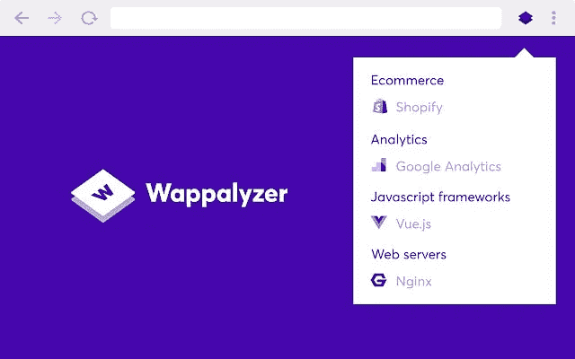
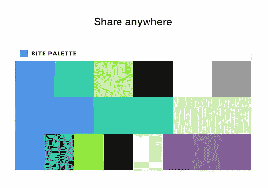
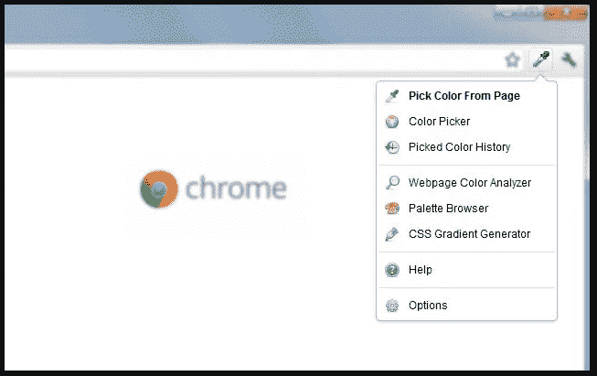
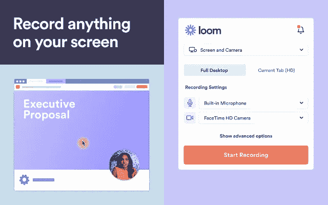
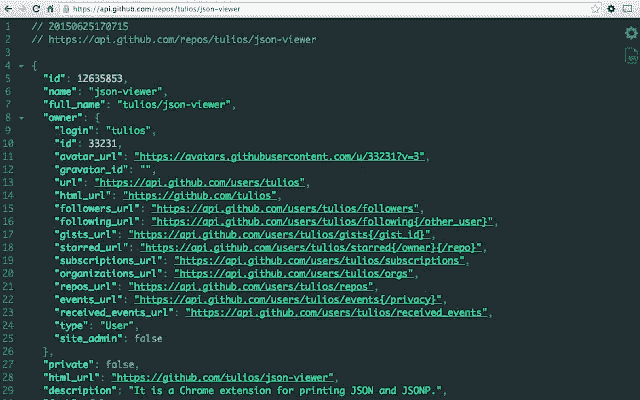
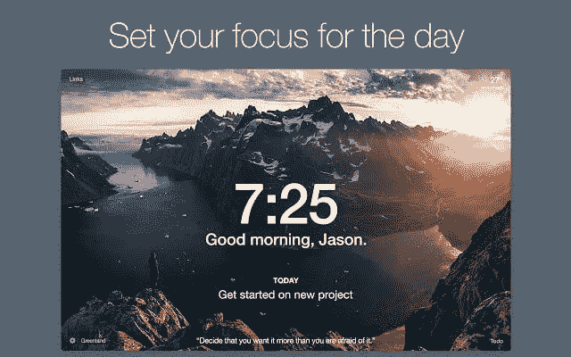

# 7 个对网络开发者有用的 Chrome 扩展

> 原文：<https://javascript.plainenglish.io/7-useful-chrome-extensions-for-web-developers-491ed32ea619?source=collection_archive---------8----------------------->

## 令人惊叹的浏览器扩展提高了您的工作效率

Photo by [Ryland Dean](https://unsplash.com/@ryland_dean?utm_source=medium&utm_medium=referral) on [Unsplash](https://unsplash.com?utm_source=medium&utm_medium=referral)

# 介绍

总的来说，浏览器扩展非常有用。作为一名 web 开发人员，您每天都有许多任务要做。这就是为什么你肯定需要一些工具来帮助你提高生产力。现代浏览器通过一些有用的扩展为您提供了这种能力，使事情变得更加简单。

在这篇文章中，我们将发现一些有用的和 web 开发人员必备的 Chrome 扩展。一些扩展也适用于其他浏览器。所以让我们开始吧。

# 1.瓦帕里斯

Wappalyzer 是一个很棒的浏览器扩展，你可以安装它来展示网站上使用的技术和工具。它是技术剖析者和领先的数据提供者。

该扩展跟踪数十个类别中数百万个网站的一千多种网络技术，如编程语言、分析、营销工具、支付处理器、CRM、CDN 等。

[Wappalyzer](https://chrome.google.com/webstore/detail/wappalyzer/gppongmhjkpfnbhagpmjfkannfbllamg?hl=en).

如果你想看的话，这里有 Chrome 版本的链接。

# 2.网站调色板

站点调色板是一个浏览器扩展，用于创建全面的调色板。是设计师和前端开发者的必备工具。

这个有用的扩展将提取网站上使用的所有颜色，并创建一个调色板。您可以共享调色板并将其导出到 Sketch、Adobe 样本等。

[Site Palette.](https://chrome.google.com/webstore/detail/site-palette/pekhihjiehdafocefoimckjpbkegknoh?ref=designrevision.com)

如果你想下载，这里是[链接](https://chrome.google.com/webstore/detail/site-palette/pekhihjiehdafocefoimckjpbkegknoh?ref=designrevision.com)。

# 3.每日开发

Daily dev 是一个新闻聚合器，尤其是对软件开发人员而言。有了 daily dev，您可以随时了解来自任何主题的最佳技术出版物的最佳文章。你可以在一个地方得到你喜欢的所有内容，比如 CSS 技巧、smashing 杂志、web dev 和其他更有用的资源。

我喜欢这个扩展的原因是它能让你了解最新的科技新闻。许多开发人员使用它来不断更新他们的知识。

[Daily dev](https://chrome.google.com/webstore/detail/dailydev-news-for-busy-de/jlmpjdjjbgclbocgajdjefcidcncaied).

如果你有兴趣，可以在这里查看[。](https://chrome.google.com/webstore/detail/dailydev-news-for-busy-de/jlmpjdjjbgclbocgajdjefcidcncaied)

# 4.色彩奇拉

ColorZilla 是一个先进的吸管，颜色选择器，渐变生成器工具。它是最受欢迎的火狐开发者扩展之一，下载量超过 500 万次，也适用于 Chrome。

使用 ColorZilla，您可以轻松地从浏览器中的任何位置提取颜色，快速调整颜色并将其粘贴到另一个程序中。它可以做更多的事情。

[ColorZilla](https://chrome.google.com/webstore/detail/colorzilla/bhlhnicpbhignbdhedgjhgdocnmhomnp).

有兴趣的可以在这里查看[。](https://chrome.google.com/webstore/detail/colorzilla/bhlhnicpbhignbdhedgjhgdocnmhomnp)

# 5.织布机

当涉及到工作视频消息时，loom 扩展非常有用。借助视频的力量，您可以轻松、快速、清晰地传达您的信息。使用 Loom，您可以记录您的屏幕、声音和面部，以创建一个即时共享的视频，所用时间比键入一封电子邮件还少。减少来回打字，让你的信息在第一时间被理解。

[Loom](https://chrome.google.com/webstore/detail/loom-for-chrome/liecbddmkiiihnedobmlmillhodjkdmb?utm_source=chrome-ntp-icon).

你可以在这里查看 Chrome。

# 6.JSON 查看器

你的眼睛所见过的最漂亮的可定制的 JSON/JSONP 荧光笔。它是一个用于打印 JSON 和 JSONP 的 Chrome 扩展。我非常喜欢这个扩展，因为它让我阅读 JSON 变得更加容易。

[JSON viewer](https://chrome.google.com/webstore/detail/json-viewer/gbmdgpbipfallnflgajpaliibnhdgobh).

这里是下载扩展的[链接](https://chrome.google.com/webstore/detail/json-viewer/gbmdgpbipfallnflgajpaliibnhdgobh)。

# 7.动力

Momentum 是一个非常棒的浏览器扩展，它允许你用一个包含待办事项、天气和灵感的个人仪表盘来替换新的标签页。新的标签页给你片刻的平静，激发你更有效率。

它可以帮助你从每日照片和引用中获得灵感，设定每日焦点，并跟踪你的待办事项。该扩展消除了分心，并通过在每个新标签上提醒您一天的重点来击败拖延。

[Momentum](https://chrome.google.com/webstore/detail/momentum/laookkfknpbbblfpciffpaejjkokdgca).

你可以从[这里](https://chrome.google.com/webstore/detail/momentum/laookkfknpbbblfpciffpaejjkokdgca)下载扩展。

# 结论

所有这些扩展都很棒，它们将帮助您完成一项有用的任务，使您作为一名 web 开发人员变得更容易。

感谢您查看这篇文章，希望您觉得有用。

## 更多阅读

 [## 2021 年前端 Web 开发者路线图

### 成为现代前端 web 开发人员的一步一步指南。

medium.com](https://medium.com/javascript-in-plain-english/the-front-end-web-developer-roadmap-for-2021-bcf88c5d4ccd)